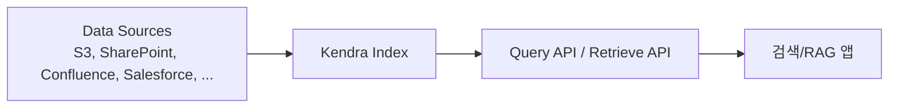

## 정의

**Amazon Kendra** 는 AWS 가 관리하는 **엔터프라이즈 지능형 검색 (intelligent enterprise search)** 서비스입니다. 전통적 키워드 검색을 넘어 **의미 기반 (semantic)** 이해와 **자연어 질문 응답 (question answering)** 을 제공하며, 40+ 데이터 소스 커넥터로 사내 문서 저장소를 통합 인덱싱합니다.

2024년 12월 **Kendra GenAI Index** 가 발표되어 **Bedrock Knowledge Bases 와 통합** 되면서 **RAG (Retrieval Augmented Generation)** 워크로드의 검색 계층으로 자리잡았습니다.

## 왜 Kendra 인가

### 전통적 검색의 한계

- **키워드 매칭만**: "환급 정책" 질문에 "환불" 문서 못 찾음
- **파일 형식 분리**: PDF, Word, Confluence, SharePoint 등 개별 검색
- **사내 접근 통제 무시**: 사용자별 문서 접근 권한을 검색이 안 감안
- **자연어 질문 지원 X**: "지난 분기 매출 얼마?" 에 대한 답이 아니라 링크만

### Kendra 의 접근

- **의미 검색 (semantic search)**: 임베딩 + ML 로 개념 매칭
- **자연어 질문 응답**: "지난 분기 매출 얼마?" -> 실제 답 (문서 인용 포함)
- **문서 랭킹**: 관련성 스코어링
- **사용자 컨텍스트**: user token 기반 문서 필터링
- **40+ 데이터 소스**: 자동 sync

## 아키텍처



## Index 유형

### 1. Kendra Enterprise Edition (전통)

- **최대 5000 개 문서** (Developer Edition) 또는 큰 규모 (Enterprise)
- Query API + Retrieve API
- Semantic search + 자연어 QA
- **월 정액** (인스턴스 시간)

### 2. Kendra Developer Edition (개발용)

- **작은 데이터셋** (수천 문서)
- 프로덕션 아님 (dev/PoC)
- 저비용

### 3. Kendra GenAI Index (2024-12+)

**RAG 특화** 신규 인덱스. Retrieve API 정확도 향상. Bedrock Knowledge Bases 통합.

- **AI 어시스턴트/챗봇** 위한 RAG 백엔드
- **의미 기반 검색 최적화**
- **다중 Bedrock 앱에서 재사용**
- 인덱스 재구축 없이 여러 앱 공유

**결정**:
- 사내 검색 UI 위주 -> Enterprise Edition
- Bedrock + LLM 챗봇 (RAG) -> GenAI Index

## 데이터 소스 커넥터 (40+)

**자동 sync + 접근 권한 정보 유지**.

- **스토리지**: S3, EBS
- **협업**: SharePoint, Confluence, Google Drive, OneDrive, Box, Dropbox
- **DB**: RDS, Aurora, DynamoDB, Amazon Q
- **CRM/ERP**: Salesforce, ServiceNow, Zendesk, Freshdesk
- **위키/코드**: GitHub, GitLab, Bitbucket, Jira
- **커뮤니케이션**: Slack, Microsoft Teams
- **웹**: Web Crawler
- **파일**: FSx, EFS
- **DB**: MySQL, PostgreSQL, Oracle, SQL Server 커넥터

**Custom Data Source**: `BatchPutDocument` API 로 직접 push.

### Sync Modes

- **Full Sync**: 전체 재색인 (초기, 대량 변경)
- **New/Modified Sync**: 변경분만 (일반)
- **Change Log**: 데이터 소스의 CDC 활용 (SharePoint, Salesforce 등)

**주기적 sync**: 자동 스케줄 (매일, 매시간 등).

## Query API vs Retrieve API

### Query API (전통 검색)

**검색 결과 페이지** (Google 스타일).

```python
import boto3

kendra = boto3.client('kendra')

resp = kendra.query(
    IndexId='abcd-1234',
    QueryText='환급 정책은 어떻게 되나요?',
    UserContext={
        'UserId': 'alice@example.com',
        'Groups': ['finance-team']
    },
    AttributeFilter={
        'EqualsTo': {
            'Key': '_category',
            'Value': {'StringValue': 'policy'}
        }
    }
)

for item in resp['ResultItems']:
    print(item['Type'])            # ANSWER, DOCUMENT, QUESTION_ANSWER
    print(item['DocumentTitle'])
    print(item['DocumentExcerpt'])
    print(item['DocumentURI'])
    print(item['ScoreAttributes'])  # HIGH, MEDIUM, LOW, VERY_HIGH
```

**응답 유형** 3가지:
- **`ANSWER`**: 자연어 질문에 대한 직접 답 (FAQ 매칭 or ML 추출)
- **`DOCUMENT`**: 관련 문서 결과
- **`QUESTION_ANSWER`**: 미리 큐레이션한 Q&A 매칭

### Retrieve API (RAG 특화)

**LLM 컨텍스트용 passage 반환**. 답 요약 대신 원본 chunk.

```python
resp = kendra.retrieve(
    IndexId='abcd-1234',
    QueryText='환급 정책은 어떻게 되나요?',
    PageSize=10,
    UserContext={...}
)

passages = [
    {
        'title': r['DocumentTitle'],
        'content': r['Content'],       # 200-token 청크
        'uri': r['DocumentURI'],
        'score': r['ScoreAttributes']
    }
    for r in resp['ResultItems']
]

# LLM prompt 에 삽입
prompt = f"다음 컨텍스트를 참고하여 답하세요:\n\n{passages}\n\n질문: 환급 정책은?"
llm_response = bedrock.invoke_model(...)
```

**GenAI Index** 는 Retrieve API 정확도를 특히 최적화.

## Bedrock Knowledge Base 통합

Kendra GenAI Index 를 **Bedrock Managed Knowledge Base** 의 벡터 저장소로:

```python
bedrock_agent = boto3.client('bedrock-agent')

# Knowledge Base 생성 시 Kendra GenAI Index 참조
bedrock_agent.create_knowledge_base(
    name='sales-kb',
    knowledgeBaseConfiguration={
        'type': 'KENDRA',
        'kendraKnowledgeBaseConfiguration': {
            'kendraIndexArn': 'arn:aws:kendra:...:index/abcd-1234'
        }
    },
    ...
)

# 사용
bedrock_agent_runtime.retrieve_and_generate(
    input={'text': '환급 정책은?'},
    retrieveAndGenerateConfiguration={
        'type': 'KNOWLEDGE_BASE',
        'knowledgeBaseConfiguration': {
            'knowledgeBaseId': 'kb-abc',
            'modelArn': 'anthropic.claude-sonnet-4-6'
        }
    }
)
```

**장점**:
- 인덱스 하나를 여러 Bedrock 앱에서 재사용
- Kendra 의 정확한 검색 + Bedrock 의 LLM
- 데이터 소스 커넥터 (40+) 그대로

## 검색 정확도 튜닝

### 1. 문서 메타데이터

각 문서에 attribute 추가 -> 필터/부스팅에 활용.

```json
{
  "documentId": "doc-1",
  "title": "환급 정책 v2",
  "body": "...",
  "attributes": {
    "_category": "policy",
    "_created_at": "2026-01-15T00:00:00Z",
    "department": "finance",
    "language": "ko",
    "confidentiality": "public"
  },
  "accessControlList": [
    {"name": "finance-team", "type": "GROUP", "access": "ALLOW"},
    {"name": "external", "type": "GROUP", "access": "DENY"}
  ]
}
```

### 2. Relevance Tuning

- **Freshness**: 최근 문서 우선
- **View count**: 자주 본 문서 우선 (Analytics 로 학습)
- **Duration**: 짧은 페이지 우선

### 3. Custom Synonyms

동의어 사전:

```
환급 -> 환불, 반환, refund
매출 -> 수익, revenue, sales
```

### 4. FAQ

미리 큐레이션한 Q&A 를 인덱스에 로드. Query 매칭 시 **QUESTION_ANSWER** 결과 우선.

```csv
question,answer,source
"환급 신청 방법?","웹사이트에서 신청 후 3일 이내 처리","https://..."
```

### 5. Query Suggestions

자동완성 제안. 사용자 쿼리 이력에서 학습.

## 사용자 컨텍스트 (접근 통제)

**중요**: 사용자별 문서 접근 권한을 검색에 반영. 다른 부서 문서가 결과에 안 나오도록.

```python
kendra.query(
    QueryText='...',
    UserContext={
        'UserId': 'alice@example.com',
        'Groups': ['finance-team', 'employees'],
        'DataSourceGroups': [
            {'DataSourceId': 'sharepoint-1', 'GroupId': 'finance-team'},
        ],
        'Token': 'JWT-token-from-IdP'
    }
)
```

- SharePoint / Confluence 커넥터는 원본 ACL 자동 sync
- 사용자 그룹 정보를 IdP (SSO) 에서 가져와 전달

## Multi-language

Kendra 는 40+ 언어 지원. **한국어 포함**. 인덱스 생성 시 언어 지정:

```python
kendra.create_index(
    Name='my-index',
    Edition='ENTERPRISE_EDITION',
    ...
)

# 데이터 소스별 언어
kendra.create_data_source(
    IndexId='...',
    Configuration={...},
    LanguageCode='ko'
)
```

**혼합 언어 문서**: 자동 감지 지원.

## Analytics

- **인기 쿼리**
- **응답 없음 쿼리** (개선 대상)
- **결과 클릭률**
- **Feedback loop** (thumbs up/down)

이 데이터로 relevance tuning + 콘텐츠 개선.

## 요금

**Kendra Enterprise Edition** (2026 기준):
- 시간당 (~1.4 USD/hour, 100M 문서, 8000 qps 규모)
- Developer Edition ~0.7 USD/hour

**Kendra GenAI Index**:
- 문서 인덱싱 GB 당
- Query 100만 당

**Data Source connector**: 별도 (커넥터에 따라)

**Sync**: 무료 (문서 처리는 인덱스 요금에 포함)

**주의**: 항상 켜져 있으므로 저사용 워크로드는 비쌈. Serverless 아님.

## Kendra vs 대안

| 옵션 | 강점 | 언제 |
|:---|:---|:---|
| **Kendra Enterprise** | 40+ 커넥터, 자연어 QA, 접근 통제 | 사내 지식 검색, 엔터프라이즈 |
| **Kendra GenAI Index** | Bedrock 통합, RAG 최적 | LLM 챗봇/어시스턴트 |
| **[[aws-s3-vectors|S3 Vectors]]** | 저비용, 벡터만 | 자체 임베딩, 대규모 저비용 |
| **OpenSearch (BM25 + kNN)** | 유연성, 하이브리드 | 커스텀 검색, 오픈소스 |
| **Bedrock Managed KB** | 완전 관리, RAG 기본 | 빠른 RAG 앱 |
| **Elasticsearch** | 오픈소스 성숙 | 자체 관리 |

**결정**:
- 사내 40+ 시스템 검색 통합 -> **Kendra Enterprise**
- Bedrock + LLM 챗봇 (RAG) -> **Kendra GenAI Index** or **Bedrock Managed KB**
- 저비용 자체 임베딩 -> **S3 Vectors**

## 실전 사용 사례

### 1. 사내 지식 검색 (Q&A 봇)

```
"작년 매출은 얼마?"
→ Kendra: Salesforce, SharePoint, Confluence 통합 검색
→ 자연어 답 + 인용 문서
```

### 2. 고객 지원 (self-service)

```
사용자가 "환급 방법?" 질문
→ Kendra: FAQ + 정책 문서 + 공지사항 검색
→ 답변 + 관련 문서 링크
```

### 3. RAG 챗봇 (Bedrock 통합)

```
사용자 질문 → Bedrock Agent
→ Kendra GenAI Index Retrieve (관련 passages)
→ Claude/Llama LLM (답 생성)
→ 사용자에게 답 + 인용
```

### 4. 개발자 문서

```
GitHub, Jira, Confluence 통합 인덱스
"이 API 는 어떻게 인증?" → 코드 + 문서 + 티켓 검색
```

## 함정

> [!WARNING]
> **Kendra 는 시간당 요금** (Enterprise). 사용 안 해도 지속 청구. 저사용은 다른 옵션.

> [!CAUTION]
> **Sync 실패**. 커넥터 credential 만료, 네트워크 이슈 등. CloudWatch 로 sync status 모니터링.

> [!WARNING]
> **문서 접근 통제 (ACL) 를 무시**하면 사용자에게 접근 권한 없는 문서 노출. UserContext 필수.

> [!IMPORTANT]
> **한국어 성능** 은 언어 코드 명시 (`ko`) 로 개선. 자동 감지도 되지만 명시가 정확.

> [!CAUTION]
> **Kendra 는 벡터 DB 가 아님**. 자체 임베딩 저장/쿼리 X (GenAI Index 는 내부 벡터 사용). 순수 벡터 검색은 S3 Vectors, OpenSearch.

> [!WARNING]
> **문서 개수 제한** 신중 확인. Storage capacity units (SCU) 및 query capacity units (QCU) 초과 시 요금 급증.

## 관련 위키

- [[aws-bedrock|Bedrock]] - Knowledge Base 통합
- [[aws-s3-vectors|S3 Vectors]] - 저비용 벡터 대안
- [[aws-sagemaker|SageMaker]] - 자체 ML 대안
- [[aws-s3|S3]] - 데이터 소스
- [[aws-iam|IAM]] - 접근 제어
- [[aws-cloudwatch|CloudWatch]] - Sync 모니터링
- [[aws-kms|KMS]] - 저장 암호화
- [[llm-rag|LLM RAG]] - RAG 배경
- [[helm-llm-benchmark|HELM]] - LLM 평가
