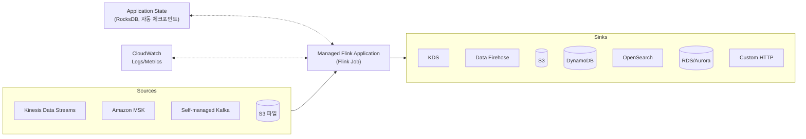

## 정의

**Amazon Managed Service for Apache Flink** (구 Amazon Kinesis Data Analytics) 는 *스트리밍 데이터를 실시간으로 처리 (aggregate, join, window, ML 추론) 하는 완전 관리형 Apache Flink* 서비스. Java / Python / Scala / SQL 로 스트림 애플리케이션 작성.

## 이름 변경 & SQL 종료 (2025-2026)

> [!IMPORTANT]
> **`Kinesis Data Analytics for SQL Applications` 는 2026-01-27 종료**. 신규 생성 불가, 기존 앱 모두 삭제. SQL 애플리케이션 사용자는 **Managed Flink Studio (Zeppelin + Flink SQL)** 로 마이그레이션.

**시기별 정리**:

| 시기 | 이름 / 상태 |
|:---|:---|
| ~2018 | Kinesis Data Analytics for SQL Applications (SQL) |
| 2018-2023 | Kinesis Data Analytics for Apache Flink (Java/Python/Scala) 추가 |
| 2023-08 | *Amazon Managed Service for Apache Flink* 로 이름 변경 |
| 2025-09-01 | KDA for SQL - 제한적 지원 시작 |
| 2025-10-15 | KDA for SQL - 신규 생성 차단 |
| **2026-01-27** | **KDA for SQL 모든 앱 삭제, 서비스 종료** |

지금은 **Managed Service for Apache Flink (MSF)** 하나만.

## 왜 Apache Flink

스트리밍 처리는 배치 처리보다 어려운 문제들이 있음:

- **Event time vs Processing time** - 이벤트가 언제 발생했는지 vs 언제 처리됐는지
- **Late-arriving events** - 늦게 도착한 데이터 처리
- **Watermark** - "이 시점 이전 이벤트는 다 왔다" 신호
- **Exactly-once semantics** - 정확히 한 번 처리
- **Stateful processing** - 세션, 집계 상태 관리
- **Windowing** - Tumbling / Sliding / Session window

Flink 는 이 모든 것을 first-class 지원. Kafka Streams, Spark Streaming 대비 저지연 + stateful 강함.

## 지원 언어

| 언어 | 특징 |
|:---|:---|
| **Java** | 원류, 가장 완전. Flink DataStream API |
| **Python** | PyFlink. Java API wrapper |
| **Scala** | 사용 감소 (Flink 2.x 부터 core 제거) |
| **SQL** | Flink SQL. Studio (Zeppelin notebook) 에서 |

## 지원 버전 (2026 시점)

- **Flink 1.20.0** (최신, 2026 기준)
- **Flink 1.19.1**
- **Flink 1.18.1**

**LTS 정책**: 각 버전 GA 시점부터 24개월 지원.

## 아키텍처



- **Application**: Flink job (JAR 또는 Python)
- **KPU (Kinesis Processing Unit)**: 1 vCPU + 4 GB. 병렬성 단위
- **State**: RocksDB 기반, S3 로 자동 체크포인트 / 스냅샷
- **Auto-scaling**: 스트림 트래픽에 따라 KPU 자동 조정

## 실행 유형

### 1. Application (프로덕션)

배포된 JAR / Python 을 24/7 실행.

```
Application configuration:
  runtime: FLINK-1_20
  code_location: s3://my-bucket/flink-app.jar
  parallelism: 4
  parallelismPerKPU: 1
  autoScalingEnabled: true
```

### 2. Studio (Zeppelin Notebook)

인터랙티브 개발/탐색. Flink SQL, PyFlink, Scala 지원.

```sql
-- Flink SQL 예: 5분 tumbling window
CREATE TABLE clicks (
  user_id BIGINT,
  page STRING,
  event_time TIMESTAMP(3),
  WATERMARK FOR event_time AS event_time - INTERVAL '10' SECOND
) WITH (
  'connector' = 'kinesis',
  'stream' = 'clicks',
  'format' = 'json'
);

SELECT
  page,
  TUMBLE_START(event_time, INTERVAL '5' MINUTE) AS window_start,
  COUNT(*) AS click_count
FROM clicks
GROUP BY page, TUMBLE(event_time, INTERVAL '5' MINUTE);
```

**Studio 는 SQL 사용자의 마이그레이션 답**. KDA for SQL 을 대체.

## 커넥터 (Connectors)

40+ 개 소스/싱크:

| 카테고리 | 목록 |
|:---|:---|
| **AWS** | [[aws-kinesis-data-streams\|Kinesis Data Streams]], MSK, [[aws-data-firehose\|Firehose]], [[aws-s3\|S3]], [[dynamodb\|DynamoDB]], [[aws-rds\|RDS]] (JDBC), OpenSearch, CloudWatch |
| **Kafka** | Self-managed Kafka, Confluent |
| **Message Queue** | RabbitMQ, ActiveMQ |
| **DB** | JDBC (PostgreSQL, MySQL), Iceberg, Hudi, Delta |
| **HTTP** | Async HTTP sink |

## 윈도우 (Windowing) 예제

### Tumbling Window

겹치지 않는 고정 크기.

```
[--5분--][--5분--][--5분--]
```

### Sliding Window

겹치는 크기.

```
[--5분--]
   [--5분--]
      [--5분--]
```

### Session Window

이벤트 간 gap 기반.

```
[event][event] .......gap....... [event][event][event]
        ↑↑ 하나의 세션              ↑↑↑ 다른 세션
```

### Global Window

전체 스트림 하나 (트리거 커스텀).

```java
DataStream<Event> input = ...;
input
  .keyBy(Event::getUserId)
  .window(TumblingEventTimeWindows.of(Time.minutes(5)))
  .aggregate(new SumAggregate())
  .print();
```

## Exactly-Once

Flink 체크포인트 + 커넥터 트랜잭션 지원.

- 소스 (KDS, Kafka) offset 저장
- 싱크 (S3, Kafka) transactional write
- 실패 시 마지막 체크포인트에서 재실행

## 요금

- **KPU-hour**: ~$0.11 / KPU-hour (Application)
- **Studio**: ~$0.14 / KPU-hour
- **Running Application Storage**: ~$0.10 / GB-월 (state)
- **Durable Application Backups**: ~$0.023 / GB-월 (스냅샷)

**계산 예**:
```
Application 4 KPU × 730 시간 = 2920 KPU-hour
2920 × $0.11 = $321.20 /월
```

## 실무 시나리오

| 시나리오 | 답 |
|:---|:---|
| 실시간 이상 감지 (fraud detection) | Managed Flink DataStream (Java) |
| 5분 tumbling aggregation | Managed Flink SQL (Studio) |
| CDC 로 KDS -> Iceberg 실시간 | Managed Flink + Iceberg connector |
| 세션 window 분석 | Managed Flink Session Windows |
| 배치 aggregation | [[aws-athena\|Athena]] / [[aws-emr\|EMR]] (Flink 아님) |
| 단순 적재 (변환 없음) | [[aws-data-firehose\|Data Firehose]] (Flink 필요 X) |

## Flink vs 다른 스트리밍 엔진

| 엔진 | 특징 | 언제 |
|:---|:---|:---|
| **Flink** | 저지연, exactly-once, stateful 강함 | 복잡한 스트리밍 처리 |
| **Spark Structured Streaming** | 배치와 통합, 익숙 | 이미 Spark 스택 |
| **Kafka Streams** | Kafka 안에서만, 경량 | Kafka 전용 |
| **KSQL / ksqlDB** | SQL only, 단순 | Confluent 환경 |
| **[[aws-data-firehose\|Firehose]]** | 변환 없이 적재 | 코딩 회피 |

## 함정

> [!WARNING]
> **KDA for SQL 은 2026-01-27 종료**. 신규 개발 금지. 기존 SQL 앱은 Managed Flink Studio (Zeppelin) 로 마이그레이션 계획 수립.

> [!CAUTION]
> **Flink 학습 곡선 급함**. Event time / watermark / windowing 개념 이해 없이 도입하면 실패. 배치 사고 방식 X.

> [!WARNING]
> **KPU 과잉 프로비저닝** = 비용 폭탄. Auto-scaling + 실측 후 조정.

> [!IMPORTANT]
> **State 크기 증가** = 체크포인트 지연 + 비용. Session window state TTL 설정, keyed state 크기 모니터링.

> [!CAUTION]
> **Late event handling 미설정** = 데이터 조용히 drop. Watermark 전략 + `allowedLateness` 정의.

> [!WARNING]
> **Studio 는 개발/탐색용**. 24/7 프로덕션은 Application 배포로. Studio 는 노트북 종료 시 앱도 중단.

> [!IMPORTANT]
> **Flink 2.x 는 Scala 제거**. 새 프로젝트는 Java / Python.

## 관련 위키

- [[aws-kinesis-data-streams|Kinesis Data Streams]] - 대표 스트림 소스
- [[aws-data-firehose|Amazon Data Firehose]] - 코드 없이 적재
- [[aws-lambda|AWS Lambda]] - 저지연 소규모 소비자 대안
- [[aws-emr|Amazon EMR]] - EMR 위에서도 Flink 실행 가능
- [[aws-glue|AWS Glue]] - Streaming ETL 대안 (Spark Streaming)
- [[aws-s3|S3]] - 자주 쓰는 sink
- [[apache-parquet|Apache Parquet]] - S3 sink 포맷
- [[etl|ETL / ELT]] - 스트리밍 파이프라인 개념
