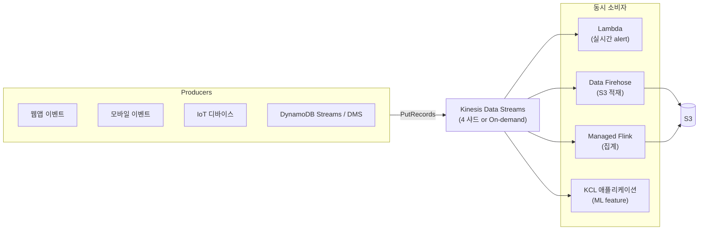

## 정의

**Amazon Kinesis Data Streams** (KDS) 는 *실시간 스트리밍 데이터를 대규모로 수집/저장하고, 여러 소비자가 각자 실시간 처리/재처리* 할 수 있는 관리형 스트리밍 플랫폼. Apache Kafka 대응 서비스.

**핵심 특성**:
- **실시간** (레코드 수집 후 ms ~ 수백 ms 소비 가능)
- **재처리 (replay)** 가능 (24시간 ~ 365일 보존)
- **다중 소비자** 각자 독립 처리
- **샤드 내 순서 보장**

## KDS vs Data Firehose 큰 그림

한 줄 감각:
- **KDS** = "데이터를 강물처럼 흘려두고 여러 앱이 떠서 쓴다" (저장/재처리 O)
- **[[aws-data-firehose|Firehose]]** = "데이터를 목적지까지 배달하는 트럭" (저장 X, 배달만)

자세히: [[aws-data-firehose|Amazon Data Firehose]].

## 핵심 개념

### Stream

*이름이 붙은 논리적 채널*. 여러 프로듀서가 write, 여러 컨슈머가 read.

### Shard (프로비저닝 모드)

스트림의 처리량 단위. **샤드 수 = 용량**.

| 방향 | 샤드당 |
|:---|:---|
| **입력 (Ingress)** | 1 MB/s 또는 1,000 records/s |
| **출력 (Egress, 클래식)** | 2 MB/s (모든 소비자 공유) |
| **출력 (Enhanced Fan-Out)** | 소비자마다 전용 2 MB/s |

### Record

- **시퀀스 번호** (자동 할당, 샤드 내 단조증가)
- **파티션 키** (프로듀서 지정, 어느 샤드로 갈지 결정)
- **데이터 블롭** (최대 1 MiB)

```
Producer -> put_records(partition_key="user_42", data=b"...")
    ↓ hash(partition_key)
샤드 결정 -> 시퀀스 번호 부여 -> 저장
```

### Partition Key

같은 파티션 키 = 같은 샤드 = 순서 보장. 잘못 설계하면 **hot shard** (특정 샤드에 트래픽 몰림).

**좋은 파티션 키**:
- 카디널리티 충분 (수천 이상)
- 균등 분포 (일부 값만 뜨면 hot)
- 도메인상 순서가 의미 있는 단위 (user_id, device_id)

**나쁜 예**:
- `"US"` 같은 저카디널리티 (한 샤드에 몰림)
- 짝수/홀수 등 극히 낮은 카디널리티

## 용량 모드

### Provisioned (전통)

샤드 수를 직접 지정/조정.

```bash
aws kinesis create-stream \
  --stream-name my-events \
  --shard-count 4
```

- 세밀한 제어
- 저비용 (트래픽 예측 가능 시)
- **샤드 관리 부담** (급증 시 수동 resharding)

### On-Demand (2021+, 권장 기본)

샤드 관리 불필요, **자동 확장**.

```bash
aws kinesis create-stream \
  --stream-name my-events \
  --stream-mode-details StreamMode=ON_DEMAND
```

- 최대 200 MB/s 자동 확장 (기본), 상한 상향 가능
- **트래픽 예측 불가** / 급변 시 유리
- 비용: 시간 + 데이터당 (예측 가능한 최대치는 provisioned 가 저렴)

## 소비자 (Consumer) 방식

### Classic (Shared Throughput)

샤드당 **2 MB/s 를 모든 소비자가 공유**. `GetRecords` 폴링 (기본 1초 간격).

- 지연: ~200 ms
- 비용: 무료 (샤드 요금에 포함)
- 소비자 5개까지 권장 (그 이상은 처리량 부족)

### Enhanced Fan-Out (EFO)

소비자마다 **전용 2 MB/s + HTTP/2 push**.

```bash
aws kinesis register-stream-consumer \
  --stream-arn arn:aws:kinesis:...:stream/my-events \
  --consumer-name my-consumer
```

- 지연: ~70 ms
- 비용: 소비자당 시간 + 데이터당
- 소비자 20개까지 (기본)
- **적합**: 소비자 다수 (5개 이상), 저지연 필요

## 보존 & 재처리

```bash
aws kinesis increase-stream-retention-period \
  --stream-name my-events \
  --retention-period-hours 168   # 7일
```

- **기본**: 24 시간
- **최대**: 365 일 (추가 비용)
- **재처리 (Replay)**: 시퀀스 번호 / 타임스탬프로 임의 시점 재실행 가능
- **적합**: 버그 수정 후 재처리, 새 소비자 온보딩, 감사

## 프로듀서 (Producer) 옵션

| 도구 | 특징 |
|:---|:---|
| **AWS SDK** (`PutRecord`, `PutRecords`) | 표준 |
| **KPL** (Kinesis Producer Library, Java) | 자동 배치, 재시도, 집계 (aggregation) |
| **Kinesis Agent** (로그 파일 스트리밍) | 파일 tail |
| **CloudWatch Logs subscription** | 로그 -> KDS |
| **DynamoDB Streams / DMS** | CDC 소스 |
| **IoT Rules** | IoT 데이터 |

## 소비자 (Consumer) 옵션

| 도구 | 특징 |
|:---|:---|
| **KCL** (Kinesis Client Library) | 다중 소비자 정족수, 체크포인트, resharding 자동 |
| **AWS SDK** (`GetRecords`) | 저수준 폴링 |
| **[[aws-lambda\|Lambda]]** (이벤트 소스 매핑) | 자동 폴링 + 병렬 실행 |
| **[[aws-kinesis-data-analytics\|Managed Flink]]** | 실시간 SQL/Flink 처리 |
| **[[aws-data-firehose\|Data Firehose]]** | 자동 적재 |
| **[[aws-emr\|EMR]] / Spark Streaming** | 대규모 분석 |

## 아키텍처 예시



## 요금

**Provisioned**:
- 샤드-시간: ~$0.015 / shard-hour
- PUT payload: $0.014 / 1M units (25 KB 단위)
- 확장 보존: $0.020 / shard-hour × extra hours

**On-Demand**:
- 스트림-시간: ~$0.04 / stream-hour
- Write: $0.08 / GB
- Read: $0.04 / GB
- 보존 확장: 별도

**Enhanced Fan-Out**:
- 소비자-시간: ~$0.015 / consumer-shard-hour
- Data: $0.013 / GB

## Resharding (샤드 분할/병합)

**Split** (트래픽 증가): 1 샤드 -> 2 샤드
**Merge** (트래픽 감소): 2 샤드 -> 1 샤드

```bash
aws kinesis split-shard \
  --stream-name my-events \
  --shard-to-split shardId-0001 \
  --new-starting-hash-key "170141183460469231731687303715884105728"
```

- 프로비저닝 모드만 필요 (on-demand 는 자동)
- 24시간 안에 여러 번 하면 API 제한
- KCL 은 자동 감지

## 다른 스트리밍 서비스 비교

| 요구 | 선택 |
|:---|:---|
| 여러 앱이 실시간 스트림을 각자 처리 + 재처리 | **KDS** |
| 스트림을 S3/Redshift/OpenSearch 에 코드 없이 적재 | **[[aws-data-firehose\|Data Firehose]]** |
| Apache Kafka 그대로 관리형 | **Amazon MSK** |
| 생산자-소비자 디커플링, 작업 큐 (재처리 불필요) | **[[aws-sqs\|SQS]]** |
| 하나의 이벤트를 다수에게 팬아웃 (알림) | **[[aws-sns\|SNS]]** |
| AWS 이벤트 규칙 라우팅 + cron | **[[aws-eventbridge\|EventBridge]]** |
| 실시간 SQL / Flink 처리 | **[[aws-kinesis-data-analytics\|Managed Flink]]** |

## 성능 튜닝

1. **파티션 키 카디널리티** - hot shard 방지
2. **PutRecords 배치** - `PutRecord` 대신 batch (최대 500)
3. **KPL aggregation** - 여러 사용자 레코드를 하나의 Kinesis 레코드로 (14x 처리량)
4. **Enhanced Fan-Out** - 소비자 5+ 개면
5. **KCL 사용** - resharding 자동, 체크포인트 관리

## 함정

> [!WARNING]
> **파티션 키 설계 실수** = hot shard = throttling. 카디널리티 충분 + 균등 분포 확인.

> [!CAUTION]
> **Enhanced Fan-Out 없이 소비자 5개 이상** = 처리량 나눠 갖기 -> 각자 400 KB/s. EFO 로 소비자당 2 MB/s 보장.

> [!WARNING]
> **`GetRecords` 를 초당 5회 초과** = throttling. 이터레이터 나이 (`IteratorAgeMilliseconds`) 지표로 감지.

> [!IMPORTANT]
> **On-Demand 는 편하지만 비쌈**. 트래픽이 예측 가능하고 지속적이면 Provisioned 가 저렴.

> [!CAUTION]
> **Kinesis 를 SQS 처럼** 쓰지 말 것. 순서/재처리 필요 없고 큐 semantics 만 원하면 [[aws-sqs|SQS]] 가 저렴.

> [!WARNING]
> **레코드 최대 1 MiB**. 초과 시 여러 레코드로 분할 필요.

> [!IMPORTANT]
> **`Kinesis Data Analytics for SQL Applications` 는 2026-01-27 종료**. 신규는 [[aws-kinesis-data-analytics|Managed Service for Apache Flink]].

## 관련 위키

- [[aws-data-firehose|Amazon Data Firehose]] - 자동 적재 (KDS 를 소스로)
- [[aws-kinesis-data-analytics|Managed Service for Apache Flink]] - 실시간 처리
- [[aws-lambda|AWS Lambda]] - 이벤트 소스 매핑 소비자
- [[aws-sqs|SQS]] - 큐 대안
- [[aws-sns|SNS]] - Pub/Sub 대안
- [[aws-eventbridge|EventBridge]] - 이벤트 라우팅
- [[aws-s3|S3]] - 대표 적재 대상
- [[aws-redshift|Redshift]] - Streaming Ingestion 소스
- [[etl|ETL]] - 스트리밍 파이프라인 개념
