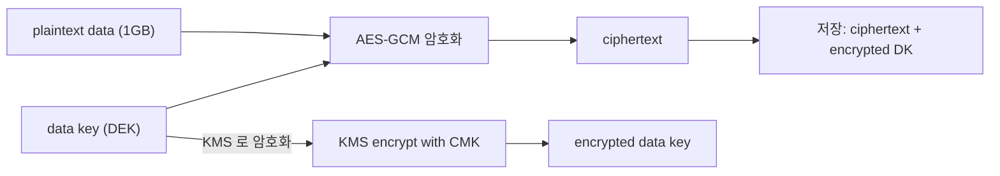
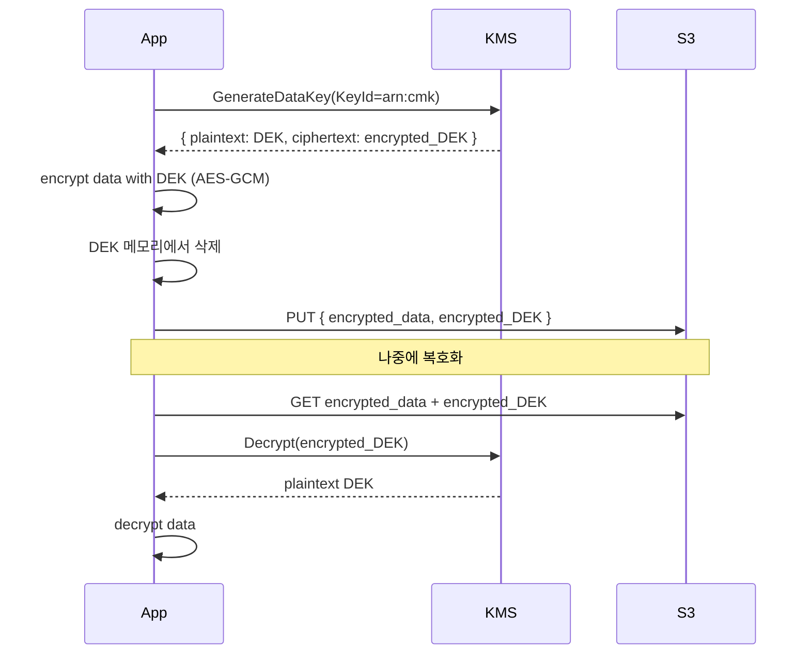

## 정의

**KMS (Key Management Service)** = *암호화 키 중앙 관리*. *envelope encryption* + IAM 통합 + 감사 로그.

## 키 종류

| 종류 | 의미 |
|---|---|
| **AWS Managed Key** | AWS 가 service 별 자동 (`aws/s3`, `aws/secretsmanager`) |
| **Customer Managed Key (CMK)** | 사용자 관리. 정책, 회전, 권한 |
| **AWS Owned Key** | service 가 *공유* 사용 (보이지 않음) |
| **External (BYOK)** | 사용자가 *키 자체* 가져옴 |
| **CloudHSM-backed** | HSM 에 보관 |

## Envelope Encryption



- KMS 가 *데이터 자체를 암호화 하지 않음*.
- 클라이언트가 *작은 data key (DEK)* 로 데이터 암호화.
- KMS 는 DEK 만 암호화.
- 큰 데이터의 *KMS 호출 회수 절감*.

## 흐름



## Key Policy + IAM

```json
{
  "Version": "2012-10-17",
  "Statement": [
    {
      "Sid": "Allow root",
      "Effect": "Allow",
      "Principal": { "AWS": "arn:aws:iam::123:root" },
      "Action": "kms:*",
      "Resource": "*"
    },
    {
      "Sid": "Allow encrypt/decrypt",
      "Effect": "Allow",
      "Principal": { "AWS": "arn:aws:iam::123:role/app" },
      "Action": ["kms:Encrypt", "kms:Decrypt", "kms:GenerateDataKey"],
      "Resource": "*"
    }
  ]
}
```

> *Key Policy 와 IAM Policy 둘 다 허용* 해야 동작.

## Key Rotation

```yaml
EnableKeyRotation: true   # 1년마다 자동 회전
```

- *이전 키 버전 보존*: 옛 ciphertext 복호화 가능.
- *수동 회전*: 새 CMK 생성 + alias 옮김.

## Encryption at Rest 자동

| 서비스 | KMS 통합 |
|---|---|
| S3 | SSE-KMS |
| EBS | volume 단위 |
| RDS | DB 전체 |
| DynamoDB | 자동 |
| Lambda env vars | 자동 |
| Secrets Manager | 자동 |

> "*encryption at rest 켜기*" 의 거의 모든 *내부 구현* 이 KMS.

## CloudTrail 로그

```
KMS API 호출 (Encrypt, Decrypt, GenerateDataKey) 모두 기록
누가 / 언제 / 어떤 키 / 어떤 자원
```

## 가격

- $1/CMK/월
- $0.03 / 10k API
- *Envelope encryption 으로 API 호출 절감* 이 핵심.

## 흔한 함정

> [!WARNING]
> 1. **모든 곳에 `Decrypt` 권한** = 한 곳 침해 = 전부 복호화. *최소 권한*.
> 2. **Cross-region 사용 시도** = KMS key 는 *region 별*. *region 간 암호화는 별도 키*.
> 3. **Key 삭제** = *7-30일 대기 후* 영구 삭제. *복구 불가*.
> 4. **CloudHSM 으로 마이그레이션** = 어렵다. 시작 전 결정.

## 관련 위키

- [[aws-secrets-manager]]
- [[aws-s3]]
- [[aws-iam]]
- [[TLS]]
