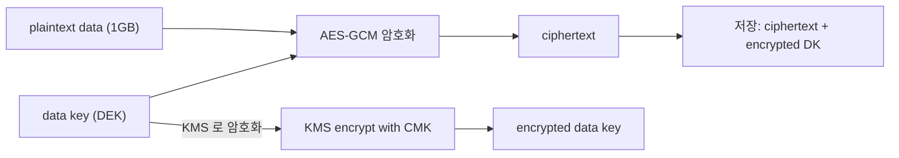
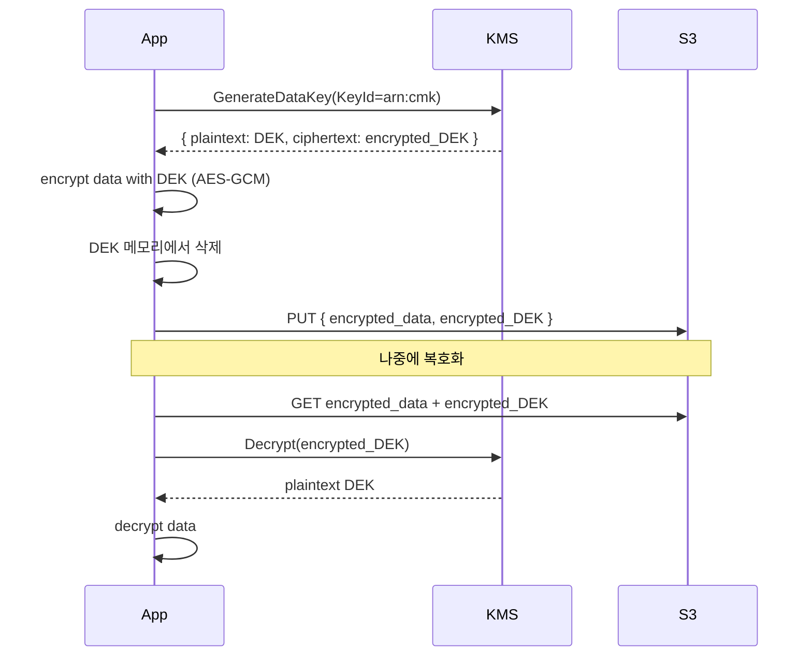
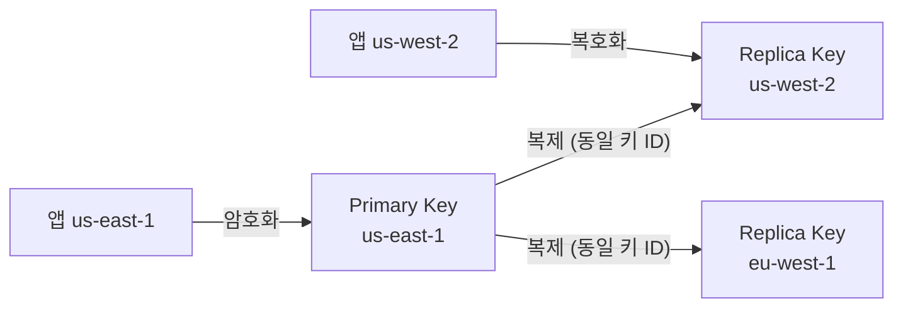
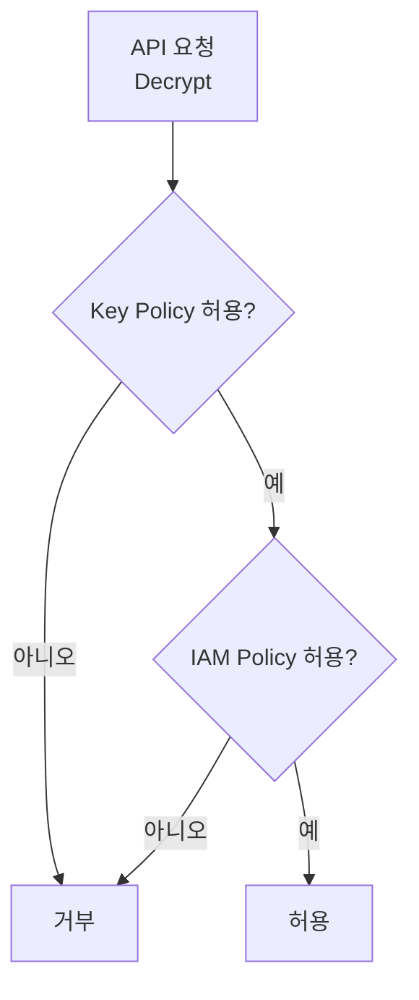
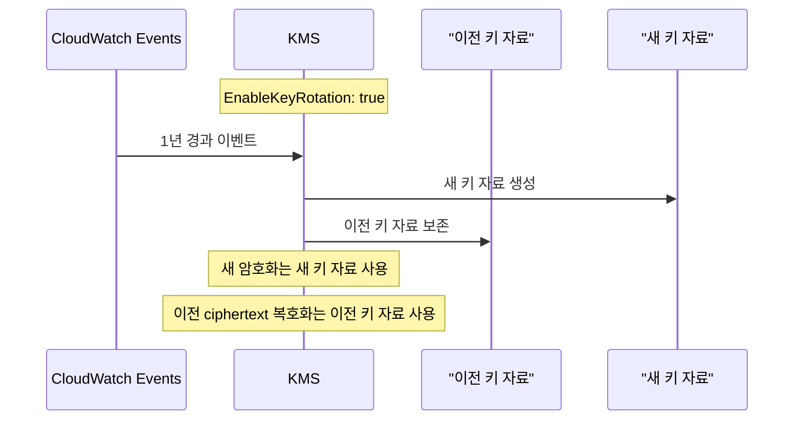

## 정의

**KMS (Key Management Service)** = *암호화 키 중앙 관리*. *envelope encryption* + IAM 통합 + 감사 로그.

## 키 종류

| 종류 | 의미 |
|---|---|
| **AWS Managed Key** | AWS 가 service 별 자동 (`aws/s3`, `aws/secretsmanager`) |
| **Customer Managed Key (CMK)** | 사용자 관리. 정책, 회전, 권한 |
| **AWS Owned Key** | service 가 *공유* 사용 (보이지 않음) |
| **External (BYOK)** | 사용자가 *키 자체* 가져옴 |
| **CloudHSM-backed** | HSM 에 보관 |

## Envelope Encryption



- KMS 가 *데이터 자체를 암호화 하지 않음*.
- 클라이언트가 *작은 data key (DEK)* 로 데이터 암호화.
- KMS 는 DEK 만 암호화.
- 큰 데이터의 *KMS 호출 회수 절감*.

## 흐름



## Key Policy + IAM

```json
{
  "Version": "2012-10-17",
  "Statement": [
    {
      "Sid": "Allow root",
      "Effect": "Allow",
      "Principal": { "AWS": "arn:aws:iam::123:root" },
      "Action": "kms:*",
      "Resource": "*"
    },
    {
      "Sid": "Allow encrypt/decrypt",
      "Effect": "Allow",
      "Principal": { "AWS": "arn:aws:iam::123:role/app" },
      "Action": ["kms:Encrypt", "kms:Decrypt", "kms:GenerateDataKey"],
      "Resource": "*"
    }
  ]
}
```

> *Key Policy 와 IAM Policy 둘 다 허용* 해야 동작.

## Key Rotation

```yaml
EnableKeyRotation: true   # 1년마다 자동 회전
```

- *이전 키 버전 보존*: 옛 ciphertext 복호화 가능.
- *수동 회전*: 새 CMK 생성 + alias 옮김.

## Encryption at Rest 자동

| 서비스 | KMS 통합 |
|---|---|
| S3 | SSE-KMS |
| EBS | volume 단위 |
| RDS | DB 전체 |
| DynamoDB | 자동 |
| Lambda env vars | 자동 |
| Secrets Manager | 자동 |

> "*encryption at rest 켜기*" 의 거의 모든 *내부 구현* 이 KMS.

## CloudTrail 로그

```
KMS API 호출 (Encrypt, Decrypt, GenerateDataKey) 모두 기록
누가 / 언제 / 어떤 키 / 어떤 자원
```

## KMS Grants

Grant 는 일시적/임시 권한 위임. Key Policy 변경 없이 특정 AWS principal 에게 특정 KMS 동작만 허용.

```bash
# Grant 생성: 다른 AWS 서비스가 특정 키 사용 허용
aws kms create-grant \
  --key-id arn:aws:kms:us-east-1:123:key/xxxx \
  --grantee-principal arn:aws:iam::123:role/app-role \
  --operations Decrypt GenerateDataKey \
  --name "app-decrypt-grant"

# Grant 조회
aws kms list-grants --key-id arn:aws:kms:us-east-1:123:key/xxxx

# Grant 취소
aws kms retire-grant --key-id ... --grant-id ...
```

Grant 의 주요 용도:
- AWS 서비스 (ECS, Secrets Manager, DynamoDB) 가 내부적으로 키 사용
- 임시 권한 (시간 제한 작업)
- Key Policy 수정 권한 없는 계정에서 권한 위임

## Multi-region Keys

단일 CMK 를 여러 AWS 리전에 복제. 재암호화 없이 다른 리전에서 복호화 가능.



```bash
# Multi-region primary key 생성
aws kms create-key \
  --multi-region \
  --description "Multi-region CMK" \
  --region us-east-1

# 다른 리전에 복제
aws kms replicate-key \
  --key-id mrk-xxxxxxxx \
  --replica-region us-west-2
```

**사용 시나리오**: 글로벌 앱에서 us-east-1 에서 암호화한 데이터를 us-west-2 에서 재암호화 없이 복호화.

> [!WARNING]
> Multi-region key 도 **리전당 $1/월** 요금 발생. 사용 리전만큼 비용 누적.

## IAM 권한 모델 심화

KMS 접근은 **Key Policy + IAM Policy** 양쪽 모두 허용해야 동작합니다.



### IAM 역할별 권한 분리 패턴

```json
{
  "Statement": [
    {
      "Sid": "KeyAdminOnly",
      "Effect": "Allow",
      "Principal": {"AWS": "arn:aws:iam::123:role/key-admin"},
      "Action": ["kms:Create*", "kms:Delete*", "kms:Disable*", "kms:Put*", "kms:ScheduleKeyDeletion"],
      "Resource": "*"
    },
    {
      "Sid": "AppEncryptOnly",
      "Effect": "Allow",
      "Principal": {"AWS": "arn:aws:iam::123:role/app"},
      "Action": ["kms:Encrypt", "kms:GenerateDataKey"],
      "Resource": "*"
    },
    {
      "Sid": "AppDecryptOnly",
      "Effect": "Allow",
      "Principal": {"AWS": "arn:aws:iam::123:role/app-decrypt"},
      "Action": ["kms:Decrypt"],
      "Resource": "*"
    }
  ]
}
```

**최소 권한 원칙**: 암호화 역할과 복호화 역할 분리. 암호화만 필요한 서비스는 `Decrypt` 권한 없음.

## 서비스별 통합 심화

### S3 SSE-KMS

```bash
# 버킷 기본 암호화 (SSE-KMS)
aws s3api put-bucket-encryption \
  --bucket my-bucket \
  --server-side-encryption-configuration '{
    "Rules": [{
      "ApplyServerSideEncryptionByDefault": {
        "SSEAlgorithm": "aws:kms",
        "KMSMasterKeyID": "arn:aws:kms:us-east-1:123:key/xxxx"
      },
      "BucketKeyEnabled": true
    }]
  }'
```

`BucketKeyEnabled: true` 로 S3 Bucket Key 사용 시 KMS API 호출 약 99% 감소 (비용 절감).

### EBS 볼륨 암호화

```bash
# 암호화된 EBS 볼륨 생성
aws ec2 create-volume \
  --size 100 \
  --volume-type gp3 \
  --encrypted \
  --kms-key-id arn:aws:kms:us-east-1:123:key/xxxx \
  --availability-zone us-east-1a
```

계정 기본값으로 모든 새 EBS 볼륨 자동 암호화 설정 가능:
```bash
aws ec2 enable-ebs-encryption-by-default
```

### RDS 암호화

```bash
# RDS 인스턴스 생성 시 CMK 지정
aws rds create-db-instance \
  --db-instance-identifier mydb \
  --engine mysql \
  --storage-encrypted \
  --kms-key-id arn:aws:kms:us-east-1:123:key/xxxx \
  ...
```

> [!CAUTION]
> RDS 암호화는 **생성 시에만** 활성화 가능. 기존 미암호화 DB 를 암호화하려면 스냅샷 복원으로 새 DB 생성 필요.

## Key Rotation 심화



- **자동 회전**: `EnableKeyRotation` 으로 1년마다 자동 갱신
- **수동 회전**: 새 CMK 생성 후 alias 를 새 키로 변경 (하위 호환성 관리 필요)
- **Rotation 확인**: CloudTrail 에 `RotateKey` 이벤트 기록

### Alias 활용

```bash
# Alias 생성 (키 ARN 대신 사용)
aws kms create-alias \
  --alias-name alias/my-app-key \
  --target-key-id arn:aws:kms:us-east-1:123:key/xxxx

# 수동 회전 시: alias 를 새 키로 변경
aws kms update-alias \
  --alias-name alias/my-app-key \
  --target-key-id arn:aws:kms:us-east-1:123:key/yyyy
```

코드에서 alias 참조 시 키 변경 시 코드 수정 불필요.

## CloudHSM 대비

| 항목 | KMS (CMK) | CloudHSM |
|:---|:---|:---|
| **하드웨어** | AWS 공유 HSM | 전용 HSM 클러스터 |
| **키 소유권** | AWS 관리 (FIPS 140-2 Level 3) | 사용자 전용 |
| **규정 요건** | 대부분 충족 | FIPS 140-2 Level 3 엄격 요건 |
| **운영 부담** | 없음 | HSM 클러스터 관리 필요 |
| **비용** | $1/키/월 | ~$1.45/HSM/시간 |
| **API** | AWS KMS API | PKCS#11, JCE, OpenSSL |
| **사용 시나리오** | 대부분 엔터프라이즈 | 금융, 정부 엄격 규제 |

> [!IMPORTANT]
> CloudHSM 으로 마이그레이션은 매우 어렵습니다. 시작 전 규제 요건 명확히 확인 후 결정.

## 가격

- $1/CMK/월
- $0.03 / 10k API
- *Envelope encryption 으로 API 호출 절감* 이 핵심.

**비용 최적화**:
- S3 Bucket Key 활성화: SSE-KMS 요청 최대 99% 감소
- Envelope encryption: 대용량 데이터 KMS 직접 호출 피함
- AWS Managed Key 사용 (무료): 규정 요건 없으면 CMK 불필요

## 흔한 함정

> [!WARNING]
> 1. **모든 곳에 `Decrypt` 권한** = 한 곳 침해 = 전부 복호화. *최소 권한*.
> 2. **Cross-region 사용 시도** = KMS key 는 *region 별*. *region 간 암호화는 별도 키*.
> 3. **Key 삭제** = *7-30일 대기 후* 영구 삭제. *복구 불가*.
> 4. **CloudHSM 으로 마이그레이션** = 어렵다. 시작 전 결정.

> [!CAUTION]
> **Key Policy 에 root 주체 없으면 잠금**: root principal 이 Key Policy 에 없으면 IAM 으로 접근 불가. 반드시 root 또는 admin role 허용.

> [!WARNING]
> **S3 버킷 암호화와 KMS**: SSE-S3 (AES-256) 은 추가 요금 없음. SSE-KMS 는 요청당 KMS 호출 비용. S3 Bucket Key 로 비용 최적화 필수.

## 관련 위키

- [[aws-secrets-manager]]
- [[aws-s3]]
- [[aws-iam]]
- [[aws-ebs-vs-instance-store]]
- [[aws-rds]]
- [[aws-cloudtrail]]
- [[TLS]]
