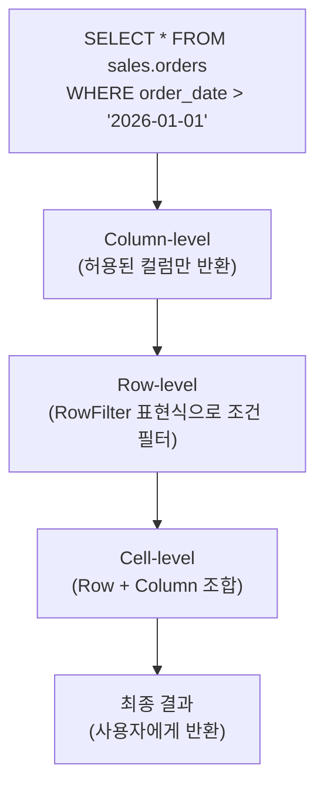
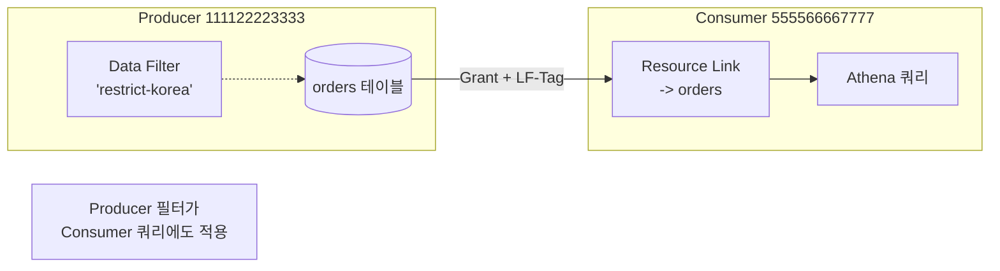

## 정의

**Lake Formation Data Filter** 는 *[[aws-lake-formation|Lake Formation]] 이 관리하는 테이블에 대해 행 (row) / 셀 (cell) 수준의 접근 제어를 정의하는 리소스*. IAM 정책이나 버킷 정책만으로는 표현 불가능한 *"같은 테이블에 대해 사용자별로 다른 row / 다른 column 만 보이게" 하는* 세밀한 제어를 SQL 없이 선언적으로 표현한다.

**핵심 대비**:
- **[[aws-iam|IAM]]**: 리소스 (버킷/테이블) 단위 접근
- **Lake Formation 기본 권한**: 데이터베이스 / 테이블 / 컬럼 단위
- **Data Filter**: **row + column 조합 (cell)** 단위

## 3 단계 보안 계층

Lake Formation 의 데이터 필터링은 3 단계로 구성된다.



### 1. Column-level Security

특정 컬럼만 SELECT 가능하도록. 나머지는 반환에서 제외.

```
Table orders (order_id, user_id, amount, ssn, credit_card, region)

Analyst-Marketing 그룹 :
  SELECT 가능 컬럼: [order_id, user_id, amount, region]
  숨김: [ssn, credit_card]

SELECT * -> SELECT order_id, user_id, amount, region 로 자동 변환
SELECT ssn FROM orders -> permission denied
```

### 2. Row-level Security

WHERE 조건과 유사한 필터 표현식으로 특정 row 만 반환.

```
Data Filter "region-korea-only":
  Table: orders
  RowFilter: "region = 'KR'"

Analyst-Korea 그룹 :
  SELECT * FROM orders 실행 시
  실제 실행 = SELECT * FROM orders WHERE region = 'KR'
```

### 3. Cell-level Security

Row filter + Column filter 결합. **다른 row 에 대해 다른 컬럼도 숨김** 가능.

```
Data Filter "hr-own-region":
  RowFilter: "region = 'KR'"
  ColumnWildcard: ExcludedColumnNames = ['salary']

Analyst-Korea 그룹 :
  KR row 는 salary 제외한 모든 컬럼
  다른 region row 는 아예 안 보임
```

## Data Filter 정의 구조

`CreateDataCellsFilter` API 또는 콘솔로 정의.

### JSON 스펙

```json
{
  "TableData": {
    "TableCatalogId": "111122223333",
    "DatabaseName": "sales",
    "TableName": "orders",
    "Name": "restrict-korea-non-pii",

    "RowFilter": {
      "FilterExpression": "region = 'KR' AND status = 'completed'"
    },

    "ColumnWildcard": {
      "ExcludedColumnNames": ["ssn", "credit_card", "phone"]
    }
  }
}
```

- **`Name`**: 필터 식별자 (테이블당 고유)
- **`RowFilter.FilterExpression`**: PartiQL 스타일 WHERE 표현식
- **`ColumnWildcard`**: 컬럼 포함/제외 방식
- **`ColumnNames`**: 명시적 포함 목록 (없으면 wildcard 사용)

### 컬럼 지정 방식 (셋 중 하나 선택)

**방식 1: 명시적 포함 (allowlist)**
```json
"ColumnNames": ["order_id", "amount", "order_date"]
```
지정한 컬럼만 보임.

**방식 2: Wildcard + 제외 (denylist)**
```json
"ColumnWildcard": {
  "ExcludedColumnNames": ["ssn", "credit_card"]
}
```
지정 컬럼 제외 모두 보임.

**방식 3: Wildcard 만 (모든 컬럼)**
```json
"ColumnWildcard": {}
```
모든 컬럼 보임 (row filter 만 적용).

> [!IMPORTANT]
> **[[aws-athena|Athena]] / [[aws-redshift-spectrum|Spectrum]] 는 명시적 포함 (`ColumnNames`) 만 지원**. 제외 방식은 [[aws-emr|EMR]] Spark / Trino 에서만.

## RowFilter 표현식

**PartiQL 기반 WHERE 스타일** 표현식.

### 지원 연산

| 카테고리 | 예 |
|:---|:---|
| **비교** | `=`, `<>`, `<`, `>`, `<=`, `>=` |
| **논리** | `AND`, `OR`, `NOT` |
| **집합** | `IN (...)`, `NOT IN (...)` |
| **NULL** | `IS NULL`, `IS NOT NULL` |
| **패턴** | `LIKE`, `NOT LIKE` (일부 엔진) |
| **BETWEEN** | `BETWEEN x AND y` |

### 예제

```sql
-- 단순
region = 'KR'

-- AND / OR
region = 'KR' AND order_amount > 100

-- IN
country IN ('KR', 'JP', 'US')

-- 복합
(department = 'HR' AND access_level >= 3)
OR (department = 'Finance' AND CURRENT_USER = 'auditor')
```

### 지원하지 않는 것

- **서브쿼리** (다른 테이블 조회)
- **집계 함수** (SUM, COUNT)
- **JOIN**
- **User-defined function**

즉 **행 자체의 값** 만 참조 가능. 다른 테이블/사용자 정보와 조합은 안 됨.

## Named Data Filter vs Inline

### Named (재사용 가능, 표준)

콘솔 / API 로 생성 후, permission grant 시 참조.

```
1. CreateDataCellsFilter("restrict-korea", ...)
2. Grant SELECT ON DATA FILTER "restrict-korea" TO ROLE "Korea-Analyst"
```

**장점**:
- 여러 사용자에게 재사용
- 이름으로 감사 추적 쉬움
- 변경 시 한 곳만 수정

### Inline (Permission 안에 직접)

Permission 생성 시 필터를 직접 정의.

```
Grant SELECT ON TABLE orders
  WITH ROW FILTER "region = 'KR'"
  WITH COLUMN EXCLUDES ["ssn"]
  TO ROLE "Korea-Analyst"
```

**단점**: 재사용 불가, 변경 시 각각 수정.

**권장**: **Named data filter** 사용.

## Grant / Revoke 구문

```sql
-- Athena / Lake Formation SQL 스타일 (콘솔에서 관리)
GRANT SELECT ON DATA FILTER "restrict-korea"
  TO PRINCIPAL "arn:aws:iam::111122223333:role/KoreaAnalyst";

REVOKE SELECT ON DATA FILTER "restrict-korea"
  FROM PRINCIPAL "arn:aws:iam::111122223333:role/KoreaAnalyst";
```

CLI:
```bash
aws lakeformation grant-permissions \
  --principal DataLakePrincipalIdentifier=arn:aws:iam::...:role/KoreaAnalyst \
  --resource '{
    "DataCellsFilter": {
      "TableCatalogId": "111122223333",
      "DatabaseName": "sales",
      "TableName": "orders",
      "Name": "restrict-korea"
    }
  }' \
  --permissions SELECT
```

## Cross-Account Data Filter

Producer 계정의 테이블을 Consumer 계정에 필터 적용해 공유.



- Producer 가 Grant → Consumer 가 AWS RAM 초대 수락 → Resource Link 생성
- Consumer 가 쿼리하면 Producer 의 data filter 자동 적용

## 엔진별 지원

| 엔진 | Row Filter | Column 포함 | Column 제외 | Nested 컬럼 |
|:---|:---|:---|:---|:---|
| **[[aws-athena\|Athena]]** | O | O | X | O |
| **[[aws-redshift-spectrum\|Redshift Spectrum]]** | O | O | X | O |
| **[[aws-emr\|EMR]] Spark** | O | O | O | O |
| **[[aws-emr\|EMR]] Trino** | O | O | O | O |
| **[[aws-glue\|Glue]] ETL** | 부분 (엔진에 따름) | O | O | 부분 |
| **QuickSight** | O (엔진 통해서) | O | X | 제한 |

> [!IMPORTANT]
> **Athena / Spectrum 은 컬럼 제외 방식 X**. `ExcludedColumnNames` 를 쓰려면 EMR (Spark / Trino) 필요.

## 성능 영향

- **Predicate pushdown**: 파티션 컬럼이 row filter 에 있으면 파티션 프루닝 유지 -> 성능 영향 미미
- **Non-partition 컬럼 필터**: 전체 스캔 후 필터 적용 -> 원본 쿼리와 비슷한 비용
- **Column filter**: 실제 read 컬럼 감소 -> 오히려 빠를 수 있음
- **Nested 컬럼**: 필터 평가 오버헤드 발생 가능

**최적화**:
- 파티션 컬럼을 row filter 에 자주 활용
- 컬럼 수 감소로 read 최소화 유도

## 실전 예제

### 예 1: 지역별 데이터 격리

```json
Filter "KR-Analysts":
  Table: sales.orders
  RowFilter: "country = 'KR'"
  ColumnWildcard: {}   // 모든 컬럼

Filter "JP-Analysts":
  Table: sales.orders
  RowFilter: "country = 'JP'"
  ColumnWildcard: {}

Grant SELECT ON "KR-Analysts" TO Group("korea-team")
Grant SELECT ON "JP-Analysts" TO Group("japan-team")
```

각 팀은 자기 지역 order 만 조회.

### 예 2: PII 컬럼 마스킹

```json
Filter "customers-non-pii":
  Table: sales.customers
  RowFilter: ""   // 모든 row
  ColumnNames: [customer_id, country, signup_date, plan]
  // ssn, credit_card, phone, email 제외
```

일반 애널리스트는 PII 없는 뷰만 볼 수 있음.

### 예 3: 조건부 컬럼 접근 (권한 상승 감지)

```json
Filter "hr-conditional-salary":
  Table: hr.employees
  RowFilter: "department IN ('engineering', 'sales')"
  ColumnWildcard:
    ExcludedColumnNames: ["salary", "bonus"]   // 일반 접근 시 급여 X

Filter "hr-full":
  RowFilter: ""
  ColumnWildcard: {}   // 모든 컬럼

Grant "hr-conditional-salary" TO Group("hr-analyst")
Grant "hr-full" TO Group("hr-manager")
```

## 감사 & 로깅

Data filter 적용 여부는 [[aws-cloudtrail|CloudTrail]] 이벤트로 기록:
- `GetTemporaryTableCredentials` (엔진이 자격증명 요청)
- `GetDataAccess` (실제 데이터 접근)

Athena / Spectrum 쿼리 로그와 결합해 *누가 언제 어떤 필터로 접근했는지* 감사 가능.

## 함정

> [!WARNING]
> **`ExcludedColumnNames` 는 Athena/Spectrum 미지원**. 이 두 엔진 사용 시 필터를 `ColumnNames` (allowlist) 로 다시 작성해야 함.

> [!CAUTION]
> **RowFilter 는 서브쿼리 / JOIN 불가**. 다른 테이블의 사용자 매핑 (`WHERE user = current_user`) 은 안 됨. 매핑 테이블을 dimension 으로 join 해서 필터링해야 하면 view 로 우회.

> [!WARNING]
> **파티션 컬럼 필터로 pushdown**. 파티션 아닌 컬럼 필터는 전체 스캔 후 필터라 스캔 비용 그대로. 파티션 설계와 함께 고려.

> [!IMPORTANT]
> **테이블당 filter 이름 unique**. 대량 관리 시 이름 규약 (e.g., `{table}-{persona}`) 필요.

> [!CAUTION]
> **[[aws-iam|IAM]] 정책이 SELECT 를 이미 거부** 하면 Lake Formation 이 GRANT 해도 접근 불가. IAM 은 통과 + LF grant 둘 다 필요.

> [!WARNING]
> **Data filter 로 컬럼 숨겨도 [[aws-s3|S3]] 직접 접근은 우회 가능**. S3 위치를 Lake Formation 에 등록해 임시 자격증명 vending 강제.

> [!IMPORTANT]
> **NULL vs empty**. `region = 'KR'` 은 region 이 NULL 인 row 도 제외. `region IS NULL OR region = 'KR'` 로 명시.

> [!CAUTION]
> **Nested (STRUCT) 컬럼 접근** 은 엔진별 지원 다름. Spark / Trino 는 nested 필드 필터 O, 일부는 X.

## 관련 위키

- [[aws-lake-formation|AWS Lake Formation]] - 상위 서비스
- [[aws-iam|IAM]] - 상호작용
- [[aws-athena|Amazon Athena]] - 대표 소비 엔진
- [[aws-redshift-spectrum|Redshift Spectrum]] - Spectrum 도 준수
- [[aws-emr|EMR]] - Spark/Trino 소비
- [[aws-glue|AWS Glue]] - Data Catalog
- [[aws-s3|AWS S3]] - underlying storage
- [[data-lake|Data Lake]] - 상위 개념
- [[aws-cloudtrail|CloudTrail]] - 감사
