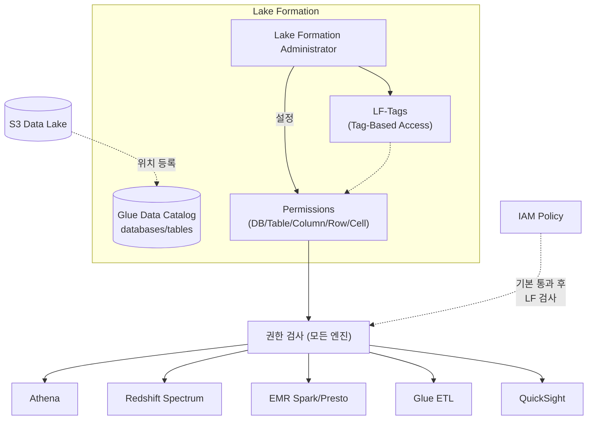

## 정의

**AWS Lake Formation** (LF) 은 *[[data-lake|데이터 레이크]] 의 세분화된 접근 제어 + 거버넌스를 중앙에서 관리* 하는 서비스. [[aws-glue|Glue Data Catalog]] 위에 얹혀 데이터베이스/테이블/컬럼/row/cell 단위 권한을 [[aws-iam|IAM]] 정책 대신 LF 만의 표준으로 표현.

**핵심**: [[aws-iam|IAM]] 만으로는 컬럼/row 단위 제어가 어려움 -> LF 로 대체.

## 왜 Lake Formation

[[aws-s3|S3]] + [[aws-glue|Glue]] + [[aws-athena|Athena]] 만으로 데이터 레이크를 구성하면:

- **[[aws-iam|IAM]] 정책** 이 유일한 접근 제어 -> 버킷/prefix 단위밖에 안 됨
- **컬럼 단위** 접근 제어 어려움 (PII 컬럼만 숨기기)
- **row 단위** 필터 없음 (지역별 데이터 격리)
- 여러 계정에 걸친 공유가 복잡
- 감사가 서비스별로 분산

**Lake Formation 이 답**:
- **테이블/컬럼/row/cell** 단위 권한
- **LF-Tags** 로 태그 기반 액세스 제어 (RBAC 대신 ABAC)
- Cross-account 공유 표준화
- [[aws-athena|Athena]], [[aws-redshift-spectrum|Spectrum]], [[aws-emr|EMR]], Spark 모두 동일 권한

## 아키텍처



## 권한 계층

| 대상 | 권한 예시 |
|:---|:---|
| **Database** | CREATE_TABLE, ALTER, DROP, DESCRIBE |
| **Table** | SELECT, INSERT, DELETE, ALTER, DROP, DESCRIBE |
| **Column** | SELECT (특정 컬럼만) |
| **Row** | SELECT (filter expression) |
| **Cell** | SELECT (row × column 조합) |
| **Data Location** (S3 prefix) | DATA_LOCATION_ACCESS |

## LF-Tags (Tag-Based Access Control, TBAC)

**RBAC (역할 기반)** 대신 **ABAC (속성 기반)**. 태그로 리소스와 사용자를 매칭.

### 예: PII / 부서별 접근

```
1. LF-Tag 정의
   Key: classification
   Values: [public, internal, pii]

   Key: department
   Values: [finance, hr, marketing]

2. 리소스에 태그
   Database "sales"      -> department=finance
   Table   "customers"   -> classification=pii
   Column  "email"       -> classification=pii

3. 사용자에 정책
   Analyst-Finance 그룹:
     GRANT SELECT ON LF-Tags: department=finance AND classification!=pii
```

이제 Analyst-Finance 는 finance DB 의 non-PII 컬럼만 SELECT 가능.

### 왜 LF-Tags 인가

수백 개 테이블 × 수십 개 그룹 = 조합 폭발. 태그 기반이면 **정책 수 = 태그 수** 로 유지.

## 컬럼 / Row / Cell 필터

### Column-Level Filter

특정 컬럼만 보이거나 숨김.

```
Table: customers
Grant SELECT on columns: [customer_id, name, country]
     Excluding: [ssn, birthdate, phone]  # PII 은닉
```

### Row-Level Filter (Data Cells Filter)

WHERE 조건으로 row 필터.

```
Filter: "region-korea-only"
  DatabaseName: sales
  TableName: orders
  RowFilter: "country = 'KR'"
  ColumnWildcard: ["*"]  # 모든 컬럼

Grant SELECT ON DataFilter "region-korea-only" TO group "Korea-Analysts"
```

Korea-Analysts 는 `orders` 를 SELECT 해도 `country='KR'` row 만 보임.

### Cell-Level Filter

Row + Column 결합. 다른 컬럼도 함께 제한.

```
Filter: "hr-own-region"
  RowFilter: "region = current_user_region()"
  ColumnWildcard:
    ExcludedColumnNames: ["salary"]  # region 이 자기 것이 아니면 salary 안 보임
```

## Lake Formation vs IAM

| 축 | [[aws-iam\|IAM]] | Lake Formation |
|:---|:---|:---|
| **단위** | 버킷/prefix | DB/Table/Column/Row/Cell |
| **표현** | JSON 정책 | LF-Tags + 관계 모델 |
| **엔진** | AWS 서비스 개별 | Athena/Spectrum/EMR/Glue 통일 |
| **PII 관리** | 어려움 | 표준 |
| **감사** | CloudTrail 서비스별 | 중앙화 |
| **관계** | 기본 | IAM 통과 후 LF 재검사 |

**우선순위**: LF 가 켜진 리소스는 **LF 권한이 IAM 을 오버라이드**. IAM 이 SELECT 를 허용해도 LF 에서 안 하면 접근 불가.

## Blueprints (워크플로)

*deprecated 방향*. 데이터 소스 (JDBC, S3) 를 catalog 로 로드하는 사전 정의 워크플로. 신규는 [[aws-glue|Glue]] 직접 사용 권장.

## 데이터 위치 등록

Lake Formation 이 관리할 S3 위치를 등록.

```bash
aws lakeformation register-resource \
  --resource-arn arn:aws:s3:::my-lake/analytics/ \
  --use-service-linked-role
```

- 등록된 위치의 S3 GET 은 LF 가 vending 하는 임시 자격 증명으로 수행
- 사용자가 직접 S3 API 를 호출해도 LF 권한 우회 불가 (프리셋)

## Cross-Account 공유

```
Producer Account (data owner)
   |  GRANT SELECT ON table1 TO Consumer Account
   ↓
Consumer Account (data consumer)
   |  RAM 초대 수락 -> Local resource link 생성
   ↓
   Athena / Spectrum 에서 LOCAL 로 쿼리
```

- **AWS RAM** 통합
- LF-Tags 도 cross-account 로 전파
- 데이터 복사 없이 논리적 공유

## 관리 역할 (Administrator)

- **Lake Formation Admin**: LF 자체 설정, 다른 사용자에게 권한 부여 가능
- **Data Lake Admin**: Data catalog / underlying storage 관리
- **Read-Only Admin**: 감사 목적

## LF 활성화 절차

1. Lake Formation Administrator 지정
2. 기존 [[aws-glue|Glue Data Catalog]] 를 LF 로 마이그레이션 (`OnlyIAMSettings` -> Mixed 또는 LF 만)
3. Data Location 등록
4. LF-Tags 정의 및 리소스에 부여
5. 그룹/사용자에 GRANT
6. `IAMAllowedPrincipals` (default 우회) 제거

**중요**: LF 를 활성화하지 않은 계정에서 기존 IAM 만 사용해도 되지만, 새 프로젝트는 처음부터 LF 로.

## 엔진별 동작

| 엔진 | LF 지원 | 특이사항 |
|:---|:---|:---|
| **[[aws-athena\|Athena]]** | 완전 지원 | Column/Row/Cell 필터 자동 적용 |
| **[[aws-redshift-spectrum\|Redshift Spectrum]]** | 완전 지원 | LF-Tags 인식 |
| **[[aws-emr\|EMR]] Spark/Presto** | 지원 | EMR 6.7+ (Trino), Spark 3.3+ |
| **[[aws-glue\|Glue Spark]] ETL** | 지원 | Job role 이 LF 권한 필요 |
| **QuickSight** | 지원 | Author 가 LF 권한 |

## 최근 업데이트 (2024-2026)

- **Nested column filtering**: struct 안의 필드 단위 컬럼 제어
- **Iceberg 완전 지원** (v1.10+)
- **Data cell 확장**: 복잡한 row filter 표현식
- **RCP 통합** ([[aws-organizations|Organizations]] RCP 와 결합)

## 요금

**Lake Formation 자체는 무료**. 다음이 요금:
- [[aws-glue|Glue Data Catalog]] (요청, 저장)
- [[aws-s3|S3]] (저장, 요청)
- 엔진 ([[aws-athena|Athena]] 스캔, [[aws-emr|EMR]] 인스턴스 등)

## 함정

> [!WARNING]
> **LF 활성화 후 `IAMAllowedPrincipals` 를 계속 두면** = IAM 이 계속 오버라이드 = LF 권한 무의미. 반드시 제거.

> [!CAUTION]
> **테이블 위치 (S3) 를 LF 에 등록 안 하면** = 사용자가 [[aws-s3|S3]] API 로 직접 접근해 LF 우회. 반드시 등록.

> [!WARNING]
> **엔진 버전 확인**. [[aws-emr|EMR]] / [[aws-athena|Athena]] 가 오래된 버전이면 컬럼/row 필터 미지원.

> [!IMPORTANT]
> **[[aws-iam|IAM]] 정책과 LF 는 AND**. 둘 다 통과해야 접근. IAM 이 이미 DENY 하면 LF 가 GRANT 해도 소용없음.

> [!CAUTION]
> **Cross-account share 는 AWS RAM 초대 수락 필요**. Consumer 가 수락 안 하면 안 보임.

> [!WARNING]
> **LF-Tags 조합 폭발**. 태그 key 개수 × values 개수 x 리소스 = 관리 부담. 4-6개 key 로 절제.

> [!IMPORTANT]
> **Data Cells Filter 는 성능 영향 있음**. 매 쿼리마다 필터 평가. 큰 팩트 테이블에는 partitioning + filter 결합.

## 관련 위키

- [[data-lake|Data Lake]] - 거버넌스 대상
- [[aws-glue|AWS Glue]] - Data Catalog
- [[aws-athena|Athena]] - 주요 소비 엔진
- [[aws-redshift-spectrum|Redshift Spectrum]] - Spectrum 도 LF 준수
- [[aws-emr|EMR]] - Spark/Trino 소비
- [[aws-s3|S3]] - underlying storage
- [[aws-iam|IAM]] - 상호작용
- AWS RAM - cross-account 공유
- [[aws-organizations|Organizations]] - RCP 결합
