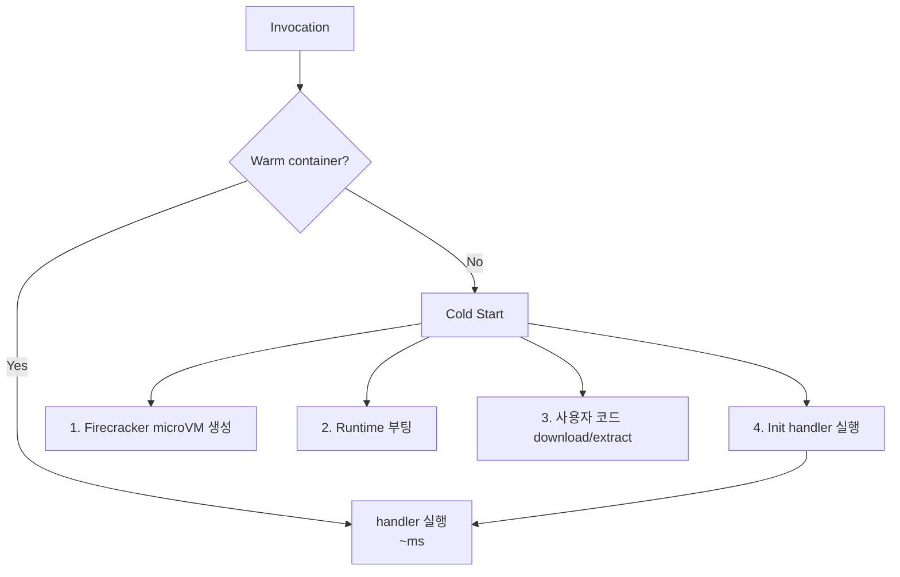

## 정의

**Cold Start** = Lambda 가 *처음 호출* 또는 *idle 후 다시 호출* 시 *컨테이너 + 런타임 + 사용자 코드 init* 의 시간.

## 단계



| 단계 | 시간 (Node) |
|---|---|
| MicroVM 생성 | ~50ms |
| Runtime 부팅 | ~50ms |
| 코드 load | ~50ms (의존성 크기 비례) |
| Init code | *사용자 책임* |

## Runtime 별 cold start (직관)

<ChartJs
  client:visible
  type="bar"
  title="Runtime 별 Cold Start (ms, p99 직관)"
  caption="Java 가 가장 느리지만 SnapStart 로 크게 개선. Rust/Go 가 가장 빠름."
  height="240px"
  data={{
    labels: ['Rust', 'Go', 'Node 22', 'Python 3.13', 'Java 21', 'Java 21 + SnapStart'],
    datasets: [
      {
        label: 'Cold Start (ms)',
        data: [30, 50, 150, 200, 1500, 150],
        backgroundColor: ['#22c55e', '#22c55e', '#3b82f6', '#3b82f6', '#ef4444', '#f59e0b'],
      },
    ],
  }}
  options={{
    scales: { y: { title: { display: true, text: 'ms' }, beginAtZero: true } },
    plugins: { legend: { display: false } },
  }}
/>

## 완화 4 단계

### 1. Provisioned Concurrency

```bash
aws lambda put-provisioned-concurrency-config \
  --function-name my-func \
  --qualifier prod \
  --provisioned-concurrent-executions 10
```

- *10 instance 미리 워밍*.
- 콜드 스타트 *0*.
- *비용*: idle 도 청구.

> [!TIP]
> *latency 예측 가능 필요* 한 API 만. *batch / async* 는 불필요.

### 2. Lambda SnapStart (Java)

```mermaid
sequenceDiagram
    Build[배포 시]: handler init 실행 → snapshot
    Inv[호출 시]: snapshot 복원 → handler 즉시 실행
```

- *Java cold start 1500ms → 150ms*.
- **snapshot 안에 DB 연결 같은 unique value 주의** (uniqueness 깨짐).

### 3. 코드 최적화

```js
// ❌ handler 안에서
export const handler = async (event) => {
  const db = new DBClient();   // 매 호출 새 연결!
  ...
};

// ✅ handler 밖 (init 시 1회)
const db = new DBClient();
export const handler = async (event) => {
  ...
};
```

### 4. Bundle 크기 줄이기

| 도구 | 효과 |
|---|---|
| esbuild | tree-shake + minify |
| webpack | 동일 |
| Layer 분리 | 큰 의존성을 layer 로 |
| Lambda Container Image | tag 단위 캐싱 |

## Warm 유지 (anti-pattern)

```bash
# CloudWatch Events 로 5분마다 ping
schedule: rate(5 minutes)
target: lambda function
```

> [!CAUTION]
> *옛 워크어라운드*. 현재는 *Provisioned Concurrency 가 정통*. ping 방식은 *불안정* + *동시 N 인스턴스 보장 안 됨*.

## 측정

```python
import time
import os
print(f"INIT, container: {os.environ.get('AWS_LAMBDA_LOG_STREAM_NAME')}, t={time.time()}")

def handler(event, context):
    print(f"HANDLER, t={time.time()}")
```

CloudWatch Logs 에서 *INIT vs HANDLER* 의 시간 차 = cold start.

## VPC Lambda 의 cold start (옛 vs 현재)

| 시점 | Cold Start (VPC) |
|---|---|
| ~2019 | *5-15초* (ENI 생성) |
| 2019+ (Hyperplane) | *~1초* 추가 |
| 2026 (Firecracker + warm pool) | *거의 일반과 동일* |

## 관련 위키

- [[aws-lambda]]
- [[aws-vpc]]
- [[aws-api-gateway]]
