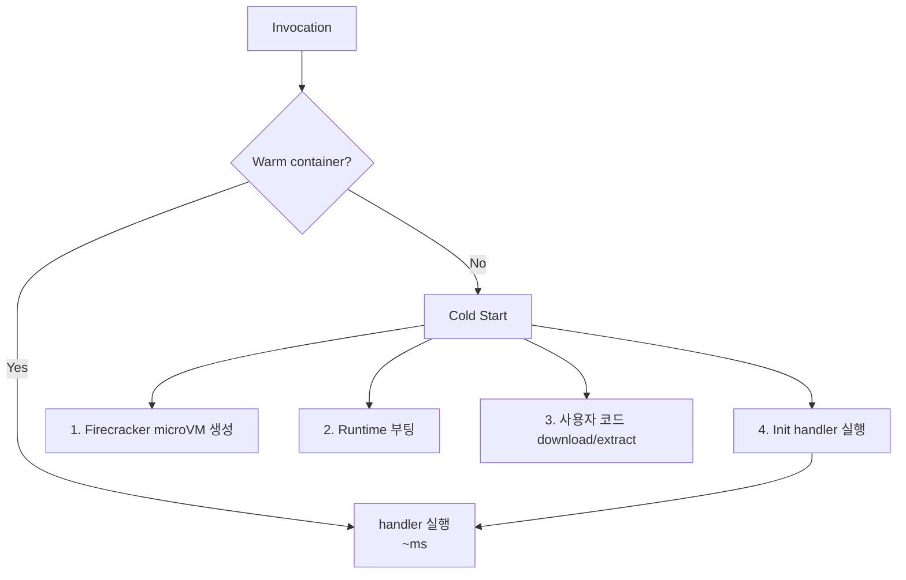
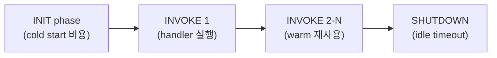

## 정의

**Cold Start** = Lambda 가 *처음 호출* 또는 *idle 후 다시 호출* 시 *컨테이너 + 런타임 + 사용자 코드 init* 에 소요되는 지연 시간.

## 사용 상황 (cold start 가 문제인 경우)

| 상황 | 영향 | 권장 완화 |
|---|---|---|
| 동기 API Gateway 요청 | 첫 요청 latency spike | Provisioned Concurrency |
| 사용자 직접 호출 (실시간) | 체감 느림 | Provisioned Concurrency / SnapStart |
| 배치 비동기 처리 | 일반적으로 무시 가능 | 불필요 |
| SQS / EventBridge 트리거 | 큐 쌓임 정도만 영향 | Bundle 최적화로 충분 |
| Java 기반 함수 | cold start 1000ms+ | SnapStart 필수 |
| VPC 내 Lambda | 예전엔 +5-15초 (현재 거의 없음) | 최신 Hyperplane 사용 |

Cold start 가 *p99 수준에서* 실제 사용자 경험에 미치는지 먼저 측정. 과도한 최적화 전에 데이터를 봐야 함.

## 단계



| 단계 | 시간 (Node) | 소유자 |
|---|---|---|
| MicroVM 생성 | ~50ms | AWS |
| Runtime 부팅 | ~50ms | AWS |
| 코드 load | ~50ms (의존성 크기 비례) | AWS + 사용자 |
| Init code 실행 | *사용자 책임* | 사용자 |

## Execution Environment Lifecycle



- **INIT**: MicroVM 생성 + 런타임 부팅 + 사용자 init code 실행. *1회만*.
- **INVOKE**: 매 호출마다 handler 함수 실행. INIT 없음.
- **SHUTDOWN**: idle 후 (보통 5-15분) 환경 회수. 다음 호출 = 새 INIT.
- **재사용**: `/tmp` (512MB-10GB), 전역 변수, DB 연결 등 재사용 가능.

## Runtime 별 cold start (직관)

<ChartJs
  client:visible
  type="bar"
  title="Runtime 별 Cold Start (ms, p99 직관)"
  caption="Java 가 가장 느리지만 SnapStart 로 크게 개선. Rust/Go 가 가장 빠름."
  height="240px"
  data={{
    labels: ['Rust', 'Go', 'Node 22', 'Python 3.13', 'Java 21', 'Java 21 + SnapStart'],
    datasets: [
      {
        label: 'Cold Start (ms)',
        data: [30, 50, 150, 200, 1500, 150],
        backgroundColor: ['#22c55e', '#22c55e', '#3b82f6', '#3b82f6', '#ef4444', '#f59e0b'],
      },
    ],
  }}
  options={{
    scales: { y: { title: { display: true, text: 'ms' }, beginAtZero: true } },
    plugins: { legend: { display: false } },
  }}
/>

## 완화 전략

### 1. Provisioned Concurrency

*N 개 인스턴스를 항상 warm 상태로 유지*. cold start 0.

```bash
aws lambda put-provisioned-concurrency-config \
  --function-name my-func \
  --qualifier prod \
  --provisioned-concurrent-executions 10
```

- 10 인스턴스 항상 warm.
- Cold start 완전 제거.
- 비용: idle 상태에서도 과금. *API, 실시간 처리에 적합*.

> [!TIP]
> *latency 예측 가능성이 필요한 API* 에만. *batch / async* 는 불필요. Application Auto Scaling 으로 트래픽 패턴에 맞게 자동 조절 가능.

```bash
# Auto Scaling 연동
aws application-autoscaling register-scalable-target \
  --service-namespace lambda \
  --resource-id function:my-func:prod \
  --scalable-dimension lambda:function:ProvisionedConcurrency \
  --min-capacity 2 \
  --max-capacity 50
```

### 2. Lambda SnapStart (Java)


- *Java cold start 1500ms → 150ms*.
- **snapshot 안에 DB 연결 같은 unique value 주의** (uniqueness 깨짐).
- `AfterRestore` hook 으로 snapshot 복원 후 초기화 재실행 가능.

```java
@LambdaHook(hookType = AfterRestore.class)
public static void afterRestore(Context context) {
    // snapshot 복원 후 실행: DB 연결 재수립 등
    dbConnection = createNewConnection();
}
```

### 3. 코드 최적화

```js
// ❌ handler 안에서: 매 호출마다 새 연결
export const handler = async (event) => {
  const db = new DBClient();
  const result = await db.query(...);
};

// ✅ handler 밖 (init 시 1회): 연결 재사용
const db = new DBClient();
export const handler = async (event) => {
  const result = await db.query(...);
};
```

- DB 연결, HTTP 클라이언트, SDK 초기화 = handler 밖으로.
- *Lazy initialization*: 실제 필요할 때까지 지연.
- 불필요한 `import` 제거.

### 4. Bundle 크기 줄이기

| 도구 | 효과 |
|---|---|
| esbuild | tree-shake + minify, 가장 빠름 |
| webpack | 동일 효과, 설정 더 복잡 |
| Layer 분리 | 큰 의존성 (AWS SDK 등) 을 Layer 로 분리 |
| Lambda Container Image | ECR 레이어 캐싱 활용 |
| `.zip` 압축 최적화 | `node_modules` 필요 파일만 포함 |

목표: *zip 10MB 이하*, 가능하면 *5MB 이하*.

### 5. ARM64 (Graviton2)

```bash
aws lambda update-function-configuration \
  --function-name my-func \
  --architectures arm64
```

- x86_64 대비 *cold start 10-20% 개선*.
- 비용 *약 20% 절감*.
- 대부분의 런타임 지원 (Node, Python, Java, Go, Ruby).
- *ARM 네이티브 바이너리 확인 필수* (native addon 있을 경우).

## Warm 유지 anti-pattern

```bash
# CloudWatch Events 로 5분마다 ping
schedule: rate(5 minutes)
target: lambda function
```

> [!CAUTION]
> *옛 워크어라운드*. 현재는 *Provisioned Concurrency 가 정통*. ping 방식의 문제:
> - 동시 N 인스턴스 warm 보장 안 됨 (1개만 warm).
> - 트래픽 급증 시 여전히 cold start 발생.
> - 불필요한 비용 + 복잡도.

## 측정 + 모니터링

```python
import time
import os
INIT_TIME = time.time()
print(f"INIT t={INIT_TIME}, container={os.environ.get('AWS_LAMBDA_LOG_STREAM_NAME')}")

def handler(event, context):
    invoke_time = time.time()
    print(f"HANDLER t={invoke_time}, delta={invoke_time - INIT_TIME:.3f}s")
```

CloudWatch Logs 에서 *INIT vs HANDLER* 시간 차 = cold start 실측.

### [[aws-cloudwatch]] 지표

| 지표 | 의미 |
|---|---|
| `InitDuration` | cold start 소요 시간 (REPORT 로그) |
| `Duration` | handler 실행 시간 |
| `ConcurrentExecutions` | 동시 실행 수 |
| `ProvisionedConcurrencyUtilization` | Provisioned 사용률 |
| `Throttles` | 제한된 요청 수 |

```bash
# X-Ray 활성화: init / handler 구간별 tracing
aws lambda update-function-configuration \
  --function-name my-func \
  --tracing-config Mode=Active
```

## Lambda Power Tuning

AWS Lambda Power Tuning (오픈소스 Step Functions 워크플로우) 으로 *메모리 vs 비용 vs 속도 최적화점* 탐색.

```bash
# Step Functions 로 실행, 각 메모리 설정에서 N 회 테스트
{
  "lambdaARN": "arn:aws:lambda:...:my-func",
  "powerValues": [128, 256, 512, 1024, 2048, 3008],
  "num": 10,
  "payload": {},
  "parallelInvocation": true,
  "strategy": "cost"
}
```

- 메모리 증가 = vCPU 비율 증가 = 실행 시간 감소.
- *비용 최적 메모리 != 가장 저렴한 메모리*. 빠른 실행이 총 비용 낮출 수 있음.

## VPC Lambda 의 cold start (옛 vs 현재)

| 시점 | Cold Start (VPC) | 원인 |
|---|---|---|
| ~2019 | 5-15초 | ENI 직접 생성 |
| 2019+ (Hyperplane) | ~1초 추가 | ENI 사전 생성 + 재사용 |
| 2024+ (Firecracker warm pool) | 일반과 거의 동일 | warm ENI pool |

> [!TIP]
> 현재는 VPC Lambda cold start 가 거의 문제 없음. 단, *서브넷 IP 고갈* 은 여전히 주의.

## Container Image vs ZIP

| 항목 | ZIP | Container Image |
|---|---|---|
| 최대 크기 | 50MB (압축) / 250MB (비압축) | 10GB (ECR) |
| 빌드 속도 | 빠름 | 느림 (Docker build) |
| Cold start | 빠름 | 느릴 수 있음 (초기 pull) |
| Layer 재사용 | Lambda Layer | Docker layer 캐싱 |
| 로컬 테스트 | SAM / AWS CLI | Docker 로 완전 동일 환경 |
| 의존성 관리 | 번들러 필요 | Dockerfile 로 단순 |

*대규모 ML 모델이나 복잡한 네이티브 의존성*: Container Image. *일반 서버리스 API*: ZIP + esbuild.

## 흔한 함정

> [!WARNING]
> 1. **Cold start 측정 안 하고 최적화** = 실제 병목이 아닐 수 있음. 먼저 `InitDuration` 측정.
> 2. **Provisioned Concurrency 과다 설정** = 불필요한 비용. 실제 동시 요청 수 기반으로 설정.
> 3. **SnapStart 의 snapshot 내 UUID/시간** = 복원 후 중복. `AfterRestore` 훅에서 재생성.
> 4. **Handler 밖 초기화 실패** = 함수 전체 장애. init code 는 방어적으로 작성.
> 5. **ARM64 로 전환 후 native addon 오류** = `sharp`, `bcrypt` 등 아키텍처별 바이너리 재빌드 필요.
> 6. **Bundle 크기 과다** = 코드 load 시간 증가. `@aws-sdk/client-s3` 만 import (전체 SDK 금지).
> 7. **VPC Lambda 서브넷 IP 고갈** = ENI 생성 실패. `/24` 이상 서브넷 권장.

## 관련 위키

- [[aws-lambda]]
- [[aws-vpc]]
- [[aws-api-gateway]]
- [[aws-cloudwatch]]
