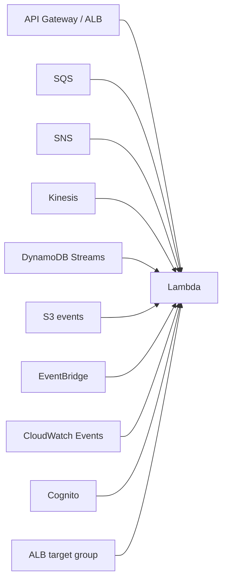
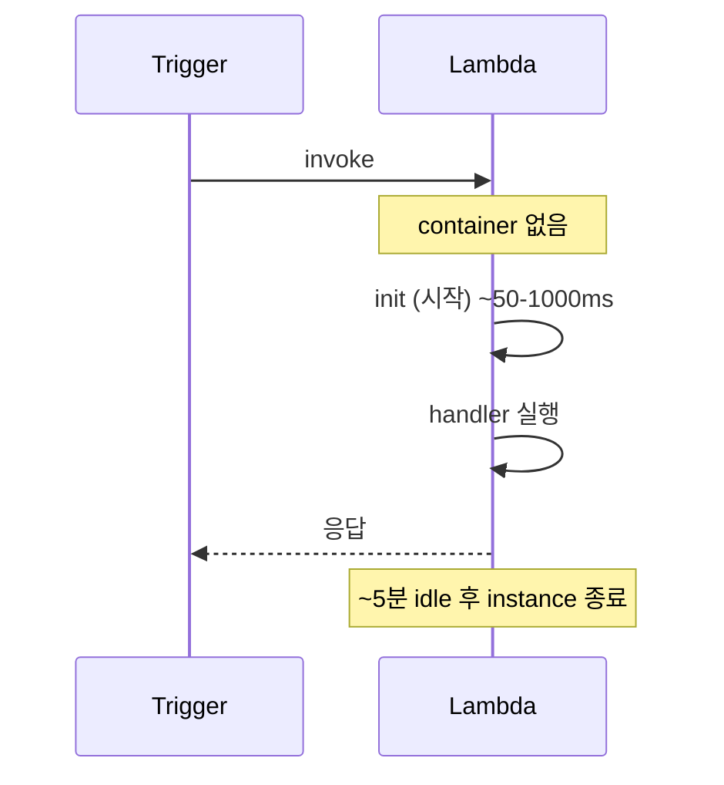

## 정의

**AWS Lambda** = *서버리스 함수 실행*. *이벤트 트리거* → *함수 실행* → 결과 / 비동기 처리. *서버 관리 0*.

## 트리거 종류



| 트리거 | 모델 |
|---|---|
| API Gateway / ALB | sync (HTTP) |
| SQS | async (poll) |
| Kinesis / DynamoDB Streams | poll + ordered |
| S3 / SNS / EventBridge | event |
| Cron (EventBridge Scheduler) | scheduled |

## 함수 작성

```js
// Node.js
export const handler = async (event, context) => {
  console.log('event', event);
  return {
    statusCode: 200,
    body: JSON.stringify({ message: 'hello' }),
  };
};
```

```python
# Python
def lambda_handler(event, context):
    return {
        'statusCode': 200,
        'body': json.dumps({'message': 'hello'})
    }
```

## 실행 모델

| 모드 | 의미 |
|---|---|
| Request-Response (sync) | 호출자가 응답 대기 |
| Async | invoke 후 즉시 반환, 재시도 자동 |
| Stream (Kinesis) | batch 처리 |

## Concurrency

```mermaid
flowchart LR
    Req[1000 동시 요청] --> L[Lambda]
    L --> I1[Instance 1<br/>(1 req 동시)]
    L --> I2[Instance 2]
    L --> IN[Instance N]
    Note["account-wide quota: 1000 (default)<br/>증가 요청 가능"]
```

| 종류 | 의미 |
|---|---|
| **Unreserved** (기본) | account 공통 풀 |
| **Reserved concurrency** | 함수에 한도 / 보장 분리 |
| **Provisioned concurrency** | *미리 워밍업* + 콜드 스타트 0 |

## Cold Start



| Runtime | 평균 cold start |
|---|---|
| Node 22 | ~150ms |
| Python 3.13 | ~200ms |
| Go | ~50ms |
| Rust | ~30ms |
| Java | *500ms-2s* (가장 느림) |
| Java + SnapStart | ~150ms |

### Cold Start 완화

1. **Provisioned Concurrency**: 항상 N개 워밍업.
2. **Lambda SnapStart** (Java): *snapshot 으로 빠르게*.
3. **smaller package** (코드 / dependency).
4. **avoid VPC** (옛 cold start 5초+, 현재는 빠름).
5. **함수 분리** (큰 모놀리스 함수 회피).

## Memory & CPU

> Memory 늘리면 *CPU 도 비례 증가*. *gp 결정의 단일 dial*.

| Memory | vCPU |
|---|---|
| 128 MB | 0.083 |
| 1024 MB | 0.6 |
| 1769 MB | *1.0 (full vCPU)* |
| 10240 MB | 5.78 |

## 가격

```
요금 = (실행 시간 ms) × (Memory GB) × $0.0000166667
+ (실행 횟수) × $0.20/M
```

> *짧고 자주* 호출되면 *호출 비용*, *긴 실행* 이면 *시간 비용*. 모니터링 필요.

## Layers (공유 코드)

```yaml
Layers:
  - arn:aws:lambda:us-east-1:123456789012:layer:common-deps:5
```

- 여러 함수가 *공유*.
- 의존성 분리 → 함수 코드 작아짐.
- 5 layer per function 한도.

## Lambda 의 적합 / 부적합

| 적합 | 부적합 |
|---|---|
| 짧은 처리 (< 15분) | *장시간 처리* (> 15분) |
| 비동기 이벤트 처리 | *지속 연결* (WebSocket idle) |
| API endpoint | 극저지연 (cold start 부담) |
| ETL batch | 큰 메모리 (10GB 초과) |
| 스케일 spike 흡수 | GPU 워크로드 |

## 흔한 함정

> [!WARNING]
> 1. **VPC 안 Lambda 의 cold start** = ENI 생성. 현대는 빠르지만 *옛 사고 기억*.
> 2. **handler 안에 *DB 연결*** = cold start 마다 새 연결. *handler 밖 전역* 으로 (warm reuse).
> 3. **timeout 너무 짧음** = 무거운 처리 fail. 모니터링 + 늘림.
> 4. **동시성 한도** = account 한도 1000 (default). 갑작스런 spike 시 throttling.

## 관련 위키

- [[aws-lambda-cold-start]]
- [[aws-ec2]]
- [[aws-sqs]]
- [[aws-eventbridge]]
- [[aws-api-gateway]] (Lambda + API Gateway)
