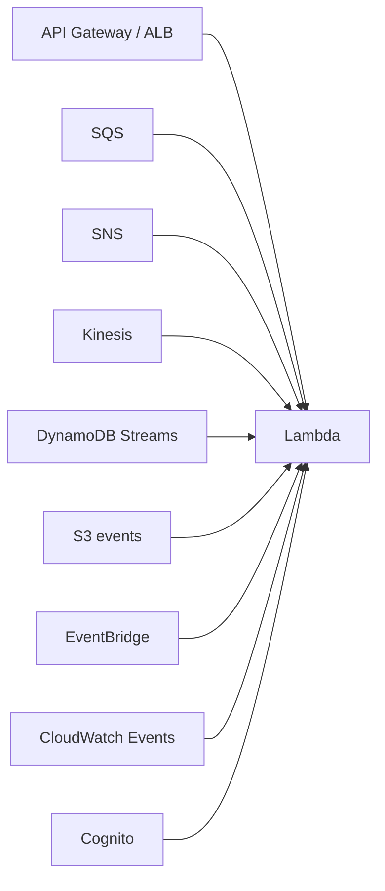
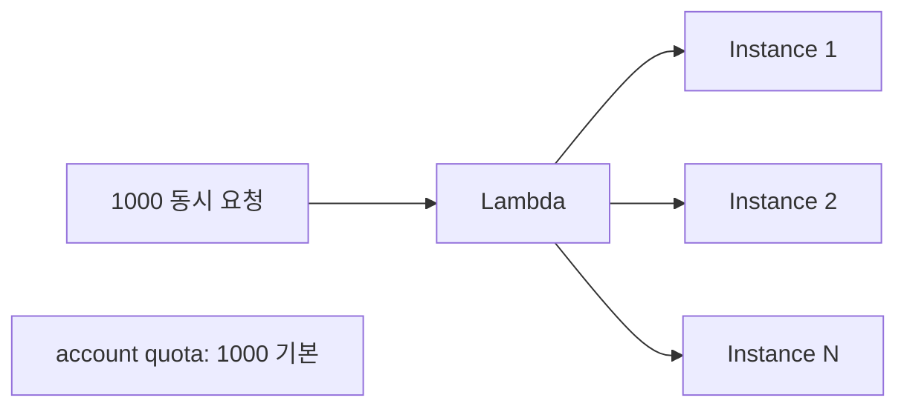
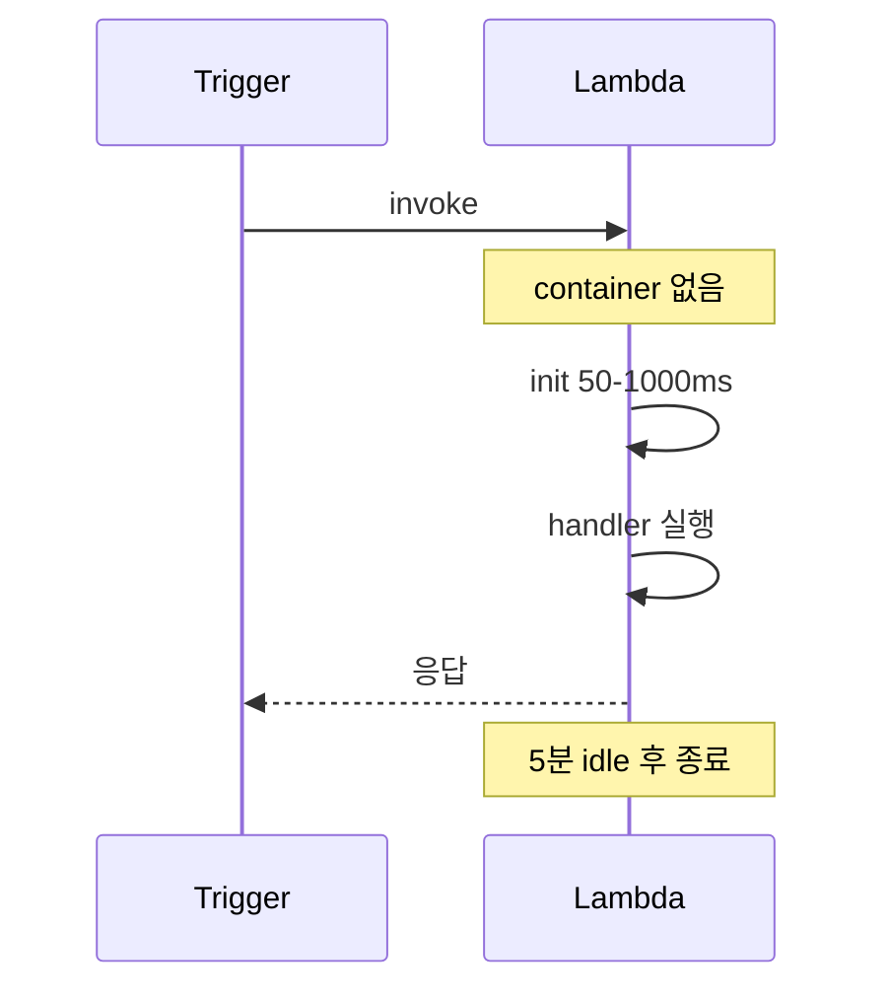

## 정의

**AWS Lambda** = *서버리스 함수 실행*. *이벤트 트리거* → *함수 실행* → 결과 / 비동기 처리. *서버 관리 0*.

## 사용 상황

| 상황 | Lambda 적합성 |
|---|---|
| REST API (API Gateway + Lambda) | 적합, 짧은 처리 |
| S3 업로드 후 이미지 리사이즈 | 적합, 이벤트 처리 |
| DynamoDB Streams 변경 감지 | 적합, poll 처리 |
| SQS 메시지 소비 | 적합, 자동 스케일 |
| 웹소켓 상시 연결 유지 | *부적합*, ECS 권장 |
| 15분 초과 ML 추론 | *부적합*, ECS/Batch 권장 |
| GPU 워크로드 | *부적합*, EC2 권장 |

## 트리거 종류



| 트리거 | 모델 |
|---|---|
| API Gateway / ALB | sync |
| SQS | async poll |
| Kinesis / DynamoDB Streams | poll + ordered |
| S3 / SNS / EventBridge | event |
| Cron | EventBridge Scheduler |

## 함수 작성

```js
// Node.js
export const handler = async (event, context) => {
  console.log('event', event);
  return {
    statusCode: 200,
    body: JSON.stringify({ message: 'hello' }),
  };
};
```

```python
# Python
def lambda_handler(event, context):
    return {
        'statusCode': 200,
        'body': json.dumps({'message': 'hello'})
    }
```

## 실행 모델

| 모드 | 의미 |
|---|---|
| Request-Response (sync) | 호출자가 응답 대기 |
| Async | invoke 후 즉시 반환, 재시도 자동 |
| Stream (Kinesis) | batch 처리 |

## Concurrency



| 종류 | 의미 |
|---|---|
| **Unreserved** (기본) | account 공통 풀 |
| **Reserved concurrency** | 함수에 한도 / 보장 분리 |
| **Provisioned concurrency** | *미리 워밍업* + 콜드 스타트 0 |

## Cold Start



| Runtime | 평균 cold start |
|---|---|
| Node 22 | ~150ms |
| Python 3.13 | ~200ms |
| Go | ~50ms |
| Rust | ~30ms |
| Java | *500ms-2s* |
| Java + SnapStart | ~150ms |

### Cold Start 완화

1. **Provisioned Concurrency**: 항상 N개 워밍업.
2. **Lambda SnapStart** (Java): *snapshot 으로 빠르게*.
3. **smaller package** (코드 / dependency).
4. **avoid VPC** (옛 cold start 5초+, 현재는 빠름).
5. **함수 분리** (큰 모놀리스 함수 회피).

## Memory & CPU

> Memory 늘리면 *CPU 도 비례 증가*. *성능 결정의 단일 dial*.

| Memory | vCPU |
|---|---|
| 128 MB | 0.083 |
| 1024 MB | 0.6 |
| 1769 MB | *1.0 (full vCPU)* |
| 10240 MB | 5.78 |

## 가격

```
요금 = (실행 시간 ms) x (Memory GB) x $0.0000166667
     + (실행 횟수) x $0.20/M
```

> *짧고 자주* 호출되면 *호출 비용*, *긴 실행* 이면 *시간 비용*. 모니터링 필요.

## Layers (공유 코드)

```yaml
Layers:
  - arn:aws:lambda:us-east-1:123456789012:layer:common-deps:5
```

- 여러 함수가 *공유*.
- 의존성 분리 → 함수 코드 작아짐.
- 5 layer per function 한도.

## Lambda URLs

API Gateway 없이 *Lambda 에 직접 HTTPS endpoint* 부여.

```bash
# Lambda URL 생성
aws lambda create-function-url-config \
  --function-name my-function \
  --auth-type NONE

# 반환: https://<id>.lambda-url.<region>.on.aws/
```

| 항목 | 내용 |
|---|---|
| Auth | NONE (공개) 또는 AWS_IAM |
| 비용 | API Gateway 보다 저렴 |
| 기능 | 단순 HTTP 만 지원 |
| 적합 | 웹훅, 간단한 API |
| 부적합 | 복잡한 라우팅, 인증 미들웨어 |

## Lambda @ Edge / CloudFront Functions

CloudFront *엣지 로케이션에서 실행* 하는 Lambda.

| | Lambda @ Edge | CloudFront Functions |
|---|---|---|
| 실행 위치 | Regional edge | 450+ POP |
| 런타임 | Node.js, Python | JS (제한) |
| 실행 시간 | 최대 30초 | 1ms |
| 메모리 | 최대 10GB | 2MB |
| 용도 | 인증, 변환 | 단순 리다이렉트 |

```js
// Lambda @ Edge: 요청 헤더에 인증 토큰 확인
exports.handler = async (event) => {
  const request = event.Records[0].cf.request;
  const token = request.headers['authorization']?.[0]?.value;

  if (!token || !isValid(token)) {
    return { status: '401', body: 'Unauthorized' };
  }
  return request;
};
```

## Lambda Extensions

Lambda *lifecycle 에 훅* 해서 실행되는 사이드카.

```text
Extension Layer
├── Init Phase: extension 초기화
├── Invoke Phase: 함수와 병렬 실행
└── Shutdown Phase: 종료 전 처리 (flush logs 등)
```

| 용도 | 예시 |
|---|---|
| 로그 수집 | Datadog, New Relic agent |
| 시크릿 캐시 | Secrets Manager 사전 fetch |
| 코드 검사 | RASP (보안 에이전트) |

## Lambda Powertools

AWS 공식 *생산성 라이브러리* (Node.js / Python / Java).

```typescript
import { Logger } from '@aws-lambda-powertools/logger';
import { Tracer } from '@aws-lambda-powertools/tracer';
import { Metrics, MetricUnit } from '@aws-lambda-powertools/metrics';

const logger = new Logger({ serviceName: 'order-api' });
const tracer = new Tracer({ serviceName: 'order-api' });
const metrics = new Metrics({ namespace: 'MyApp' });

export const handler = async (event: APIGatewayEvent) => {
  logger.info('Processing order', { orderId: event.pathParameters?.id });
  metrics.addMetric('OrderProcessed', MetricUnit.Count, 1);
  // ...
};
```

| 기능 | 역할 |
|---|---|
| Logger | 구조화 JSON 로깅, correlation ID |
| Tracer | X-Ray 자동 계측 |
| Metrics | EMF 기반 커스텀 메트릭 |
| Idempotency | 중복 실행 방지 |
| Parameters | SSM / Secrets Manager 캐시 |

## Lambda 의 적합 / 부적합

| 적합 | 부적합 |
|---|---|
| 짧은 처리 (< 15분) | *장시간 처리* (> 15분) |
| 비동기 이벤트 처리 | *지속 연결* (WebSocket idle) |
| API endpoint | 극저지연 (cold start 부담) |
| ETL batch | 큰 메모리 (10GB 초과) |
| 스케일 spike 흡수 | GPU 워크로드 |

## 흔한 함정

> [!WARNING]
> 1. **VPC 안 Lambda 의 cold start** = ENI 생성 지연. 현재는 빠르지만 옛 경험 주의.
> 2. **handler 안에 *DB 연결*** = cold start 마다 새 연결. *handler 밖 전역* 으로 warm reuse.
> 3. **timeout 너무 짧음** = 무거운 처리 fail. 모니터링 + 늘림.
> 4. **동시성 한도** = account 한도 1000 기본. 갑작스런 spike 시 throttling.
> 5. **Lambda URL + NONE auth** = 공개 endpoint. WAF 연결 또는 IAM 인증 필요.
> 6. **임시 파일 `/tmp` 한도** = 512MB 기본 (최대 10GB). 큰 파일 처리 시 S3 사용.

## 관련 위키

- [[aws-lambda-cold-start]]
- [[aws-ec2]]
- [[aws-sqs]]
- [[aws-eventbridge]]
- [[aws-api-gateway]]
- [[aws-step-functions]]
