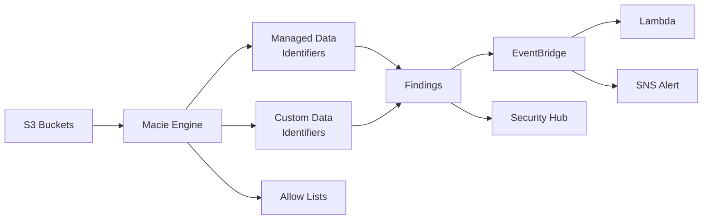

## 정의

**Amazon Macie** 는 AWS 가 관리하는 **데이터 보안 및 프라이버시 서비스** 로, 머신러닝과 패턴 매칭을 이용해 **S3 버킷의 민감 정보 (PII, PHI, 금융 정보, credential 등)** 를 자동 탐지하고 데이터 보안 자세 (posture) 를 평가합니다.

**한 줄 요약**: "S3 에 이상한 민감 정보가 저장돼 있진 않나?" 에 답하는 서비스.

## 왜 Macie 인가

### 조직의 흔한 문제

- **S3 버킷 규모** 가 커지면 어떤 버킷에 무슨 데이터가 있는지 파악 불가
- **개발자가 실수로** PII 를 로그에 남기거나 backup 에 포함
- **컴플라이언스 요구** (GDPR, HIPAA, PCI DSS) 는 민감 정보 위치를 명확히 알아야
- **누출 리스크**: public 버킷에 실수로 개인정보 저장

수동 발견은 불가능. 자동 스캐닝 + 분류 필요.

## 두 가지 핵심 기능

### 1. Sensitive Data Discovery

S3 객체를 스캔해 **민감 정보 유형 + 위치** 식별.

- **Managed Data Identifiers** (150+ 사전 정의): 신용카드, 여권번호, IP, PHI, credential 등
- **Custom Data Identifiers**: 정규식으로 자체 정의
- **Allow Lists**: false-positive 제외

### 2. S3 Security Posture

S3 계정 전체의 **보안 상태 자동 평가**.

- 공개 접근 (public read/write) 감지
- 암호화 되지 않은 버킷
- 다른 계정 공유
- 복제 상태
- Object ownership 설정

## 주요 개념

### Managed Data Identifiers (관리형 식별자)

AWS 가 유지 관리하는 150+ 개 사전 정의 유형. 예:

- **PII (개인식별정보)**: 이름, 생년월일, 이메일, 전화, 주소, 주민등록번호
- **금융**: 신용카드 (Visa/MC/AmEx/Discover), CVV, 은행 계좌, IBAN, SWIFT
- **의료 (PHI)**: NPI (National Provider ID), Medicare ID, DEA
- **여행/신분**: 여권번호 (국가별), 운전면허, 사회보장번호
- **Credential**: AWS access key, private key, JWT, GitHub token, database password
- **지역별**: 한국 주민등록번호, 일본 My Number, 인도 Aadhaar

각 identifier 는 **패턴 + 컨텍스트 키워드** 조합으로 감지 (예: 신용카드 번호 근처 "credit card" 텍스트).

### Custom Data Identifiers

정규식 기반 자체 식별자:

```json
{
  "name": "Employee ID",
  "regex": "EMP-[0-9]{6}",
  "keywords": ["employee", "emp id"],
  "ignoreWords": ["template", "example"],
  "maximumMatchDistance": 50
}
```

- `keywords` 근처에서만 감지 -> false-positive 감소
- `ignoreWords` 로 예외 처리

### Findings (발견 사항)

Macie 가 감지한 결과. 두 유형:

- **Sensitive Data Findings**: 특정 객체에 민감 정보 발견
- **Policy Findings**: 버킷 정책 문제 (public 접근, 암호화 없음 등)

각 finding 은 심각도 (Low/Medium/High) 와 카테고리로 분류.

### Automated Sensitive Data Discovery (자동 발견)

2023년 도입. Macie 활성화 시 자동으로 조직 전체 S3 스캔.

- **일일 샘플링**: 각 버킷에서 대표 객체 스캔
- **비용 예측 가능**: 정액제 (계정당 월)
- **지속적 인벤토리**: 매일 업데이트되는 데이터 자세

수동 discovery job 없이도 baseline 보안 상태 파악.

## 아키텍처



## Discovery Job 실행

명시적 스캐닝 job 생성:

```bash
aws macie2 create-classification-job \
  --job-type ONE_TIME \
  --name "quarterly-pii-scan" \
  --s3-job-definition '{
    "bucketDefinitions": [
      {
        "accountId": "123456789012",
        "buckets": ["prod-logs", "prod-user-uploads"]
      }
    ],
    "scoping": {
      "includes": {
        "and": [
          {
            "simpleScopeTerm": {
              "comparator": "GTE",
              "key": "OBJECT_SIZE",
              "values": ["1024"]
            }
          }
        ]
      }
    }
  }' \
  --managed-data-identifier-selector RECOMMENDED
```

**Job 유형**:
- **ONE_TIME**: 한 번 스캔
- **SCHEDULED**: 정기 (daily / weekly / monthly)

**Scoping**: 크기, 확장자, 태그, prefix 로 필터.

## 지원 파일 형식

Macie 가 파싱하고 스캔:
- **텍스트**: TXT, CSV, TSV, HTML, XML, JSON, JSONL
- **문서**: PDF, Word (DOC/DOCX), Excel (XLS/XLSX), PowerPoint (PPT/PPTX)
- **아카이브**: TAR, ZIP, GZIP (내부 파일 스캔)
- **이메일**: EML, MSG
- **로그**: Apache, log4j 형식

**지원 안 함**: 이미지 (JPG, PNG), 비디오, 실행 파일, 암호화된 파일.

## Finding 예시

```json
{
  "id": "abc123",
  "severity": {"description": "High", "score": 3},
  "type": "SensitiveData:S3Object/Personal",
  "resourcesAffected": {
    "s3Bucket": {
      "name": "user-uploads",
      "publicAccess": {"effectivePermission": "PUBLIC_READ"}
    },
    "s3Object": {
      "key": "backups/users-2026-01.csv",
      "size": 15728640
    }
  },
  "classificationDetails": {
    "result": {
      "sensitiveData": [
        {
          "category": "PERSONAL_INFORMATION",
          "totalCount": 4523,
          "detections": [
            {"type": "USA_SOCIAL_SECURITY_NUMBER", "count": 4520},
            {"type": "USA_DRIVERS_LICENSE", "count": 3}
          ]
        },
        {
          "category": "FINANCIAL_INFORMATION",
          "totalCount": 892,
          "detections": [
            {"type": "CREDIT_CARD_NUMBER", "count": 892}
          ]
        }
      ]
    }
  }
}
```

이 finding = "public read S3 버킷의 CSV 파일에 SSN 4520개 + 신용카드 892개".

## EventBridge 자동 대응

```json
{
  "source": ["aws.macie"],
  "detail-type": ["Macie Finding"],
  "detail": {
    "severity": {"description": ["High"]},
    "type": [{"prefix": "SensitiveData:"}]
  }
}
```

Lambda 로 자동 조치:
- 즉시 S3 버킷 public access 차단
- Slack / PagerDuty 알림
- Jira 티켓 생성
- 객체 격리 (다른 버킷으로 이동, KMS 재암호화)

## Multi-Account (Organizations 통합)

**Delegated administrator** 계정이 조직 전체 Macie 관리:

- Central 계정에서 모든 계정 버킷 인벤토리 조회
- Central 에서 통합 finding 대시보드
- 정책/식별자를 중앙에서 배포

관리자 위임:

```bash
aws macie2 enable-organization-admin-account \
  --admin-account-id 111111111111
```

## 요금

Macie 는 **두 요금 축**:

1. **S3 버킷 평가** (posture): 계정당 월 정액 (버킷 수/객체 수 기반)
2. **Sensitive data discovery**: GB 당 (스캔된 데이터)

**Cost 관리 팁**:
- Scoping 으로 큰 파일 (백업, 로그) 제외 후 시작
- Sampling (Automated discovery) 로 baseline 확보
- 필요 부분만 전체 스캔

**주의**: 큰 조직은 첫 스캔에서 요금 폭발 가능. Free trial (30일) 로 볼륨 예측 후 진행.

## GuardDuty 와의 차이

| 서비스 | 초점 |
|:---|:---|
| **Macie** | S3 안 **데이터** 의 민감성 |
| **[[aws-guardduty|GuardDuty]]** | 계정/네트워크 **활동** 의 이상 |

- Macie: "**어떤 데이터** 가 노출됐나?"
- GuardDuty: "**누가** 이상하게 API 를 호출했나?"

병행 사용.

## 실전 사용 사례

### 1. 컴플라이언스 (GDPR/HIPAA/PCI DSS)

- 조직 전체 S3 스캔 -> PII/PHI/PCI 위치 지도
- 감사인에게 "우리는 이런 데이터가 어디 있는지 압니다" 증명
- [[aws-audit-manager|Audit Manager]] 에 evidence 자동 공급

### 2. 개발자 실수 감지

- 프로덕션 로그에 API 키/토큰 우연히 저장
- 백업 파일에 원문 credential
- 개발용 dump 파일에 실제 사용자 데이터

Custom Data Identifier + 지속 스캔으로 즉시 감지.

### 3. Zero-Trust Data

- 새 S3 버킷마다 자동 스캔
- Public 접근 + 민감 정보 = 즉시 alert
- Bucket policy 자동 tightening

### 4. 데이터 이관 검증

- 마이그레이션 대상 데이터에 예상 밖 민감 정보?
- Redshift/Snowflake export 전 스캔

### 5. AI/ML 학습 데이터

- 학습 데이터셋에 실수로 포함된 PII
- LLM fine-tuning 전 검증

## 함정

> [!WARNING]
> **첫 discovery 요금 폭발** 가능. Free tier 로 30일 baseline 후 volume 확인.

> [!CAUTION]
> **False positives**. 정규식 기반이라 이메일/전화 등 흔한 패턴에 오탐. Allow list + custom keyword 로 튜닝.

> [!WARNING]
> **암호화된 객체 스캔 불가**. Client-side 암호화 (SSE-C 등) 는 Macie 가 못 봄. Server-side (SSE-KMS) 는 Macie service role 이 복호화 권한 있어야.

> [!IMPORTANT]
> **이미지/영상 파일은 안 봄**. OCR 없음. 스크린샷 PII 는 별도 도구 (Textract + Comprehend).

> [!CAUTION]
> **KMS 사용 버킷은 Macie IAM role 에 kms:Decrypt 부여**. 안 하면 스캔 실패.

> [!WARNING]
> **Finding 데이터의 민감성**. Finding 자체가 "SSN 4000개 여기 있음" 이라 metadata 유출 시 위험. Macie finding S3 export 는 KMS + 접근 제한.

## 관련 위키

- [[aws-s3|S3]] - 스캔 대상
- [[aws-guardduty|GuardDuty]] - 활동 기반 위협 탐지 (짝)
- [[aws-inspector|Inspector]] - 취약점 스캔 (인프라)
- [[aws-shield|Shield]] - DDoS 방어
- [[aws-cloudtrail|CloudTrail]] - 활동 로깅
- [[aws-config|Config]] - 리소스 구성
- [[aws-audit-manager|Audit Manager]] - 감사 증거
- [[aws-eventbridge|EventBridge]] - 자동 대응
- [[aws-kms|KMS]] - 저장 암호화
- [[aws-iam|IAM]] - Macie 접근 제어
- [[differential-privacy|Differential Privacy]] - 관련 프라이버시 기법
