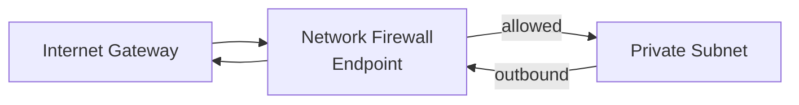
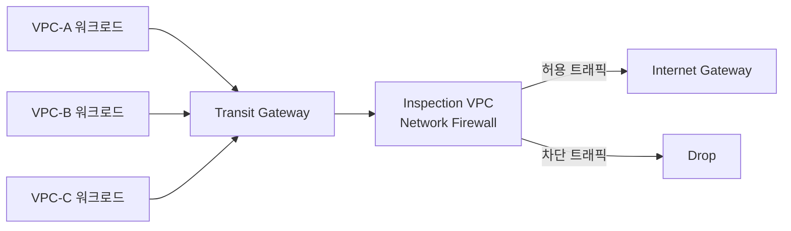

## 정의

**AWS Network Firewall (ANF)** 은 VPC 를 위한 **관리형 네트워크 방화벽 + 침입 방지 (IDS/IPS)** 서비스입니다. Stateful + Stateless 규칙 엔진, Suricata 호환 규칙, TLS SNI 검사, 관리형 위협 인텔리전스 피드를 제공.

**한 줄 요약**: SG/NACL 로 부족한 딥 인스펙션 (Layer 7 검사, 도메인 필터, 시그니처 기반 IPS) 담당.

## 왜 필요한가

### SG/NACL 의 한계

[[aws-sg-vs-nacl|Security Group / NACL]] 은 5-tuple (src IP, port, protocol, dst IP, port) 만 봄:

- **도메인 기반 차단 불가** (example.com/malicious 만 막고 example.com/api 허용?)
- **패킷 내용 검사 X** (SQL injection payload 감지?)
- **알려진 공격 시그니처 X**
- **위협 인텔리전스 자동 연동 X**

### Network Firewall 의 접근

- **Suricata 규칙**: DPI (Deep Packet Inspection)
- **TLS SNI**: HTTPS 도메인 필터
- **관리형 규칙 그룹**: AWS 유지 (`AttackVector`, `ThreatSignatures`, `BotNetCommandAndControlDomains`)
- **로그**: alert/flow/TLS

## 아키텍처



**중요**: 서브넷 사이에 방화벽 endpoint 를 두고 route table 을 조정해 트래픽이 방화벽을 통과하도록.

## 구성 요소

### Firewall

전체 배포 단위. 하나의 VPC 에 연결.

### Firewall Policy

Firewall 이 사용할 규칙 그룹 모음. Stateless + Stateful 규칙 그룹, default action.

### Rule Group

실제 규칙 컨테이너. 두 유형:

- **Stateless**: 5-tuple 매칭 (Suricata 없음)
- **Stateful**: Suricata 규칙 (DPI, 도메인 필터, 시그니처)

### Firewall Endpoint

각 AZ 에 하나. Route table 이 이 endpoint 로 트래픽 라우팅.

## Stateful Rules (Suricata)

Suricata 규칙 문법:

```
drop tcp any any -> any 443 (msg:"Block bad.example.com"; \
  tls.sni; content:"bad.example.com"; nocase; sid:1000001;)

alert http any any -> any any (msg:"SQL Injection"; \
  content:"UNION SELECT"; http_uri; sid:1000002;)

drop ip any any -> [$MALICIOUS_IPS] any (msg:"Known bad IP"; sid:1000003;)
```

**action**: `alert`, `drop`, `pass`, `reject`.
**direction**: `->` (단방향), `<>` (양방향).

### 도메인 리스트 (간편)

Suricata 대신 도메인 리스트로 필터:

```yaml
RulesSourceList:
  Targets: ['bad.example.com', '.malware.net']
  TargetTypes: ['HTTP_HOST', 'TLS_SNI']
  GeneratedRulesType: DENYLIST
```

**HTTP Host** (평문) 와 **TLS SNI** (HTTPS 도메인) 로 감지.

## 관리형 Rule Groups (AWS)

AWS 제공, 자동 업데이트:

- **ThreatSignatures**: 알려진 공격 시그니처
- **AttackVectors**: OWASP Top 10 등
- **BotNetCommandAndControlDomains**: C2 서버 도메인
- **MalwareDomains**: 알려진 malware 배포 도메인
- **AbusedLegitDomains**: 남용되는 정상 도메인

subscription 형식으로 정책에 포함.

## 관용 배포 패턴

### Centralized Egress

**Transit Gateway** 뒤에 Inspection VPC 하나 두고 모든 VPC 의 인터넷 outbound 를 그 곳 통과:

```
VPC-A ─┐
VPC-B ─┼─→ Transit Gateway ─→ Inspection VPC (Network Firewall) ─→ Internet
VPC-C ─┘
```

여러 VPC 의 정책 중앙 관리 + 요금 절감.

### Per-VPC Firewall

각 VPC 안 subnet 사이에 firewall endpoint. 소규모 조직.

### East-West (VPC 내부)

같은 VPC 안 subnet 간 트래픽을 firewall 통과. Zero-trust 네트워크.

## 로깅

Firewall 이 생성하는 로그:

- **Alert logs**: 규칙 alert 발생
- **Flow logs**: 모든 flow 요약 (source, dest, action)
- **TLS logs**: TLS handshake 정보 (SNI 등)

CloudWatch Logs / Kinesis / S3 로.

## 요금

- **Endpoint 시간당**: AZ 마다 (~0.395 USD/hour)
- **트래픽 처리**: GB 당 (~0.065 USD/GB)
- **관리형 규칙 그룹**: 일부 무료, 일부 subscription

**주의**: 여러 AZ 배포 시 endpoint 요금 곱하기.

## Network Firewall vs 대안

| 옵션 | 강점 | 언제 |
|:---|:---|:---|
| **[[aws-sg-vs-nacl\|SG/NACL]]** | 무료, 간단, 대부분 케이스 | 기본 |
| **Network Firewall** | Layer 7, IPS, 도메인 필터 | 컴플라이언스, 엔터프라이즈 |
| **[[aws-waf\|WAF]]** | HTTP 특화 (URL, header) | 웹 앱 앞단 |
| **[[aws-shield\|Shield]]** | DDoS | 볼륨 공격 |
| **3rd-party (Palo Alto, Fortinet)** | 종합 NGFW | 기존 firewall 팀 |

**결정**: SG/NACL 로 부족 + DPI 필요 → Network Firewall.

## Stateless Rules 상세

Stateful 보다 먼저 평가. 5-tuple 만 사용, 빠르고 저렴함.

```yaml
# Stateless rule group 예시
StatelessRules:
  - Priority: 10
    RuleDefinition:
      MatchAttributes:
        Protocols: [6]       # TCP
        DestinationPorts:
          - FromPort: 443
            ToPort: 443
      Actions:
        - aws:forward_to_sfe   # Stateful engine 으로 전달
  - Priority: 20
    RuleDefinition:
      MatchAttributes:
        Sources:
          - AddressDefinition: 10.0.1.0/24   # 관리 서브넷
        DestinationPorts:
          - FromPort: 22
            ToPort: 22
        Protocols: [6]
      Actions:
        - aws:pass
```

전략: *간단 허용/차단 = Stateless* 로 먼저 처리, *DPI 필요 = `aws:forward_to_sfe`* 로 Stateful 에 전달.

## Centralized Egress 상세 아키텍처



Route Table 핵심:
- Inspection VPC `firewall-subnet`: IGW 로 가는 경로 → firewall endpoint
- Inspection VPC `public-subnet`: 외부 → firewall endpoint
- TGW attachment route: 스포크 VPC 트래픽 → Inspection VPC

## CloudWatch Logs 쿼리

```sql
-- 상위 차단 시그니처 (Alert 로그)
fields @timestamp, alert.signature, src_ip, dest_ip
| filter event_type = "alert"
| stats count(*) as cnt by alert.signature
| sort cnt desc
| limit 20

-- 내부에서 외부로 나가는 차단 트래픽 (Flow 로그)
fields @timestamp, src_ip, dest_ip, dest_port, action
| filter action = "blocked"
| limit 100
```

## Terraform 예시

```hcl
resource "aws_networkfirewall_rule_group" "domain_denylist" {
  name     = "domain-denylist"
  type     = "STATEFUL"
  capacity = 100

  rule_group {
    rules_source {
      rules_source_list {
        generated_rules_type = "DENYLIST"
        target_types         = ["HTTP_HOST", "TLS_SNI"]
        targets              = ["bad.example.com", ".malware.net"]
      }
    }
  }
}

resource "aws_networkfirewall_firewall_policy" "main" {
  name = "main-policy"
  firewall_policy {
    stateless_default_actions          = ["aws:forward_to_sfe"]
    stateless_fragment_default_actions = ["aws:forward_to_sfe"]
    stateful_rule_group_reference {
      resource_arn = aws_networkfirewall_rule_group.domain_denylist.arn
    }
  }
}
```

## 함정

> [!WARNING]
> **Route table 설정 실수**. Firewall endpoint 로 라우팅 안 되면 방화벽 우회.

> [!CAUTION]
> **양방향 (return traffic)**. Stateful 이면 자동, stateless 는 규칙 명시.

> [!WARNING]
> **비용 폭발 가능**. GB 당 요금 + 다중 AZ endpoint. 필요한 트래픽만 필터.

> [!IMPORTANT]
> **TLS SNI 만 검사, decrypt 안 함**. TLS 안 payload 는 안 보임. TLS inspection 은 별도 (3rd-party appliance).

> [!CAUTION]
> **Suricata 규칙 성능**. 수천 규칙은 지연 증가. 관리형 규칙 그룹 우선.

## 관련 위키

- [[aws-vpc|VPC]]
- [[aws-sg-vs-nacl|SG vs NACL]]
- [[stateful-vs-stateless-firewall|Stateful vs Stateless Firewall]]
- [[aws-shield|Shield]]
- [[aws-waf|WAF]] - 웹 특화
- [[aws-guardduty|GuardDuty]] - 위협 탐지 (짝)
- [[aws-privatelink|PrivateLink]]
- [[aws-direct-connect|Direct Connect]]
