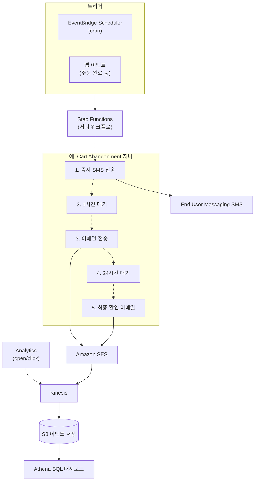

## 정의

**Amazon Pinpoint** 는 AWS 의 *고객 참여 (customer engagement) 플랫폼* 이었음. 이메일, SMS, 푸시 알림, 음성 통화를 통합 채널로 발송하고 세그먼트/캠페인/저니로 조직화. **2024-11 End of Support 발표, 2026-10-30 종료 예정**.

## End of Support 타임라인 (핵심)

> [!CAUTION]
> **2026-10-30 이후 Pinpoint 콘솔 접근/주요 기능 사용 불가**. 지금 마이그레이션 계획 필수.

| 시기 | 이벤트 |
|:---|:---|
| 2024-11 | End of Support 공식 발표 |
| 2025 | 신규 계정 접수 중단, 마이그레이션 가이드 배포 |
| **2026-10-30** | **콘솔 접근 종료, Endpoints/Segments/Campaigns/Journeys/Analytics 종료** |

## 무엇이 종료되고 무엇이 남는가

### 종료되는 것 (2026-10-30)

- **Pinpoint 콘솔 UI**
- **Endpoints** - 사용자별 채널 프로필 관리
- **Segments** - 오디언스 타겟팅
- **Campaigns** - 예약 발송
- **Journeys** - 다단계 워크플로 (트리거 -> 이메일 -> 대기 -> SMS 등)
- **Analytics** - 발송/오픈/클릭 대시보드
- **Machine Learning 모델** - 추천, 이탈 예측

### 남는 것 (계속 유지)

- **SMS v2 API** - `AWS End User Messaging SMS` 로 이관
- **Voice v2 API** - `AWS End User Messaging Voice`
- **Push API** - `AWS End User Messaging Push`
- **OTP API** - OTP 검증
- **Phone Number 관리** - 발신 번호 (long code, short code, TFN)

즉, *로우 레벨 채널 API 는 이름만 바뀌어 유지*. 상위 오케스트레이션 (segment/campaign/journey) 은 사라짐.

## 마이그레이션 매핑

| Pinpoint 에서 하던 것 | 마이그레이션 대상 |
|:---|:---|
| Pinpoint SMS 발송 | **AWS End User Messaging SMS** |
| Pinpoint Voice 발송 | **AWS End User Messaging Voice** |
| Pinpoint Push 알림 | **AWS End User Messaging Push** |
| Pinpoint OTP | **AWS End User Messaging OTP** |
| Pinpoint 이메일 | **Amazon SES** (Simple Email Service) |
| Endpoints/Segments 관리 | **자체 DB** ([[dynamodb\|DynamoDB]] / [[aws-rds\|RDS]]) + 앱 로직 |
| Campaigns (예약 발송) | **[[aws-eventbridge\|EventBridge Scheduler]] + [[aws-lambda\|Lambda]]** |
| Journeys (워크플로) | **[[aws-step-functions\|Step Functions]]** + End User Messaging |
| Analytics (open/click) | **Amazon SES event destinations** + [[aws-kinesis-data-streams\|Kinesis]] + BI |
| Predictive ML | **SageMaker** (자체 학습) |

## AWS End User Messaging

**포지션**: Pinpoint 의 channel API 를 계승한 새 서비스군.

### End User Messaging SMS

```python
import boto3
sms = boto3.client('pinpoint-sms-voice-v2')  # API 는 여전히 v2

response = sms.send_text_message(
    DestinationPhoneNumber='+821012345678',
    OriginationIdentity='+18005551234',   # 미리 발급받은 발신 번호
    MessageBody='주문이 배송 시작되었습니다',
    MessageType='TRANSACTIONAL',   # or PROMOTIONAL
    ConfigurationSetName='my-config-set'
)
```

**기능**:
- 200+ 국가 SMS 발송
- Long/Short code, 10DLC, TFN, Sender ID
- Two-way SMS (수신)
- MMS (일부 국가)
- Delivery reports -> [[aws-kinesis-data-streams|Kinesis]] / [[aws-sns|SNS]] / CloudWatch
- Opt-out 자동 처리
- 국가별 요금

### End User Messaging Push

- APNs (iOS), FCM (Android), ADM (Kindle), Baidu
- 발송 API 직접 호출 (오케스트레이션은 직접)

### End User Messaging Voice

- TTS (Polly 통합) 또는 사전 녹음
- OTP 음성 전달
- 국제 발신

## 이메일: Amazon SES

Pinpoint 이메일은 **SES 로 마이그레이션**.

```python
import boto3
ses = boto3.client('sesv2')

ses.send_email(
    FromEmailAddress='no-reply@example.com',
    Destination={'ToAddresses': ['user@example.com']},
    Content={
        'Simple': {
            'Subject': {'Data': '주문 확인'},
            'Body': {'Html': {'Data': '<h1>주문이 접수되었습니다</h1>'}}
        }
    },
    ConfigurationSetName='transactional'
)
```

**SES 주요 기능**:
- Transactional / marketing 이메일
- SPF / DKIM / DMARC
- Reputation dashboard
- Event destinations -> [[aws-kinesis-data-streams|KDS]] / [[aws-eventbridge|EventBridge]]
- Suppression list
- Sending quota (샌드박스 -> 프로덕션 승인)
- Configuration sets
- 템플릿 (SES Templates)

## 캠페인 / 저니 대체 아키텍처



**Endpoints/Segments 대체**:
- 사용자 프로필 저장: [[dynamodb|DynamoDB]] 또는 [[aws-rds|RDS]]
- Segment 조회: 프로필 DB 에 SQL / query
- Personalization: 자체 로직 or SageMaker

## OTP (One-Time Password)

Pinpoint OTP API 는 그대로 유지 (End User Messaging).

```python
sms.send_destination_number_verification_code(
    DestinationPhoneNumber='+821012345678',
    DestinationCountryParameters={},
    OriginationIdentity='+18005551234',
    ConfigurationSetName='otp-config'
)

# 검증
sms.verify_destination_number(
    DestinationPhoneNumber='+821012345678',
    VerificationCode='123456'
)
```

## Pinpoint 를 계속 쓰던 사용자를 위한 체크리스트

- [ ] 마이그레이션 계획 수립 (2026-10-30 데드라인)
- [ ] 채널별 대체 서비스 결정 (SMS/Voice/Push -> End User Messaging, Email -> SES)
- [ ] Endpoints/Segments 를 자체 DB 로 이관 ([[dynamodb|DynamoDB]] / [[aws-rds|RDS]])
- [ ] Campaigns -> [[aws-eventbridge|EventBridge Scheduler]] + [[aws-lambda|Lambda]]
- [ ] Journeys -> [[aws-step-functions|Step Functions]]
- [ ] Analytics -> SES/EUM event destinations + [[aws-kinesis-data-streams|Kinesis]] + BI
- [ ] Predictive 기능 -> SageMaker 자체 학습
- [ ] IAM 정책 재검토 (`mobiletargeting:*` -> `sms-voice:*`, `ses:*`)
- [ ] 발신 번호 (long/short code) 인벤토리
- [ ] 인증/SPF/DKIM 재구성 (SES)

## 신규 프로젝트라면

Pinpoint 자체는 **선택하지 말 것**. 처음부터:

- **SMS/Push/Voice** -> AWS End User Messaging
- **Email** -> Amazon SES
- **오케스트레이션** -> [[aws-step-functions|Step Functions]] + [[aws-eventbridge|EventBridge]]
- **사용자 프로필** -> [[dynamodb|DynamoDB]]
- **분석** -> [[aws-kinesis-data-streams|Kinesis]] + [[aws-s3|S3]] + [[aws-athena|Athena]] + QuickSight

## 함정

> [!CAUTION]
> **2026-10-30 이후 Pinpoint 콘솔/기능 종료**. 지금 마이그레이션 시작. 미룰수록 위험.

> [!WARNING]
> **Endpoints/Segments/Campaigns/Journeys 는 자동 마이그레이션 안 됨**. 자체 앱으로 재구현.

> [!IMPORTANT]
> **`mobiletargeting:*` 권한** 은 없어짐. 신규 IAM 은 `sms-voice:*`, `ses:*`, `push:*` (End User Messaging).

> [!CAUTION]
> **SES 는 처음 sandbox 모드** (본인 확인된 주소만 발송). 프로덕션 발송은 승인 요청 필요.

> [!WARNING]
> **SMS 국가별 규제** 상이 (10DLC, TFN 등록 등). 발신 번호 종류 신중 선택.

> [!IMPORTANT]
> **A/B 테스트, Personalization** 등 고급 기능은 자체 구현하거나 서드파티 (Braze, OneSignal, Iterable) 로.

## 관련 위키

- [[aws-lambda|AWS Lambda]] - 발송 로직
- [[aws-eventbridge|EventBridge]] - 스케줄링
- [[aws-step-functions|Step Functions]] - 저니 오케스트레이션
- [[aws-sns|SNS]] - 알림 (다른 용도, 시스템 알림)
- [[dynamodb|DynamoDB]] - 사용자 프로필 저장
- [[aws-kinesis-data-streams|Kinesis]] - 이벤트 수집
- [[aws-iam|IAM]] - 권한
