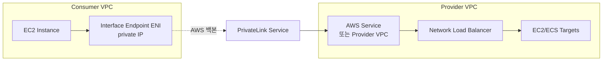

## 정의

**AWS PrivateLink** 는 VPC 내부의 리소스가 **인터넷을 거치지 않고** AWS 서비스, 다른 계정의 서비스, 또는 SaaS 파트너 서비스에 접근하도록 하는 서비스입니다. AWS 네트워크 백본 위에서 **ENI (Elastic Network Interface) + private IP** 를 통해 연결됩니다.

**핵심 가치**: 데이터가 **퍼블릭 인터넷을 절대 통과하지 않음**. 규제 (HIPAA, PCI), 데이터 유출 방지, 저지연 요구에 필수.

## VPC Endpoint 3 유형

| 유형 | 용도 | 비용 |
|:---|:---|:---|
| **Interface Endpoint** | 대부분 AWS 서비스, 커스텀 서비스 (PrivateLink) | 시간당 + GB |
| **Gateway Endpoint** | S3, DynamoDB 만 | 무료 |
| **GatewayLoadBalancer Endpoint** | Third-party appliance (firewall, IDS) | 시간당 + GB |

### Interface Endpoint (PrivateLink 본체)

- **AWS 서비스 (STS, KMS, ECR, SNS, SSM 등 100+) 를 private IP 로 호출**
- **ENI 생성**: 지정한 subnet 마다 하나
- **DNS 이름**: `vpce-xxxx.execute-api.us-east-1.vpce.amazonaws.com` (또는 private DNS 로 표준 endpoint 이름 override)
- **Cross-region PrivateLink** (2024+): 리전 간 endpoint 지원

### Gateway Endpoint (S3, DynamoDB 만)

- **Route table 항목** 추가로 트래픽 리다이렉트
- ENI 없음, IP 소비 없음
- **무료**
- **같은 리전** 만 가능

### GatewayLoadBalancer Endpoint

Palo Alto, Fortinet 등 third-party inspection appliance 앞에.

## 아키텍처



## Interface Endpoint 생성

```bash
aws ec2 create-vpc-endpoint \
  --vpc-id vpc-0abc \
  --service-name com.amazonaws.us-east-1.s3 \
  --vpc-endpoint-type Interface \
  --subnet-ids subnet-01 subnet-02 \
  --security-group-ids sg-0xyz \
  --private-dns-enabled
```

- `--private-dns-enabled`: 표준 endpoint (`s3.us-east-1.amazonaws.com`) 를 자동으로 endpoint IP 로 resolve
- `--security-group-ids`: Endpoint ENI 의 SG (443 허용 필요)

## Private DNS

**Private DNS enabled** 시 VPC 안 DNS resolver 가 표준 endpoint 이름을 endpoint private IP 로 응답. 앱 코드 수정 불필요.

```bash
# Private DNS 활성 시
curl https://s3.us-east-1.amazonaws.com   # ← private IP 로 자동 라우팅

# 비활성 시 명시적
curl https://bucket.vpce-xxxx.s3.us-east-1.vpce.amazonaws.com/...
```

**주의**: Private DNS 는 VPC 의 `enableDnsSupport` + `enableDnsHostnames` 활성 필수.

## 지원 서비스 (일부)

**PrivateLink 지원 AWS 서비스** (2026 기준 100+):

- **컴퓨트**: EC2, Lambda, Batch, ECS, EKS
- **스토리지**: S3, EFS, FSx
- **DB**: RDS Data API, DynamoDB, Neptune, Redshift Data API, Aurora, DocumentDB
- **보안**: KMS, Secrets Manager, ACM, WAF, Shield
- **관리**: CloudFormation, CloudWatch, SSM, Systems Manager
- **AI**: Bedrock, SageMaker, Comprehend, Rekognition
- **컨테이너**: ECR (2 endpoint: `ecr.api`, `ecr.dkr`)
- **메시지**: SNS, SQS, EventBridge, MSK
- **기타**: STS, IAM, Kinesis, CodeBuild, CodePipeline

전체 목록: `aws ec2 describe-vpc-endpoint-services`.

## VPC Endpoint Service (자체 서비스 노출)

**Provider 가 자기 VPC 의 서비스를 다른 계정에 PrivateLink 로 노출**.

```
[Provider VPC]
  Network Load Balancer (또는 GLB)
      ↓
  VPC Endpoint Service (생성)
      ↓
  Service Name 발급 (com.amazonaws.vpce.us-east-1.vpce-svc-xxxxx)
      ↓
[Consumer 계정에 승인]
  Consumer VPC 에서 Interface Endpoint 생성 (해당 service name 참조)
```

### 생성 예

**Provider**:

```bash
# NLB 대상으로 Endpoint Service 생성
aws ec2 create-vpc-endpoint-service-configuration \
  --network-load-balancer-arns arn:aws:elasticloadbalancing:...:loadbalancer/net/my-nlb/abc \
  --acceptance-required

# Consumer 계정 승인 추가
aws ec2 modify-vpc-endpoint-service-permissions \
  --service-id vpce-svc-xxxxx \
  --add-allowed-principals arn:aws:iam::CONSUMER_ACCOUNT:root
```

**Consumer**:

```bash
aws ec2 create-vpc-endpoint \
  --vpc-endpoint-type Interface \
  --service-name com.amazonaws.vpce.us-east-1.vpce-svc-xxxxx \
  --subnet-ids ...
```

Provider 가 승인해야 활성. `--acceptance-required=false` 로 자동 승인도.

## SaaS PrivateLink

**Snowflake, Datadog, MongoDB Atlas, Databricks, Confluent Cloud** 등 다수 SaaS 가 PrivateLink 지원. 인터넷 우회 + 저지연.

Consumer 는:
1. SaaS 콘솔에서 endpoint service name 확보
2. VPC 에 Interface Endpoint 생성
3. SaaS 콘솔에 endpoint ID 등록 (승인)

## Cross-Region PrivateLink (2024+)

리전 간 endpoint 지원. 이전에는 같은 리전 안에서만. 이제 us-east-1 Consumer VPC 에서 eu-west-1 Provider Service 접근 가능.

```bash
aws ec2 create-vpc-endpoint \
  --service-region eu-west-1 \
  --service-name com.amazonaws.eu-west-1.s3 \
  ...
```

Cross-region 데이터 전송 요금.

## Endpoint Policy

Endpoint 단위로 IAM 정책 적용. AWS 서비스로 향하는 요청 제한.

```json
{
  "Version": "2012-10-17",
  "Statement": [
    {
      "Effect": "Allow",
      "Principal": "*",
      "Action": ["s3:GetObject", "s3:PutObject"],
      "Resource": [
        "arn:aws:s3:::my-bucket",
        "arn:aws:s3:::my-bucket/*"
      ]
    }
  ]
}
```

특정 버킷만 접근 허용. 데이터 유출 방지.

## Security Group

Endpoint ENI 도 SG 를 갖음. 인바운드 443 (HTTPS) 만 허용 관용:

```bash
aws ec2 authorize-security-group-ingress \
  --group-id sg-xxx \
  --protocol tcp --port 443 \
  --source-group sg-app-tier
```

## S3 Gateway Endpoint vs Interface Endpoint

**S3 는 두 유형 모두 지원**.

| 축 | Gateway | Interface |
|:---|:---|:---|
| **비용** | 무료 | 시간 + GB |
| **IP 사용** | 없음 | ENI 마다 IP |
| **Cross-VPC** | 불가 | 가능 (Transit Gateway 없이) |
| **On-prem access** | 불가 | Direct Connect / VPN 조합 가능 |
| **DNS** | Route table 기반 | Private DNS 지원 |

**결론**:
- 같은 VPC 내에서만 접근 -> **Gateway** (무료)
- On-prem 이나 다른 VPC 에서 접근 -> **Interface**

## 요금 (Interface Endpoint)

- **시간당**: AZ 마다 별도 (예: 0.01 USD/hour)
- **데이터 처리**: GB 당 (예: 0.01 USD/GB)
- 여러 endpoint 를 여러 AZ 에 두면 시간당 요금 합산

큰 워크로드는 endpoint 요금이 인터넷 gateway 요금보다 저렴할 수 있음.

## 실전 사용 사례

### 1. Private VPC + S3 접근

Private subnet 만 있는 VPC 에서 S3 접근. NAT Gateway 없이:

```
Private Subnet EC2 → S3 Gateway Endpoint → S3
```

NAT 요금 절감 (수 만 USD/월 절감 흔함).

### 2. ECR 이미지 pull (private cluster)

EKS/ECS 노드가 프라이빗:

```
Interface Endpoint:
- com.amazonaws.us-east-1.ecr.api
- com.amazonaws.us-east-1.ecr.dkr
- com.amazonaws.us-east-1.s3 (레이어)  ← Gateway 로도 가능
```

### 3. Lambda + Secrets Manager

Lambda in VPC -> Secrets Manager:

```
Interface Endpoint: com.amazonaws.us-east-1.secretsmanager
```

### 4. Multi-account 서비스 공유

Platform team 이 shared service (예: 사내 API) 를 Endpoint Service 로 노출. 다른 계정에서 Interface Endpoint 로 접근.

### 5. SaaS 통합

Snowflake, Datadog agent -> PrivateLink -> 인터넷 우회.

## 함정

> [!WARNING]
> **Interface Endpoint 는 요금 발생**. 사용 안 하는 endpoint 는 삭제.

> [!CAUTION]
> **Private DNS 활성** 을 잊으면 표준 endpoint 이름이 public IP 로 resolve -> 인터넷 경유.

> [!WARNING]
> **Endpoint SG 인바운드 443 안 열면** 통신 실패. Endpoint ENI 도 SG 규칙 적용됨.

> [!IMPORTANT]
> **Gateway Endpoint 는 라우팅 테이블 항목**. Custom route table 에 명시 추가 필요.

> [!CAUTION]
> **Cross-region 은 별도 endpoint**. 리전 이동 시 각 리전에 endpoint 필요.

> [!WARNING]
> **PrivateLink 는 non-HTTPS 서비스 제한적**. TLS 종단이 endpoint 에 없어 대부분 서비스는 HTTPS.

## PrivateLink vs Transit Gateway vs VPC Peering

| 도구 | 용도 | 언제 |
|:---|:---|:---|
| **PrivateLink** | 서비스 단위 노출 (endpoint) | 서비스 하나만 공유, cross-account |
| **VPC Peering** | 1:1 VPC 전체 연결 | 소규모, 저비용 |
| **Transit Gateway** | 여러 VPC 허브 | 대규모 network topology |
| **VPN Gateway / Direct Connect** | On-prem 연결 | 하이브리드 클라우드 |

**결정**: 특정 서비스만 공유 = PrivateLink. VPC 전체 통신 = Peering/TGW.

## 관련 위키

- [[aws-vpc|VPC]] - 기본 네트워크
- [[aws-route53|Route 53]] - Private Hosted Zone 조합
- [[aws-direct-connect|Direct Connect]] - On-prem 통합
- [[aws-s3|S3]] - Gateway Endpoint 대상
- [[aws-iam|IAM]] - Endpoint Policy
- [[aws-alb-nlb|ALB/NLB]] - Endpoint Service 뒤 NLB
- [[aws-secrets-manager|Secrets Manager]] - Private access
- [[aws-ecr|ECR]] - Private cluster pull
