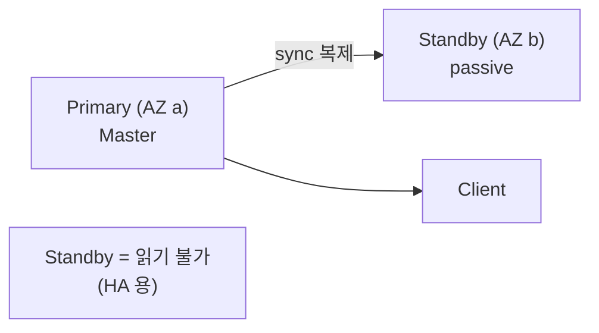
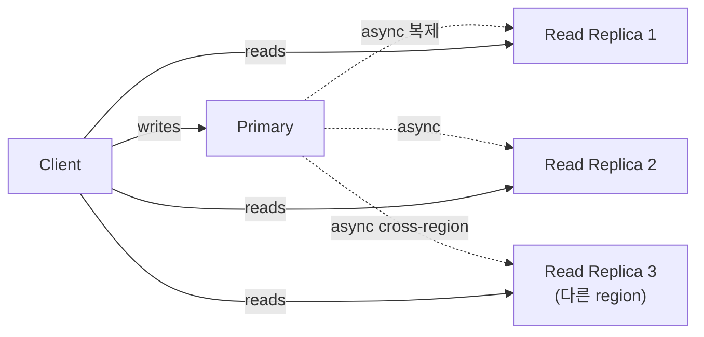
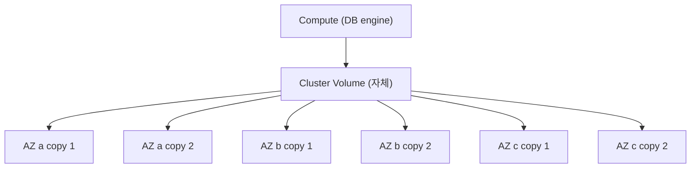
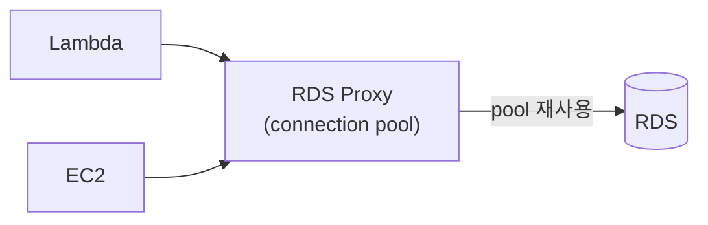
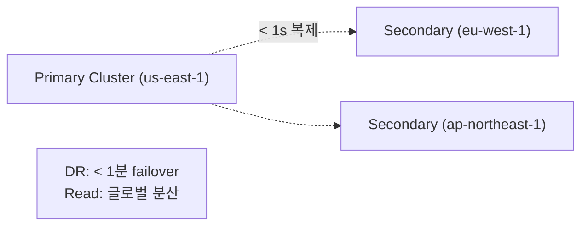
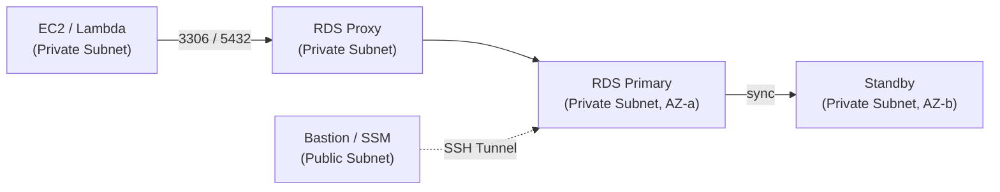

## 정의

**RDS (Relational Database Service)** = AWS 의 *managed RDB*. MySQL, PostgreSQL, MariaDB, Oracle, SQL Server, *Aurora* (AWS 자체).

## Multi-AZ Deployment



- *동기 복제*.
- AZ 장애 시 *자동 failover* (1-2분).
- *Read 분산 불가* (Standby = passive).

## Read Replica



- *비동기 복제* (lag 가능).
- *읽기 부하 분산*.
- *Cross-region* 가능 (DR).
- Standalone DB 로 *승격* 가능.

## Aurora vs RDS MySQL/PostgreSQL

| | RDS MySQL/PG | Aurora MySQL/PG |
|---|---|---|
| 스토리지 | EBS | *AWS 자체 분산 (3 AZ x 2 복제)* |
| 처리량 | 표준 | *3-5배 빠름* |
| 백업 | snapshot | *continuous 백업 (PITR)* |
| Read Replica | 5개 한도 | 15개 + reader endpoint |
| Failover | 1-2분 | *< 30초* |
| 가격 | 약간 cheap | 약간 비쌈 |
| Serverless | 옵션 | *Aurora Serverless v2* |

> [!IMPORTANT]
> *2026 신규 = 거의 항상 Aurora*. RDS MySQL/PG 보다 *비싸지만 더 빠른 + 안정*.

## Aurora 분산 스토리지



- *6 copy, 3 AZ*.
- *quorum (4/6 write, 3/6 read)*.
- *2 copy 손실 OK* (가용성), *3 copy 손실 OK* (durability).

## RDS Proxy



- *Connection pool* 을 *AWS managed* 로.
- *Lambda 의 connection 폭증* 해결.
- failover 시간 단축.

## Aurora Serverless v2

- *자동 scaling* (0.5 ACU - 128 ACU).
- *cold start 없음* (v1 의 결함 해결).
- 가변 워크로드 / dev / test.

## Aurora Global Database



## 백업

| 종류 | 의미 |
|---|---|
| Automated backup | 매일 + WAL. PITR (Point-in-Time Recovery) |
| Manual snapshot | 수동, 영구 |
| Aurora Backtrack | 옛 시점으로 *DB 자체 회귀* (snapshot 없이) |

## VPC 내 배치

RDS 인스턴스는 항상 *VPC Private Subnet* 에 배치. *퍼블릭 서브넷 배치는 절대 금지*.

- **DB Subnet Group**: 2개 이상 AZ 의 Private Subnet 지정. Multi-AZ 사용 시 필수 조건.
- **Security Group**: EC2 SG 에서 RDS SG 로만 인바운드 허용. IP 기반 아님.
- **Bastion Host / SSM**: 직접 접속이 필요할 때 SSH Tunnel 또는 AWS SSM Session Manager 활용.



## 파라미터 그룹

RDS *인스턴스 파라미터* 와 *클러스터 파라미터* (Aurora) 가 분리됨.

| 파라미터 | 영향 | 재시작 필요 |
|:---|:---|:---:|
| `max_connections` | 동시 접속 수 | 아니오 |
| `innodb_buffer_pool_size` | InnoDB 캐시 크기 | 예 |
| `slow_query_log` | 느린 쿼리 기록 | 아니오 |
| `log_bin_trust_function_creators` | 함수 생성 권한 완화 | 아니오 |
| `character_set_server` | 서버 기본 문자셋 | 예 |

> [!IMPORTANT]
> Static 파라미터 변경은 인스턴스 *재시작* 이 필요. 프로덕션에서 갑작스럽게 적용되지 않도록 Maintenance Window 시간 확인.

## 모니터링 (CloudWatch)

| 지표 | 설명 | 권장 임계치 |
|:---|:---|:---|
| `CPUUtilization` | CPU 사용률 | > 80% 지속 시 업사이즈 검토 |
| `FreeStorageSpace` | 남은 스토리지 | < 20% 알람 설정 |
| `DatabaseConnections` | 현재 연결 수 | max_connections 80% 경보 |
| `ReplicaLag` | Read Replica 복제 지연 | > 1s 시 read-your-writes 위험 |
| `ReadIOPS` / `WriteIOPS` | IOPS | 프로비저닝 IOPS 한도 대비 확인 |
| `FreeableMemory` | 여유 메모리 | < 200MB 알람 |

*Enhanced Monitoring*: OS 레벨 (메모리, 프로세스) 지표 추가 (1-60초 간격).
*Performance Insights*: 쿼리별 대기 분석, DB 부하 시각화 (7일 무료, 2년 유료).

## 업그레이드 전략

| 유형 | 방법 | 다운타임 |
|:---|:---|:---|
| Minor 버전 | 자동 또는 수동 | 수 초 (재시작) |
| Major 버전 | Blue-Green 권장 | Blue-Green = 수 초 |
| Aurora Major | Blue-Green 또는 snapshot 복원 | 계획 다운타임 필요 |

**Blue-Green 업그레이드 절차** (RDS 네이티브 지원):
1. Green = 신 버전 복제 클러스터 자동 생성
2. 복제 완료 후 *동기화 확인*
3. Switchover: 트래픽 전환 (수 초)
4. 검증 후 Blue 삭제

> [!WARNING]
> Aurora Major 버전 업그레이드 (예: MySQL 5.7 -> 8.0) 는 호환성 확인 필수. 스토어드 프로시저, 뷰, 트리거의 deprecated 문법 검토 필요.

## 비용 최적화

| 항목 | 방법 |
|:---|:---|
| 인스턴스 사이즈 | CloudWatch CPU/메모리 모니터링 후 rightsizing |
| Multi-AZ | Dev/Test 환경은 Single-AZ 로 50% 절감 |
| Read Replica | 리전 내 Reserved Instance 적용 가능 |
| Aurora 스토리지 | 사용량 기반 과금 (max 설정 없음), 읽기 IOPS 별도 과금 주의 |
| Backup 보존 | 자동 백업 보존 기간 최소화 (1-35일, 기본 7일) |
| Aurora Serverless v2 | 간헐적 워크로드에서 ACU 절감 (0.5 ACU 까지 스케일 다운) |

## 흔한 함정

> [!WARNING]
> 1. **Multi-AZ != Read Replica**: Multi-AZ 의 Standby 는 *읽기 불가*. Read Replica 는 별도.
> 2. **Aurora major version upgrade**: 다운타임 있음. 충분한 테스트 필요.
> 3. **Read Replica lag**: async 복제 특성상 *read-your-writes* 가 깨질 수 있음.
> 4. **Aurora storage 비용**: 사용량만큼 과금 (max 와 무관). *읽기 IOPS 비용* 도 별도.
> 5. **파라미터 그룹 수정 후 재시작 누락**: Static 파라미터 변경이 반영 안 된 채로 운영 지속.

## 인스턴스 클래스 선택 가이드

Aurora 와 RDS 모두 *인스턴스 클래스* 가 성능을 결정.

| 클래스 계열 | 특징 | 적합한 워크로드 |
|:---|:---|:---|
| `db.t4g.*` | 버스트 가능 (Graviton2) | Dev / Test, 낮은 기준 부하 |
| `db.m7g.*` | 범용 (Graviton3) | 웹 애플리케이션 |
| `db.r7g.*` | 메모리 최적화 | 대용량 인메모리 캐시, Analytics |
| `db.x2g.*` | 고메모리 (SAP HANA급) | 초대형 인메모리 DB |

> [!IMPORTANT]
> `t` 클래스는 CPU 크레딧 소진 시 *성능 저하*. 프로덕션 지속 부하에는 `m` 또는 `r` 계열 사용.
>
> Reserved Instance (1년/3년 약정) 사용 시 On-Demand 대비 최대 70% 절감. 안정적인 워크로드라면 RI 를 우선 검토.

## 접속 보안 베스트 프랙티스

| 항목 | 권장 |
|:---|:---|
| 암호화 (전송) | SSL/TLS 강제 (`require_secure_transport = ON`) |
| 암호화 (저장) | RDS 생성 시 Encryption at rest 활성화 (KMS) |
| 인증 | IAM DB 인증 (MySQL/PG 지원, 패스워드 불필요) |
| Secrets | AWS Secrets Manager + 자동 rotation |
| 네트워크 | VPC Private Subnet + Security Group 최소 권한 |

```sql
-- IAM 인증 토큰으로 접속 (MySQL 예시)
-- 1. IAM 역할에 rds-db:connect 권한 부여
-- 2. 토큰 발급
MYSQL_PWD=$(aws rds generate-db-auth-token \
  --hostname mydb.xxx.us-east-1.rds.amazonaws.com \
  --port 3306 \
  --username iam_user)

-- 3. SSL + 토큰으로 접속
mysql -h mydb.xxx.us-east-1.rds.amazonaws.com \
  --ssl-ca=global-bundle.pem \
  -u iam_user \
  --password="$MYSQL_PWD"
```

## 관련 위키

- [[postgresql]], [[mysql]]
- [[aws-vpc]]
- [[aws-cloudwatch]]
- [[aws-ecs-fargate]] - 컨테이너 워크로드 + RDS 조합
- [[aws-kms]] - RDS Encryption at rest
- [[aws-secrets-manager]] - DB 패스워드 자동 rotation
- [[aws-iam]] - IAM DB 인증 설정
- [[aws-alb-nlb]] - RDS 앞단 Load Balancer 패턴 (RDS Proxy 와 비교)
