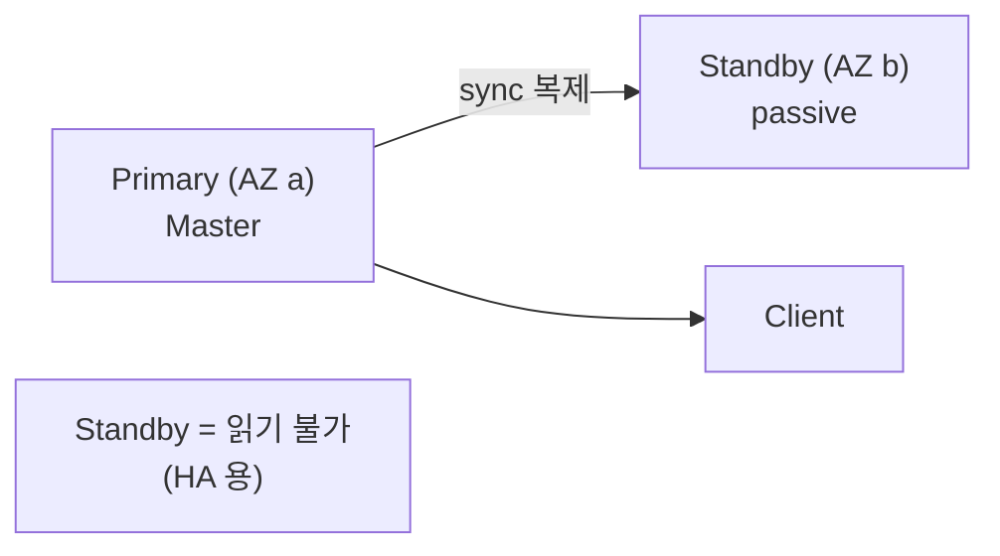
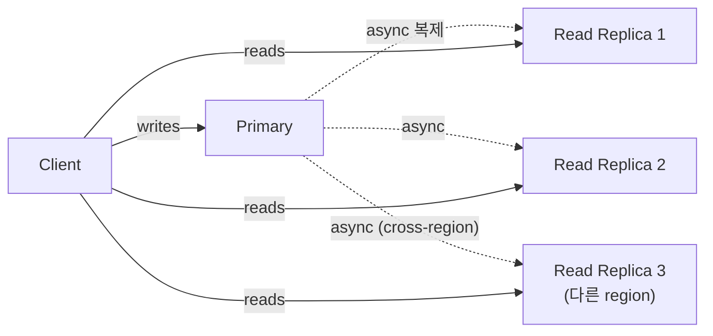
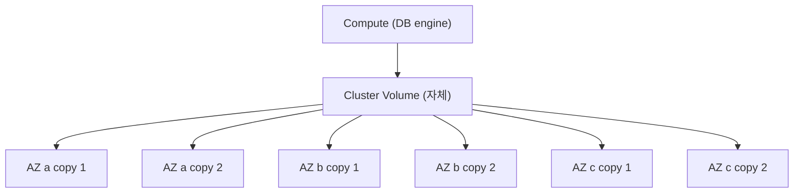
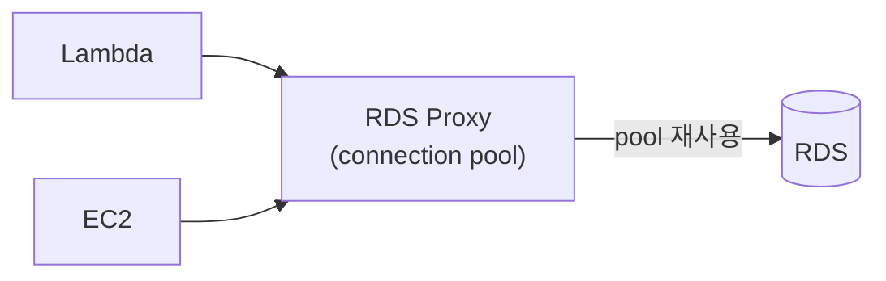
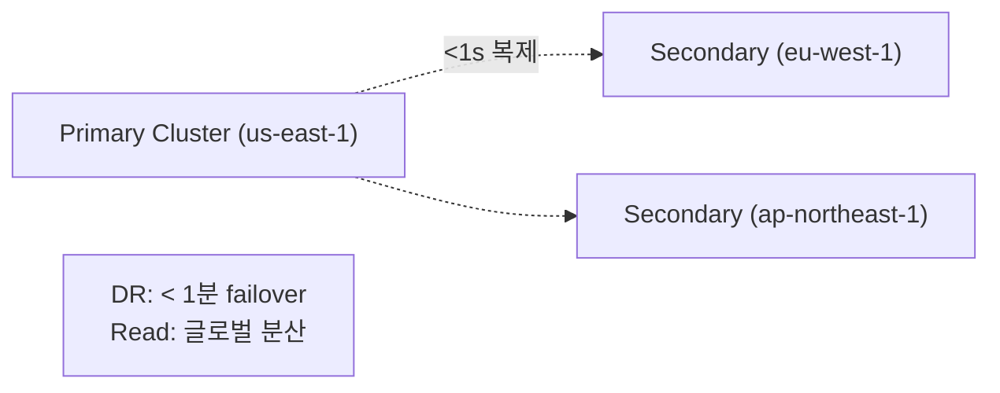

## 정의

**RDS (Relational Database Service)** = AWS 의 *managed RDB*. MySQL, PostgreSQL, MariaDB, Oracle, SQL Server, *Aurora* (AWS 자체).

## Multi-AZ Deployment

- *동기 복제*.
- AZ 장애 시 *자동 failover* (1-2분).
- *Read 분산 불가* (Standby = passive).

## Read Replica

- *비동기 복제* (lag 가능).
- *읽기 부하 분산*.
- *Cross-region* 가능 (DR).
- Standalone DB 로 *승격* 가능.

## Aurora vs RDS MySQL/PostgreSQL

| | RDS MySQL/PG | Aurora MySQL/PG |
|---|---|---|
| 스토리지 | EBS | *AWS 자체 분산 (3 AZ × 2 복제)* |
| 처리량 | 표준 | *3-5배 빠름* |
| 백업 | snapshot | *continuous 백업 (PITR)* |
| Read Replica | 5개 한도 | 15개 + reader endpoint |
| Failover | 1-2분 | *< 30초* |
| 가격 | 약간 cheap | 약간 비쌈 |
| Serverless | 옵션 | *Aurora Serverless v2* |

> [!IMPORTANT]
> *2026 신규 = 거의 항상 Aurora*. RDS MySQL/PG 보다 *비싸지만 더 빠른 + 안정*.

## Aurora 분산 스토리지

- *6 copy, 3 AZ*.
- *quorum (4/6 write, 3/6 read)*.
- *2 copy 손실 OK* (가용성), *3 copy 손실 OK* (durability).

## RDS Proxy

- *Connection pool* 을 *AWS managed* 로.
- *Lambda 의 connection 폭증* 해결.
- failover 시간 단축.

## Aurora Serverless v2

- *자동 scaling* (0.5 ACU - 128 ACU).
- *cold start 없음* (v1 의 결함 해결).
- 가변 워크로드 / dev / test.

## Aurora Global Database

## 백업

| 종류 | 의미 |
|---|---|
| Automated backup | 매일 + WAL. PITR (Point-in-Time Recovery) |
| Manual snapshot | 수동, 영구 |
| Aurora Backtrack | 옛 시점으로 *DB 자체 회귀* (snapshot 없이) |

## 흔한 함정

> [!WARNING]
> 1. **Multi-AZ ≠ Read Replica** = Multi-AZ 의 standby 는 *읽기 불가*. RR 가 별도.
> 2. **Aurora major version upgrade** = downtime 있음. 충분한 테스트.
> 3. **Read Replica lag** = async 복제. *read-your-writes* 가 깨질 수 있음.
> 4. **Aurora storage 비용** = *사용량만큼* (max 와 무관). 단 *읽기 IOPS 비용* 도 별도.

## 관련 위키

- [[postgresql]], [[mysql-innodb]]
- [[connection-pool]]
- [[Redis Replication]] (비교)
- [[aws-vpc]]
