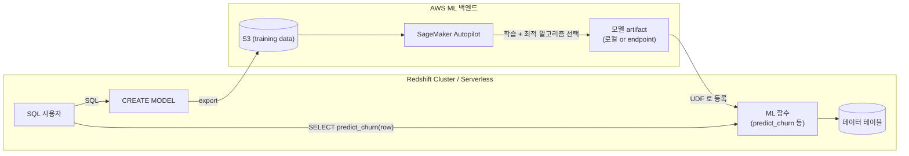

## 정의

**Amazon Redshift ML** 은 *SQL 문 (`CREATE MODEL`) 만으로 머신러닝 모델을 학습, 배포, 추론* 하는 기능. 데이터를 Redshift 밖으로 옮기지 않고 학습이 가능하며, 내부적으로 **SageMaker Autopilot** 이 최적 알고리즘 선택과 하이퍼파라미터 튜닝을 자동 수행. 학습된 모델은 Redshift 안에서 **SQL 함수** 로 등록되어 `SELECT` 안에서 그대로 호출된다.

**핵심 통찰**: *데이터 사이언티스트가 없어도, SQL 만 아는 애널리스트가 ML 을 사용할 수 있다*.

## 왜 Redshift ML

전통적 ML 흐름의 문제:

```
1. 데이터를 [[aws-redshift|Redshift]] 에서 export
2. [[aws-s3|S3]] 에 저장
3. SageMaker notebook 에서 데이터 로드
4. 특징 엔지니어링 (Python, pandas)
5. 알고리즘 선택 + 학습
6. 모델 배포 (endpoint or Lambda)
7. 예측 결과를 다시 Redshift 로 가져오기
```

문제:
- **7 단계, 여러 팀 걸침**
- **데이터 이동 시 지연 + 보안 문제**
- **애널리스트가 SQL 이외 접근 어려움**
- **결과 다시 저장하는 파이프라인**

Redshift ML 의 답:
```
1. CREATE MODEL FROM (SELECT ... FROM warehouse) TARGET churned
   → 자동 학습 + 배포 (SQL 한 번)
2. SELECT predict_churn(...) FROM customers  → 즉시 예측
```

## 아키텍처



**단계**:
1. `CREATE MODEL` 실행 → 학습 데이터를 [[aws-s3|S3]] 로 export
2. **SageMaker Autopilot** 이 알고리즘 선택 + 하이퍼파라미터 튜닝
3. 학습 완료 → 모델 artifact 저장
4. Redshift 안에 **SQL UDF** 로 등록
5. 이후 사용자가 `SELECT predict_xxx(cols)` 로 그대로 호출

## 모델 유형

### 1. AUTO (Autopilot 완전 자동)

*가장 흔한 선택*. 문제 유형 파악부터 알고리즘, 하이퍼파라미터까지 자동.

```sql
CREATE MODEL customer_churn
FROM (
  SELECT age, tenure, monthly_charges, total_charges, ..., churned
  FROM customers
  WHERE churn_flag_known = TRUE
)
TARGET churned
FUNCTION predict_churn
IAM_ROLE default
SETTINGS (
  S3_BUCKET 'my-redshift-ml',
  MAX_RUNTIME 3600  -- 학습 최대 1시간
);
```

- 자동 판단: 이진 분류, 다중 분류, 회귀
- 자동 선택: XGBoost, MLP, Linear Learner
- 자동 튜닝: HyperParameter Optimization
- 자동 검증: hold-out 셋으로 성능 측정

### 2. User-guided (알고리즘 지정)

성능이 예측 가능해야 할 때 알고리즘/하이퍼파라미터 직접 지정.

```sql
CREATE MODEL customer_churn_xgb
FROM (SELECT ... FROM customers)
TARGET churned
FUNCTION predict_churn_xgb
MODEL_TYPE XGBOOST
OBJECTIVE 'binary:logistic'
HYPERPARAMETERS DEFAULT EXCEPT (
    NUM_ROUND '200',
    ETA '0.1',
    MAX_DEPTH '6'
)
IAM_ROLE default
SETTINGS (S3_BUCKET 'my-bucket');
```

지원 알고리즘: XGBoost, MLP, Linear Learner, K-means (클러스터링).

### 3. BYOM (Bring Your Own Model)

외부에서 이미 학습한 SageMaker 모델을 Redshift 에서 호출.

**Local Inference** (Redshift 안에서):
```sql
CREATE MODEL my_own_model
FROM 'arn:aws:sagemaker:us-east-1:123:model/my-trained-xgb'
FUNCTION my_predict
IAM_ROLE default;
```

- XGBoost, MLP, Linear Learner 만 로컬 추론 가능
- Redshift 컴퓨트에서 직접 실행 -> 저지연

**Remote Inference** (SageMaker endpoint 호출):
```sql
CREATE MODEL remote_model
FUNCTION predict_remote(bigint, varchar, double)
RETURNS double
SAGEMAKER 'my-sagemaker-endpoint'
IAM_ROLE default
SETTINGS (MAX_BATCH_ROWS 100);
```

- 임의 알고리즘 (Python, PyTorch, TF 등) 사용 가능
- 호출당 SageMaker endpoint 요금 + 지연 (~ms-100ms)

### 4. LLM / Foundation Model (Bedrock 연동)

Amazon Bedrock 의 LLM 을 SQL 로 호출.

```sql
CREATE EXTERNAL MODEL llm_summarizer
FUNCTION summarize_text(varchar)
RETURNS varchar
IAM_ROLE default
MODEL_TYPE BEDROCK
SETTINGS (
  MODEL_ID 'anthropic.claude-v2:1',
  PROMPT 'Summarize the following text in one sentence: '
);

-- 사용
SELECT article_id, summarize_text(body) AS summary
FROM articles;
```

**RESPONSE_TYPE**: `VARCHAR` (단순 텍스트) 또는 `SUPER` (구조화된 응답).

**용도**:
- 텍스트 요약, 번역, 분류
- 감정 분석
- 임베딩 생성 (Bedrock Titan Embeddings)
- RAG 파이프라인 (Redshift 데이터를 프롬프트 컨텍스트로)

## SUPER 데이터 타입 활용

**SUPER** 는 Redshift 의 반정형 데이터 타입 (JSON-like). LLM 응답이나 복잡한 predict 입력에 유용.

```sql
-- LLM 응답을 SUPER 로 받아 구조화 필드 추출
SELECT article_id,
       llm_analyze(body).sentiment  AS sentiment,
       llm_analyze(body).topics     AS topics,
       llm_analyze(body).confidence AS confidence
FROM articles;
```

## 추론 성능

| 방식 | 지연 | 상황 |
|:---|:---|:---|
| **Local (AUTO / XGBoost 등)** | 마이크로초 - 밀리초 | 대량 배치 예측 |
| **Remote (SageMaker endpoint)** | 수십 - 수백 ms | 커스텀 알고리즘 |
| **Bedrock (LLM)** | 수백 ms - 초 | LLM 태스크 |

**배치 vs 단건**:
- `SELECT predict(...) FROM huge_table` -> 각 행마다 함수 호출, 병렬 실행
- 로컬 추론이면 매우 빠름 (Redshift 컴퓨트에서 직접)
- 원격 추론이면 batch 조율 필요 (`MAX_BATCH_ROWS`)

## 모델 관리

```sql
-- 모델 목록
SHOW MODEL ALL;

-- 특정 모델 상세
SHOW MODEL customer_churn;

-- 모델 삭제
DROP MODEL customer_churn;

-- 모델 상태 (학습 진행 중, 성공, 실패)
SELECT model_name, model_state, function_name, training_start_time
FROM SVV_ML_MODEL_INFO;
```

## 활용 사례

| 시나리오 | 모델 유형 |
|:---|:---|
| **이탈 예측 (Churn Prediction)** | AUTO (이진 분류) |
| **매출 예측 (Forecasting)** | AUTO (회귀) |
| **고객 세분화 (Segmentation)** | User-guided (K-means) |
| **부정 거래 감지 (Fraud)** | AUTO 또는 BYOM (unbalanced 클래스) |
| **추천 (LTV, Next best action)** | User-guided (XGBoost regression) |
| **텍스트 요약** | Bedrock (LLM) |
| **감정 분석** | Bedrock 또는 SageMaker 커스텀 |
| **이미지 분류** | BYOM Remote (SageMaker endpoint) |

## 사용 예: 이탈 예측 파이프라인

```sql
-- 1. 모델 학습 (한 번)
CREATE MODEL customer_churn
FROM (
  SELECT
    age, tenure_months, monthly_charges,
    contract_type, payment_method,
    total_gb_used, support_tickets_count,
    churned  -- 라벨
  FROM analytics.churn_training_data
  WHERE observation_date < '2025-01-01'
)
TARGET churned
FUNCTION predict_churn
IAM_ROLE default
SETTINGS (S3_BUCKET 'my-ml', MAX_RUNTIME 7200);

-- 2. 학습 완료 확인 (Autopilot 30분 - 몇 시간)
SHOW MODEL customer_churn;

-- 3. 예측 (매일 실행 가능)
CREATE TABLE churn_scores AS
SELECT
  customer_id,
  predict_churn(age, tenure_months, monthly_charges,
                contract_type, payment_method,
                total_gb_used, support_tickets_count) AS churn_probability
FROM customers
WHERE is_active = TRUE;

-- 4. 하위 시스템으로 전달 (예: 마케팅)
SELECT customer_id FROM churn_scores
WHERE churn_probability > 0.7
ORDER BY churn_probability DESC;
```

## 요금

- **학습**: SageMaker Autopilot 학습 시간 (수 분 - 수 시간) × SageMaker 요금
- **로컬 추론**: Redshift 컴퓨트 (기존 쿼리 비용에 포함)
- **원격 추론**: SageMaker endpoint 시간 + 호출당 요금
- **Bedrock LLM**: Bedrock 요금 (토큰당)
- **저장**: S3 (모델 artifact)

## 함정

> [!WARNING]
> **AUTO 모드 학습 시간 예측 어려움**. `MAX_RUNTIME` 을 설정해 폭주 방지 (기본 5400 초).

> [!CAUTION]
> **원격 추론 (SageMaker endpoint)** 은 매 예측마다 endpoint 호출. 대량 배치에는 로컬 추론 가능한 알고리즘 (XGBoost 등) 이 훨씬 저렴/빠름.

> [!WARNING]
> **불균형 라벨 (예: 이탈 5%)** 은 AUTO 가 자동 처리하지만, 검증 지표 (F1, AUC) 확인 필수. Accuracy 만 보면 오해.

> [!IMPORTANT]
> **Feature engineering 은 사전 SQL 로**. Redshift ML 은 raw 데이터 -> 예측이 목적이므로, 복잡한 특징은 `WITH` / view 로 미리 만들어 놓기.

> [!CAUTION]
> **Bedrock LLM 은 토큰당 과금**. 대량 처리 시 비용 폭탄. 샘플링 / 결과 캐시 필수.

> [!WARNING]
> **모델 재학습 자동 아님**. 데이터 drift 시 수동 `CREATE MODEL` 재실행. Airflow 등으로 스케줄링.

> [!IMPORTANT]
> **BYOM 로컬 추론은 지원 알고리즘 제한** (XGBoost, MLP, Linear Learner). 그 외는 원격 추론.

## 관련 위키

- [[aws-redshift|Amazon Redshift]] - 상위 서비스
- [[aws-redshift-serverless|Redshift Serverless]] - Serverless 에서도 사용 가능
- [[data-warehouse|Data Warehouse]] - 개념
- [[aws-s3|AWS S3]] - 모델 artifact 저장
- [[aws-iam|IAM]] - default 역할
