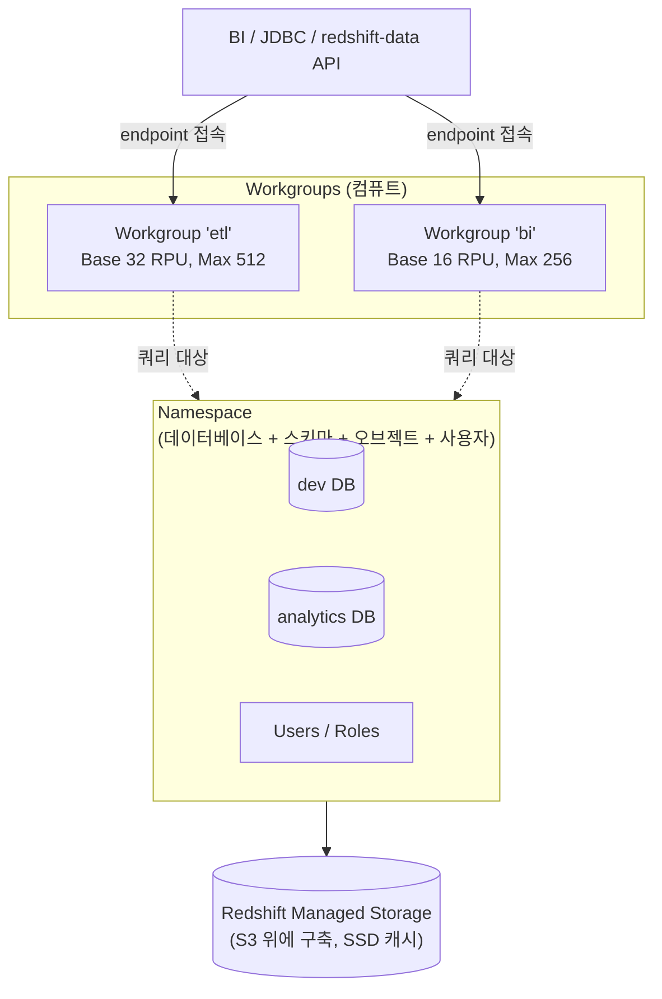

## 정의

**Amazon Redshift Serverless** 는 *[[aws-redshift|Redshift]] 를 클러스터 프로비저닝 없이 사용* 하는 방식. 컴퓨트 (RPU) 가 워크로드에 맞춰 자동 확장/축소되며, 유휴 시 요금이 없다. 스토리지는 [[data-warehouse|DW]] 를 위한 관리형 계층 (RMS, Redshift Managed Storage) 이 [[aws-s3|S3]] 위에 별도로 존재한다.

**한 줄 요약**: *워크로드 예측 불가 / 스파이키 / 개발 및 애드혹* 상황에서 클러스터 관리 부담 없이 [[mpp|MPP]] 를 이용.

## 왜 Serverless 인가

전통 Provisioned Redshift 의 문제:

- **유휴 시에도 인스턴스-시간 요금** (24 시간 켜져 있으면 그만큼)
- **트래픽 급증** 시 수동으로 노드 추가 필요 (수 분 프로비저닝)
- **워크로드 관리 (WLM) 튜닝** 부담
- **cluster resize 는 read-only 시간 발생**

Serverless 의 해결:
- **초 단위 과금** (RPU-hour, 실제 실행 시간만)
- **자동 확장** (RPU 상한 안에서)
- **WLM 자동** (수동 튜닝 불필요)
- **유휴 시 0 원**

## 아키텍처



### Namespace (논리적 저장 + 사용자)

*데이터베이스 / 스키마 / 테이블 / 사용자 / 권한* 의 논리 그룹.

- Snapshot / 복원 / KMS 암호화 / [[aws-iam|IAM]] role 이 여기에 붙음
- 하나의 namespace 는 여러 workgroup 이 공유 가능
- 삭제 시 데이터 손실 (백업 별도)

### Workgroup (컴퓨트 설정)

*RPU 용량 + 네트워크 (VPC/보안 그룹) + 엔드포인트 설정* 등 컴퓨트 관련 설정.

- 하나의 namespace 에 여러 workgroup (ETL 용 / BI 용 분리)
- workgroup 마다 base capacity, max capacity, 사용량 한도 별도

**분리 이유**: 같은 데이터에 대해 워크로드별로 다른 컴퓨트 정책 적용.

## RPU (Redshift Processing Unit)

Redshift Serverless 요금의 기본 단위.

- **1 RPU** ≈ 소량의 CPU + 메모리 + 네트워크 조합 (구체 스펙 비공개, AWS 관리)
- **Base capacity**: 워크그룹의 최소 RPU (기본 8, 최소 8, 최대 512)
- **Max capacity**: 자동 확장 상한
- 실제 실행 초 단위로 과금

### Base capacity 선택 감각

| Base RPU | 성격 | 대상 |
|:---|:---|:---|
| 8 | 최소 (개발/테스트, 매우 작은 워크로드) | 실험 |
| 16-32 | 기본 프로덕션 | 소-중규모 |
| 64-128 | 중대형 (concurrent 사용자 다수) | 팀 BI |
| 256-512 | 대형 배치 / 데이터 사이언스 | 대기업 |

> [!IMPORTANT]
> **Base 가 너무 낮으면 첫 쿼리 지연** (급격한 스케일 업 필요). 프로덕션은 최소 16-32 부터 시작 후 사용 패턴 관찰.

## 자동 확장 (Auto-Scaling)

Serverless 는 두 가지 방향으로 자동 확장.

### 1. Base 넘어서 위로 (concurrency scaling)

동시 쿼리 부하가 base capacity 를 초과하면 자동으로 추가 RPU 할당 (max capacity 까지).

- **판단 기준**: 큐 길이, 예상 실행 시간, 자원 대기 시간
- **확장 속도**: 초 단위
- **축소**: 유휴 감지 후 자동으로 base 로 복귀

### 2. AI-driven Scaling (2024+)

과거 워크로드 패턴을 학습해 *쿼리 시작 전에 미리* 확장. Cold query 지연 감소.

**결과**: 사용자는 base/max 만 정하고, 실제 확장은 완전 자동.

## 요금 모델

```
총 요금 =
    (실행된 RPU 초당 요금)
  + (RMS 저장 요금, GB-월)
  + (Concurrency Scaling / Spectrum / Zero-ETL 등 별도)
```

**과금 특징**:
- **초 단위 (최소 60 초)**: 짧은 쿼리 여러 개도 정확히
- **base RPU × 실행 시간**: 유휴는 청구 X
- **compute 와 storage 분리 청구**: 저장 요금은 실행 여부 무관

**계산 예 (us-east-1, 2026 대략)**:
```
Base 16 RPU × $0.375/RPU-hour × 하루 8 시간 실행 × 30일
= 16 × 0.375 × 8 × 30 = $1,440 /월

+ RMS 스토리지 500 GB × $0.024/GB-월 = $12
= 총 ~$1,452 /월
```

**Provisioned RA3 대비**:
- 하루 24 시간 균등 부하 -> Provisioned 저렴할 수 있음
- 하루 8 시간 스파이키 -> Serverless 저렴

## RMS (Redshift Managed Storage)

Serverless / RA3 의 공통 스토리지 계층. *[[aws-s3|S3]] 위에 구축된 컬럼형 저장소*.

**동작**:
- **Hot** 데이터: 로컬 SSD 캐시
- **Cold** 데이터: S3 tiered
- 사용자는 계층 관리 불필요 (자동)
- 저장 요금은 실제 GB 사용량 기반

**이점**:
- 컴퓨트와 스토리지 **독립 확장**
- 스토리지 사실상 무제한
- 유휴 컴퓨트에도 데이터 유지 (Serverless 유휴 = 저장만 청구)

자세히: [[mpp|MPP]] "현대 MPP: Compute-Storage 분리".

## 데이터 공유 (Data Sharing)

Serverless 도 **Data Sharing 완전 지원**.

- 다른 namespace / 다른 계정 / 다른 리전과 데이터 공유 (복사 없음)
- Producer + Consumer 모델
- 각자 자기 컴퓨트로 쿼리, 데이터는 물리적으로 한 곳

**활용**:
- 팀 A 는 ETL workgroup, 팀 B 는 BI workgroup 이 같은 데이터 공유
- 개발 계정과 프로덕션 계정 간 데이터 공유

## Provisioned RA3 vs Serverless

| 축 | RA3 Provisioned | Serverless |
|:---|:---|:---|
| **워크로드** | 예측 가능한 지속 부하 | 스파이키, 간헐적 |
| **비용 최적** | Reserved Instance 로 저렴 | 사용량 기반 |
| **관리** | Cluster 관리 필요 | AWS 자동 |
| **WLM** | Manual + Auto | Auto only |
| **유휴 요금** | 인스턴스-시간 지속 | 0 (base 는 실행 시만) |
| **확장 속도** | 수 분 (resize) | 초 단위 |
| **동시 사용자** | Concurrency Scaling 별도 | 자동 |
| **최소 크기** | 노드 단위 | 8 RPU |

**결정 규칙**:
- **새 프로젝트, 워크로드 미지수** -> **Serverless 부터**
- **하루 24 시간 균등 heavy 부하** -> Provisioned RA3 + RI (비용 30-70% 절감)
- **개발 / 테스트 / 애드혹** -> Serverless

## 사용 사례

### 1. Ad-hoc + 정기 배치 혼재

```
낮 (BI 대시보드) : ~30 개 동시 쿼리
저녁 (ETL 배치) : 대용량 스캔 4시간
새벽             : 유휴
```

Serverless 가 각 상황에 맞춰 자동 확장 + 유휴 절약.

### 2. Data Sharing consumer

프로듀서가 Provisioned, 컨슈머는 Serverless. 컨슈머는 저장 비용 없이 컴퓨트만.

### 3. 개발 / 테스트

프로덕션은 Provisioned 로 저렴하게, 개발 팀은 각자 Serverless workgroup.

## 성능 / 요금 관리

### 사용량 한도 (Usage Limits)

```bash
aws redshift-serverless create-usage-limit \
  --resource-arn arn:aws:redshift-serverless:...:workgroup/bi \
  --usage-type serverless-compute \
  --amount 500 \
  --period monthly \
  --breach-action log  # log / emit-metric / deactivate
```

- 월/주/일 RPU-hour 한도
- 초과 시 알림 / 워크그룹 비활성화
- **비용 폭탄 방지 필수**

### 쿼리 모니터링

```sql
-- 최근 쿼리와 사용된 RPU
SELECT query_id, database_name, query_text,
       compute_seconds, compute_capacity
FROM SYS_QUERY_HISTORY
WHERE start_time > SYSDATE - 1
ORDER BY compute_seconds DESC LIMIT 20;

-- 워크그룹 사용량
SELECT * FROM SYS_SERVERLESS_USAGE
WHERE start_time > SYSDATE - 7;
```

## 통합

| 기능 | Serverless 지원 |
|:---|:---|
| [[aws-redshift-spectrum\|Spectrum]] (S3 외부 테이블) | O |
| [[aws-redshift\|Redshift]] Streaming Ingestion | O |
| Data Sharing | O (producer + consumer) |
| Zero-ETL (Aurora / RDS / DynamoDB) | O |
| [[aws-redshift-ml\|Redshift ML]] | O |
| Federated Query ([[postgresql\|Postgres]], MySQL) | O |
| VPC-only | O |
| [[aws-lake-formation\|Lake Formation]] | O |

## 함정

> [!WARNING]
> **Base RPU 너무 낮음** = 첫 쿼리 지연 + 스케일 업 오버헤드. 프로덕션은 최소 16-32 부터.

> [!CAUTION]
> **Max capacity 무제한 설정** = 예상 밖 비용. Usage Limit 필수.

> [!WARNING]
> **Namespace 삭제 시 데이터 손실**. 삭제 전 최종 snapshot.

> [!IMPORTANT]
> **Serverless 는 시간 균등 heavy 워크로드에 오히려 비쌈**. RI 를 활용한 Provisioned RA3 가 30-70% 저렴할 수 있음. 예측 후 선택.

> [!CAUTION]
> **Cold query 지연**. 오래 유휴 후 첫 쿼리는 스케일 업 시간 (수 초). AI-driven scaling 이 완화 중.

> [!WARNING]
> **Workgroup / Namespace 개념 혼동**. Namespace = 저장 + 사용자, Workgroup = 컴퓨트 설정. 하나의 namespace 를 여러 workgroup 이 공유.

## 관련 위키

- [[aws-redshift|Amazon Redshift]] - 상위 서비스
- [[aws-redshift-spectrum|Redshift Spectrum]] - S3 데이터 쿼리
- [[aws-redshift-ml|Redshift ML]] - SQL ML
- [[mpp|MPP]] - 아키텍처 원리
- [[data-warehouse|Data Warehouse]] - 개념
- [[aws-s3|AWS S3]] - RMS 백엔드
- [[aws-lake-formation|Lake Formation]] - 세분화 권한
