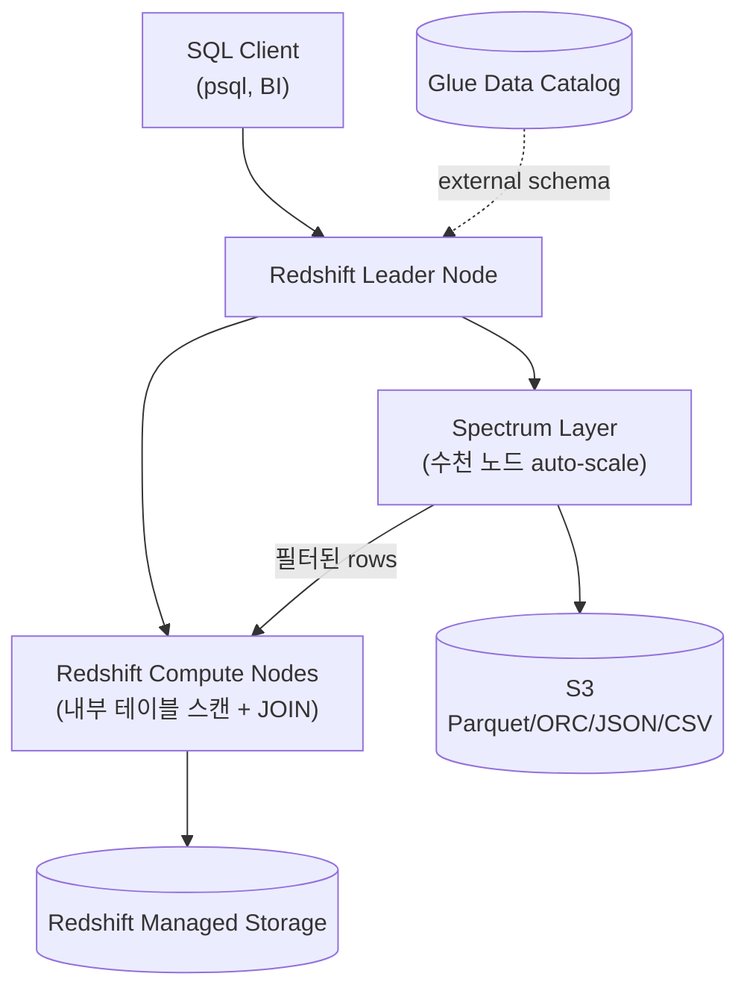

## 정의

**Redshift Spectrum** 은 [[aws-redshift|Redshift]] 에서 *S3 에 있는 데이터를 로드하지 않고 직접 SQL 로 쿼리* 하는 기능. 별도 Spectrum 실행 계층 (Spectrum layer) 이 S3 스캔/필터를 수행하고, 결과를 Redshift 컴퓨트로 넘겨 aggregation/join.

**핵심 이점**: 페타바이트 S3 데이터에 대해 Redshift 를 확장하지 않고도 쿼리. Cold 데이터는 S3 에, hot 데이터는 Redshift 내부에 두는 [[data-warehouse|lakehouse]] 패턴을 가능하게 함.

## 아키텍처



- **Redshift 클러스터**: 필요 (RA3, DC2, Serverless)
- **Spectrum layer**: AWS 관리, 자동 확장 (사용자 프로비저닝 X)
- **메타 저장**: [[aws-glue|Glue Data Catalog]] (또는 Hive Metastore)
- **데이터**: [[aws-s3|S3]] 그대로

## 언제 쓰나

| 상황 | 적합 |
|:---|:---|
| 데이터 레이크 (수 PB S3) + Redshift 조인 | 매우 적합 |
| Cold historical 데이터를 Redshift RMS 에 넣기 아까움 | 적합 |
| ETL 전 raw 데이터 탐색 | 적합 |
| 여러 소스 (S3 + Redshift 내부) 통합 쿼리 | 적합 |
| Redshift 로드 없이 애드혹 리포팅 | 적합 |
| 짧은 반복 API 백엔드 | *부적합* (Redshift 내부 테이블) |
| Redshift 없는 순수 애드혹 | *부적합* ([[aws-athena\|Athena]]) |

## External Schema & Table

### External Schema

Glue Catalog 의 database 를 Redshift 에 mount.

```sql
CREATE EXTERNAL SCHEMA spectrum
FROM DATA CATALOG
DATABASE 'my_lake_db'
IAM_ROLE 'arn:aws:iam::123456789012:role/RedshiftSpectrumRole'
CREATE EXTERNAL DATABASE IF NOT EXISTS;
```

- `IAM_ROLE`: `glue:GetTable*` + `s3:GetObject` + `s3:ListBucket`
- `CREATE EXTERNAL DATABASE`: Glue DB 가 없으면 자동 생성

### External Table (Redshift 자체 등록)

```sql
CREATE EXTERNAL TABLE spectrum.sales_parquet (
  sales_id   BIGINT,
  user_id    BIGINT,
  product_id INT,
  amount     DECIMAL(10, 2),
  sale_ts    TIMESTAMP
)
PARTITIONED BY (year INT, month INT)
STORED AS PARQUET
LOCATION 's3://my-lake/sales_parquet/'
TABLE PROPERTIES ('numRows' = '500000000');

-- 파티션 등록
ALTER TABLE spectrum.sales_parquet
  ADD PARTITION (year=2026, month=7)
      LOCATION 's3://my-lake/sales_parquet/year=2026/month=7/';
```

또는 [[aws-glue|Glue Crawler]] 로 등록된 테이블을 external schema 로 자동 노출.

## 지원 파일 포맷

| 포맷 | 압축 | Predicate Pushdown | Partitioning |
|:---|:---|:---|:---|
| **[[apache-parquet\|Parquet]]** | SNAPPY / GZIP / ZSTD | 우수 | O |
| **ORC** | SNAPPY / GZIP / ZSTD | 우수 | O |
| **JSON** | GZIP | 제한 | O |
| **CSV / TSV** | GZIP | 제한 | O |
| **Avro** | SNAPPY / GZIP / DEFLATE | 제한 | O |
| **RegexSerDe** | - | X | O |
| **Apache Hudi** | (Parquet 기반) | 우수 | O |
| **Delta Lake** | (Parquet 기반) | 우수 | O |
| **Apache Iceberg** | (Parquet 기반) | 우수 | O |

> [!IMPORTANT]
> **Parquet + ZSTD + partitioning** 이 사실상 표준. CSV 대비 10-100배 요금 절감 + 10-100배 성능.

## 요금

**Spectrum layer**: `$5.00 / TB scanned` (us-east-1, 2026).
- 10 MB 최소 per query
- 성공/실패 모두 청구
- DDL 은 무료

**추가 비용**:
- Redshift 컴퓨트 (RPU-hour or node-hour)
- S3 저장, S3 GET/LIST
- [[aws-glue|Glue Data Catalog]] 요청/저장
- Cross-region 전송

**예시 (Parquet + 파티션 프루닝 + 컬럼 프로젝션)**:
```
raw S3 데이터: 4 TB CSV (uncompressed)
동일 데이터 Parquet + ZSTD + 파티션: ~1 TB, 컬럼 100개 중 1개 쿼리

CSV 전체 스캔:  $5 × 4 TB = $20
Parquet + 프루닝 + 프로젝션:
  실 스캔 = 1 TB × (1/100) × (year 파티션 스킵) ≈ 5 GB
  $5 × 5/1024 TB = $0.024
  → 800배 절감
```

## 파티션 프루닝 (필수)

파티션 컬럼을 `WHERE` 절에 명시적으로 사용해야 스캔 대상이 줄어듬.

```sql
-- 파티션 프루닝 O (year=2026, month=7 파티션만 스캔)
SELECT SUM(amount)
FROM spectrum.sales_parquet
WHERE year = 2026 AND month = 7;

-- 파티션 프루닝 X (모든 파티션 스캔)
SELECT SUM(amount)
FROM spectrum.sales_parquet
WHERE sale_ts >= '2026-07-01' AND sale_ts < '2026-08-01';

-- 파티션 프루닝 X (함수 적용)
SELECT SUM(amount)
FROM spectrum.sales_parquet
WHERE YEAR(sale_ts) = 2026;
```

**교훈**: 파티션 컬럼은 원본 그대로 (`year = 2026`), 함수 wrap 금지.

## Predicate Pushdown

Parquet/ORC 의 min/max 통계로 row group 을 스킵. Spectrum layer 가 S3 에서 read 하는 단계에서 필터.

```sql
-- Parquet row group min/max 로 대부분 스킵
SELECT * FROM spectrum.sales_parquet
WHERE amount > 1000000;
```

**주의**: 통계가 없으면 스킵 불가. Glue Crawler 는 통계를 생성하지 않음 -> Spark job 으로 write 시 통계 포함해야 함 (`write_statistics=True`, 기본).

## Redshift 내부 테이블과의 JOIN

Spectrum 의 진짜 강점: *S3 데이터를 Redshift 내부 dimension 과 조인*.

```sql
-- Fact (S3, Spectrum) x Dimension (Redshift 내부)
SELECT
  d.category,
  SUM(f.amount) AS revenue
FROM spectrum.sales_parquet f      -- S3
JOIN internal.products d           -- Redshift RMS
  ON f.product_id = d.product_id
WHERE f.year = 2026 AND f.month = 7
GROUP BY d.category;
```

Fact 데이터가 큰 경우 (10 TB+), Redshift 에 로드하지 않고 S3 에 두는 것이 저장/관리 비용 이득.

## Concurrency Scaling

동시 쿼리 부하 시 *추가 Spectrum 컴퓨트 자동 프로비저닝*.

- Serverless: 자동
- Provisioned RA3: 매일 1시간 무료, 이후 초당 노드 요금
- 별도 설정 없이 Spectrum 쿼리에도 적용

## Materialized View (Spectrum 위에)

자주 쓰는 Spectrum 쿼리를 Redshift 내부에 pre-compute.

```sql
CREATE MATERIALIZED VIEW mv_sales_daily AS
SELECT
  year, month, product_id,
  SUM(amount) AS revenue,
  COUNT(*) AS n_sales
FROM spectrum.sales_parquet
WHERE year >= 2025
GROUP BY 1, 2, 3;

-- 주기적 refresh 또는 auto refresh
REFRESH MATERIALIZED VIEW mv_sales_daily;
```

이후 쿼리는 Redshift 내부 MV 를 스캔 (Spectrum 요금 0).

## [[aws-athena|Athena]] vs Spectrum

같은 S3 데이터를 쿼리하는 두 가지 옵션. 근본적으로 다른 아키텍처.

| 축 | Athena | Redshift Spectrum |
|:---|:---|:---|
| **엔진** | Trino (Engine v3) | Redshift 자체 |
| **SQL 방언** | Trino/Presto | PostgreSQL 계열 (Redshift) |
| **클러스터 필요** | X | O (Redshift) |
| **요금** | $5/TB scanned | $5/TB scanned + Redshift 컴퓨트 |
| **동시성** | 사실상 무제한 (serverless) | 클러스터 한도 (concurrency scaling) |
| **Redshift 내부 데이터와 JOIN** | X (federated 필요) | 네이티브 |
| **ETL / CTAS** | 지원 | 제한 (external table 은 read 중심) |
| **JOIN 성능** | 중간 | 우수 (RA3 로컬 shuffle) |
| **Iceberg 트랜잭션** | 완전 지원 | 읽기 위주 |
| **적합** | 애드혹, BI, S3-only | Redshift 기존 자산 + S3 확장 |

**결정 규칙**:
- 이미 Redshift 를 쓰고 S3 데이터를 조인해야 함 -> **Spectrum**
- Redshift 없이 S3 만 쿼리 -> **Athena**
- 둘 다 쓸 수도 있음 (병존 흔함)

## 실전 예제

### 콜드 데이터 아카이빙 후 쿼리

```
2년 이상 지난 주문 → S3 Parquet (파티션: year/month)
                   → Glue Catalog 등록
                   → Redshift Spectrum external table

Redshift 내부: 최근 2년
Spectrum:       2년+ 이전
UNION ALL 로 통합 뷰
```

```sql
CREATE VIEW analytics.orders_all AS
SELECT * FROM internal.orders_recent
UNION ALL
SELECT * FROM spectrum.orders_archive;

-- 애널리스트는 orders_all 만 쿼리, 위치 신경 X
```

### Nested Parquet (struct/list) 쿼리

```sql
-- 중첩 필드 접근
SELECT c.address.city, COUNT(*)
FROM spectrum.customers c
GROUP BY 1;

-- List 를 UNNEST
SELECT c.customer_id, tag
FROM spectrum.customers c, c.tags AS tag;
```

Parquet 의 struct/list 를 그대로 SQL 로. Redshift 내부는 flat 이라 이 부분은 Spectrum 만 가능한 워크로드.

## 성능 튜닝 체크리스트

1. **[[apache-parquet|Parquet]] / ORC + 압축** (ZSTD 우선)
2. **파티션 컬럼** 을 `WHERE` 절에 그대로 (함수 wrap X)
3. **파일 크기** 256 MB - 1 GB (small files 회피)
4. **컬럼 프로젝션** (SELECT * 금지)
5. **통계 생성** (Spark write 시 자동, Crawler 는 안 함)
6. **Materialized View** 로 반복 쿼리 캐시
7. **Concurrency Scaling** 활성화
8. **`SVL_S3QUERY_SUMMARY`** 로 스캔량 모니터링

```sql
-- 실행된 Spectrum 쿼리와 스캔량
SELECT userid, query, s3_scanned_bytes, s3_scanned_rows,
       elapsed / 1000000.0 AS elapsed_sec
FROM SVL_S3QUERY_SUMMARY
WHERE starttime > SYSDATE - 1
ORDER BY s3_scanned_bytes DESC LIMIT 20;
```

## 함정

> [!WARNING]
> **`SELECT *` on unpartitioned CSV** = 페타바이트 스캔 = 수천 달러. Workgroup 이 아니라 [[aws-redshift|Redshift]] usage limit 로 제한.

> [!CAUTION]
> **파티션 컬럼에 함수 적용** = 파티션 프루닝 실패. `WHERE year = 2026` 그대로. `WHERE CAST(year AS VARCHAR) = '2026'` 금지.

> [!WARNING]
> **작은 파일 (수천 개 × < 10 MB)** = Spectrum 노드가 파일마다 GET/파싱 = 성능 붕괴. Compact 필수.

> [!IMPORTANT]
> **[[aws-glue|Glue Crawler]] 는 통계 미생성** -> Predicate pushdown 효과 감소. Spark write 시 `write_statistics=True` (기본) 확인.

> [!CAUTION]
> **Glacier 오브젝트 는 쿼리 실패**. Lifecycle 로 Glacier 로 옮긴 파일을 external table 이 참조 -> "InvalidObjectState". [[aws-s3-glacier|Restore]] 후에만.

> [!WARNING]
> **Cross-region S3** = 데이터 전송 요금 + 지연. Redshift 와 같은 region S3 유지.

> [!IMPORTANT]
> **Athena 와 Spectrum 을 오해**: 이름은 같은 개념이지만 엔진과 SQL 방언이 다름. 쿼리를 서로 그대로 옮기면 안 됨.

> [!CAUTION]
> **External Table 스키마 변경 안 반영** = Redshift 캐시된 스키마와 실제 파일 스키마가 다르면 오류. `ALTER TABLE ... SET LOCATION` 또는 재등록.

## 관련 위키

- [[aws-redshift|AWS Redshift]] - Spectrum 을 실행하는 엔진
- [[aws-athena|Amazon Athena]] - 대안 엔진
- [[aws-glue|AWS Glue]] - Data Catalog 제공자
- [[aws-s3|AWS S3]] - 데이터 저장소
- [[aws-s3-glacier|S3 Glacier]] - 아카이빙 (Spectrum 쿼리 X)
- [[apache-parquet|Apache Parquet]] - 권장 파일 포맷
- [[data-warehouse|Data Warehouse]] - lakehouse 확장
- [[etl|ETL / ELT]] - S3 데이터 전처리
- [[aws-iam|IAM]] - Spectrum role
