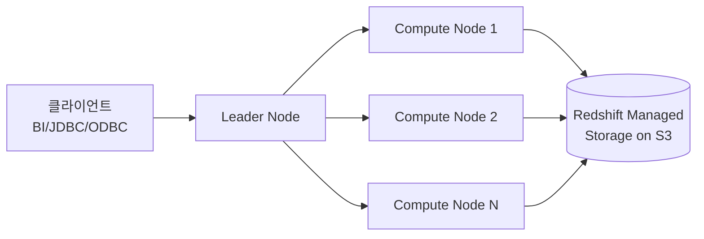

## 정의

**Amazon Redshift** 는 AWS 가 관리하는 **페타바이트 규모 컬럼형 데이터 웨어하우스** 입니다. 2012년 PostgreSQL 8.0.2 를 기반으로 시작해 **MPP (Massively Parallel Processing)** 아키텍처로 대규모 분석 쿼리를 병렬 실행합니다. 2020년대에는 **Redshift Serverless**, **Zero-ETL**, **Data Sharing (writes)**, **Streaming Ingestion**, **Redshift ML** 등으로 확장되었습니다.

## 왜 데이터 웨어하우스 인가

OLTP (RDS, Aurora) 는 트랜잭션 지향 (row-based). 분석 쿼리 (수십억 행 aggregation) 는 다른 스토리지/실행 모델이 필요:

- **컬럼형 저장**: 필요 컬럼만 읽음 -> I/O 절감
- **압축**: 컬럼 값이 유사 -> 압축률 높음 (5-10x)
- **MPP**: 슬라이스로 나뉜 데이터를 병렬 스캔
- **집계 최적화**: SUM, COUNT, GROUP BY 등 대량 aggregation 특화

## 아키텍처



- **Leader Node**: 쿼리 파싱, 최적화, compute node 로 분배, 결과 통합
- **Compute Nodes**: 실제 데이터 저장 + 실행. 각 노드는 여러 **slice** 로 분할.
- **RMS (Redshift Managed Storage)**: S3 위 계층. Compute 와 스토리지 독립 스케일링 (RA3+).

## 노드 유형 (2025-2026)

### RA3 (권장)

**Compute + Storage 분리**. Compute 만 늘리거나 storage 만 확장 가능.

- **ra3.large**, **ra3.xlplus**, **ra3.4xlarge**, **ra3.16xlarge**
- **Managed Storage**: 실제 데이터는 S3 layer. Local SSD 는 캐시.
- **Data Sharing, Zero-ETL, Streaming Ingestion** 모두 RA3+ 만.

### DS2 (Deprecated)

이전 노드. RA3 로 마이그레이션 권장.

### DC2 (Deprecated)

Dense Compute. Compute+Storage 결합. 2025년 이후 신규 사용 안 함.

**결론**: RA3 또는 **Redshift Serverless** 만 선택.

## Redshift Serverless

Compute 를 완전 자동 스케일. 유휴 시 요금 없음.

```
RPU (Redshift Processing Unit) 단위
Base capacity: 8 ~ 512 RPU
사용량 기반 청구
```

### Provisioned RA3 vs Serverless

| 축 | RA3 provisioned | Serverless |
|:---|:---|:---|
| **워크로드** | 예측 가능한 지속 부하 | 스파이키, 간헐적 |
| **비용** | Reserved instance 로 저렴 | 사용량 만큼 |
| **관리** | Cluster 관리 필요 | AWS 자동 |
| **워크로드 관리 (WLM)** | Manual + Auto | Auto only |
| **유휴 요금** | Instance-hour 지속 | 0 |
| **동시 사용자 수** | Concurrency Scaling 필요 | 자동 스케일 |

**결정**: 새 프로젝트는 Serverless 부터. 예측 가능한 heavy 부하면 RA3.

## Managed Storage (RMS)

RA3 / Serverless 의 스토리지 계층. S3 위에 구축되어 **compute 와 독립 스케일**. 사용자는 스토리지 크기 걱정 없음, 사용한 만큼 GB-월 청구.

- **Backup**: 자동 (증분)
- **Hot data**: local SSD 캐시
- **Cold data**: S3
- **압축**: 컬럼별 자동 encoding

## 분산 스타일 (Distribution Style)

테이블 데이터를 노드에 어떻게 나눌지.

### EVEN

라운드 로빈. 균등 분포. **JOIN 없는 fact table** 에 적합.

### KEY

특정 컬럼 hash 로 분산. **같은 key 조인 시 co-located** (성능 최적).

```sql
CREATE TABLE orders (
  order_id BIGINT,
  user_id BIGINT NOT NULL,
  ...
) DISTKEY(user_id);

CREATE TABLE users (
  user_id BIGINT NOT NULL,
  ...
) DISTKEY(user_id);

-- users.user_id JOIN orders.user_id 는 network shuffle 없이 로컬
```

### ALL

모든 노드에 복제. **작은 dimension table** (수백만 행) 에.

```sql
CREATE TABLE date_dim (...) DISTSTYLE ALL;
```

### AUTO

Redshift 가 데이터 크기 기반 자동 선택. 기본값.

## 정렬 키 (Sort Key)

블록 skip 을 위한 물리적 정렬:

```sql
CREATE TABLE orders (
  order_id BIGINT,
  order_date DATE,
  amount NUMERIC
) SORTKEY(order_date);

SELECT SUM(amount) FROM orders WHERE order_date >= '2026-01-01';
-- Redshift 는 order_date < 2026-01-01 인 블록 skip
```

- **Compound sort key** (기본): 여러 컬럼 우선순위
- **Interleaved sort key**: 여러 컬럼 균등 (거의 사용 안 함, 성능 저하 사례 다수)

## 압축 (Encoding)

컬럼 별 압축. 자동 감지 (ANALYZE COMPRESSION) 또는 명시:

```sql
CREATE TABLE users (
  user_id BIGINT ENCODE az64,
  email VARCHAR(256) ENCODE zstd,
  created_at TIMESTAMP ENCODE az64,
  status CHAR(10) ENCODE bytedict
);
```

압축 알고리즘:
- **AZ64** (Amazon 개발, 정수/시간에 최적)
- **ZSTD** (범용, 문자열)
- **LZO**, **RUNLENGTH**, **DELTA**, **BYTEDICT**, **MOSTLY8/16/32**

## COPY (대량 로드)

```sql
COPY orders
FROM 's3://my-bucket/data/orders/'
IAM_ROLE 'arn:aws:iam::123:role/RedshiftLoadRole'
FORMAT AS PARQUET;
```

지원 format: CSV, TSV, JSON, Parquet, ORC, Avro. Parquet 가 컬럼형이라 로드 빠름.

**옵션**:
- `MAXERROR`: 오류 허용 개수
- `MANIFEST`: 여러 파일을 매니페스트로
- `COMPUPDATE`: 압축 encoding 자동 갱신

## Redshift Spectrum (S3 쿼리)

S3 데이터를 Redshift 로 로드하지 않고 직접 쿼리. External table.

```sql
CREATE EXTERNAL SCHEMA spectrum_schema
FROM DATA CATALOG
DATABASE 'my_glue_db'
IAM_ROLE 'arn:aws:iam::123:role/SpectrumRole';

SELECT * FROM spectrum_schema.access_logs
WHERE date >= '2026-01-01' LIMIT 100;

-- Redshift 내부 테이블과 JOIN 도 가능
SELECT o.order_id, l.click_count
FROM orders o
JOIN spectrum_schema.access_logs l ON o.user_id = l.user_id;
```

**Glue Data Catalog** 로 스키마 관리. Parquet/ORC 가 성능 최적.

## Data Sharing

**Cross-cluster / cross-account read (write 도 지원)** 데이터 공유. 데이터 복제 없음.

```sql
-- Producer cluster
CREATE DATASHARE sales_share;
ALTER DATASHARE sales_share ADD SCHEMA public;
ALTER DATASHARE sales_share ADD TABLE public.orders;
GRANT USAGE ON DATASHARE sales_share TO ACCOUNT '123456789012';

-- Consumer cluster
CREATE DATABASE sales_shared FROM DATASHARE sales_share OF ACCOUNT '123456789012' NAMESPACE 'producer-namespace';
SELECT * FROM sales_shared.public.orders;
```

**RA3 / Serverless 만**. 조직 내 팀별 사일로 관리에 유리.

## Zero-ETL Integrations

Aurora MySQL / PostgreSQL, RDS MySQL, DynamoDB 등에서 Redshift 로 **거의 실시간 replication**. DMS 없이.

```
Source (Aurora / RDS / DynamoDB)
   ↓ (초 단위 CDC)
Redshift (Zero-ETL target)
```

- 소스에 트랜잭션 -> Redshift 반영 (수 초)
- 최대 50 통합/target
- Primary key 필요 (source 테이블)

## Streaming Ingestion

Kinesis Data Streams, MSK (Kafka) 에서 실시간 로드.

```sql
CREATE EXTERNAL SCHEMA kds FROM KINESIS;

CREATE MATERIALIZED VIEW events AUTO REFRESH YES AS
SELECT approximate_arrival_timestamp,
       JSON_EXTRACT_PATH_TEXT(kinesis_data, 'user_id')::BIGINT AS user_id,
       JSON_EXTRACT_PATH_TEXT(kinesis_data, 'event') AS event
FROM kds."my-stream" WHERE is_utf8(kinesis_data);
```

Materialized view auto-refresh 로 지속 갱신.

## Redshift ML

SQL 로 ML 모델 학습/예측. SageMaker 자동 통합.

```sql
CREATE MODEL churn_prediction
FROM (SELECT customer_id, age, tenure, ..., churned FROM customers WHERE churn_flag_known = TRUE)
TARGET churned
FUNCTION predict_churn
IAM_ROLE default
SETTINGS (S3_BUCKET 'my-redshift-ml-bucket');

-- 예측
SELECT customer_id, predict_churn(age, tenure, ...) AS churn_probability
FROM customers;
```

내부적으로 SageMaker Autopilot / XGBoost / LinearLearner 등 활용.

## Concurrency Scaling

트래픽 급증 시 **추가 클러스터 자동 프로비저닝**. Read-heavy 쿼리 오프로드.

```sql
ALTER USER analyst SET enable_result_cache_for_session TO ON;
ALTER SYSTEM SET concurrency_scaling TO auto;
```

RA3 는 매일 1시간 무료, 이후 초 단위 청구. Serverless 는 자동.

## WLM (Workload Management)

RA3 provisioned 만. Query queue 를 정의해 사용자별 우선순위.

- **Auto WLM** (권장): AWS 자동 조정
- **Manual WLM**: 큐/메모리/동시성 명시

Redshift Serverless 는 auto only.

## VACUUM & ANALYZE

- **VACUUM**: DELETE 후 공간 회수, 정렬 재수행 (RA3+ 는 대부분 자동)
- **ANALYZE**: 통계 갱신 (query optimizer)

```sql
VACUUM FULL orders;
ANALYZE orders;
```

## 백업 & 복구

- **Automated snapshot**: 8시간 or 5 GB 데이터 변경마다 (자동)
- **Manual snapshot**: 사용자 지정
- **Cross-region copy**: DR
- **Restore from snapshot**: 새 클러스터로

## 성능 튜닝

### 1. DISTKEY / SORTKEY 설계

Join 자주 하는 컬럼 = DISTKEY, filter/range 쿼리 컬럼 = SORTKEY.

### 2. COPY 성능

- **Multi-part** 파일 (여러 개로 나눠 병렬 로드)
- **Parquet** (컬럼형, 압축)
- **압축 파일**: gzip/bzip2/lzop

### 3. 쿼리 프로파일

```sql
EXPLAIN SELECT ...;
SELECT * FROM SVL_QLOG WHERE ...;
```

STL_, SVL_ 시스템 뷰로 실행 이력, redistribution 감지.

### 4. Materialized View

```sql
CREATE MATERIALIZED VIEW daily_sales AS
SELECT DATE(order_date), SUM(amount) FROM orders GROUP BY 1;
```

주기적 refresh 또는 auto refresh.

### 5. Result Cache

같은 쿼리 반복 -> 캐시 결과 (기본 활성).

## 보안

- **VPC only** (RA3 provisioned) 또는 VPC + public (조합 가능)
- **Encryption**: KMS (기본 활성 권장)
- **IAM 통합**: SSO, IAM database authentication
- **Column-level access control**: `GRANT SELECT (col1, col2) ON table TO user;`
- **Row-level security (RLS)**: 정책 기반 row 필터

## 데이터 API (`redshift-data`)

JDBC 없이 REST API 로 실행:

```bash
aws redshift-data execute-statement \
  --workgroup-name my-serverless-workgroup \
  --database dev \
  --sql "SELECT COUNT(*) FROM orders;"

aws redshift-data get-statement-result --id <id>
```

Lambda 등에서 편리.

## 함정

> [!WARNING]
> **DC2 / DS2 은 legacy**. RA3 / Serverless 로 마이그레이션 권장 (2025년 이후 신규 지원 축소).

> [!CAUTION]
> **`INSERT` 한 행씩은 매우 느림**. 대량 로드는 반드시 COPY. Streaming Ingestion 도 batch.

> [!WARNING]
> **JOIN 이 nested loop / hash redistribute** 로 실행되면 성능 급락. DISTKEY 설계로 co-located join.

> [!IMPORTANT]
> **Serverless base RPU 하한**. 너무 낮으면 병렬성 부족. 프로덕션은 최소 16 RPU 부터 검토.

> [!CAUTION]
> **Zero-ETL 지연**. "거의 실시간" 이지만 몇 초 ~ 몇 분. Sub-second 요구는 다른 아키텍처.

> [!WARNING]
> **VARCHAR 크기 잘못 잡으면 낭비**. 컬럼형 압축이 크기 영향 받음. 필요 이상 크게 잡지 말 것.

## Redshift vs 다른 데이터 웨어하우스

| DW | 강점 | 약점 |
|:---|:---|:---|
| **Redshift** | AWS 통합, 성숙, Spectrum | Vertical scaling 어려움 (Serverless 로 완화) |
| **Snowflake** | Multi-cloud, 사용자 경험 우수 | 벤더 락인, 비용 |
| **BigQuery** | Serverless, low overhead | GCP 종속 |
| **Databricks SQL** | Delta Lake + Photon | 개별 세팅 필요 |
| **ClickHouse** | 초고속, 오픈소스 | 자체 관리 |
| **Firebolt** | 신생, 성능 강조 | 성숙도 |

## 관련 위키

- [[aws-rds|RDS]] - OLTP 대안
- [[aws-neptune|Neptune]] - 그래프 대안
- [[aws-documentdb|DocumentDB]] - NoSQL 대안
- [[aws-s3|S3]] - Spectrum, 백업 저장소
- [[aws-s3-vectors|S3 Vectors]] - 벡터 저장 대안
- [[aws-iam|IAM]] - IAM 통합 인증
- [[aws-kms|KMS]] - 저장 암호화
- [[aws-vpc|VPC]] - 네트워크
- [[aws-cloudwatch|CloudWatch]] - 모니터링
- [[aws-sagemaker|SageMaker]] - Redshift ML 백엔드
