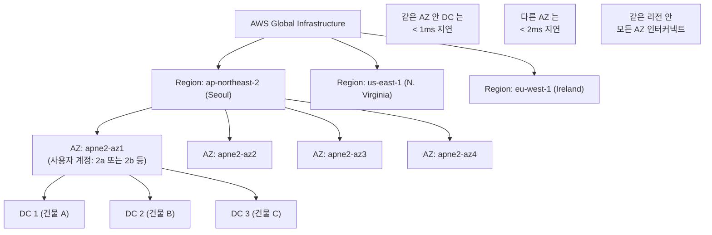

## 정의

AWS 인프라의 물리 계층은 *"Region → Availability Zone → Data Center"* 3 단계 계층. 각 계층이 격리 (isolation), 지연 (latency), 가용성 (availability) 을 다른 방식으로 제공.

- **Region**: 지리적으로 분리된 물리 위치 그룹 (예: 서울 `ap-northeast-2`, 도쿄 `ap-northeast-1`)
- **Availability Zone (AZ)**: 한 리전 안의 *물리적으로 분리된* 하나 이상의 데이터센터 클러스터
- **Data Center**: 실제 물리 시설 (건물). AWS 는 이 계층을 사용자에게 노출하지 않음

**한 줄 요약**: *Region 은 지리, AZ 는 리전 안의 물리적 격리 단위, DC 는 AWS 내부 구현 상세*.

## 왜 이 계층인가

세 계층은 각각 다른 실패 모드 (failure mode) 에 대응.

| 계층 | 실패 상황 | 방어 방식 |
|:---|:---|:---|
| **Data Center** | 한 건물의 정전, 화재 | AZ 안에 여러 DC → 자동 fail-over |
| **Availability Zone** | AZ 전체 장애 (정전, 자연재해) | 여러 AZ 배포 (Multi-AZ) |
| **Region** | 지역 전체 (드물지만: 지진, 정전, 규제) | Multi-region (DR) |
| **Provider (AWS 전체)** | 극단적 경우 | Multi-cloud |

각 계층 방어는 비용과 복잡도가 증가. 대부분 워크로드는 **Multi-AZ 까지** 로 충분.

## Region (리전)

**지리적으로 분리된 영역**. 각 리전은 독립된 물리 인프라 + 지리적 위치.

### 특성

- **완전 격리 (독립성)**: 한 리전의 서비스가 다른 리전으로 자동 복제 X (S3 Cross-Region Replication 등 명시적 설정 필요)
- **자체 규제 준수**: 데이터 sovereignty (예: EU 데이터가 EU 리전 밖으로 안 나감, 한국 개인정보보호법)
- **자체 서비스 카탈로그**: 신규 서비스는 특정 리전부터 순차 출시
- **지연**: 사용자 지리적 위치에 가까운 리전이 더 낮은 지연

### 리전 명명 규칙

**형식**: `<대륙>-<방향>-<번호>`

| 예시 | 위치 |
|:---|:---|
| `us-east-1` | 미국 동부 (버지니아 북부) - 최초 리전, 가장 큼 |
| `us-east-2` | 미국 동부 (오하이오) |
| `us-west-2` | 미국 서부 (오리건) |
| `ap-northeast-2` | 아시아 태평양 (서울) |
| `ap-northeast-1` | 아시아 태평양 (도쿄) |
| `eu-west-1` | 유럽 (아일랜드) |
| `eu-central-1` | 유럽 (프랑크푸르트) |

### 대표 리전 (2026 시점 기준)

- **최다 서비스**: `us-east-1` (버지니아 북부) - 신규 서비스 최초 출시, IAM 등 전역 서비스의 primary
- **가장 저렴**: 오래된 리전 (us-east, us-west) 이 보통 저렴
- **격리 리전**: AWS GovCloud (US), China (Beijing, Ningxia) - 별도 계정 필요

### 리전 선택 기준

1. **사용자 지리적 위치** (지연)
2. **데이터 sovereignty** 규제
3. **필요 서비스 가용성** (모든 서비스가 모든 리전에 없음)
4. **비용** (리전별 단가 다름)
5. **DR 파트너 리전** (활용도 큰 서비스면 최소 2 리전)

## Availability Zone (AZ)

리전 안의 **물리적으로 분리된 데이터센터 클러스터**. 한 리전은 3+ AZ 로 구성.

### 특성

- **하나 이상의 데이터센터 로 구성** (AZ = DC 는 아님, AZ 는 DC 의 상위 집합)
- **독립 전력, 냉각, 네트워킹**
- **지리적 분리** (동일 AZ 라도 여러 DC 가 수 km 떨어져 있을 수 있음)
- **AZ 간 저지연 고대역폭 사설 링크** (일반적으로 < 1 ms, 100+ Gbps)
- **AZ 장애의 독립성**: 한 AZ 가 죽어도 다른 AZ 는 영향 X (설계 원칙)

### AZ 개수

- 대부분 리전: **3 AZ**
- 큰 리전 (`us-east-1`, `us-west-2`): **6 AZ**
- 신규/소규모: 3 AZ 로 시작

### AZ 명명: Name vs ID (중요 개념)

같은 물리 AZ 를 여러 방식으로 지칭.

#### AZ Name (사용자 관점)

- 형식: `<region>-<az-letter>` (예: `ap-northeast-2a`, `ap-northeast-2b`, `ap-northeast-2c`)
- **계정마다 무작위 매핑!** 계정 A 의 `ap-northeast-2a` 와 계정 B 의 `ap-northeast-2a` 는 **다른 물리 AZ** 일 수 있음

**왜 무작위 매핑인가**: AWS 가 최초 몇 년간 대부분 사용자가 `us-east-1a` 만 쓰는 것을 발견. 리소스 편중 방지 위해 계정별로 AZ 이름을 물리 AZ 에 무작위 매핑.

#### AZ ID (물리적 고정 식별자)

- 형식: `<region-code>-az<N>` (예: `apne2-az1`, `apne2-az2`)
- **모든 계정에서 동일 물리 AZ 를 가리킴**
- 크로스 계정 협업 시 AZ ID 로 소통해야 함

```bash
# AZ Name → ID 매핑 확인
aws ec2 describe-availability-zones --region ap-northeast-2 \
  --query 'AvailabilityZones[].[ZoneName,ZoneId]' \
  --output table

# 예 (계정 A):
# ap-northeast-2a → apne2-az1
# ap-northeast-2b → apne2-az2

# 계정 B (다를 수 있음):
# ap-northeast-2a → apne2-az3
```

**실무 함의**:
- **VPC 공유** (계정 A 의 subnet 을 계정 B 와 [[aws-organizations|RAM]] 공유): AZ Name 이 아닌 AZ ID 로 매칭
- **크로스 계정 데이터 전송 요금 절감**: 같은 물리 AZ 사이 전송이 저렴 → AZ ID 로 확인
- **재난 복구 계획**: "us-east-1a 장애" 라는 알림은 계정마다 다른 물리 AZ 일 수 있음

## Data Center (DC)

AZ 를 구성하는 **실제 물리 시설**. AWS 는 이 계층을 사용자 API 로 노출 X.

### 특성

- 하나의 AZ 가 여러 DC 로 구성될 수 있음
- 각 DC 는 자체 물리 인프라 (전력, 냉각, 소방)
- DC 간 저지연 고속 광케이블
- 지리 분산: 같은 AZ 라도 DC 들이 수 km 떨어져서 화재/폭발 상관 관계 최소화

### 사용자가 알 필요 없는 이유

- AWS 가 DC 간 부하 분산과 fail-over 를 자동 관리
- 사용자는 AZ 만 지정하면 됨
- DC 계층은 SLA 계산과 내부 리던던시 위한 것

## Region / AZ / DC 계층 시각화



## Multi-AZ 설계

프로덕션 워크로드의 최소 요건.

### 원칙

- 컴퓨트 (EC2, ECS, EKS) 를 **최소 2 AZ** 에 분산
- 데이터 저장 (RDS, ElastiCache) 는 **Multi-AZ deployment** 활성화
- 로드밸런서 (ALB, NLB) 는 자동 다중 AZ (사용할 AZ 선택)
- Auto Scaling Group 은 여러 AZ 걸침

### 크로스 AZ 데이터 전송 요금

- 같은 AZ 안: **무료**
- 다른 AZ (같은 리전): **양방향 GB 당 요금**
- 다른 리전: 더 비싼 요금

**실무 팁**: 같은 flow 를 같은 AZ 안에서 완결하도록 설계 (예: AZ-local ALB → AZ-local EC2 → AZ-local RDS 라도 이상적).

## Multi-Region 설계

DR (Disaster Recovery), 지연 최적화, 데이터 sovereignty.

### RTO / RPO 목표별 전략

| 전략 | RTO | RPO | 비용 |
|:---|:---|:---|:---|
| **Backup & Restore** | 시간 | 시간 | 낮음 |
| **Pilot Light** | 수십 분 | 분 | 중간 |
| **Warm Standby** | 분 | 초 | 높음 |
| **Multi-Region Active-Active** | 초 | 초 | 매우 높음 |

### 크로스 리전 서비스

- S3 Cross-Region Replication
- DynamoDB Global Tables
- Aurora Global Database
- RDS Cross-Region Read Replica
- Route 53 (Health Check + Failover)
- CloudFront (전 세계 자동)

## 특수 위치 (Region/AZ 밖)

### Local Zones

**도시 근처 소규모 컴퓨트 확장**. 리전에서 멀리 떨어진 도시 (예: LA, 마이애미, 서울) 에 배치.

- 사용자 근접 low-latency (< 10 ms)
- Parent Region 에 종속 (Local Zone 은 Parent Region 의 확장)
- 서비스 제한 (모든 서비스 없음)
- 대표 사용: 로컬 media, 게임, live streaming

### Wavelength Zones

**5G 통신사 네트워크 안에 배치된 컴퓨트**. 모바일 사용자에게 초저지연.

- 통신사 (Verizon, KDDI, SK Telecom 등) 파트너십
- 대표 사용: AR/VR, 자율주행, 산업 IoT
- 5G 네트워크 안에서 완결되는 앱

### Outposts

**AWS 하드웨어를 고객 데이터센터에 설치**. AWS 인프라의 온프레미스 확장.

- AWS 가 하드웨어 (rack) 배송 + 설치 + 유지관리
- AWS 리전과 동일 API (EC2, EBS, S3, RDS 등)
- 대표 사용:
  - 데이터가 물리적으로 특정 위치에 있어야 함 (규제)
  - 매우 저지연 필요 (금융 거래)
  - 대용량 데이터 처리 (지구 반대편 리전 대신 로컬)

### 요약

```
Region (일반)     → 지리적 분리, 리전 규모 전체 인프라
Local Zone       → 도시 근접 확장 (Parent Region 종속)
Wavelength Zone  → 5G 통신사 네트워크 안
Outposts         → 고객 데이터센터 안
```

## 실무 결정 규칙

- **Multi-AZ** = 사실상 프로덕션 필수 (SLA 유지)
- **Multi-Region** = 정말 필요할 때만 (복잡도 큼)
- **Local Zone** = 특정 도시 사용자 저지연 필수 (게임, 미디어)
- **Wavelength** = 5G 모바일 앱 저지연
- **Outposts** = 규제 or 매우 저지연 or 데이터 sovereignty

## 함정

> [!WARNING]
> **AZ Name 은 계정별 무작위**. 두 계정이 같은 물리 AZ 를 다른 이름으로 부를 수 있음. 크로스 계정 협업은 반드시 **AZ ID** 로.

> [!CAUTION]
> **Single AZ 프로덕션** = SLA 위반, AZ 장애 시 완전 다운. 최소 2 AZ 필수.

> [!WARNING]
> **크로스 AZ 데이터 전송 요금**. 인기 있지만 관측 안 하면 예상 밖 요금. 같은 AZ 안 flow 완결 우선.

> [!IMPORTANT]
> **`us-east-1` 은 신규 서비스가 먼저 출시** 되지만 **가장 많은 장애 이력**. 크리티컬 워크로드는 다른 리전 검토.

> [!CAUTION]
> **Multi-Region 이 자동 아님**. Region 간 리소스 복제는 명시적 설정 필요 (S3 CRR, Aurora Global 등).

> [!WARNING]
> **Local Zone / Wavelength 는 서비스 제한**. 모든 EC2 인스턴스 타입, 모든 서비스 지원 X. 배포 전 확인 필수.

> [!IMPORTANT]
> **IAM, CloudFront, Route 53 등 전역 서비스** 는 리전 X. 모든 리전에서 같은 상태 (하지만 API 는 `us-east-1` 에서 처리).

## 관련 위키

- [[aws-vpc|AWS VPC]] - 리전 안에 만들어지고 AZ 에 걸침
- [[aws-subnet-public-private|Subnet]] - AZ 안의 IP 대역
- [[aws-ec2|EC2]] - AZ 안에서 실행
- [[aws-organizations|Organizations]] - 여러 계정 관리
- [[aws-rds-multi-az|RDS Multi-AZ]] - Multi-AZ deployment
- [[aws-cloudfront-cdn|CloudFront]] - 전 세계 엣지 (Region 개념 밖)
- [[aws-global-accelerator|Global Accelerator]] - Anycast, 여러 리전
- [[aws-direct-connect|Direct Connect]] - 리전에 온프레미스 사설 연결
