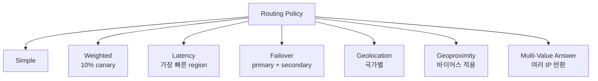
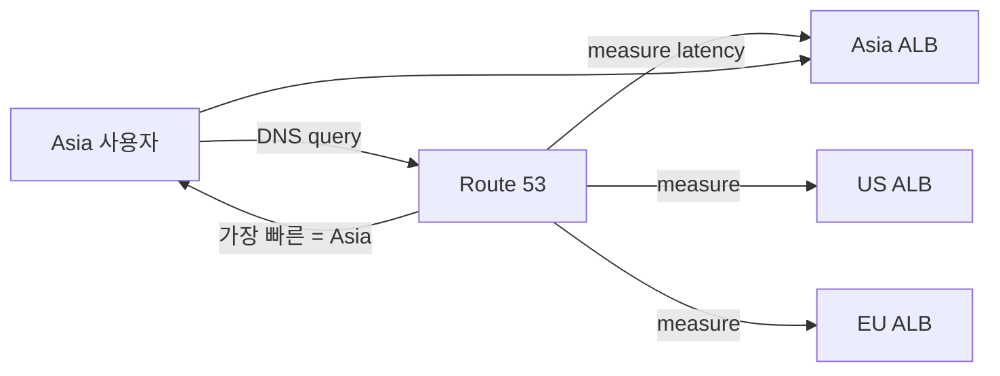

## 정의

**Route 53** = AWS 의 *글로벌 DNS + health check + 라우팅 정책*. 단순 DNS 뿐 아니라 *글로벌 트래픽 분산*.

## Hosted Zone

```
Hosted Zone: example.com
└── Record:
    A      api.example.com   →  192.0.2.1
    CNAME  www.example.com   →  example.com
    MX     example.com       →  mail.example.com
    TXT    _verification     →  "google-site-verification=..."
```

## Alias Record (AWS 전용)

```
A alias api.example.com → AWS Load Balancer (xx.amazonaws.com)
```

CNAME 보다:

- *root domain 가능* (CNAME 은 root 불가)
- *무료 query*
- *IP 자동 갱신*

## 라우팅 정책 7가지



### Weighted (Canary)

```
api.example.com (200)
  → 10% → 신 ALB
  → 90% → 옛 ALB
```

### Latency-Based



### Failover

```
primary: api-prod.example.com (health check)
secondary: api-dr.example.com (health check)
```

primary unhealthy → secondary 자동 응답.

## Health Check

```yaml
HealthCheck:
  Type: HTTPS
  ResourcePath: /health
  FullyQualifiedDomainName: api.example.com
  RequestInterval: 30
  FailureThreshold: 3
  Regions: [us-east-1, us-west-2, ap-northeast-1]  # 다중 region 동시 체크
```

3개 region 의 *과반* 이상 unhealthy → unhealthy 판정.

## DNSSEC

```bash
aws route53 enable-hosted-zone-dnssec --hosted-zone-id Z0123
```

DNS 응답에 *디지털 서명* → DNS 위조 (cache poisoning) 방어.

## Private Hosted Zone

```
domain: internal.local
visibility: VPC associated
```

VPC 안에서만 resolve. 내부 service 명명에 활용.

## 흔한 함정

> [!WARNING]
> 1. **TTL 너무 큼** = failover 시 *옛 IP 캐시* → 다운타임 길음. 일반 60s.
> 2. **CNAME root domain 시도** = 거절. *Alias* 또는 *redirect (CloudFront)*.
> 3. **Health check 의 IP-only** = TLS 검증 안 됨. HTTPS health check 권장.
> 4. **다중 region failover 의 *RTO*** = TTL + health check interval. 분 단위 가능.

## 관련 위키

- [[network-dns]]
- [[aws-alb-nlb]]
- [[aws-cloudfront-cdn]]
- [[aws-vpc]]
