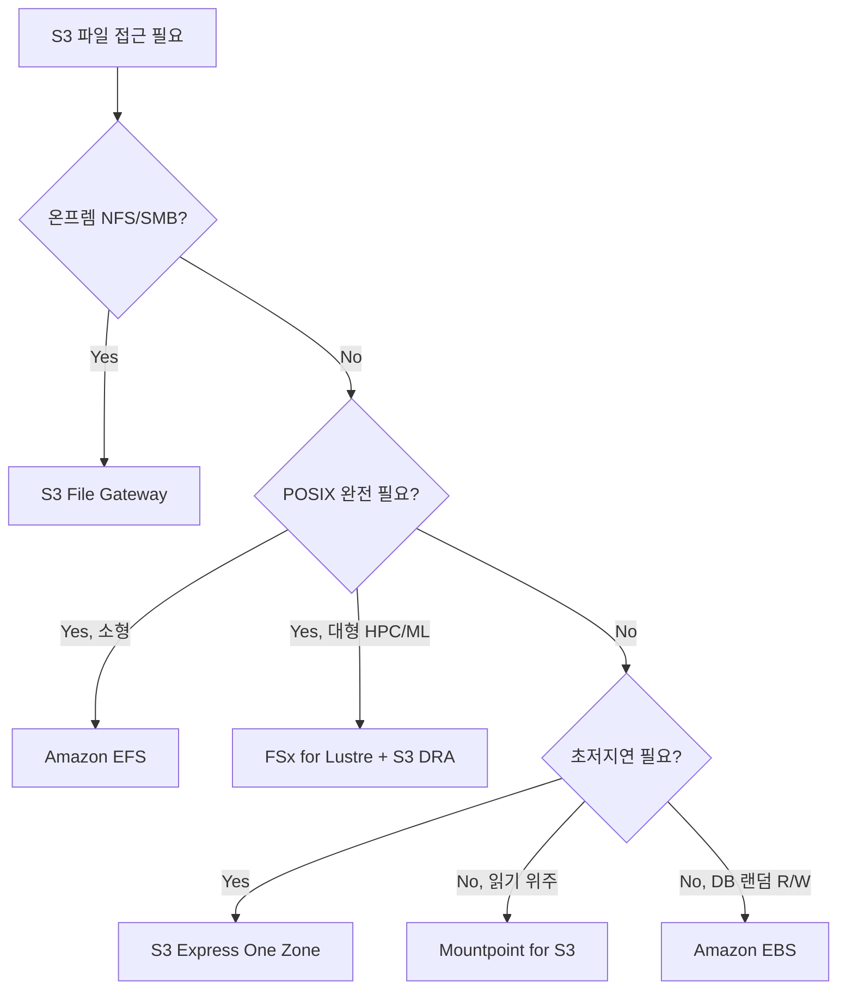

## 정의

"**S3 를 파일처럼 다루는**" 요구를 충족하는 AWS 옵션은 하나가 아니라 여러 개입니다. 각자 다른 트레이드오프를 가집니다.

| 옵션 | 성격 | 대표 용도 |
|:---|:---|:---|
| **Mountpoint for S3** | Linux 클라이언트 (FUSE 기반) | 읽기 위주 데이터 파이프라인, ML 학습 |
| **S3 File Gateway** | 하이브리드 NFS/SMB 게이트웨이 (온프레미스) | 백업, 아카이브, 온프렘 확장 |
| **S3 Express One Zone** | 단일 AZ 초고속 S3 스토리지 클래스 | 저지연 접근 (수 ms), AI 학습 캐시 |
| **FSx for Lustre + S3 DRA** | POSIX 파일시스템에 S3 를 linked repository 로 | HPC, ML 대규모 학습 |

## Mountpoint for Amazon S3

**Mountpoint for S3** 는 AWS 가 만든 **오픈소스 Linux 클라이언트** 로, S3 버킷을 로컬 디렉토리처럼 마운트합니다. FUSE 로 리눅스 커널에 붙어 open/read/write 을 S3 API 로 번역합니다.

Rust 로 작성되어 있고 `mount-s3` CLI 로 사용:

```bash
sudo yum install mount-s3
mount-s3 my-bucket /mnt/s3
# 이제 /mnt/s3 안의 파일 = S3 객체
```

### 무엇을 지원하고 무엇을 지원하지 않는가

**지원**:
- Sequential/random **read** (매우 빠름, 병렬 GET)
- Sequential **write** (스트림 append 없이, 새 객체 생성)
- 디렉토리 리스트 (prefix `ListObjectsV2`)
- 큰 파일 (multipart)
- IAM instance profile / IRSA 자격증명

**지원 안 함** (POSIX 완전성 부재):
- **Random write** (파일 중간 수정 안 됨)
- **파일 이름 변경** (rename)
- **디렉토리 rename**
- **Symbolic link, hard link**
- **File locking (flock)**
- **`chmod`, `chown`** (POSIX 권한)
- **truncate to non-zero**
- **파일 다시 열어서 append**

### 왜 이런 제약인가

S3 는 **객체 저장소** 이지 파일시스템이 아닙니다. 객체는 **불변** 이고, 이름 변경 = 새 객체 PUT + 기존 DELETE 라는 값비싼 연산. Mountpoint 는 이 근본을 강제로 감추지 않고, "우리는 이만큼만 지원한다" 를 명시합니다.

### 적합한 워크로드

- **ML 학습 데이터 읽기**: PyTorch DataLoader 가 shard 파일들을 sequential read
- **로그 인제스션**: 새 파일을 append-only 로 write
- **배치 데이터 파이프라인**: Airflow task 가 S3 객체를 로컬 파일처럼 read
- **읽기 위주 웹 서빙**: 정적 자산을 마운트 후 nginx 로 서빙 (S3 정적 웹사이트보다 유연)

### 부적합

- 데이터베이스 파일 (SQLite, RocksDB)
- 파일 rename 이 필요한 툴 (git, npm cache)
- POSIX lock 을 쓰는 앱 (많은 레거시 앱)

## S3 File Gateway (Storage Gateway 계열)

**AWS Storage Gateway** 의 한 유형. 온프레미스 (또는 EC2) 에 가상 어플라이언스 (VMware, Hyper-V, KVM, ESXi, EC2 AMI) 를 배포하면 **NFS v3/v4.1 또는 SMB v2/v3** 로 파일 공유가 뜨고, 파일 write 는 **S3 객체** 로 저장됩니다.

```
[클라이언트: NFS/SMB]
   ↓
[File Gateway 어플라이언스 (온프렘 VM)]
   ↓ 캐시 계층 (로컬 디스크)
   ↓
[S3 Bucket]
```

### 핵심 특성

- **캐시** (로컬 SSD/HDD): 최근 접근 파일을 로컬에 저장, 재접근 시 저지연
- **비동기 upload**: write 를 로컬 캐시에 저장 후 background 로 S3 upload
- **파일 = 객체 1:1**: NFS 로 쓴 파일이 그대로 S3 객체 (역방향으로도 브라우저에서 접근 가능)
- **암호화**: 전송 TLS, 저장 SSE-S3 또는 SSE-KMS
- **파일 크기 최대**: 5 TB per 파일 (S3 객체 상한)

### 대표 용도

- **레거시 앱** 이 NFS 만 지원할 때, 백엔드 스토리지를 S3 로 저비용 이전
- **온프렘 백업/아카이브**: 로컬 파일 서버를 S3 로 옮기며 인터페이스는 유지
- **하이브리드 SaaS**: 데이터센터 파일 서버를 클라우드로 슬라이드

## S3 Express One Zone

2023년 re:Invent 에서 발표된 **초저지연 S3 스토리지 클래스**. 단일 AZ 에 저장 (내구성 SLA 는 낮음) 하는 대신, **first-byte latency 를 표준 S3 대비 최대 10배 낮춤** (수 ms).

### 특징

- **디렉토리 버킷** (directory bucket) 이라는 새 버킷 유형, 리전 접미사 (`--x-s3` suffix)
- **단일 AZ**: 데이터가 한 AZ 에만 저장, 그 AZ 장애 시 손실
- **DNS-based routing**: 버킷 이름에 AZ 정보 포함
- **낮은 request 요금** (수십배 낮음), 반면 **저장 요금은 표준보다 높음**
- **강한 read-after-write consistency**

### 언제 쓰나

- **AI/ML 학습의 캐시 계층**: 원본은 표준 S3, hot working set 을 Express One Zone 에 복사
- **저지연이 필수인 batch analytics**: Spark, Ray 등
- **컴퓨트가 같은 AZ 에 있을 때** (cross-AZ 트래픽 없음)

**표준 S3 대체가 아닙니다.** 단일 AZ 이라 재해복구 시나리오에는 부적합.

## FSx for Lustre + S3 Data Repository Association

**Amazon FSx for Lustre** 는 관리형 Lustre 파일시스템. **S3 버킷을 linked data repository (DRA)** 로 연결하면:

- Lustre 파일시스템 접근 = 완전 POSIX
- 파일이 hot 이면 Lustre 캐시에 자동 로드 (lazy load), cold 는 S3 에서 stream
- Write 는 Lustre 에 저장 후 batch export 로 S3 로 sync

### 적합한 워크로드

- **대규모 ML 학습**: 수십 노드가 병렬로 파일 read, sub-ms 지연
- **HPC 시뮬레이션**: MPI 로 계산 노드 간 파일 공유
- **유전체학, 시각효과 렌더링**

FSx Lustre 자체가 고가이므로 **비용 정당화가 되는 규모**에서만 씁니다.

## 옵션 선택 가이드

| 요구 | 권장 |
|:---|:---|
| 리눅스에서 S3 를 파일처럼 read | **Mountpoint** |
| 온프렘 NFS/SMB 를 S3 백엔드로 | **S3 File Gateway** |
| 초저지연 S3 접근 (같은 AZ 컴퓨트) | **S3 Express One Zone** |
| POSIX 완전 파일시스템 (rename, lock) | **EFS** 또는 **FSx** |
| 대규모 병렬 ML 학습 | **FSx Lustre + S3 DRA** |
| 컨테이너 공유 볼륨 | **EFS** (ECS/EKS 통합) |
| DB 파일 (append + random write) | **EBS** 또는 관리형 DB |

## Mountpoint 실전 팁

```bash
mount-s3 my-bucket /mnt/s3 \
  --allow-delete \
  --allow-overwrite \
  --allow-other \
  --cache /var/cache/mountpoint-s3 \
  --max-cache-size 10G \
  --metadata-ttl 60
```

- `--cache`: 로컬 디스크 캐시로 read 반복 시 큰 성능 향상
- `--metadata-ttl`: 디렉토리 리스트 캐시 TTL. 자주 바뀌면 낮게.
- `--allow-delete` / `--allow-overwrite`: 기본은 read-only + no-overwrite 안전
- Container 환경: `privileged` + `SYS_ADMIN` capability 필요 (FUSE)

## 아키텍처 결정 흐름



## 보안 및 접근 제어

### Mountpoint IAM 최소 권한

읽기 전용 파이프라인:

```json
{
  "Version": "2012-10-17",
  "Statement": [
    {
      "Effect": "Allow",
      "Action": ["s3:GetObject", "s3:ListBucket"],
      "Resource": [
        "arn:aws:s3:::my-bucket",
        "arn:aws:s3:::my-bucket/*"
      ]
    }
  ]
}
```

읽기/쓰기가 필요하면 `s3:PutObject`, 삭제가 필요하면 `s3:DeleteObject` 를 추가합니다.

### VPC 엔드포인트

퍼블릭 인터넷을 거치지 않으려면 **S3 Gateway Endpoint** (무료) 를 VPC 에 붙입니다. 더 세밀한 제어가 필요하면 **S3 Interface Endpoint** (PrivateLink, 유료) 를 사용합니다.

### 암호화 옵션 비교

| 옵션 | 방식 | 비고 |
|:---|:---|:---|
| **SSE-S3** | S3 관리 키 | 기본값, 추가 비용 없음 |
| **SSE-KMS** | KMS 고객 관리 키 | 감사 로그, 세밀한 접근 제어 |
| **SSE-C** | 클라이언트 제공 키 | 키 관리 책임이 클라이언트에 |
| **CSE** | 업로드 전 클라이언트 암호화 | S3 는 암호문만 저장 |

Mountpoint 와 File Gateway 모두 SSE-S3 / SSE-KMS 를 지원합니다.

## 성능 모니터링

CloudWatch 에서 확인할 핵심 S3 지표:

| 지표 | 의미 | 관찰 포인트 |
|:---|:---|:---|
| `NumberOfRequests` | API 호출 수 | 과도한 `ListObjects` 호출 감시 |
| `FirstByteLatency` | 첫 바이트 수신 지연 | Express One Zone: 10ms 미만 목표 |
| `TotalRequestLatency` | 전체 요청 지연 | 표준 S3: 100ms 미만 목표 |
| `4xxErrors` | 클라이언트 에러 | IAM 정책 또는 버킷 정책 문제 |
| `5xxErrors` | S3 서버 에러 | 재시도 로직 점검 신호 |

Mountpoint 로그는 기본적으로 stderr 에 출력됩니다. `--log-directory /var/log/mountpoint-s3/` 로 파일에 기록하면 CloudWatch Logs Agent 로 수집하기 편리합니다.

## 함정

> [!WARNING]
> **Mountpoint 를 데이터베이스로 오해하지 마세요.** 파일 중간 수정, rename, lock 이 없어 SQLite/RocksDB/Postgres data directory 로 마운트하면 즉시 손상됩니다.

> [!CAUTION]
> **File Gateway 는 캐시 어플라이언스 장애 = 최근 write 손실 위험**. 캐시가 upload 되기 전에 어플라이언스가 죽으면 손실. 프로덕션은 어플라이언스 이중화 + 모니터링 필수.

> [!WARNING]
> **S3 Express One Zone 은 단일 AZ**. 컴퓨트가 다른 AZ 이면 오히려 성능 저하 + cross-AZ 요금. 반드시 같은 AZ 에 배치.

> [!IMPORTANT]
> **비용 모델이 다릅니다**. Mountpoint 는 표준 S3 요금, File Gateway 는 어플라이언스 + 저장 + 요청 요금, Express One Zone 은 저장 요금이 높지만 요청 요금이 낮음. 워크로드 패턴 (read/write 비율, 파일 수) 을 시뮬레이션해 총액 비교 필요.

> [!CAUTION]
> **Kubernetes 에서 Mountpoint 는 CSI driver (`s3-csi-driver`)** 로 씁니다. Pod 재시작 시 마운트 다시 붙기, DaemonSet 로 노드마다 sidecar 등 운영 이슈가 있어 도입 전 문서 검토 필요.

## 관련 위키

- [[aws-s3|S3]] - 기본 객체 저장소
- [[aws-s3-vectors|S3 Vectors]] - 벡터 검색 특화
- [[aws-ebs-vs-instance-store|EBS vs Instance Store]] - 블록 스토리지 대안
- [[aws-iam|IAM]] - 마운트 자격증명
- [[aws-vpc|VPC]] - VPC 엔드포인트로 프라이빗 접근
- [[aws-cloudwatch|CloudWatch]] - 마운트/게이트웨이 모니터링
- [[oci-image|OCI Image]] - 컨테이너 이미지에 Mountpoint 포함
