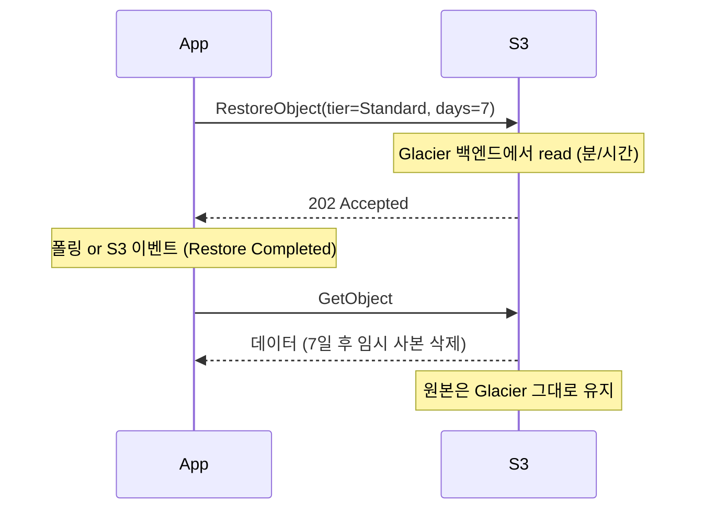

## 정의

**Amazon S3 Glacier** 는 [[aws-s3|S3]] 의 *장기 아카이빙 스토리지 클래스 3종*. 자주 접근하지 않는 데이터를 극도로 저렴하게 (Standard 대비 최대 95% 절감) 저장. 각 클래스는 검색 지연 (retrieval latency) 과 최소 저장 기간 (minimum storage duration) 이 다름.

**주의**: *S3 Glacier storage class* (현재 방식) 와 *S3 Glacier Vault* (legacy 별도 서비스) 는 다름. 신규는 storage class 로만.

## 세 가지 클래스 (2026 시점)

| 클래스 | 검색 지연 | 최소 저장 기간 | 저장 요금 (US East) | 대표 용도 |
|:---|:---|:---|:---|:---|
| **Glacier Instant Retrieval** | 밀리초 | 90일 | ~$0.004 / GB-월 | 분기별 접근 아카이브 |
| **Glacier Flexible Retrieval** | 분 ~ 시간 | 90일 | ~$0.0036 / GB-월 | 연 1-2회 접근 |
| **Glacier Deep Archive** | 12 ~ 48 시간 | 180일 | ~$0.00099 / GB-월 | 매우 드문 접근 (컴플라이언스) |

**최소 오브젝트 크기**: 128 KB. 더 작아도 128 KB 로 청구.
**메타데이터 오버헤드**: 40 KB / object (8 KB @ Standard 요금 + 32 KB @ Glacier 요금).

## 클래스별 상세

### S3 Glacier Instant Retrieval (IR)

**밀리초 검색**. Standard 와 접근 지연이 사실상 같음.

- 검색 = 즉시 (restore 불필요)
- 접근 요금이 있음 (`$0.03 / GB`), 저장은 매우 저렴
- 최소 저장 90일 (조기 삭제 시 pro-rated 요금)
- 최소 오브젝트 128 KB

**적합**: 의료 이미지, 미디어 백카탈로그, 컴플라이언스 로그 (분기/반기 조회).

### S3 Glacier Flexible Retrieval (구 "S3 Glacier")

**3단계 retrieval tier** 로 지연과 요금 트레이드오프.

| Tier | 지연 | 요금 |
|:---|:---|:---|
| **Expedited** | 1-5 분 | ~$0.03 / GB |
| **Standard** | 3-5 시간 | ~$0.01 / GB (기본) |
| **Bulk** | 5-12 시간 | **무료** |

- 검색 = *restore 요청 필요* (동기 아님)
- 최소 저장 90일
- 대용량 벌크 검색 (bulk tier) 이 무료 -> 정기 감사에 유리

**적합**: 백업 (분기/연 검증), 미디어 원본, 규제 데이터 아카이브.

### S3 Glacier Deep Archive

**최저가 스토리지**. 12/48 시간 대기 감내 가능한 데이터.

| Tier | 지연 | 요금 |
|:---|:---|:---|
| **Standard** | 12 시간 | ~$0.01 / GB |
| **Bulk** | 48 시간 | ~$0.0025 / GB |

- 최소 저장 180일
- 데이터 볼륨 극대: 페타바이트 저장 시 큰 차이

**적합**: 7년+ 재무/의료/법적 보존, 오프사이트 백업 대체.

## 저장 요금 시각화

```
$/GB-월 (2026, us-east-1)
Standard              ████████ ~$0.023
Standard-IA           ████     ~$0.0125
One Zone-IA           ███      ~$0.01
Glacier Instant       ██        ~$0.004
Glacier Flexible      █         ~$0.0036
Glacier Deep Archive  ·         ~$0.00099
```

## 검색 워크플로우 (Restore)

Flexible / Deep Archive 는 *비동기 restore* 가 필요.



```bash
aws s3api restore-object \
  --bucket my-archive \
  --key logs/2024/data.parquet \
  --restore-request '{
    "Days": 7,
    "GlacierJobParameters": {"Tier": "Standard"}
  }'

# 완료 확인
aws s3api head-object --bucket my-archive --key logs/2024/data.parquet
# 'Restore': 'ongoing-request="false", expiry-date="..."'
```

- **`Days`**: Standard 클래스로 임시 사본을 유지할 기간
- 만료 = 임시 사본 삭제 (원본은 Glacier 에 그대로)
- `s3:ObjectRestore:Completed` 이벤트로 자동 트리거 가능

## Lifecycle Transitions

`STANDARD -> IA -> Glacier` 자동 이동.

```yaml
Rules:
  - Id: archive-old
    Filter: { Prefix: logs/ }
    Transitions:
      - Days: 30
        StorageClass: STANDARD_IA
      - Days: 90
        StorageClass: GLACIER              # Flexible
      - Days: 365
        StorageClass: DEEP_ARCHIVE
    Expiration:
      Days: 2555   # 7년
    AbortIncompleteMultipartUploads:
      DaysAfterInitiation: 7
```

**전이 요금**: `$0.05 / 1000 requests`. 파일 수가 많으면 무시 못 함.

## 컴플라이언스: Object Lock vs Vault Lock

### S3 Object Lock (현재 표준)

*WORM* (Write Once Read Many) 을 스토리지 클래스와 무관하게 적용.

```yaml
Mode: GOVERNANCE | COMPLIANCE
RetainUntilDate: "2031-07-30T00:00:00Z"
```

- **GOVERNANCE**: 특정 IAM 권한으로 해제 가능
- **COMPLIANCE**: root 도 삭제 불가 (SEC 17a-4, FINRA, CFTC 등 규제 대응)
- **Legal Hold**: 날짜 무관 삭제 차단

Glacier 모든 클래스에 적용 가능. 신규는 Object Lock 만.

### Vault Lock (Legacy Glacier Vaults)

*별도 서비스* `glacier` API (S3 API 아님). 신규 프로젝트는 사용 안 함. S3 Object Lock 이 완전 대체.

## Small Files 문제

**40 KB 메타데이터 오버헤드** 가 오브젝트 당 청구. 오브젝트 수천만 개 = 오버헤드 폭발.

```
1000만 objects × 40 KB = 400 GB metadata
- 8 KB × 1000만 @ Standard 요금
- 32 KB × 1000만 @ Glacier 요금
```

**128 KB 미만** 은 128 KB 로 청구. 작은 파일들을 *묶어서* (tar/zip) 저장하는 것이 압도적으로 저렴.

## 데이터 접근 패턴별 선택

| 패턴 | 클래스 |
|:---|:---|
| 하루 여러 번 | Standard |
| 주 1회 | Standard-IA |
| 월 1-2회 | One Zone-IA (내구성 감수) |
| 분기 1회 (즉시 필요) | **Glacier Instant Retrieval** |
| 연 1-2회 (몇 시간 감수) | **Glacier Flexible Retrieval** |
| 5년+ 거의 접근 안 함 | **Glacier Deep Archive** |
| 예측 불가 | Intelligent-Tiering (자동) |

## Intelligent-Tiering 과의 관계

**S3 Intelligent-Tiering** 은 여러 tier 를 자동 이동. Archive Access / Deep Archive Access tier 를 활성화하면 Glacier 클래스도 자동 관리:

```yaml
IntelligentTieringConfiguration:
  Tierings:
    - Days: 90                       # 90일 미접근
      AccessTier: ARCHIVE_ACCESS      # Glacier Flexible 상당
    - Days: 180                       # 180일 미접근
      AccessTier: DEEP_ARCHIVE_ACCESS # Deep Archive 상당
```

접근 패턴을 몰라도 됨. 단, Archive tier 에 있는 오브젝트는 restore 가 필요 (즉시 접근 X).

## 요금 계산 예시

**시나리오**: 100 TB 로그, 1년 후 Deep Archive 로 옮김.

```
초기 12개월 (Standard):
  100 TB × 1024 × $0.023 × 12 = ~$28,262

Lifecycle 로 12개월 후 Deep Archive:
  전이 요금: 100M objects × $0.05/1000 = $5,000  (한 번)
  이후 저장: 100 TB × 1024 × $0.00099 × 12 = ~$1,216  /년

절감:
  Standard 계속:  ~$28,262 /년
  Deep Archive:   ~$1,216  /년
  → 95% 절감
```

**단, 검색 요금 별도** 발생. 접근 빈도가 실제로 낮아야 이득.

## [[aws-athena|Athena]] / [[aws-redshift-spectrum|Spectrum]] 과의 관계

Glacier 클래스 오브젝트는 **Athena / Redshift Spectrum 이 직접 쿼리 불가**. 이유:

- Athena / Spectrum 은 GET 을 즉시 시도, restore 대기 안 함
- Instant Retrieval 도 다른 스토리지 클래스로 인식되어 쿼리 실패

**해결**:
1. 쿼리 전 `RestoreObject` 수행
2. Restore 된 임시 사본 (Standard) 이 나오면 쿼리
3. 만료 후 원본은 Glacier 에 그대로

또는 데이터를 미리 Standard 로 옮겨 놓기.

## 함정

> [!WARNING]
> **최소 저장 기간 위반**: 90일 (IR/Flexible) 또는 180일 (Deep Archive) 이내 삭제 시 남은 기간 pro-rated 요금 청구. 잦은 upload/delete 는 오히려 비쌈.

> [!CAUTION]
> **Expedited retrieval 요금** = Standard 대비 3배. 정기 감사에 Expedited 를 관행으로 쓰면 예상 밖 요금. Bulk (무료) 로 사전 계획.

> [!WARNING]
> **40 KB 메타데이터 오버헤드** 을 무시 = 파일 1억 개 = 4 TB 오버헤드. 작은 파일은 tar/zip 으로 묶어 저장.

> [!IMPORTANT]
> **128 KB 최소** 청구. 100 바이트 파일도 128 KB 로 계산. 작은 오브젝트를 Glacier 로 옮기면 오히려 비용 증가할 수 있음.

> [!CAUTION]
> **Restore 임시 사본 만료** 후 재접근 시 다시 restore 필요 = 지연 재발. 접근 패턴 파악 후 `Days` 를 넉넉히.

> [!WARNING]
> **Athena / Spectrum 이 Glacier 오브젝트 만나면 쿼리 실패**. Lifecycle 로 옮기기 전에 다운스트림 쿼리 패턴을 재검증.

> [!IMPORTANT]
> **Instant Retrieval 은 저장 요금이 Standard-IA 보다 비싸다** (약 2배). 접근이 정말 드물 때만 유리. 월 1회 이상이면 Standard-IA 가 저렴.

> [!CAUTION]
> **Legacy Glacier Vault 를 신규 프로젝트에** 사용하지 말 것. S3 storage class 로만 사용. Vault 는 별도 API + Vault Lock 이지만 사용성/통합성이 떨어짐.

> [!WARNING]
> **Versioning + Lifecycle 조합 실수** = 이전 버전이 계속 Glacier 에 쌓임. `NoncurrentVersionTransition` / `NoncurrentVersionExpiration` 을 명시.

## 관련 위키

- [[aws-s3|AWS S3]] - 기본 객체 스토리지
- [[aws-s3-files|S3 File Access]] - Mountpoint, File Gateway
- [[aws-athena|Amazon Athena]] - Glacier 직접 쿼리 X (restore 필요)
- [[aws-redshift-spectrum|Redshift Spectrum]] - 같은 제약
- [[aws-kms|KMS]] - Glacier 데이터 암호화
- [[aws-iam|IAM]] - Restore/GetObject 권한
- [[aws-glue|AWS Glue]] - 아카이빙 전 카탈로그 정리
- [[data-warehouse|Data Warehouse]] - cold 계층으로 Glacier 활용
- [[etl|ETL]] - Lifecycle 자동화
