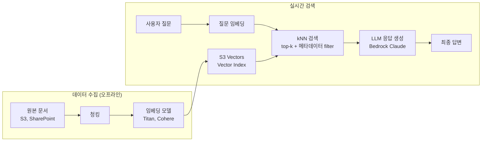

## 정의

**Amazon S3 Vectors** 는 벡터 임베딩을 **저비용, 대용량, 서버리스** 로 저장하고 쿼리하기 위한 S3 의 새 버킷 유형입니다. 2024년 7월 preview, **2025년 12월 GA** 로 14 개 리전에 릴리스되었으며, 기존 벡터 DB 대비 **최대 90% 비용 절감** 을 주장합니다.

**첫 번째 클라우드 객체 저장소 네이티브 벡터 스토리지** 라는 포지셔닝입니다. Bedrock Knowledge Bases 와 OpenSearch Service 에 네이티브 통합되어 RAG 파이프라인의 저장 계층을 저비용화합니다.

## 핵심 개념

### Vector Bucket

S3 에 새로 추가된 **버킷 유형**. 일반 S3 (범용 버킷, 디렉토리 버킷) 와 별개입니다.

```
Region → Vector Bucket → Vector Index → Vector (embedding + metadata)
```

- **Vector Bucket**: 리전 스코프의 컨테이너
- **Vector Index**: 특정 임베딩 모델/차원의 벡터 컬렉션. 한 버킷에 여러 index.
- **Vector**: 단일 임베딩 + optional metadata (key-value JSON)

### API

일반 S3 (`GetObject`, `PutObject`) 와 별개의 벡터 전용 API:

- `PutVectors`: 벡터 upsert (batch)
- `GetVectors`: key 로 벡터 조회
- `DeleteVectors`: 벡터 삭제
- `QueryVectors`: kNN 유사도 검색 + metadata filter
- `ListVectors`, `ListVectorBuckets`, `ListIndexes`
- `CreateVectorBucket`, `CreateIndex` 등 관리 API

## 왜 S3 Vectors 인가

### 비용 구조

기존 벡터 DB 문제:

- **OpenSearch Serverless**: 최소 요금 (2 OCU minimum) 이 월 600+ USD
- **Pinecone / Weaviate**: pod/hour 또는 replica 기반 요금, 유휴에도 청구
- **자체 호스팅**: 노드 관리 + 스토리지 IOPS

S3 Vectors:
- **저장은 GB-월**, **쿼리는 request 당** (per-query pricing)
- 유휴 시 저장 요금만 발생
- 저장 요금 자체가 S3 스토리지 대비 몇 배지만, 절대 규모는 저렴
- Read-heavy, low-update 워크로드에서 특히 유리

### 확장성

- **버킷당 수천 개 index**, **index 당 수백만~수십억 벡터**
- **차원**: 1 ~ 4,096 (일반적으로 384, 768, 1024, 1536)
- **Metric**: cosine, Euclidean
- **Metadata**: 벡터당 최대 40 KB JSON (수 KB 권장), filterable/non-filterable 분류
- **Sub-second query** SLA (kNN top-k)

### 내구성

일반 S3 와 동일한 99.999999999% (11 nines) 내구성. 다중 AZ 저장. 재해복구 걱정 없음.

## RAG 파이프라인 아키텍처

S3 Vectors 를 벡터 저장소로 쓰는 RAG 구성의 전체 흐름입니다.



Bedrock Managed Knowledge Base 를 사용하면 청킹 ~ 임베딩 ~ 인덱싱을 자동으로 처리하며, S3 Vectors 를 벡터 저장소로 선택할 수 있습니다.

## Bedrock Knowledge Bases 통합

**[[aws-bedrock|Bedrock]] Managed Knowledge Base** (2026 GA) 는 S3 Vectors 를 벡터 저장소 옵션 중 하나로 지원. 사용자는 데이터 소스 (S3, SharePoint, Confluence, Google Drive) 만 지정하고, 벡터 저장소는 관리형 기본값 (S3 Vectors) 또는 명시적 선택 (OpenSearch, Aurora pgvector, Pinecone, Redis, MongoDB Atlas) 을 사용.

**S3 Vectors 를 KB 벡터 저장소로 쓸 때 이점**:
- 최소 유휴 비용 near-zero
- 벡터 데이터가 KB 파이프라인과 같은 계정/리전에 격리
- KB 가 알아서 chunk / embed / index

## OpenSearch 티어드 전략

AWS 공식 권장 패턴: **hot** 벡터는 OpenSearch, **cold/archive** 는 S3 Vectors.

```
[신선한 데이터]     [자주 조회하는 벡터]
       ↓                    ↓
   S3 Vectors ← 티어링 →  OpenSearch Serverless
   (저비용)              (초저지연)
```

OpenSearch Service 가 S3 Vectors 를 network storage 로 참조 가능. 자주 조회하지 않는 벡터는 S3 에 두고 필요할 때 OpenSearch 로 promote.

## 실전 예시 (Boto3)

```python
import boto3

s3vectors = boto3.client("s3vectors")

# 벡터 버킷 + 인덱스 생성
s3vectors.create_vector_bucket(vectorBucketName="my-embeddings")
s3vectors.create_index(
    vectorBucketName="my-embeddings",
    indexName="docs-1536",
    dimension=1536,
    distanceMetric="COSINE",
    dataType="FLOAT32",
    metadataConfiguration={
        "nonFilterableMetadataKeys": ["source_text"],
    },
)

# 임베딩 upsert
s3vectors.put_vectors(
    vectorBucketName="my-embeddings",
    indexName="docs-1536",
    vectors=[
        {
            "key": "doc-42",
            "data": {"float32": [0.1, 0.2, ...]},  # 1536-dim
            "metadata": {
                "author": "kim",
                "created_at": "2026-07-07",
                "source_text": "..."
            }
        },
    ],
)

# kNN 쿼리
resp = s3vectors.query_vectors(
    vectorBucketName="my-embeddings",
    indexName="docs-1536",
    queryVector={"float32": [0.15, 0.22, ...]},
    topK=10,
    filter={"author": "kim"},
    returnMetadata=True,
    returnDistance=True,
)

for m in resp["vectors"]:
    print(m["key"], m["distance"], m["metadata"])
```

## 성능 & 확장 (2025-12 GA 기준)

- **버킷당 index**: 수만 (preview 대비 40배 확장)
- **Index 당 벡터**: 수십억 (10^9)
- **벡터 upsert 처리량**: 병렬 요청으로 확장 가능
- **Sub-second query**: p50 100 ms 이하 (top-10, 백만 벡터급 index)
- **콜드 쿼리 시** 약간의 latency 초기 튐 (인덱스 워밍)

## 비용 추정 시나리오

S3 Vectors 는 세 축으로 요금이 발생합니다 (리전별 상이, 아래는 us-east-1 기준 근사치).

| 항목 | 단위 | 참고 |
|:---|:---|:---|
| **벡터 저장** | GB-월 | 1536-dim FLOAT32 = 벡터당 ~6 KB |
| **메타데이터 저장** | GB-월 | 벡터당 수 KB |
| **upsert** | 벡터 1,000 건당 | 배치 upsert 로 최적화 |
| **쿼리** | 요청당 | top-k, metadata filter 포함 |

**백만 벡터 (1536-dim) 월 비용 추정 예시**:

```
저장: 1,000,000 벡터 × 6 KB ≈ 6 GB × GB-월 단가
메타데이터: 1,000,000 × 2 KB ≈ 2 GB
쿼리: 하루 10,000 회 × 30일 = 300,000 회 × 요청 단가
```

OpenSearch Serverless 최소 요금 (2 OCU = 월 ~$700+) 과 비교하면, S3 Vectors 는 **유휴 비용이 거의 없어** 저빈도 워크로드에 훨씬 유리합니다.

> [!IMPORTANT]
> 실제 비용은 [AWS 가격 계산기](https://calculator.aws/pricing/2/home)에서 용량과 요청량을 넣고 시뮬레이션. upsert 빈도와 쿼리 QPS 가 핵심 변수입니다.

## 적합한 워크로드

S3 Vectors 가 잘 맞는 유스케이스:

| 유스케이스 | 이유 |
|:---|:---|
| **내부 문서 RAG** | 유휴 비용 최소, 대용량, latency 100-500 ms 허용 |
| **오프라인 추천** | 배치 임베딩 후 S3 저장, 주기적 쿼리 |
| **지식 베이스 백업** | 11 nines 내구성, 재해복구 자동 |
| **멀티모달 임베딩 아카이브** | 이미지/오디오 임베딩 대규모 저장 |
| **OpenSearch cold tier** | 자주 안 찾는 벡터를 S3 Vectors 로 티어링 |

S3 Vectors 가 맞지 않는 유스케이스:

| 유스케이스 | 대안 |
|:---|:---|
| **실시간 UI 자동완성 (< 50 ms)** | Redis Vector, OpenSearch Serverless |
| **트랜잭션과 결합된 벡터 검색** | Aurora pgvector |
| **하이브리드 키워드 + 벡터 검색** | OpenSearch (BM25 + kNN) |

## 다른 벡터 스토리지와 비교

| 옵션 | 초점 | 강점 | 약점 |
|:---|:---|:---|:---|
| **S3 Vectors** | 저비용 대용량 | 서버리스, 유휴 비용 최소 | latency 표준 ms (초저지연 X) |
| **OpenSearch Serverless** | 관리형 벡터 | 초저지연, 하이브리드 검색 | 최소 요금 큼 |
| **Pinecone** | SaaS 벡터 DB | 개발자 경험 우수 | AWS 외부 |
| **Aurora pgvector** | RDB + 벡터 | 트랜잭션 통합 | 대규모 저장 비용 큼 |
| **Redis Vector** | 인메모리 초저지연 | ms 단위 latency | 저장 크기 제약 |
| **자체 FAISS / HNSWlib** | 오프라인 | 최대 유연 | 운영 부담 |

## 함정

> [!WARNING]
> **초저지연 (< 10 ms) 실시간 검색 워크로드에는 부적합**. Sub-second 이지만 100 ms 근처가 정상. UI 실시간 자동완성 같은 케이스에는 OpenSearch 또는 Redis 벡터를 고려.

> [!CAUTION]
> **Metadata schema 변경이 index 재빌드를 요구**할 수 있습니다. 처음 index 생성 시 filterable / non-filterable metadata 를 신중히 계획.

> [!IMPORTANT]
> **Filter 성능**은 metadata cardinality 에 의존. 고카디널리티 필터는 pre-filter 로 검색 공간이 줄어들지만 인덱스 구조에 따라 느려질 수 있음. 프로덕션 전 대표 쿼리 벤치마크.

> [!WARNING]
> **한 index 는 하나의 임베딩 모델 차원**. 모델을 바꾸면 새 index 를 만들고 재임베딩 필요. Bedrock KB 는 자동으로 하지만 자체 파이프라인은 마이그레이션 계획 필수.

> [!CAUTION]
> **비용 계산이 여러 축**. 저장 (GB-월) + upsert (per-vector) + 쿼리 (per-query) + metadata (GB-월) + list/get 요청. 실 사용 패턴으로 시뮬레이션.

## 관련 위키

- [[aws-s3|S3]] - 기본 객체 저장소
- [[aws-s3-files|S3 File Access]] - Mountpoint/File Gateway/Express One Zone
- [[aws-bedrock|Bedrock]] - Managed Knowledge Base 벡터 저장소로 활용
- [[aws-sagemaker|SageMaker]] - Studio 에서 통합 사용
- [[llm-rag|LLM RAG]] - S3 Vectors 를 RAG 저장 계층
- [[aws-iam|IAM]] - 벡터 API 접근 제어
