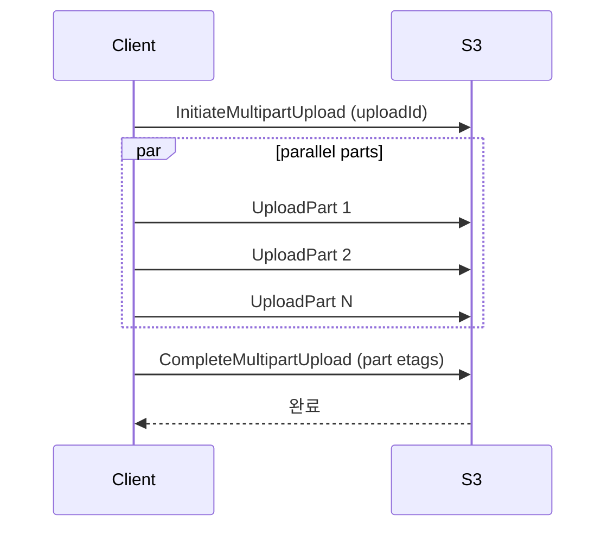
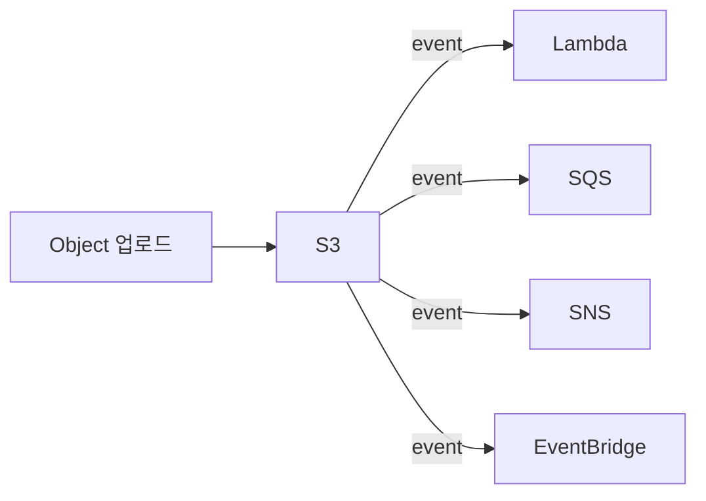
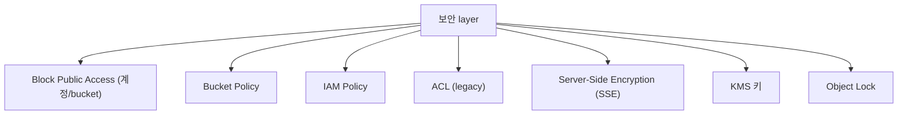

## 정의

**S3** = AWS 의 *object storage*. *bucket + key + object*. *11 9's durability*, *무한 확장*. *2026 시점 인터넷의 핵심 스토리지*.

## Storage Class

| Class | 용도 | 비용 | 검색 latency |
|---|---|---|---|
| **Standard** | 자주 접근 | $0.023/GB | ms |
| **Intelligent-Tiering** | 자동 자주/덜 자주 분류 | varies | ms |
| **Standard-IA** | 가끔 접근 | 더 cheap, *retrieval fee* | ms |
| **One Zone-IA** | 단일 AZ + 가끔 접근 | 더 cheap | ms |
| **Glacier Instant Retrieval** | archive + 즉시 접근 | 매우 cheap | ms |
| **Glacier Flexible Retrieval** | archive | 매우 cheap | 분~시간 |
| **Glacier Deep Archive** | 장기 archive | 가장 cheap | 12+ 시간 |

## Lifecycle Policy

```yaml
Rules:
  - Id: archive-old-logs
    Filter: { Prefix: logs/ }
    Transitions:
      - Days: 30
        StorageClass: STANDARD_IA
      - Days: 90
        StorageClass: GLACIER
    Expiration:
      Days: 365
```

> *비용 대폭 절감*. 사용 안 하는 데이터를 *자동 cheaper class* 로.

## Versioning

```bash
aws s3api put-bucket-versioning --bucket my --versioning-configuration Status=Enabled
```

- 덮어쓰기 / 삭제 = *옛 버전 보존*.
- 실수 복구 가능.
- 비용 *2배* (옛 버전도 저장).

## Object Lock (WORM)

```yaml
Mode: GOVERNANCE | COMPLIANCE
RetainUntilDate: 2027-06-25
```

- *Write Once Read Many*.
- 컴플라이언스 (금융 / 의료).
- COMPLIANCE: *root user 도 삭제 불가*.

## Multipart Upload



- *큰 파일* (> 100MB) 권장, *5GB 초과* 시 *필수*.
- 병렬 + 재시도 가능.

## Presigned URL

```python
url = s3.generate_presigned_url(
    'put_object',
    Params={'Bucket': 'my', 'Key': 'upload.zip'},
    ExpiresIn=3600
)
```

- 클라이언트가 *S3 에 직접 업로드/다운로드* (서버 우회).
- *임시 URL*.

## Static Website Hosting

```
Bucket Property: Static Website Hosting
  Index document: index.html
  Error document: error.html
```

+ CloudFront 추가 = *글로벌 CDN 정적 사이트*.

## Event Notifications



- 새 파일 → 처리 자동.
- *이미지 thumbnail 생성*, *비디오 transcoding*, *데이터 처리*.

## S3 Select / S3 Object Lambda

- **S3 Select**: CSV/JSON/Parquet 의 *SQL 일부 query*.
- **S3 Object Lambda**: GET 시 *Lambda 가 transform* (redact, watermark).

## 보안



### Encryption

| 종류 | 의미 |
|---|---|
| `SSE-S3` | S3 관리 key |
| `SSE-KMS` | KMS 관리 key |
| `SSE-C` | 사용자 제공 key |
| `DSSE-KMS` | 이중 암호화 |

## 흔한 함정

> [!WARNING]
> 1. **Bucket 공개 사고** = "Block Public Access" 항상 켜기. CloudFront + OAC 권장.
> 2. **Versioning 후 비용** = 옛 버전 누적. lifecycle 로 정리.
> 3. **Lifecycle 의 *retrieval fee*** = Glacier 에서 빨리 꺼내면 비용 큼.
> 4. **Multipart upload 정리 안 함** = 미완료 multipart 가 *비용 발생*. lifecycle `AbortIncompleteMultipartUpload`.

## 관련 위키

- [[aws-cloudfront-cdn]]
- [[aws-kms]]
- [[aws-lambda]] (S3 trigger)
- [[aws-eventbridge]]
