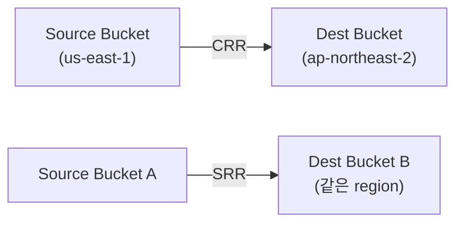
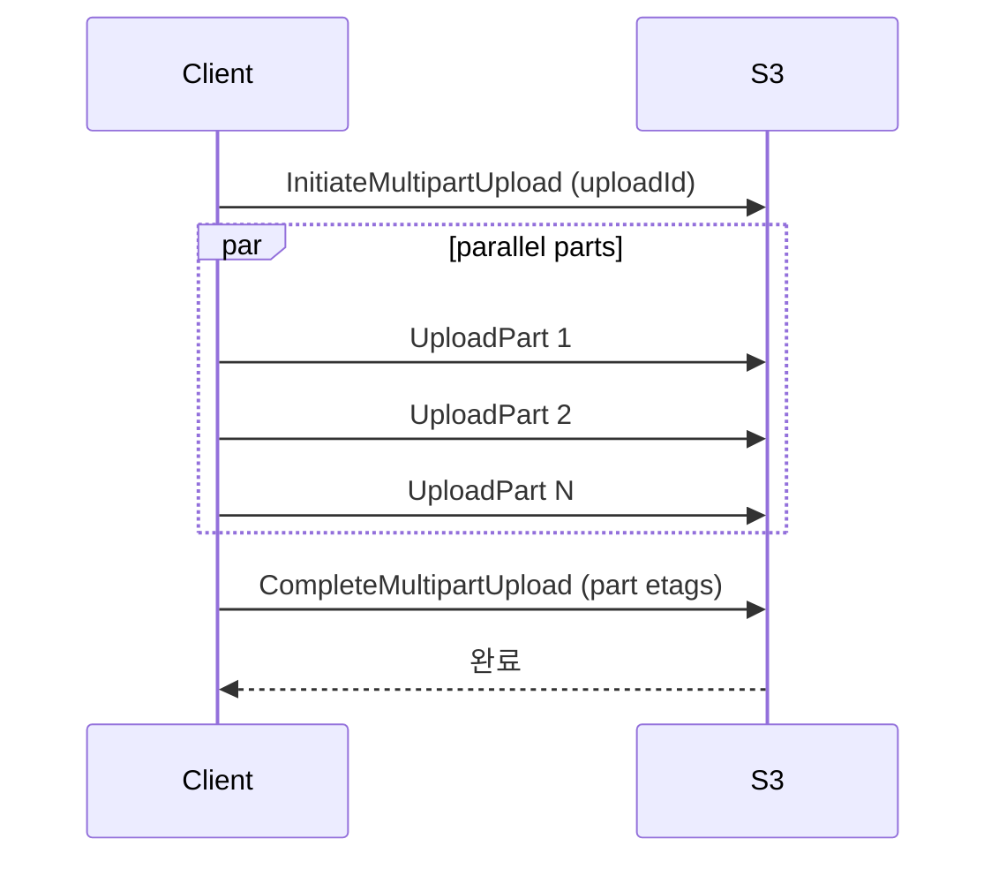
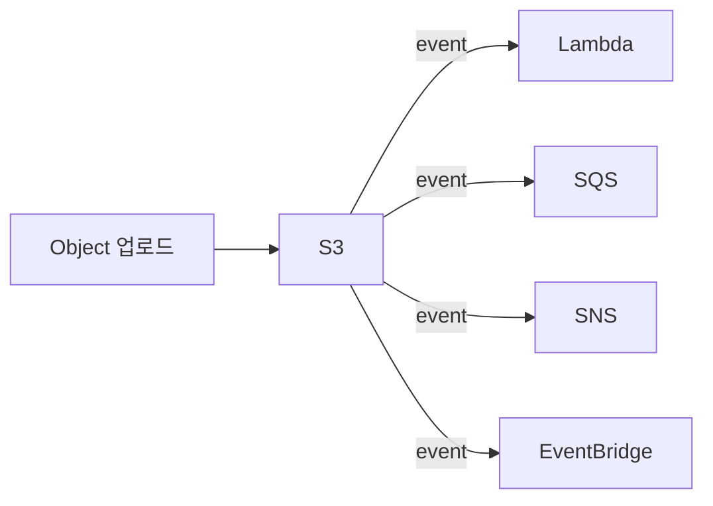
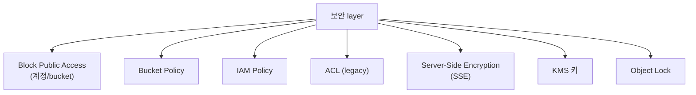

## 정의

**S3** = AWS 의 *object storage*. *bucket + key + object*. *11 9's durability* (99.999999999%), *무한 확장*. 2026 시점 인터넷의 핵심 스토리지 플랫폼.

## 사용 상황

| 상황 | S3 선택 이유 |
|---|---|
| 정적 자산 (이미지, JS, CSS) | [[aws-cloudfront-cdn]] 와 조합 |
| 로그 장기 보관 | Lifecycle 로 Glacier 자동 이동 |
| ML 학습 데이터 / 모델 | S3 → SageMaker 직접 연동 |
| 백업 / DR | Cross-Region Replication |
| 데이터 레이크 | S3 + Athena + Glue |
| 사용자 파일 업로드 | Presigned URL 로 서버 우회 |
| 컴플라이언스 아카이빙 | Object Lock WORM |

## Storage Class

| Class | 용도 | 비용 | 검색 latency |
|---|---|---|---|
| **Standard** | 자주 접근 | $0.023/GB | ms |
| **Intelligent-Tiering** | 자동 자주/덜 자주 분류 | varies | ms |
| **Standard-IA** | 가끔 접근 | 더 cheap, retrieval fee | ms |
| **One Zone-IA** | 단일 AZ + 가끔 접근 | 더 cheap | ms |
| **Glacier Instant Retrieval** | archive + 즉시 접근 | 매우 cheap | ms |
| **Glacier Flexible Retrieval** | archive | 매우 cheap | 분~시간 |
| **Glacier Deep Archive** | 장기 archive | 가장 cheap | 12+ 시간 |

*Intelligent-Tiering* 은 접근 패턴 예측 불가 시 최적. 30일 미접근 시 IA 로 자동 이동.

## Lifecycle Policy

```yaml
Rules:
  - Id: archive-old-logs
    Filter: { Prefix: logs/ }
    Transitions:
      - Days: 30
        StorageClass: STANDARD_IA
      - Days: 90
        StorageClass: GLACIER
    Expiration:
      Days: 365
    AbortIncompleteMultipartUploads:
      DaysAfterInitiation: 7
```

> *비용 대폭 절감*. 사용 안 하는 데이터를 *자동 cheaper class* 로.

`AbortIncompleteMultipartUploads` 는 반드시 설정. 미완료 multipart 가 비용 누수.

## Replication (CRR / SRR)



| 종류 | 의미 |
|---|---|
| **CRR (Cross-Region Replication)** | 다른 리전으로 복제 (DR, 지연 감소) |
| **SRR (Same-Region Replication)** | 같은 리전 내 복제 (로그 집계, 테스트) |

- Source bucket: *Versioning 활성화 필수*.
- 신규 객체만 복제 (기존 객체는 S3 Batch Operations 으로 별도 복제).
- Delete Marker: 기본 복제 안 됨 (설정 가능).
- 복제 시간 SLA: 기본 15분 이내. *S3 Replication Time Control (RTC)* = 99.99% 를 15분 이내 보장 (추가 비용).

## Versioning

```bash
aws s3api put-bucket-versioning --bucket my --versioning-configuration Status=Enabled
```

- 덮어쓰기 / 삭제 = 옛 버전 보존.
- 실수 복구 가능.
- 삭제 = Delete Marker 생성 (실제 삭제 아님).
- 비용: 모든 버전 저장. Lifecycle 로 오래된 버전 정리 필수.

## Object Lock (WORM)

```yaml
Mode: GOVERNANCE | COMPLIANCE
RetainUntilDate: "2027-06-25T00:00:00Z"
```

- *Write Once Read Many*: 보존 기간 중 삭제/수정 불가.
- `GOVERNANCE`: 특정 IAM 권한으로 삭제 가능.
- `COMPLIANCE`: *root user 도 삭제 불가*. 금융/의료 컴플라이언스.
- Legal Hold: 날짜 무관 삭제 차단.

## Multipart Upload



- *큰 파일* (100MB+) 권장, *5GB 초과* 시 *필수*.
- 병렬 업로드 + 개별 파트 재시도 가능.
- 최소 파트 크기: 5MB (마지막 파트 제외).
- 미완료 Multipart: *Lifecycle `AbortIncompleteMultipartUploads`* 로 자동 정리.

## Presigned URL

```python
import boto3

s3 = boto3.client('s3')
url = s3.generate_presigned_url(
    'put_object',
    Params={'Bucket': 'my-bucket', 'Key': 'upload.zip'},
    ExpiresIn=3600   # 1시간
)
```

- 클라이언트가 *S3 에 직접 업로드/다운로드* (서버 경유 없음).
- 임시 URL (만료 시간 설정).
- 서버 측에서 IAM 권한 위임.
- GET (다운로드), PUT (업로드) 모두 지원.

## Transfer Acceleration

```bash
# 엔드포인트: my-bucket.s3-accelerate.amazonaws.com
aws configure set default.s3.use_accelerate_endpoint true
```

- *CloudFront edge location* 을 경유해 S3 에 전송.
- 글로벌 업로드 속도 *최대 60% 향상* (지역별 편차 큼).
- 비용: 일반 전송 대비 추가 요금.
- 실제 개선 여부: *S3 Transfer Acceleration Speed Comparison Tool* 로 사전 확인.

## S3 Access Points

버킷 하나를 *여러 팀이 다른 정책으로* 접근할 때.

```bash
aws s3control create-access-point \
  --name data-science-ap \
  --account-id 123456789 \
  --bucket my-data-lake \
  --vpc-configuration VpcId=vpc-abc
```

- 각 Access Point 는 고유한 ARN + endpoint + Policy.
- *VPC-only 접근 강제* 가능.
- 버킷 Policy 가 복잡해지는 것을 Access Point Policy 로 분리.

## Static Website Hosting

```
Bucket Property: Static Website Hosting
  Index document: index.html
  Error document: 404.html
```

CloudFront + OAC 조합:
- CloudFront: 글로벌 CDN, HTTPS, 커스텀 도메인.
- OAC (Origin Access Control): CloudFront 에서만 S3 접근 허용.
- S3 직접 접근 차단 (Block Public Access 유지).

## Event Notifications



- 새 파일 → 처리 자동화.
- *이미지 thumbnail 생성*, *비디오 transcoding*, *데이터 처리*.
- [[aws-eventbridge]] 연동 시 *content-based filtering* 가능 (object key prefix 등).

## S3 Select / S3 Object Lambda

- **S3 Select**: CSV / JSON / Parquet 의 *SQL 일부 query*. 필요한 컬럼만 pull.
- **S3 Object Lambda**: GET 요청 시 *Lambda 가 transform* (redact, watermark, format conversion).

## 보안



### Encryption

| 종류 | 의미 |
|---|---|
| `SSE-S3` | S3 관리 key (AES-256) |
| `SSE-KMS` | [[aws-kms]] 관리 key, 감사 가능 |
| `SSE-C` | 사용자 제공 key |
| `DSSE-KMS` | 이중 암호화 |

2023년부터 *기본 암호화 SSE-S3 자동 적용*. 컴플라이언스 요구 시 SSE-KMS 전환.

### Object Ownership + ACL

신규 버킷은 *ACL 비활성화 + Object Ownership = BucketOwnerEnforced* 권장. Cross-account 업로드 객체도 버킷 소유자가 자동 소유.

## Inventory / Storage Lens / Analytics

| 도구 | 용도 |
|---|---|
| **S3 Inventory** | 객체 목록을 CSV/Parquet 으로 주기 출력 (대규모 버킷 감사) |
| **S3 Storage Lens** | 조직 전체 스토리지 사용량 대시보드 (비용 최적화 insight) |
| **S3 Analytics** | 접근 패턴 분석 → Standard-IA 전환 권고 |

```bash
# Storage Lens 기본 대시보드 (무료)
aws s3control get-storage-lens-dashboard \
  --config-id default-account-dashboard \
  --account-id 123456789
```

## 흔한 함정

> [!WARNING]
> 1. **Bucket 공개 사고** = "Block Public Access" 항상 켜기. CloudFront + OAC 권장.
> 2. **Versioning 후 비용** = 옛 버전 누적. Lifecycle `NoncurrentVersionExpiration` 으로 정리.
> 3. **Glacier 의 retrieval fee** = Glacier 에서 빨리 꺼내면 비용 큼. 접근 빈도 고려.
> 4. **Multipart upload 정리 안 함** = 미완료 multipart 가 비용 발생. Lifecycle `AbortIncompleteMultipartUploads`.
> 5. **CRR 에서 기존 객체 미복제** = Replication 설정 이전 객체는 S3 Batch Operations 로 별도 복제.
> 6. **S3 Event + Lambda 무한 루프** = Lambda 가 같은 버킷에 쓰면 이벤트 재발생. prefix/suffix 필터 필수.
> 7. **Presigned URL 의 만료 후 클라이언트 캐싱** = 클라이언트가 URL 를 저장해 재사용 시 403. 짧은 만료 + 재발급 로직.

## 관련 위키

- [[aws-cloudfront-cdn]]
- [[aws-kms]]
- [[aws-lambda]] (S3 trigger)
- [[aws-eventbridge]]
- [[aws-iam]] (Bucket Policy)
