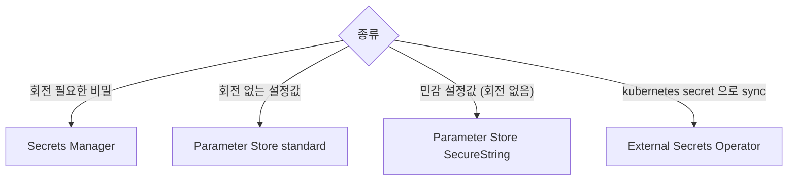
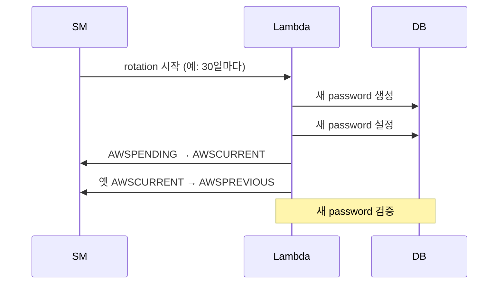

## 정의

| | Secrets Manager | Parameter Store (SSM) |
|---|---|---|
| 가격 | $0.40/secret/월 + $0.05/10k API | *대부분 무료* (standard) |
| 자동 회전 | *예* (Lambda) | 아니오 |
| 버전 관리 | 자동 | 수동 |
| 크기 | 64KB | 4KB (standard) / 8KB (advanced) |
| 사용 | DB password, API key (회전 필요) | config, feature flag |

## 어떤 걸 언제?



## Secret 사용

```python
import boto3, json
sm = boto3.client('secretsmanager')
secret = json.loads(sm.get_secret_value(SecretId='prod/db')['SecretString'])
db_password = secret['password']
```

## 자동 회전



| 단계 | label |
|---|---|
| 생성 | `AWSPENDING` |
| 활성화 | `AWSCURRENT` |
| 보존 | `AWSPREVIOUS` |
| 폐기 | (없음) |

## EKS 와의 통합

| 패턴 | 도구 |
|---|---|
| Sync to K8s Secret | External Secrets Operator |
| Mount as volume | Secrets Store CSI Driver |
| Direct fetch in pod | aws-sdk + IRSA |

## Parameter Store: 계층

```bash
/prod/db/host
/prod/db/port
/prod/api/key
/dev/db/host
```

```bash
aws ssm get-parameters-by-path --path /prod/db --recursive
```

## 흔한 함정

> [!WARNING]
> 1. **Hardcoded fallback** = 코드에 *secret 평문*. 절대 금지.
> 2. **Cross-region replication 없음** = region 장애 시 secret 미접근. *Multi-region 권장*.
> 3. **Rotation 실패 모니터링 부재** = 옛 password 만료 → 서비스 다운.
> 4. **Parameter Store 의 *4KB 한도*** = 큰 비밀 (인증서) 은 *advanced* 또는 Secrets Manager.

## 관련 위키

- [[aws-iam]]
- [[aws-kms]]
- [[k8s-configmap-secret]]
