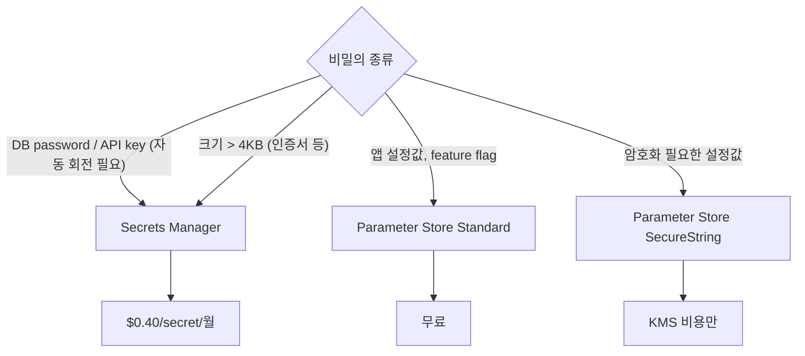
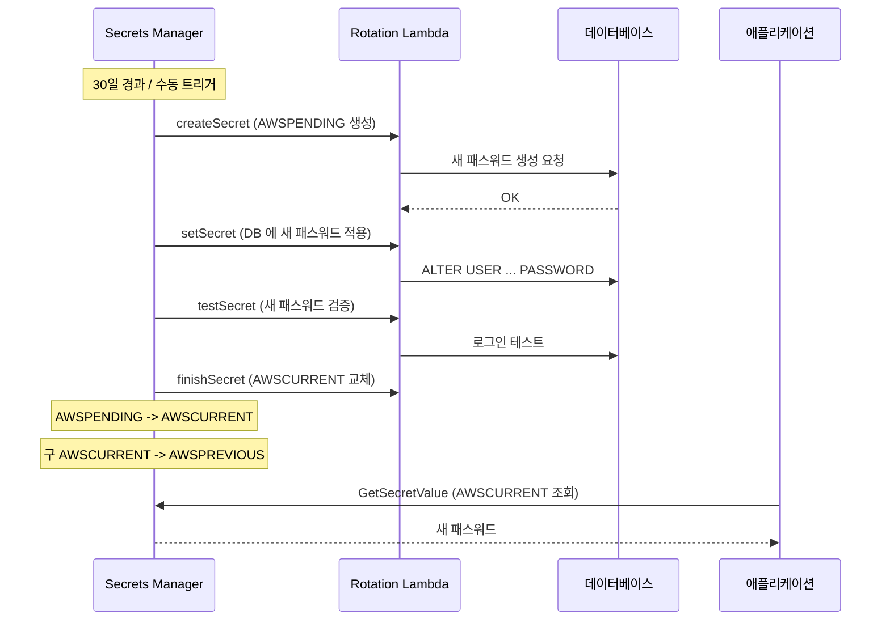

## 정의

**AWS Secrets Manager** = *회전이 필요한 비밀* (DB 패스워드, API key) 을 안전하게 저장/관리하는 서비스. Lambda 기반 자동 회전과 [[aws-kms]] 암호화 내장.

**Parameter Store (SSM)** = *설정값 + 비밀값*의 계층형 저장소. 대부분 무료, 간단한 구성 관리에 적합.

## Secrets Manager vs Parameter Store

| 항목 | Secrets Manager | Parameter Store |
|:---|:---|:---|
| 가격 | $0.40/secret/월 + $0.05/10k API | Standard 무료, Advanced $0.05/1만 |
| 자동 회전 | *내장 (Lambda)* | 아니오 |
| 버전 관리 | 자동 (AWSPENDING / AWSCURRENT / AWSPREVIOUS) | 수동 |
| 크기 제한 | 64 KB | 4 KB (standard) / 8 KB (advanced) |
| [[aws-kms]] 암호화 | 기본 적용 | SecureString 타입만 |
| 타입 | JSON / 문자열 | String / StringList / SecureString |
| 교차 계정 | 가능 | 제한적 |
| RDS 통합 | *내장 rotation* | 수동 |

## 어떤 걸 언제 쓸까?



## Secrets Manager: 기본 사용

### Secret 저장

```bash
# JSON 형식 (DB 자격증명)
aws secretsmanager create-secret \
  --name "prod/db/credentials" \
  --description "RDS Aurora production" \
  --secret-string '{"username":"admin","password":"s3cr3t"}'

# 회전 주기 설정 (30일)
aws secretsmanager rotate-secret \
  --secret-id "prod/db/credentials" \
  --rotation-rules AutomaticallyAfterDays=30
```

### Secret 조회

```python
import boto3, json

sm = boto3.client('secretsmanager', region_name='us-east-1')

def get_secret(secret_name: str) -> dict:
    response = sm.get_secret_value(SecretId=secret_name)
    return json.loads(response['SecretString'])

creds = get_secret('prod/db/credentials')
db_password = creds['password']
```

> [!IMPORTANT]
> 매 요청마다 API 호출 금지. 애플리케이션 시작 시 캐싱 후 TTL 기반 갱신 권장.

### Secret 캐싱 패턴

```python
from aws_secretsmanager_caching import SecretCache

cache = SecretCache()   # 기본 TTL 3600초

def get_cached_secret(name: str) -> str:
    return cache.get_secret_string(name)
```

`aws-secretsmanager-caching` 라이브러리가 공식 지원. Lambda 에서 전역 캐시로 콜드 스타트 이후 재사용.

## 자동 회전 흐름



### 버전 레이블

| 레이블 | 의미 |
|:---|:---|
| `AWSPENDING` | 회전 준비 중인 새 값 |
| `AWSCURRENT` | 현재 활성 값 |
| `AWSPREVIOUS` | 직전 값 (롤백 보험) |

## RDS 자동 회전 설정

```bash
# RDS MySQL 자동 회전 활성화
aws secretsmanager rotate-secret \
  --secret-id "prod/rds/mysql" \
  --rotation-lambda-arn "arn:aws:lambda:us-east-1:123:function:SecretsManagerRDSMySQLRotationSingleUser" \
  --rotation-rules '{"AutomaticallyAfterDays": 30}'
```

AWS 가 지원하는 내장 rotation Lambda:
- `SecretsManagerRDSMySQLRotationSingleUser`
- `SecretsManagerRDSPostgreSQLRotationSingleUser`
- `SecretsManagerRDSAuroraRotation`
- `SecretsManagerRedshiftRotation`

## IAM 접근 제어

```json
{
  "Version": "2012-10-17",
  "Statement": [
    {
      "Sid": "ReadSecretOnly",
      "Effect": "Allow",
      "Action": [
        "secretsmanager:GetSecretValue",
        "secretsmanager:DescribeSecret"
      ],
      "Resource": "arn:aws:secretsmanager:us-east-1:123:secret:prod/*"
    }
  ]
}
```

> [!CAUTION]
> `secretsmanager:*` 권한 금지. 최소 권한으로 `GetSecretValue` 만 부여. secret ARN 패턴으로 범위 제한.

## Parameter Store: 계층 구조

```bash
# 계층형 경로로 환경별 설정 관리
/prod/app/db/host
/prod/app/db/port
/prod/app/api/key      # SecureString
/staging/app/db/host
/dev/app/db/host

# 경로 아래 모든 파라미터 조회
aws ssm get-parameters-by-path \
  --path /prod/app \
  --recursive \
  --with-decryption    # SecureString 복호화
```

### Parameter 타입

```bash
# String (평문)
aws ssm put-parameter \
  --name "/prod/app/db/host" \
  --value "db.prod.internal" \
  --type String

# SecureString (KMS 암호화)
aws ssm put-parameter \
  --name "/prod/app/api/key" \
  --value "sk-xxxx" \
  --type SecureString \
  --key-id "alias/prod-params"

# StringList (쉼표 구분)
aws ssm put-parameter \
  --name "/prod/app/allowed-ips" \
  --value "10.0.0.1,10.0.0.2" \
  --type StringList
```

## EKS 통합 패턴

| 패턴 | 도구 | 특징 |
|:---|:---|:---|
| K8s Secret 으로 sync | External Secrets Operator | GitOps 친화 |
| Pod 에 파일로 마운트 | Secrets Store CSI Driver | 파일 마운트 |
| 코드에서 직접 조회 | AWS SDK + IRSA | 단순, 캐싱 주의 |

```yaml
# External Secrets Operator 예시
apiVersion: external-secrets.io/v1beta1
kind: ExternalSecret
metadata:
  name: db-credentials
spec:
  refreshInterval: 1h
  secretStoreRef:
    name: aws-secrets-manager
    kind: SecretStore
  target:
    name: db-credentials
  data:
    - secretKey: password
      remoteRef:
        key: prod/db/credentials
        property: password
```

## Cross-region 복제

```bash
# Secret 을 다른 리전에 복제
aws secretsmanager replicate-secret-to-regions \
  --secret-id "prod/db/credentials" \
  --add-replica-regions '[{"Region":"eu-west-1"}]'
```

리전 장애 시에도 비밀 접근 유지. 복제된 시크릿은 읽기 전용 (쓰기는 primary 에만).

## 비용 최적화

| 방법 | 절감 효과 |
|:---|:---|
| Parameter Store Standard 사용 | 비밀이 아닌 설정값에 무료 |
| Secret 캐싱 라이브러리 | API 호출 수 대폭 감소 |
| 공유 Secret 사용 | 여러 환경 값 JSON 으로 통합 |
| TTL 기반 갱신 | 불필요한 빈번 조회 방지 |

## 대안 비교

| 솔루션 | 특성 | 적합한 경우 |
|:---|:---|:---|
| **Secrets Manager** | 자동 회전, 관리형 | AWS 네이티브, 멀티 서비스 |
| **Parameter Store** | 저렴, 계층형 | 설정값, feature flag |
| **HashiCorp Vault** | 멀티 클라우드, 세밀한 정책 | 멀티 클라우드, 복잡한 정책 |
| **환경 변수 (직접)** | 단순 | 개발 환경 한정 |

## 함정

> [!WARNING]
> **Hardcoded fallback 금지**: 코드에 평문 비밀값 절대 금지. 코드베이스 검색으로 `password =` 같은 패턴 CI 차단.

> [!WARNING]
> **회전 실패 모니터링 부재**: rotation Lambda 실패 시 AWSPENDING 상태 고착, 서비스 다운 위험. CloudWatch Alarm + SNS 알림 필수.

```bash
# 회전 실패 CloudWatch Alarm
aws cloudwatch put-metric-alarm \
  --alarm-name "secrets-rotation-failure" \
  --metric-name "RotationFailed" \
  --namespace "AWS/SecretsManager" \
  --statistic Sum \
  --period 300 \
  --evaluation-periods 1 \
  --threshold 1 \
  --comparison-operator GreaterThanOrEqualToThreshold \
  --alarm-actions "arn:aws:sns:us-east-1:123:alerts"
```

> [!CAUTION]
> **Cross-region 없이 단일 리전**: Secret 은 리전별 서비스. 리전 장애 = 비밀 접근 불가. 크리티컬 서비스는 multi-region 복제.

> [!WARNING]
> **Parameter Store 4KB 한도**: 인증서, 큰 JSON 설정은 Advanced (8KB) 또는 Secrets Manager (64KB) 사용.

> [!CAUTION]
> **매 요청마다 GetSecretValue 호출**: Lambda 가 요청마다 API 호출 시 throttling + 비용 폭증. 전역 캐시 또는 공식 캐싱 라이브러리 필수.

> [!WARNING]
> **Secret 삭제 즉시 불가**: `DeleteSecret` 기본 복구 기간 30일. 즉시 삭제는 `--force-delete-without-recovery` 옵션 필요.

## 관련 위키

- [[aws-iam]] - 접근 제어
- [[aws-kms]] - 암호화 키 관리
- [[aws-rds]] - DB 패스워드 회전 대상
- [[aws-lambda]] - Rotation Lambda
- [[aws-cloudwatch]] - 회전 실패 모니터링
- [[k8s-configmap-secret]] - K8s 시크릿 연동
