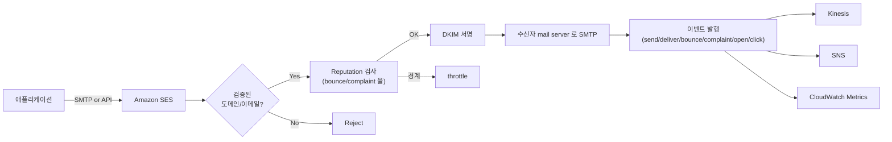
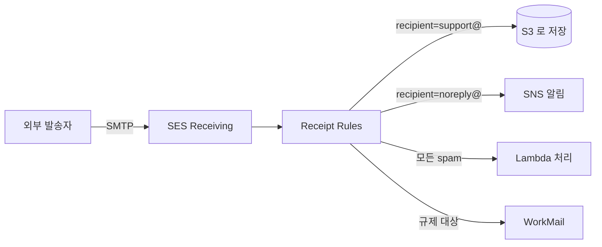

## 정의

**Amazon SES** (Simple Email Service) 는 *AWS 관리형 이메일 발송 / 수신 서비스*. 대량 마케팅 메일, 트랜잭션 메일 (주문 확인, 비밀번호 재설정), 알림 메일을 SMTP 또는 API 로 발송하고, 원한다면 MX 레코드를 SES 로 향하게 해 수신도 가능.

**핵심 정체성**: *직접 SMTP 서버 (Postfix, Sendmail) 를 운영하지 않고 이메일 인프라를 AWS 에 위임*.

## 왜 SES 인가

자체 SMTP 서버의 문제:

- **IP reputation 관리** = 대형 receiver (Gmail, Outlook) 가 새 IP 를 신뢰하기까지 warm-up 필요
- **Blocklist 관리** = Spamhaus 등재 시 즉시 배달 불가
- **SPF / DKIM / DMARC 설정 + 유지**
- **bounce / complaint 처리** = 미처리 시 reputation 급락
- **재시도 / queue 관리**
- **TLS 인증서 갱신**

SES 의 답: 위 전부를 AWS 가 대신. 앱은 SendEmail API 만 호출.

## 아키텍처 (발송)



## 발송 인터페이스

두 가지 API.

### 1. SMTP

표준 SMTP 프로토콜. 기존 mail 라이브러리 (`nodemailer`, `django.core.mail`, Rails ActionMailer 등) 그대로.

```
Endpoint: email-smtp.us-east-1.amazonaws.com
Port: 587 (STARTTLS) 또는 2587
Username/Password: SES SMTP credentials (IAM 사용자에서 생성)
```

**적합**: 이미 SMTP 클라이언트가 있는 앱, 서드파티 도구 (WordPress 등).

### 2. HTTPS API

- **`SendEmail`**: 간단한 이메일 (subject + body + to)
- **`SendRawEmail`**: 완전 MIME 제어 (첨부, HTML, multipart)
- **`SendBulkTemplatedEmail`**: 템플릿 기반 대량 발송 (수신자당 개인화)

```python
import boto3
ses = boto3.client('sesv2')

ses.send_email(
    FromEmailAddress='no-reply@example.com',
    Destination={'ToAddresses': ['user@example.com']},
    Content={
        'Simple': {
            'Subject': {'Data': '주문 확인'},
            'Body': {'Html': {'Data': '<h1>주문이 접수되었습니다</h1>'}}
        }
    },
    ConfigurationSetName='transactional'
)
```

**적합**: 서버리스 ([[aws-lambda|Lambda]]), IAM 기반 인증, 세밀한 제어.

## Identity 검증

SES 는 아무 도메인이나 발송 불가. 소유권 검증된 identity 만 사용.

### Email identity (단일 주소)

`no-reply@example.com` 하나만 검증. 빠름 (분 단위).

```
1. SES 에서 email identity 등록
2. AWS 가 검증 이메일 발송
3. 링크 클릭 → 검증 완료 (24시간 안)
```

**적합**: 프로토타입, 소규모.

### Domain identity (도메인 전체)

`example.com` 전체 도메인 검증. 이후 도메인의 어떤 주소든 발송 가능.

```
1. SES 에서 domain identity 등록
2. AWS 가 DKIM 토큰 3 개 제공
3. Route 53 (또는 DNS 공급자) 에 CNAME 3 개 등록
4. AWS 가 자동 확인 → 검증 완료 (수 분 - 72시간)
```

**적합**: 프로덕션. `noreply@`, `orders@`, `support@` 등 여러 주소 사용.

### DKIM 옵션

- **Easy DKIM**: AWS 가 키 쌍 생성, 고객은 CNAME 만
- **BYODKIM (Bring Your Own DKIM)**: 고객이 키 쌍 관리 (규제 목적)

## SPF / DKIM / DMARC

이메일 도메인 인증 3대 표준. **셋 다 설정 권장**.

| 표준 | 역할 | 설정 방법 |
|:---|:---|:---|
| **SPF** (Sender Policy Framework) | 어떤 IP 가 이 도메인 대신 발송 가능한지 선언 | DNS TXT: `v=spf1 include:amazonses.com ~all` |
| **DKIM** (DomainKeys Identified Mail) | 발송자 도메인의 개인키로 서명, 수신자가 공개키로 검증 | CNAME 3 개 (SES 가 제공) |
| **DMARC** | SPF/DKIM 실패 시 정책 (거부/격리/보고) | DNS TXT: `v=DMARC1; p=quarantine; rua=mailto:dmarc@example.com` |

**미설정 결과**: Gmail / Outlook 이 스팸 폴더로 보냄. 최악의 경우 완전 차단.

## Sandbox 모드 (신규 계정)

새 SES 계정은 **sandbox 모드** 로 시작. 제한:

- **수신자**: **검증된** 이메일 / 도메인 만 (Mailbox Simulator 예외)
- **속도**: **200 emails / 24시간**, **1 email / 초**
- **수신 (receiving)**: 비활성
- **Suppression list 일괄 조작**: 비활성

**프로덕션 접근 요청**:
- AWS 콘솔 → SES → Account dashboard → Request production access
- 발송 유즈케이스, 웹사이트 URL, mail type (transactional / marketing), 대략 볼륨 명시
- AWS Support 검토 (통상 24시간 안)

## Reputation 관리 (매우 중요)

SES 는 **계정 sender reputation** 을 관리. 나쁘면 발송 정지.

### 지표

- **Bounce rate**: 반송률 = (반송된 이메일 / 발송) × 100
- **Complaint rate**: 스팸 신고율 = (신고 / 발송) × 100

### 임계값 (대략)

| 상태 | Bounce | Complaint | 결과 |
|:---|:---|:---|:---|
| Healthy | < 2% | < 0.05% | 정상 |
| Under review | > 5% | > 0.1% | AWS 가 관찰 |
| Paused | > 10% | > 0.5% | **계정 발송 정지** |

정지된 계정은 개선 계획 제출 후 복구 요청 필요. **매우 신중**.

### 대응

- **Suppression list**: 반송/신고 이메일을 자동 억제 (재발송 안 함)
- **List cleaning**: 발송 전 알려진 hard bounce 주소 제거
- **Unsubscribe 링크**: 마케팅 메일 필수
- **DKIM/SPF/DMARC** 완비 (수신자가 legitimate 로 인식)
- **Warm-up**: 새 IP / 계정은 소량부터 시작해 점진 증가

## Suppression List

바운스 / 신고된 주소는 자동으로 **suppression list** 에 등록되어 이후 발송 시도 자동 차단.

두 레벨:
- **Account-level**: SES 계정에서 관리 (사용자가 조회/삭제 가능)
- **Global (AWS-wide)**: AWS 전체 suppression list (모든 계정 공유)

**중요**: hard bounce 는 재시도 안 되지만, 사용자가 이메일 주소 오타를 고치고 다시 등록하면 리스트에서 제거해야 함.

## Configuration Set

*Identity 에 적용되는 규칙 그룹*.

**포함**:
- **Event destinations**: 이벤트를 어디로 발행 (Kinesis / SNS / CloudWatch / Firehose)
  - Send, Delivery, Open, Click, Bounce, Complaint, Reject
- **IP pool**: 전용 IP 를 여러 목적별 pool 로 (트랜잭션 vs 마케팅)
- **Reputation tracking**: 지표 추적
- **Sending options**: 발송 활성/비활성

**활용**: 마케팅용 config set 은 open/click 추적, 트랜잭션용은 bounce/complaint 만 추적. 각 config set 이 다른 IP pool 사용.

## Templates & Personalization

```json
Template: "welcome-v2"
Subject: "환영합니다, {{name}}님"
Html: "<p>안녕하세요 {{name}}님, {{coupon}} 쿠폰을 드립니다.</p>"

SendBulkTemplatedEmail:
  Template: welcome-v2
  Destinations:
    - ToAddresses: [alice@example.com]
      ReplacementTemplateData: {"name": "Alice", "coupon": "SAVE10"}
    - ToAddresses: [bob@example.com]
      ReplacementTemplateData: {"name": "Bob", "coupon": "SAVE20"}
```

수신자당 개인화 + 대량 발송을 한 번의 API 호출로.

## 수신 (Receiving)

MX 레코드를 SES 로 향하게 하면 SES 가 도메인 이메일을 수신.



**Receipt Rules**:
- 수신자 별 조건 (`support@example.com`, `*@example.com` 등)
- 액션: S3 저장, SNS 알림, Lambda 호출, Bounce, Stop rule set

**용도**:
- 고객 지원 티켓 시스템 (`support@` → Lambda → Zendesk API)
- 알림 처리 (`noreply-reply@` → 자동 답장)
- 규제 감사 (`compliance@` → S3 아카이브)

**주의**: sandbox 계정은 수신 X. 프로덕션 접근 필요.

## Virtual Deliverability Manager (VDM)

**2023+** 추가 기능. Deliverability 분석 대시보드.

- 각 receiver (Gmail, Yahoo, Outlook) 별 배달률
- Placement (inbox vs spam)
- Reputation trend
- 문제 감지 시 권장 조치

## Mail Manager (2024+)

**Inbound 이메일 처리 파이프라인**. 수신된 메일을 여러 단계 (스팸 필터, 정책, 라우팅) 로 처리.

- 이메일 게이트웨이 대체 (Proofpoint, Barracuda 등)
- Rule 기반 라우팅 / 격리 / 아카이브

## 요금

- **발송**: $0.10 / 1000 emails (EC2 에서 발송 시 첫 62,000 emails 무료)
- **수신**: $0.10 / 1000 emails
- **첨부**: $0.12 / GB
- **전용 IP**: $24.95 / IP / 월

**비교**: Mailgun / SendGrid 등 SaaS 는 $10 - $50 / 월 (10K emails). SES 는 $1 정도로 훨씬 저렴.

## 실전 시나리오

### 1. 트랜잭션 이메일 (주문 확인)

```
[웹앱 checkout] → Lambda → SES SendEmail (config-set=transactional)
                                          → S3 로 이벤트 저장 (via Kinesis Firehose)
```

- Transactional config set 은 open/click 추적 안 함 (개인정보 최소화)
- Bounce/complaint 만 별도 처리

### 2. 마케팅 뉴스레터

```
[관리자] → SendBulkTemplatedEmail (config-set=marketing)
    → Dedicated IP pool
    → Kinesis Firehose → Redshift → 분석
```

- 마케팅 config set 은 open/click 추적
- Dedicated IP 로 reputation 격리
- Suppression list 로 unsubscribe 자동

### 3. 고객 지원 티켓

```
[사용자 이메일] → MX → SES Receiving → Lambda (본문 파싱) → Zendesk API
                                                         → S3 아카이브
```

`support@example.com` 을 SES 수신으로 → 자동 티켓 생성.

## 함정

> [!WARNING]
> **Sandbox 모드에서 프로덕션 배포** = 검증 안 된 주소에 발송 실패. 배포 전 반드시 프로덕션 접근 승인.

> [!CAUTION]
> **Bounce rate > 5%** = AWS 관찰 시작. > 10% = 발송 정지. 리스트 정리 필수.

> [!WARNING]
> **DKIM / SPF / DMARC 미설정** = Gmail 스팸 폴더 or 완전 차단. 도메인 검증 후 3 종 세트 반드시 설정.

> [!IMPORTANT]
> **Marketing / Transactional 을 같은 IP** = 마케팅 스팸이 트랜잭션 배달률까지 망침. Config set 으로 IP pool 분리.

> [!CAUTION]
> **Suppression list 무한 확대**. 사용자가 오타 고쳐서 재등록하면 리스트에서 제거해야 배달됨. 관리 프로세스 필요.

> [!WARNING]
> **첨부 크기 상한** (SES 는 raw email 40 MB 근처). 큰 파일은 [[aws-s3|S3]] Presigned URL 로 링크만.

> [!IMPORTANT]
> **수신 (receiving) 은 sandbox 미지원**. 프로덕션 접근 요청 필요.

> [!CAUTION]
> **SMTP credentials ≠ IAM access key**. IAM 사용자에서 SMTP credentials 를 별도 생성해야 함 (같아 보여도 다름).

## 관련 위키

- [[aws-lambda|AWS Lambda]] - 서버리스 발송 로직
- [[aws-s3|AWS S3]] - 수신 이메일 저장
- [[aws-sns|AWS SNS]] - 이벤트 알림
- [[aws-kinesis-data-streams|Kinesis Data Streams]] - 이벤트 스트리밍
- [[aws-iam|IAM]] - SMTP credentials 관리
- [[aws-kms|KMS]] - 이메일 암호화
