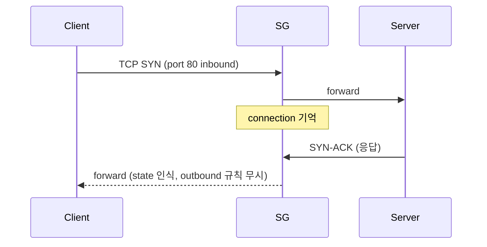

## 정의

| | SG (Security Group) | NACL (Network ACL) |
|---|---|---|
| 상태 | *Stateful* | *Stateless* |
| 적용 | ENI / instance | subnet |
| 규칙 | *allow 만* | allow + deny |
| 평가 | *모든 규칙* | *번호 순* |
| 기본 | inbound deny + outbound allow all | allow all |

## Stateful vs Stateless 의 의미



- **Stateful (SG)**: 들어온 연결 = *나가는 응답 자동 허용*.
- **Stateless (NACL)**: 모든 패킷 *양방향 규칙 필요*. ephemeral port (1024-65535) 까지.

## SG 예시

```yaml
SecurityGroup:
  Description: web servers
  IngressRules:
    - Protocol: tcp
      Port: 443
      CidrIp: 0.0.0.0/0
    - Protocol: tcp
      Port: 22
      CidrIp: 10.0.0.0/16    # 내부 SSH
  EgressRules:
    - Protocol: -1            # 모든 outbound (기본)
      CidrIp: 0.0.0.0/0
```

## SG referencing SG (강력!)

```yaml
IngressRules:
  - Protocol: tcp
    Port: 5432
    SourceSecurityGroupId: sg-web   # web SG 가진 instance 만 허용
```

> *IP 가 아니라 다른 SG 자체*. dynamic 환경에서 *IP 추적 없이* 권한 제어.

## NACL 예시

```yaml
Rules:
  - RuleNumber: 100
    Action: allow
    Protocol: 6   # TCP
    PortRange: { From: 443, To: 443 }
    CidrBlock: 0.0.0.0/0
  - RuleNumber: 200
    Action: allow
    Protocol: 6
    PortRange: { From: 1024, To: 65535 }   # ephemeral
    CidrBlock: 0.0.0.0/0
  - RuleNumber: 32767
    Action: deny
    Protocol: -1
```

## 평가 순서

```mermaid
flowchart TD
    Packet[Packet 도착]
    Packet --> SG_In[SG inbound 규칙 평가]
    SG_In --> NACL_In[NACL inbound 평가 (번호 순)]
    NACL_In --> Routing[VPC routing]
    Routing --> NACL_Out[NACL outbound]
    NACL_Out --> SG_Out[SG outbound]
```

## Default Deny vs Allow

| | SG | NACL |
|---|---|---|
| 기본 inbound | *deny all* | allow all |
| 기본 outbound | allow all | allow all |
| 명시 deny | *불가* | *가능* |

> SG 는 *허용만 추가*. NACL 은 *deny 도 가능* → *특정 IP 차단* 같은 용도.

## 흔한 함정

> [!WARNING]
> 1. **NACL 의 ephemeral port 누락** = 응답이 차단. SG 처럼 stateful 이 아님.
> 2. **SG 의 outbound 닫음** = NAT 응답 차단. 일반 적으로 outbound 는 *기본 allow*.
> 3. **SG 변경 즉시 반영** = 새 연결만. 기존 연결은 *남아있을 수* 있음.
> 4. **너무 넓은 0.0.0.0/0** = SSH 22 public = 즉시 공격. Session Manager 사용.

## 관련 위키

- [[aws-vpc]]
- [[aws-ec2]]
- [[k8s-network-policy]]
