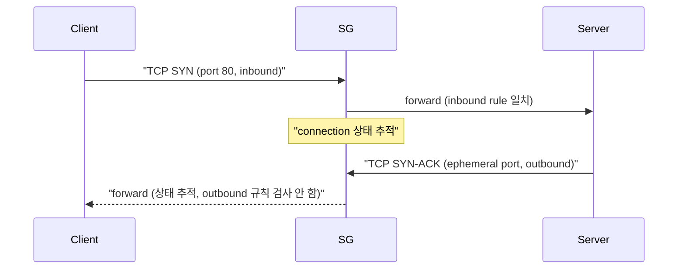
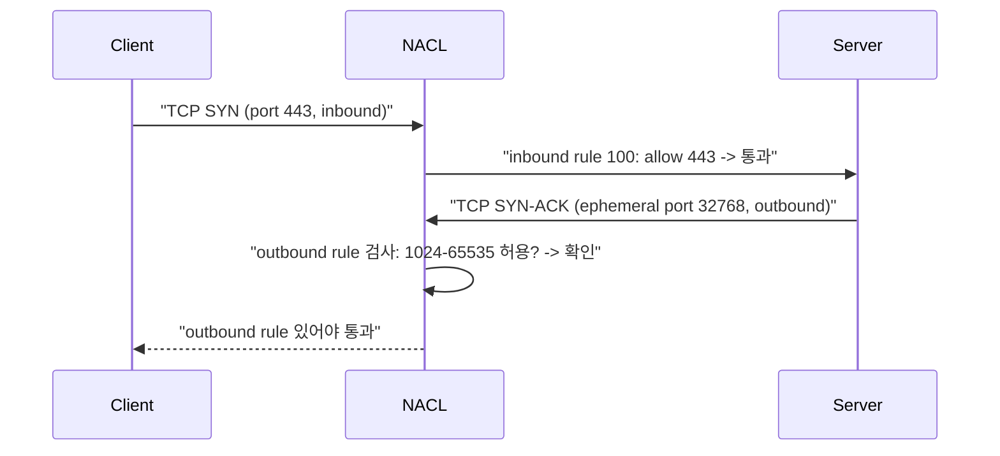
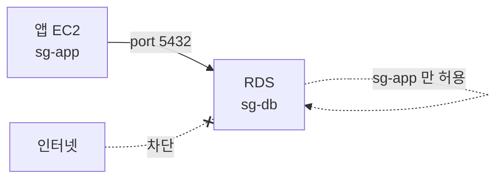
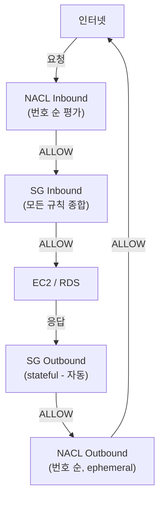

## 정의

**AWS VPC** 에는 두 계층의 네트워크 방화벽이 존재.

| 항목 | SG (Security Group) | NACL (Network ACL) |
|:---|:---|:---|
| 상태 | *Stateful* | *Stateless* |
| 적용 레벨 | ENI / 인스턴스 | Subnet |
| 규칙 종류 | *Allow 만* | Allow + Deny |
| 규칙 평가 | *모든 규칙 종합* | *번호 순 (첫 매칭)* |
| 기본 Inbound | deny all | allow all |
| 기본 Outbound | allow all | allow all |
| 반환 트래픽 | *자동 허용* | *명시적 설정 필요* |

## Stateful vs Stateless 심화

### Stateful: Security Group



SG 는 연결 상태를 추적. Inbound 를 허용하면 그 연결의 응답은 *자동으로* 허용. Outbound 규칙을 닫아도 기존 연결 응답은 통과.

### Stateless: NACL



NACL 은 **각 패킷을 독립적으로 검사**. 응답 트래픽도 별도 outbound rule 필요. 특히 *ephemeral port* 처리가 핵심.

## Ephemeral Port 이해

클라이언트가 서버에 요청할 때 임시 포트를 사용:

- **Linux**: 32768-60999
- **Windows**: 49152-65535
- **AWS 권장**: 1024-65535

```yaml
# NACL Outbound rule (올바른 설정)
Rules:
  - RuleNumber: 100
    Direction: outbound
    Action: allow
    Protocol: tcp
    PortRange: { From: 1024, To: 65535 }   # ephemeral ports
    CidrBlock: 0.0.0.0/0

# 이것만 있으면 Inbound 요청의 응답도 통과
```

> [!WARNING]
> **NACL 에서 ephemeral port 누락** = 응답이 차단. NACL outbound 에 반드시 1024-65535 포트 범위 허용 규칙 추가.

## Security Group 규칙

### 기본 설정 패턴

```yaml
# 웹 서버 Security Group
WebServerSG:
  Inbound:
    - Protocol: tcp
      Port: 443
      CidrIp: 0.0.0.0/0         # 인터넷에서 HTTPS
    - Protocol: tcp
      Port: 80
      CidrIp: 0.0.0.0/0         # 인터넷에서 HTTP (리다이렉트용)
  Outbound:
    - Protocol: -1               # 모든 아웃바운드 (기본)
      CidrIp: 0.0.0.0/0
```

```yaml
# DB 서버 Security Group
DatabaseSG:
  Inbound:
    - Protocol: tcp
      Port: 5432
      SourceSecurityGroupId: sg-webserver   # 웹 SG 에서만 PostgreSQL
  Outbound:
    - Protocol: -1
      CidrIp: 0.0.0.0/0
```

### SG Referencing SG (핵심 기능)

IP 대신 다른 SG 를 source/destination 으로 지정. Dynamic IP 환경에서 강력.

```yaml
DatabaseSG:
  Inbound:
    - Protocol: tcp
      Port: 5432
      SourceSecurityGroupId: sg-app         # app SG 가진 ENI 만 허용
```



Auto Scaling 으로 앱 인스턴스 IP 가 변해도 `sg-app` 이 붙어있으면 자동 허용. *IP 추적 불필요*.

## NACL 규칙 작성

### 번호 순 평가

```yaml
NACL Inbound Rules:
  RuleNumber: 100
    Action: ALLOW
    Protocol: tcp
    PortRange: 443
    CidrBlock: 0.0.0.0/0

  RuleNumber: 200
    Action: ALLOW
    Protocol: tcp
    PortRange: 1024-65535    # ephemeral ports (응답)
    CidrBlock: 0.0.0.0/0

  RuleNumber: 300
    Action: DENY
    CidrBlock: 1.2.3.4/32   # 악의적 IP 차단

  RuleNumber: 32767
    Action: DENY
    Protocol: -1             # 기본 모두 차단
    CidrBlock: 0.0.0.0/0
```

> [!IMPORTANT]
> 번호가 낮을수록 먼저 평가. 첫 번째 일치 규칙으로 결정. 100번에 ALLOW, 200번에 같은 IP 의 DENY 가 있으면 100번 ALLOW 가 우선.

### 특정 IP 차단 (NACL 만 가능)

```yaml
NACL Rules:
  RuleNumber: 50
    Action: DENY
    CidrBlock: 1.2.3.0/24   # 악성 IP 범위 차단
  RuleNumber: 100
    Action: ALLOW
    CidrBlock: 0.0.0.0/0    # 나머지 허용
```

SG 는 Allow 만 지원하므로 특정 IP 차단에는 NACL 사용.

## 패킷 흐름: 전체 평가 순서



**패킷이 통과하려면 NACL + SG 모두 통과해야 함.**

## 레이어드 보안 설계

```
[인터넷]
    |
[NACL - subnet 경계]
 - 악성 IP 차단 (Deny)
 - 허용 포트 제한
    |
[Security Group - 인스턴스 경계]
 - 세밀한 포트 제어
 - SG-to-SG 참조
    |
[EC2/RDS/Lambda]
```

**실전 사용 패턴**:
- **NACL**: subnet 레벨 coarse-grained 제어, 악성 IP 차단, 간단한 화이트리스트
- **SG**: 인스턴스 레벨 fine-grained 제어, SG 참조, 대부분의 방화벽 규칙

## 변경 즉시 반영

**SG 변경**: *즉시 반영*. 새로운 연결에 바로 적용. 기존 연결은 stateful 로 유지.

**NACL 변경**: *즉시 반영*. 단, 기존 연결의 다음 패킷부터.

```bash
# SG 인바운드 규칙 추가
aws ec2 authorize-security-group-ingress \
  --group-id sg-12345 \
  --protocol tcp \
  --port 443 \
  --cidr 0.0.0.0/0

# NACL 규칙 추가
aws ec2 create-network-acl-entry \
  --network-acl-id acl-12345 \
  --rule-number 100 \
  --protocol 6 \
  --rule-action allow \
  --ingress \
  --port-range From=443,To=443 \
  --cidr-block 0.0.0.0/0
```

## Session Manager vs SSH: SG 설계

> [!IMPORTANT]
> SSH 포트 22 를 인터넷에 오픈하지 말 것. **AWS Systems Manager Session Manager** 사용 시 SSH 포트 전혀 불필요.

```yaml
# 잘못된 설계 (SSH 공개)
IngressRules:
  - Port: 22, CidrIp: 0.0.0.0/0   # 즉시 공격 대상

# 올바른 설계 (Session Manager)
IngressRules: []                    # 인바운드 없음
EgressRules:
  - Port: 443, CidrIp: 0.0.0.0/0  # SSM endpoint 접근용
```

## 비용

SG 와 NACL 모두 **추가 비용 없음**. VPC 의 기본 포함 기능.

## 함정

> [!WARNING]
> **NACL ephemeral port 누락**: Stateless NACL 에서 응답 포트 (1024-65535) outbound 허용 없으면 응답 차단. SG 는 자동이지만 NACL 은 수동.

> [!WARNING]
> **SG outbound 모두 닫기**: 일반적으로 outbound 는 모두 허용. 닫으면 외부 API 호출, DNS 조회 모두 차단. stateful 이므로 inbound 응답은 별개.

> [!CAUTION]
> **너무 넓은 0.0.0.0/0 inbound**: SSH/RDP 를 인터넷에 열면 즉시 brute force 공격 대상. Session Manager, Bastion Host, IP 제한 중 선택.

> [!WARNING]
> **SG 변경 후 기존 연결**: SG 는 stateful 이므로 규칙 변경 후에도 기존 연결은 유지. 즉시 차단이 필요하면 인스턴스 재시작 또는 연결 강제 종료.

> [!CAUTION]
> **NACL 규칙 번호 간격**: 10, 20, 30 처럼 촘촘하게 쓰면 중간 삽입 불가. 100, 200, 300 처럼 여유있게 번호 부여.

> [!WARNING]
> **SG 규칙 상한**: 기본 60개 inbound + 60개 outbound. 너무 세분화된 규칙은 SG 여러 개로 분리하거나 NACL 사용.

## 관련 위키

- [[aws-vpc]] - VPC 네트워크 구조
- [[aws-ec2]] - Security Group 적용 대상
- [[aws-alb-nlb]] - LB 앞단 SG 설계
- [[aws-rds]] - DB SG 격리 패턴
- [[aws-iam]] - 네트워크 외 접근 제어
- [[k8s-network-policy]] - K8s 네트워크 정책 (대조)
