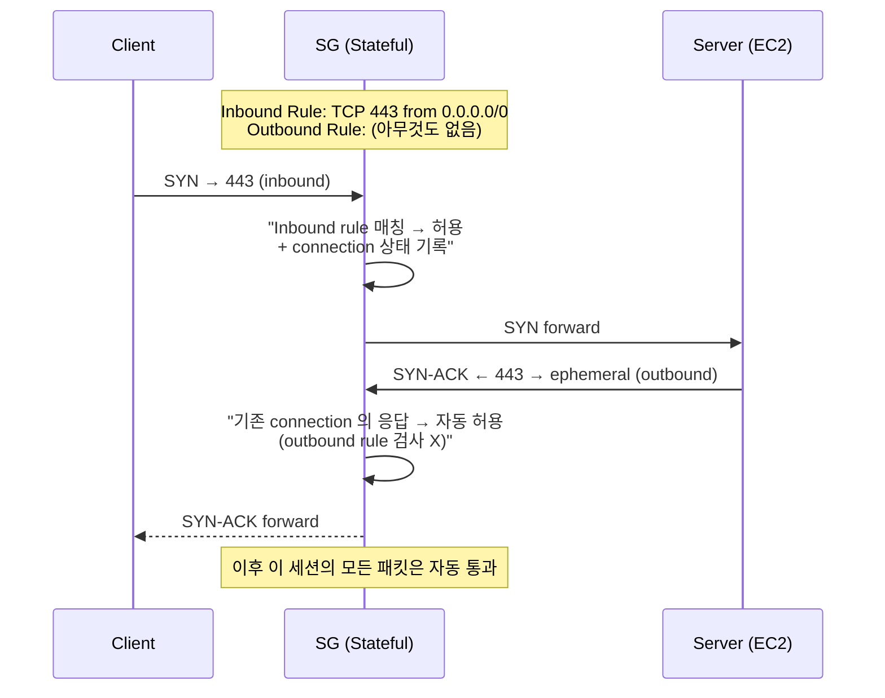
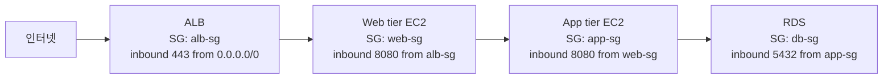

## 정의

**AWS Security Group** (SG) 은 *AWS 리소스 (정확히는 ENI, Elastic Network Interface) 에 붙는 stateful 가상 방화벽*. 인바운드/아웃바운드 트래픽을 IP + 포트 + 프로토콜 조합으로 제어하며, 연결 상태를 추적해 응답 트래픽은 자동으로 허용한다.

**핵심 성질** 세 가지:
1. **Stateful** - 요청을 허용하면 응답은 반대 방향 규칙 없이도 통과
2. **Allow-only** - Allow 규칙만. Deny 규칙 없음. 매칭 안 되면 암묵적 deny
3. **ENI 레벨** - VPC / 서브넷이 아닌 각 [[aws-eni|ENI]] 에 부착 (인스턴스 × 여러 ENI 가능)

**대비 개념**:
- **[[aws-sg-vs-nacl|NACL]]**: 서브넷 레벨, stateless, allow/deny 모두
- **[[aws-network-firewall|Network Firewall]]**: VPC 레벨 관리형 방화벽
- **[[aws-waf|WAF]]**: L7 HTTP 애플리케이션 방화벽

## 왜 ENI 레벨인가

전통 방화벽은 네트워크 경계 (subnet, VLAN) 에 배치. 하지만 클라우드에서는:

- **micro-segmentation**: 같은 서브넷 안에서도 인스턴스별 다른 정책
- **동적 스케일링**: 새 인스턴스가 뜨면 자동으로 방화벽 정책 상속
- **application-centric**: "app 서버 → DB 서버 만 허용" 처럼 IP 대신 논리 그룹

SG 는 이걸 위해 **ENI 단위**로 붙는다. 인스턴스가 어느 서브넷에 있든, 몇 개의 ENI 를 갖든, 각 ENI 가 자기 SG 를 소유.

## Stateful 의 의미 (핵심)



**의미**: outbound 규칙을 아무것도 안 넣어도, inbound 로 허용된 연결의 응답은 자동으로 나감. 반대로 outbound 로 초기 요청한 연결의 응답은 inbound 규칙 없어도 들어옴.

**NACL 과의 차이**: NACL 은 각 패킷을 독립 검사 → response 도 별도 outbound 규칙 필요 → **ephemeral port 범위 (1024-65535) 를 명시적으로 열어야 함**. SG 는 이 부담이 없다.

## 규칙 구성

SG 규칙은 4개 필드:

| 필드 | 값 |
|:---|:---|
| **Type** | Inbound / Outbound |
| **Protocol** | TCP / UDP / ICMP / All / 특정 프로토콜 번호 |
| **Port Range** | 단일 (`80`), 범위 (`8000-9000`), All (`-1`) |
| **Source / Destination** | CIDR (`10.0.0.0/16`) / **다른 SG ID** / **Prefix List** |

**중요한 것**: Source/Destination 에 **다른 SG 를 참조** 가능. 이게 AWS 만의 강력한 패턴.

## SG Referencing (SG 체이닝) - AWS 특화 패턴

### 문제: IP 기반의 한계

전통 방화벽:
```
web-tier: 10.0.1.0/24 → app-tier: 10.0.2.0/24 → db-tier: 10.0.3.0/24
방화벽: "10.0.1.0/24 → 10.0.2.0/24 port 8080 허용"
```

**문제**:
- 오토스케일링으로 web-tier 가 다른 IP 대역에 확장되면 방화벽 규칙 수정
- IP 대역 겹치면 실수 위험
- 신규 리전 확장 시 매번 반복

### 답: SG 를 Source 로 참조

```
web-sg = "web 서버들이 소속되는 SG"
app-sg = "app 서버들이 소속되는 SG"
  ├─ Inbound rule: port 8080, source = web-sg
  └─ 의미: "web-sg 를 부착한 어떤 ENI 든 8080 접근 허용"
db-sg = "DB 서버들이 소속되는 SG"
  └─ Inbound rule: port 5432, source = app-sg
```

**이점**:
- IP 몰라도 됨 (스케일링/이동에 자동 대응)
- 논리적: "web → app → db" 흐름을 명확히 표현
- 규칙 수정 없이 새 인스턴스 자동 반영 (SG 만 부착하면 됨)

### 예: 3-Tier 웹 아키텍처



각 층이 바로 위층의 SG 만 허용. Client IP 나 서브넷 CIDR 을 몰라도 됨. 인스턴스 추가/삭제 자동 반영.

## Default Security Group

각 VPC 생성 시 자동으로 하나 만들어짐 (`default`).

**기본 규칙**:
- **Inbound**: 자기 SG 로부터 모든 트래픽 허용 (self-reference)
- **Outbound**: 모든 트래픽 허용 (`0.0.0.0/0`)

**의미**: default SG 를 부착한 EC2 들은 서로 자유롭게 통신, 인터넷으로도 자유롭게 나감. 하지만 외부에서는 못 들어옴.

**주의**:
- 삭제 불가
- 수정은 가능하지만 실무는 default 를 그대로 두고 새 SG 를 만듦
- 여러 인스턴스가 실수로 default 만 갖고 있으면 서로 다 통신됨 = micro-segmentation 실패

## 신규 SG 의 기본값

새로 만든 SG (default 아닌 것):
- **Inbound**: 규칙 없음 = deny all
- **Outbound**: `0.0.0.0/0` 모두 허용

즉 신규는 "인바운드 완전 차단, 아웃바운드 열림". 필요한 인바운드만 명시 추가.

## 제한 (Quota)

| 항목 | 기본 | 조정 |
|:---|:---|:---|
| **VPC 당 SG 수** | 2,500 | 상향 가능 |
| **SG 당 인바운드 규칙** | **60** | 상향 가능 |
| **SG 당 아웃바운드 규칙** | **60** | 상향 가능 |
| **ENI 당 SG 수** | **5** | 최대 **16** |
| **SG 참조 (source/dest 로)** | 100 개 서로 다른 SG | - |

**총 유효 규칙 = SG 규칙 수 × ENI 당 SG 수** → 상한 `60 × 5 = 300` (기본), 확장 시 `60 × 16 = 960`.

**넘어서면**: 인스턴스 시작 실패 또는 규칙 추가 실패. 규칙 통합 (여러 개를 하나로) 또는 SG 분리 필요.

## Prefix List

여러 IP CIDR 을 하나의 논리 그룹으로 묶어 SG 규칙에 참조.

**두 종류**:
- **AWS 관리 Prefix List**: `com.amazonaws.<region>.s3` 등 서비스 IP 대역
- **Customer 관리 Prefix List**: 사용자 정의

**예**:
```
Customer Prefix List "office-networks":
  - 203.0.113.0/24  (서울 오피스)
  - 198.51.100.0/24 (도쿄 오피스)

SG rule: SSH 22 from prefix-list office-networks
```

오피스가 추가되면 prefix list 만 수정 → 참조하는 모든 SG 자동 반영.

**AWS 관리 예**: `com.amazonaws.us-east-1.s3` 는 S3 IP 대역을 자동으로 최신 유지. VPC Gateway Endpoint 없이 S3 접근 허용하려면 이 prefix list 참조.

## 서비스별 SG 특성

### EC2

- 인스턴스에 여러 ENI, 각 ENI 에 여러 SG (최대 5)
- 인스턴스 자체가 SG 를 갖는 게 아니라 ENI 가.

### RDS

- 하나의 RDS 인스턴스는 하나의 ENI (Multi-AZ 는 2개)
- SG 는 이 ENI 에 부착
- 대개 `db-sg` 하나만 붙이고, source 는 `app-sg` 로

### Lambda (in VPC)

- Lambda 가 VPC 안에서 실행되면 Hyperplane ENI 사용 (자세히: [[aws-eni|ENI]])
- SG 는 그 Hyperplane ENI 에 부착
- Outbound 만 사용 (Lambda 는 서비스가 호출하므로 inbound 개념 X)

### ECS / EKS (Fargate)

- Task / Pod 마다 ENI (VPC CNI)
- Task definition / Pod spec 에 SG 지정
- Task 단위 micro-segmentation

### ALB / NLB / GWLB

- 로드 밸런서 노드마다 ENI
- SG 를 부착 (NLB 는 최근 지원)

## 관측: VPC Flow Logs

SG 로 허용/거부된 트래픽 관찰:

```
VPC Flow Log 활성화:
  → CloudWatch Logs / S3 로 flow 기록
  → 각 flow 의 srcaddr, dstaddr, srcport, dstport, action (ACCEPT / REJECT)
```

**REJECT** = SG 나 NACL 이 차단.

## 흔한 패턴

### 1. Bastion / SSH 접근 격리

```
bastion-sg: inbound 22 from 오피스 IP
private-app-sg: inbound 22 from bastion-sg
```

Bastion 만 오피스에서 접근, 내부는 bastion 을 경유.

### 2. Public Web + Private DB

```
alb-sg: inbound 443 from 0.0.0.0/0
web-sg: inbound 8080 from alb-sg
db-sg: inbound 5432 from web-sg
```

### 3. 자기 참조 (mesh)

```
cluster-sg: inbound "모든 포트" from cluster-sg (self-reference)
```

같은 SG 를 붙인 인스턴스끼리 자유 통신 (예: Kubernetes 노드끼리).

### 4. VPC Endpoint 접근 제어

```
endpoint-sg: inbound HTTPS 443 from app-sg
app-sg: outbound HTTPS 443 to endpoint-sg
```

## SG vs NACL 요약

간단 비교. 자세히는 [[aws-sg-vs-nacl|SG vs NACL]].

| 축 | SG | NACL |
|:---|:---|:---|
| 상태 | Stateful | Stateless |
| 적용 대상 | **ENI** | **Subnet** |
| 규칙 | Allow 만 | Allow + Deny |
| 평가 | 모든 규칙 종합 (OR) | 번호 순 (첫 매칭) |
| 반환 트래픽 | 자동 | 명시적 규칙 필요 |
| 대표 용도 | 애플리케이션 격리 | Subnet 경계, 특정 IP 차단 |

**실무**: SG 를 주로 쓰고, NACL 은 특별한 경우 (알려진 악성 IP 차단, 서브넷 격리) 에만.

## 함정

> [!WARNING]
> **Allow 만 존재**. 특정 IP 차단이 필요하면 NACL. SG 는 화이트리스트만.

> [!CAUTION]
> **SG 규칙 수 제한** (60 in / 60 out). 큰 규칙 세트는 SG 를 분리하거나 prefix list 활용.

> [!WARNING]
> **default SG 를 그대로 둔 인스턴스** = 같은 default 인 것끼리 자유 통신. 예상 밖 접근성. 새 SG 를 만들어 명시적으로 부착.

> [!IMPORTANT]
> **RDS SG 를 CIDR (`10.0.0.0/16`) 로 열어두는 관행** = 다른 VPC 확장 시 커버 못 함. SG 참조 (`from app-sg`) 로 대체 권장.

> [!CAUTION]
> **SSH 22 를 0.0.0.0/0 으로 개방** = 공격 표면. [[aws-ssm-session-manager|SSM Session Manager]] 로 대체하고 22 는 닫기.

> [!WARNING]
> **Stateful 하지만 규칙 변경 시 기존 세션 재검사** (AWS 문서 기준 최근 개선). 오래된 관행 문서를 그대로 믿지 말 것.

> [!IMPORTANT]
> **SG 삭제 안 됨** 다른 SG 나 ENI 가 참조 중이면. Dependency 정리 후 삭제.

> [!CAUTION]
> **Outbound 를 좁혔는데 서비스 안 됨** = 반환 트래픽은 자동이지만 *외부로 요청* 하는 흐름 (예: DB 가 외부 API 호출) 은 outbound 규칙 필요. 트래픽 방향 파악 필수.

## 관련 위키

- [[aws-sg-vs-nacl|SG vs NACL]] - NACL 과의 대비
- [[aws-eni|ENI]] - SG 가 부착되는 인터페이스
- [[aws-vpc|VPC]] - 배포 컨텍스트
- [[aws-network-firewall|Network Firewall]] - VPC 수준 관리형 대안
- [[aws-waf|WAF]] - L7 HTTP 대안
- [[aws-gwlb|Gateway Load Balancer]] - 서드파티 방화벽 우회
- [[aws-ssm-session-manager|SSM Session Manager]] - SSH 대체
- [[aws-cloudwatch|CloudWatch]] / VPC Flow Logs - 관측
