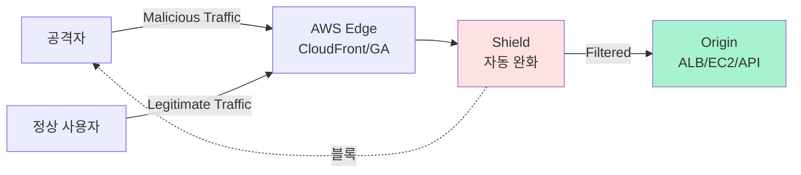

## 정의

**AWS Shield** 는 AWS 워크로드를 **분산 서비스 거부 (DDoS, Distributed Denial of Service)** 공격으로부터 보호하는 관리형 서비스입니다. Standard (기본, 무료) 와 Advanced (유료) 두 티어를 제공.

**한 줄 요약**: 인터넷 전면의 AWS 리소스가 다운되지 않도록 DDoS 트래픽을 자동 완화.

## DDoS 공격 유형

Shield 가 방어하는 공격:

### Layer 3/4 (Network / Transport)

- **UDP flood**: 대량 UDP 패킷
- **SYN flood**: TCP handshake 미완료 패킷 폭주
- **DNS amplification**: 취약 DNS 서버로 반사 공격
- **NTP amplification**, **Memcached amplification**
- **IP fragmentation**: 조각난 패킷으로 자원 소진
- **Reflection attacks**: source IP 스푸핑으로 반사

### Layer 7 (Application)

- **HTTP flood**: 정상 HTTP 요청 대량
- **Slowloris**: 연결 오래 유지
- **DNS query flood**: 도메인 쿼리 폭주
- **SSL/TLS handshake flood**
- **API abuse**: 특정 endpoint 반복 호출

## Shield Standard

**모든 AWS 계정에 자동 활성, 무료**.

### 자동 보호 대상

- **CloudFront**: 글로벌 CDN 앞단
- **Route 53**: DNS
- **Global Accelerator**
- **AWS 리소스의 public IP**: EC2, ELB, EIP, etc.

### 기능

- Layer 3/4 DDoS 자동 감지 및 완화
- AWS 백본에서 트래픽 필터링 (사용자 앞에 도달 전)
- SYN cookies, UDP reflection 방어
- **자동, 개입 없음**: 활성화도 없음

**한계**:
- Layer 7 (앱 레벨) 방어 제한적
- Detailed metrics/report 없음
- Cost protection 없음 (공격 중 auto scaling 요금 사용자 부담)

## Shield Advanced

**유료 티어** (계정당 월 3000 USD + 데이터 요금). 큰 조직/타겟된 워크로드용.

### 추가 기능

- **Layer 7 방어**: WAF 통합, ML 기반 앱 레벨 완화
- **DDoS Response Team (DRT)**: 24/7 전문가 지원
- **Health-based detection**: Route 53 health check 로 공격 여부 정확 판단
- **Global threat environment 대시보드**: AWS 규모의 위협 상황
- **DDoS cost protection**: 공격 중 auto-scaling 요금을 크레딧으로 환급
- **Enhanced 자동 완화**: 앱-specific 규칙
- **Application-layer protection**: 대규모 HTTP flood, 카멜 API 남용
- **Global protection**: Route 53 + CloudFront + ELB + EC2 통합 보호
- **WAF 요금 포함**: WAF 규칙 무제한 사용

### 보호 대상 (Advanced)

- CloudFront distributions
- Route 53 hosted zones
- Global Accelerator
- Application Load Balancer (ALB)
- Classic Load Balancer (CLB)
- Elastic IP (EIP)

**Advanced 활성화 후 리소스별 protection 지정**:

```bash
aws shield create-protection \
  --name "prod-alb" \
  --resource-arn "arn:aws:elasticloadbalancing:us-east-1:...:loadbalancer/app/prod/abc"
```

## 아키텍처



## Shield + WAF (심층 방어)

Shield 는 **volumetric DDoS**, WAF 는 **request-level 규칙**. 병행:

- **Shield**: 트래픽 볼륨/패턴 (수 Gbps 규모 필터)
- **WAF**: URL/header/body 검사 (개별 요청)

Advanced 는 WAF 요금 포함.

**WAF 규칙 예시**:
- **Rate limiting**: IP 당 초당 100 요청 초과 시 block
- **Managed rule sets**: OWASP Top 10, SQL injection, XSS
- **Bot Control**: 봇 탐지
- **IP reputation**: 알려진 악의 IP list

## Auto Scaling 상호작용

DDoS 는 auto scaling 을 유발해 **요금 폭탄**.

**Shield Standard**: 요금 사용자 부담.

**Shield Advanced**: **Cost Protection** 크레딧. AWS 가 auto-scaling 요금을 사후 환급.

## Attack Diagnostics

**Advanced** 사용 시:

- **Attack summary**: 시작/종료 시각, 종류, 크기 (Gbps, pps)
- **Attack vectors**: SYN flood + UDP reflection 등 조합
- **Top source IPs / countries**
- **Mitigation actions**: AWS 가 실행한 조치

CloudWatch 에 자동 메트릭 게시.

## 실전 DDoS 방어 아키텍처

```
[Internet]
    ↓
[CloudFront + Shield + WAF]      ← Edge 방어 (Layer 3/4/7)
    ↓
[Route 53]                        ← DNS Shield
    ↓
[Global Accelerator]              ← Anycast, 자동 라우팅
    ↓
[Application Load Balancer]       ← Layer 7 LB
    ↓
[VPC + Security Groups]
    ↓
[EC2 Auto Scaling / ECS / Lambda]
```

**모든 계층에서 방어**. Shield 는 top-most 계층에 있어 대부분 공격 완화.

## Rate-based Rules (WAF)

```json
{
  "Name": "RateLimitPerIP",
  "Statement": {
    "RateBasedStatement": {
      "Limit": 2000,
      "AggregateKeyType": "IP"
    }
  },
  "Action": {"Block": {}}
}
```

IP 당 5분 동안 2000 요청 초과 시 block.

## DDoS Response Team (DRT)

Shield Advanced 만. 24/7 전문가 팀이 지원.

- 공격 진행 중 실시간 지원
- 커스텀 완화 규칙 배포
- 사후 분석 리포트

**Pre-authorization** 필수: DRT 가 계정 리소스 조작 권한 필요 (IAM role).

## DDoS 완화 기법 (AWS 백본 내부)

Shield 가 사용하는 완화 (사용자는 API 로 직접 접근 안 됨):

- **Traffic engineering**: BGP 로 공격 트래픽 우회
- **Deterministic packet filtering**: 명확히 악의인 패킷 (spoofed source, malformed)
- **Priority-based traffic shaping**: 정상 트래픽 우선
- **Application-layer detection**: HTTP header 패턴, TLS fingerprinting
- **Rate limiting**: 특정 소스/패턴별
- **Blackholing**: 극단적 경우 (attack 지속 시 대상 IP 를 잠시 블랙홀)

## Global Threat Environment Dashboard

Shield Advanced 대시보드:

- 최근 24시간 AWS 전체 공격 규모
- 우리 자원에 대한 지속 공격
- Top 공격 유형
- Geographic origin

정보 공유: AWS 규모의 통찰.

## 실전 준비 체크리스트 (DDoS Resiliency)

DDoS 방어 아키텍처의 기본:

1. **CloudFront 앞단**: Origin 을 직접 노출 X. CloudFront + Origin Access Control.
2. **WAF 활성**: OWASP managed rules + rate limiting.
3. **Route 53 alias**: DNS 자체가 Shield 보호 대상.
4. **Auto Scaling**: 공격 흡수 위한 여유 capacity.
5. **Multi-region**: DR + traffic distribution.
6. **Health checks**: 공격 감지 자동 페일오버.
7. **Origin obfuscation**: Origin IP 를 CloudFront 만 접근 (SG rules).
8. **CloudWatch alarms**: Latency, error rate 급증 시 알림.
9. **Runbook**: 공격 시 조치 문서.
10. **Shield Advanced (선택)**: 크리티컬 워크로드는 활성.

## 요금 (Advanced)

- **월 정액**: 3000 USD/월/계정 (1년 약정, 조직 전체 커버)
- **Data Transfer Out**:
  - Standard AWS 요금 대비 할인
  - Web AC 등록된 리소스만
- **DDoS Cost Protection**: 크레딧 (환급)

**계약 조건**: 1년 약정 필수. 조직 계정 하나 활성이면 조직 전체 리소스에 커버 (일정 조건).

**Free tier**: Shield Standard 는 무료. Advanced 만 요금.

## 관리형 위협 대응 서비스

Shield Advanced + Route 53 Application Recovery Controller (ARC) + Global Accelerator 조합으로 **글로벌 DR + DDoS 방어** 통합.

## 함정

> [!WARNING]
> **Shield Standard 로만 대규모 공격 방어 어려움**. Layer 7 앱 공격, 대량 volumetric 은 Advanced + WAF 필요.

> [!CAUTION]
> **Origin 직접 노출 = 최악**. 공격자가 CloudFront 우회해 origin IP 직접 공격. Origin SG 를 CloudFront IP range 로 제한.

> [!WARNING]
> **Shield Advanced 는 계정 통합 계약**. 개별 리소스 단위 아님. 조직 전체 예산 결정.

> [!IMPORTANT]
> **WAF 없이 Layer 7 방어 부족**. Advanced 는 WAF 포함이므로 활용.

> [!CAUTION]
> **DRT 는 24/7 이지만 즉시 반응 아님**. 실제 지원까지 몇 분 걸릴 수 있음. 자체 runbook 도 준비.

> [!WARNING]
> **Auto Scaling 요금 폭탄 주의**. Standard 는 사용자 부담. 예산 alarm + max instance 제한.

## Shield vs 대안 CDN/DDoS

| 옵션 | 특성 |
|:---|:---|
| **AWS Shield** | AWS 네이티브 통합 |
| **Cloudflare** | 매우 큰 네트워크, 무료 tier 강력 |
| **Akamai** | 엔터프라이즈, 최상급 완화 능력 |
| **Fastly** | Edge compute + DDoS |
| **Google Cloud Armor** | GCP 워크로드 |

**AWS 워크로드 중심** = Shield. **멀티 CDN 이나 non-AWS origin** = 3rd party 조합.

## 관련 위키

- [[aws-cloudfront-cdn|CloudFront]] - 주 보호 대상
- [[aws-route53|Route 53]] - DNS 보호
- [[aws-alb-nlb|ALB/NLB]] - Layer 7 LB
- [[aws-guardduty|GuardDuty]] - 위협 탐지 (짝)
- [[aws-inspector|Inspector]] - 취약점 스캔
- [[aws-macie|Macie]] - 데이터 민감성
- [[aws-vpc|VPC]] - 네트워크 격리
- [[aws-cloudwatch|CloudWatch]] - Attack 메트릭
- [[aws-iam|IAM]] - DRT 권한
- [[aws-audit-manager|Audit Manager]] - 감사 증거
