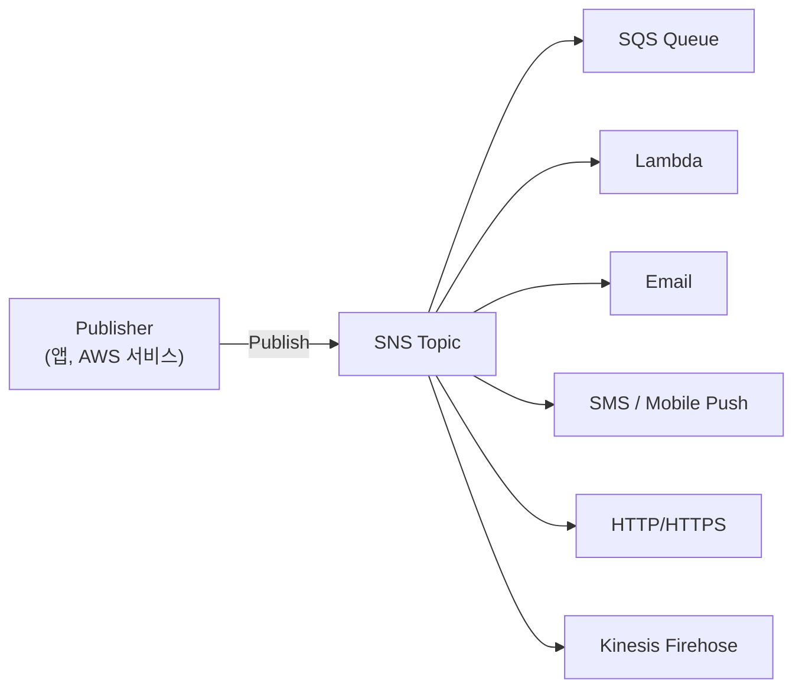
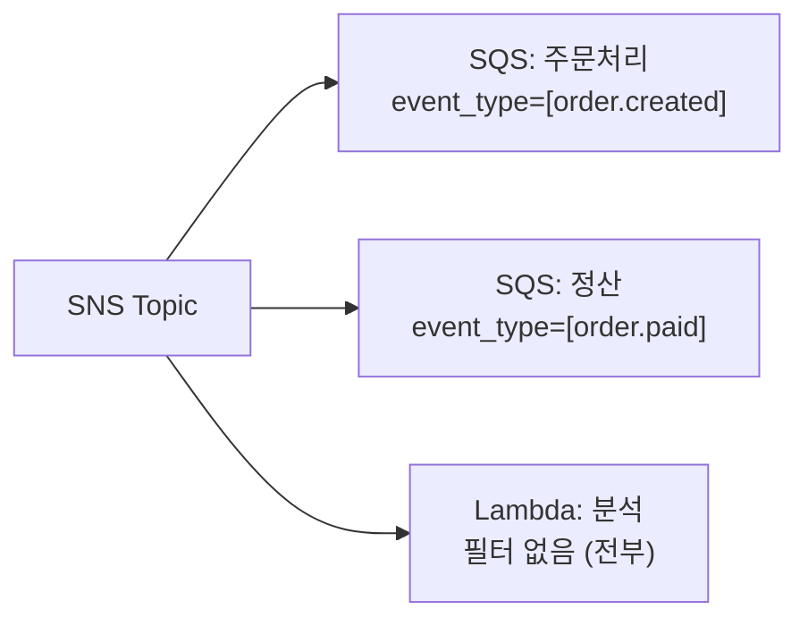
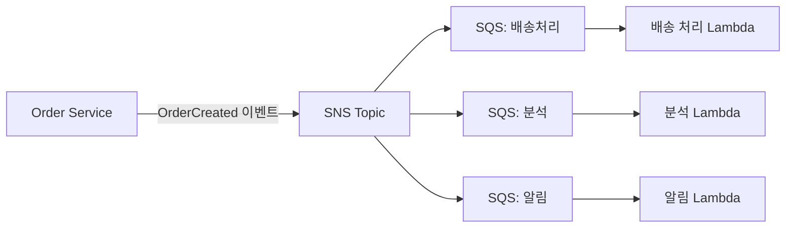
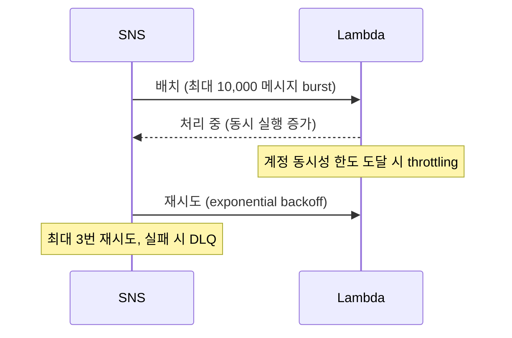

## 정의

**SNS (Simple Notification Service)** = *pub-sub 메시징*. Publisher 가 Topic 에 발행하면 모든 Subscriber 에 *동시에 fan-out*. 알림, 이벤트 배포, 마이크로서비스 디커플링에 활용.

## 구조

```anim:pubsub-bus
{}
```



**핵심**: SNS 자체는 *메시지를 저장하지 않음*. 전달 후 소멸. 내구성 필요하면 SQS 구독.

## Subscriber 종류

| 종류 | 사용 케이스 | 내구성 |
|:---|:---|:---|
| [[aws-sqs|SQS]] | 큐 fan-out, 내구성 | 높음 |
| [[aws-lambda|Lambda]] | 비동기 처리 | 재시도 |
| Email | 운영 알림 | 낮음 |
| SMS | 모바일 알림 | 낮음 |
| Mobile Push | APNS, FCM | 낮음 |
| HTTP/HTTPS | Webhook | 낮음 |
| Kinesis Firehose | 데이터 파이프라인 | 높음 |

## Standard vs FIFO Topic

| 항목 | Standard Topic | FIFO Topic |
|:---|:---|:---|
| 메시지 순서 | best-effort | *엄격 (MessageGroupId)* |
| 중복 | 가능 | *5분 중복 제거* |
| 처리량 | 무제한 (초당 수십만) | 300 TPS |
| 구독 가능 타입 | 전부 | *SQS FIFO 만* |
| 이름 접미사 | 없음 | `.fifo` 필수 |
| 비용 | 표준 | 약간 높음 |

```bash
# FIFO Topic 생성
aws sns create-topic \
  --name "OrderEvents.fifo" \
  --attributes '{"FifoTopic":"true","ContentBasedDeduplication":"true"}'
```

## Message Filtering

Subscriber 마다 FilterPolicy 로 받을 메시지 선택. Topic 이 전부 보내도 필터에 맞는 것만 전달.

```json
{
  "FilterPolicy": {
    "event_type": ["order.created", "order.paid"],
    "region": ["us-east-1", "us-west-2"],
    "amount": [{ "numeric": [">", 100] }]
  }
}
```



**FilterPolicy 매칭 방식**:
- 문자열 정확 일치: `["value1", "value2"]`
- 숫자 범위: `[{"numeric": [">", 100, "<=", 500]}]`
- prefix 매칭: `[{"prefix": "order."}]`
- exists: `[{"exists": true}]`
- 필터 없음: 모든 메시지 수신

> [!WARNING]
> FilterPolicy 잘못 설정 시 메시지 silently drop. CloudWatch `NumberOfNotificationsFilteredOut` 메트릭 모니터링 필수.

## SNS + SQS Fan-out 패턴

SNS 의 fan-out + SQS 의 내구성 결합. 가장 많이 쓰이는 패턴.



**이점**:
- **독립 스케일링**: 각 SQS / Lambda 독립 처리
- **내구성**: SQS 에 메시지 보존, 처리 실패 시 재시도
- **디커플링**: Order Service 는 하위 서비스 모름
- **DLQ**: 각 SQS 에 Dead Letter Queue 연결 가능

## Dead Letter Queue 설정

```bash
# SNS Subscription 에 DLQ 설정
aws sns set-subscription-attributes \
  --subscription-arn "arn:aws:sns:..." \
  --attribute-name RedrivePolicy \
  --attribute-value '{
    "deadLetterTargetArn": "arn:aws:sqs:us-east-1:123:sns-dlq"
  }'
```

DLQ 는 전달 실패 메시지 보관. 실패 원인 분석 후 재처리.

## Lambda 통합: 동시성 주의



> [!CAUTION]
> SNS -> Lambda 직접 연결 시 대량 메시지에 Lambda 동시성 폭증. SQS 버퍼를 중간에 넣어 조절 권장.

## HTTP 구독: 서명 검증

SNS 는 HTTP endpoint 에 메시지 전송 시 서명 포함.

```python
import json, base64, urllib.request
from cryptography.hazmat.primitives import hashes, serialization
from cryptography.hazmat.primitives.asymmetric import padding

def verify_sns_signature(message: dict) -> bool:
    # SigningCertURL 에서 인증서 다운로드
    cert_url = message['SigningCertURL']
    # SNS URL 검증
    assert cert_url.startswith('https://sns.'), "Invalid cert URL"
    # 서명 검증 (cryptography 라이브러리 사용)
    ...
```

> [!WARNING]
> HTTP endpoint 는 SNS 인척 위조 가능. 반드시 SNS 서명 검증 구현.

## 메시지 구조

```json
{
  "Type": "Notification",
  "MessageId": "12345",
  "TopicArn": "arn:aws:sns:us-east-1:123:OrderEvents",
  "Subject": "Order Created",
  "Message": "{\"orderId\":\"o-001\",\"amount\":150}",
  "Timestamp": "2026-07-15T10:00:00.000Z",
  "MessageAttributes": {
    "event_type": {
      "Type": "String",
      "Value": "order.created"
    }
  }
}
```

**Raw Message Delivery**: SQS / HTTP 구독에서 SNS 래퍼 없이 원본 메시지만 전달. SQS 에서 `json.loads` 두 번 하는 실수 방지.

```bash
# Raw delivery 활성화
aws sns set-subscription-attributes \
  --subscription-arn "arn:aws:sns:..." \
  --attribute-name RawMessageDelivery \
  --attribute-value true
```

## 비용 구조

| 항목 | 비용 |
|:---|:---|
| API 요청 (Publish) | $0.50/million |
| SQS 전달 | 무료 |
| Lambda 전달 | 무료 |
| Email 전달 | 처음 1,000 건 무료, 이후 $2/100k |
| SMS (한국) | $0.0843/건 |
| HTTP/HTTPS 전달 | 처음 100k 건 무료, 이후 $0.60/million |
| Mobile Push | 처음 100만 건 무료 |

**비용 최적화**:
- SQS/Lambda 구독 선호 (무료)
- SMS 는 Direct SMS 대신 SNS + Mobile Push 고려
- Message Filtering 으로 불필요한 메시지 전달 줄임

## SNS vs 대안 비교

| 서비스 | 특성 | 적합한 경우 |
|:---|:---|:---|
| **SNS** | 단순 fan-out, 저렴, 고처리량 | 알림 발송, fan-out |
| **[[aws-eventbridge|EventBridge]]** | 복잡한 라우팅, schema registry, SaaS 통합 | 이벤트 버스, 외부 SaaS |
| **[[aws-sqs|SQS]]** | 큐, pull 기반, 내구성 | 작업 큐, 순서 처리 |
| **Kinesis** | 스트리밍, 재처리 가능 | 대용량 스트림, 분석 |

**실전 선택 기준**:
- 단순 알림 / 높은 fan-out -> SNS
- 복잡한 이벤트 라우팅 / 외부 SaaS 연동 -> EventBridge
- 순서 보장 / 내구성 / consumer 속도 제어 -> SQS

## 실전 패턴: 주문 이벤트 처리

```python
import boto3

sns = boto3.client('sns')

def publish_order_event(order_id: str, event_type: str, amount: float):
    sns.publish(
        TopicArn='arn:aws:sns:us-east-1:123:OrderEvents',
        Message=json.dumps({
            'orderId': order_id,
            'amount': amount
        }),
        Subject=event_type,
        MessageAttributes={
            'event_type': {
                'DataType': 'String',
                'StringValue': event_type
            },
            'amount': {
                'DataType': 'Number',
                'StringValue': str(amount)
            }
        }
    )
```

## 함정

> [!WARNING]
> **HTTP subscriber 서명 검증 누락**: SNS 에서 온 척 위조 webhook 가능. 반드시 `SigningCertURL` 에서 인증서 받아 서명 검증.

> [!WARNING]
> **Standard topic 중복 메시지**: at-least-once 전달. Subscriber 는 *idempotent* 로 설계. `MessageId` 로 중복 처리.

> [!CAUTION]
> **SNS -> Lambda 직접: 동시성 폭증**: 대량 이벤트 시 Lambda 동시성 한도 초과. SQS 버퍼 삽입으로 back-pressure 적용.

> [!WARNING]
> **DLQ 미설정**: 전달 실패 메시지 손실. SNS Subscription 에 SQS DLQ 설정 필수.

> [!CAUTION]
> **FIFO Topic - SQS FIFO 만 구독 가능**: Email, HTTP, Lambda, SMS 는 FIFO Topic 구독 불가. FIFO 순서 보장 필요 시 SQS FIFO 경유.

> [!WARNING]
> **FilterPolicy 비어있음 vs 없음**: `{}` (빈 FilterPolicy) = 모든 메시지 차단. Attribute 없는 메시지도 차단. 없애거나 속성이 없어도 통과하도록 설정.

## 관련 위키

- [[aws-sqs]] - 큐 내구성 결합 (fan-out 패턴)
- [[aws-lambda]] - 서버리스 subscriber
- [[aws-eventbridge]] - 복잡한 이벤트 라우팅 대안
- [[aws-cloudwatch]] - 메시지 전달 메트릭
- [[aws-iam]] - Topic 접근 제어
