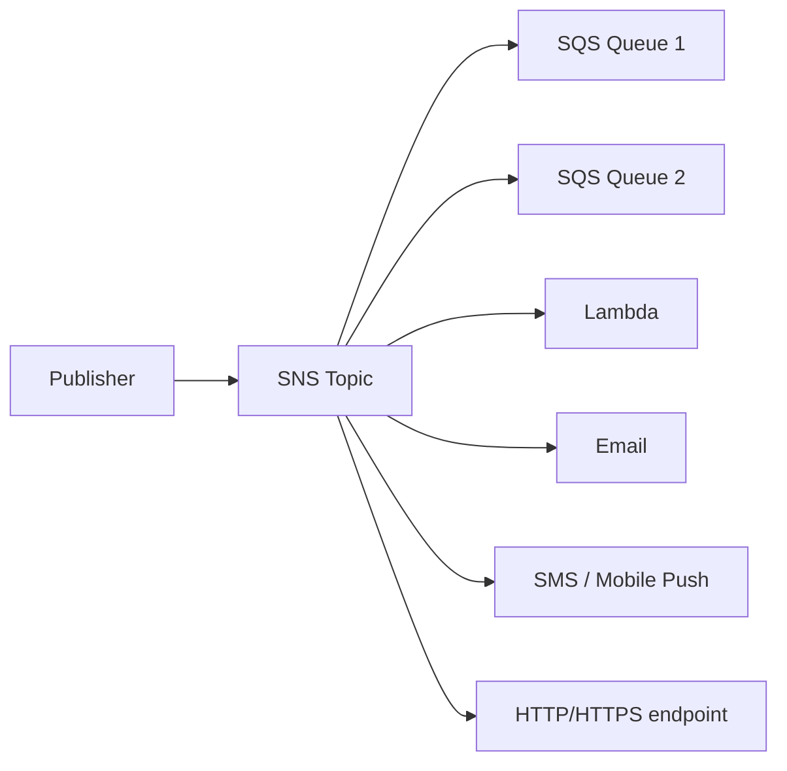
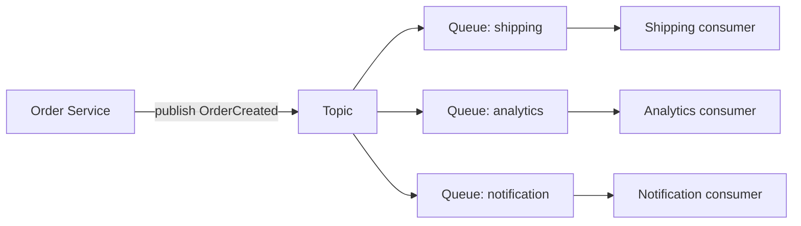

## 정의

**SNS (Simple Notification Service)** = *pub-sub fan-out*. 한 message → 여러 subscriber 에 *동시 배포*.

## 구조

```anim:pubsub-bus
{}
```



## Subscriber 종류

| 종류 | 사용 |
|---|---|
| SQS | 큐 fan-out |
| Lambda | 비동기 처리 |
| Email | 알림 |
| SMS | 알림 (전세계) |
| Mobile Push | APNS, FCM |
| HTTP/HTTPS | webhook |
| Kinesis Data Firehose | 데이터 흐름 |

## Standard vs FIFO Topic

| | Standard | FIFO |
|---|---|---|
| 순서 | best-effort | strict (group) |
| 중복 | 가능 | 5분 dedup |
| 처리량 | 무한 | 300/s |
| Subscriber | 모든 종류 | *SQS FIFO 만* |

## Message Filtering

```json
"FilterPolicy": {
  "event_type": ["order.created", "order.paid"],
  "region": ["us-east-1"]
}
```

> Subscriber 마다 *받을 메시지 필터*. 한 topic 에 다양한 event 보내고 *각 subscriber 가 관심사만*.

## SNS + SQS Fan-out 패턴



> *Pub-sub + queue durability*. SNS 의 fan-out + SQS 의 영속.

## SNS vs EventBridge

| | SNS | EventBridge |
|---|---|---|
| Subscriber 수 | 12.5M / topic | 5 target / rule |
| Filtering | 단순 (key=value) | *advanced (content-based, schema)* |
| Schema Registry | 없음 | *있음* |
| 가격 | 저렴 | 약간 비쌈 |
| 사용 | high fan-out | 복잡 라우팅 / 외부 SaaS |

## 흔한 함정

> [!WARNING]
> 1. **HTTP subscriber 인증 없음** = *aws에서 온 척 한 webhook 위조*. *SNS signature 검증* 필수.
> 2. **Standard topic의 중복** = subscriber 가 idempotent.
> 3. **Filter policy 잘못** = silently drop. CloudWatch 메트릭으로 확인.
> 4. **DLQ 미설정** = subscriber 실패 시 *재시도 후 손실*. SNS subscription DLQ.

## 관련 위키

- [[aws-sqs]]
- [[aws-eventbridge]]
- [[Redis Pub Sub vs Streams]]
- [[message-broker-comparison]]
