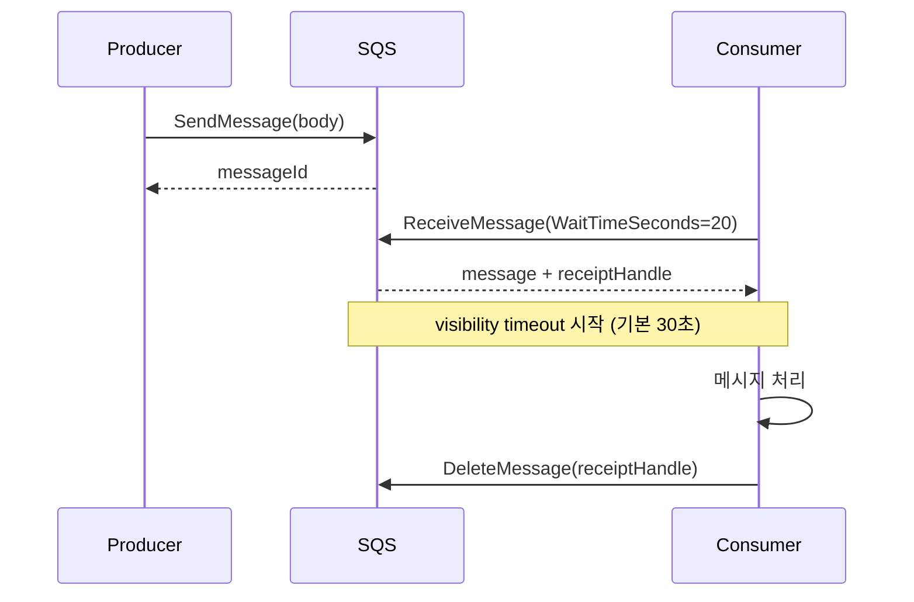
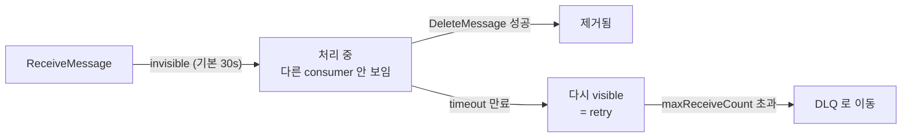
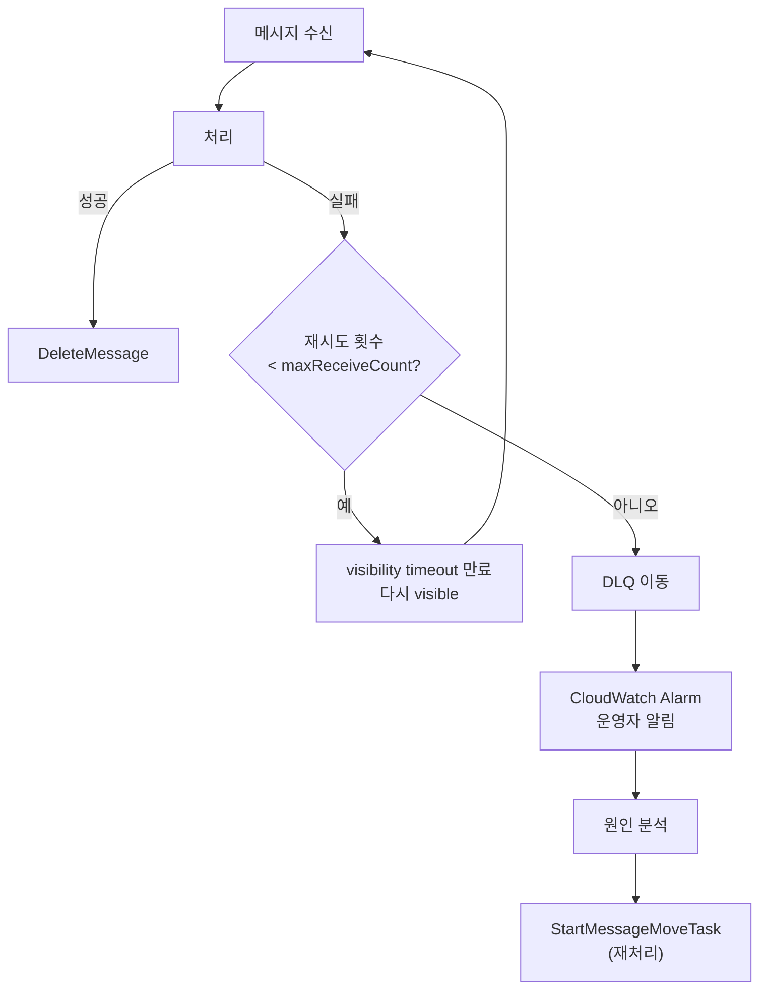

## 정의

**SQS (Simple Queue Service)** = AWS 의 *완전 관리형 메시지 큐*. *infinite scale*, *no provisioning*, *pay-per-request*. 프로듀서와 컨슈머를 비동기로 분리.

## Standard vs FIFO

| 항목 | Standard | FIFO |
|:---|:---|:---|
| 처리량 | 거의 무한 | 300 msg/s (배치 시 3000/s) |
| 순서 | best-effort | 엄격 (group 안) |
| 중복 | at-least-once (드물게 중복) | exactly-once (5분 dedup 윈도우) |
| URL suffix | `.amazonaws.com/...` | `.fifo` 필수 |
| 가격 | 저렴 | 약간 비쌈 |

**선택 기준**: 순서/중복 허용 가능 = Standard. 결제/주문 등 순서 중요 = FIFO.

## 흐름



## Visibility Timeout

컨슈머가 메시지를 가져간 후 *다른 컨슈머에게 숨겨지는 시간*.



**설정 원칙**: `처리 예상 시간 × 2 + 여유` 로 설정. Lambda timeout 과 함께 고려.

```python
# 처리 중 timeout 연장 (최대 12시간)
sqs.change_message_visibility(
    QueueUrl=queue_url,
    ReceiptHandle=receipt_handle,
    VisibilityTimeout=600  # 10분으로 연장
)
```

## DLQ (Dead Letter Queue)

```yaml
# CloudFormation / CDK 설정
RedrivePolicy:
  deadLetterTargetArn: arn:aws:sqs:ap-northeast-2:123:my-dlq
  maxReceiveCount: 5
```

- `maxReceiveCount` 초과 후 자동으로 DLQ 로 이동
- 원인 분석 후 `StartMessageMoveTask` 로 원본 큐에 재처리
- DLQ 자체에도 DLQ 설정 가능 (중첩 방지)

> DLQ 에 메시지 쌓이면 CloudWatch alarm 필수. 무한 재처리 방지.

## Long Polling

```python
sqs.receive_message(
    QueueUrl=queue_url,
    WaitTimeSeconds=20,        # long poll (최대 20초)
    MaxNumberOfMessages=10,    # 배치 (최대 10개)
)
```

- 메시지 없으면 최대 20초 대기 후 반환
- *short polling* (기본 0초) 대비 API 호출 횟수 대폭 감소, 비용 절감
- 거의 항상 `WaitTimeSeconds=20` 권장

## SQS + Lambda 이벤트 소스

AWS 가 자동으로 poll + batch + invoke + delete 처리.

```yaml
# SAM / CloudFormation
EventSourceMapping:
  EventSourceArn: arn:aws:sqs:...:my-queue
  FunctionName: my-func
  BatchSize: 10
  MaximumBatchingWindowInSeconds: 5
  FunctionResponseTypes:
    - ReportBatchItemFailures   # 부분 실패 처리
```

**`ReportBatchItemFailures`**: batch 중 일부만 실패 시 해당 메시지만 DLQ 로 이동. 나머지는 정상 처리.

```python
def handler(event, context):
    failures = []
    for record in event['Records']:
        try:
            process(record['body'])
        except Exception:
            failures.append({'itemIdentifier': record['messageId']})
    return {'batchItemFailures': failures}
```

## FIFO + MessageGroupId

```python
sqs.send_message(
    QueueUrl=fifo_queue_url,
    MessageBody=json.dumps(payload),
    MessageGroupId='user-42',           # 같은 group = 순서 보장
    MessageDeduplicationId='unique-id'  # 5분 dedup 윈도우
)
```

- 같은 `MessageGroupId` = 한 컨슈머가 순서대로 처리
- 다른 `MessageGroupId` = 병렬 처리 가능
- `ContentBasedDeduplication` 활성 시 body hash 로 자동 dedup

## 배치 처리

```python
# 최대 10개 한번에 전송 (비용 절감)
entries = [
    {'Id': str(i), 'MessageBody': json.dumps(msg)}
    for i, msg in enumerate(messages)
]
sqs.send_message_batch(QueueUrl=queue_url, Entries=entries)
```

- `SendMessageBatch`: 최대 10개, 최대 256KB
- `DeleteMessageBatch`: 소비 후 일괄 삭제
- 배치 API = 단건 대비 API 호출 최대 10배 절감

## 재시도 전략 설계



**exponential backoff**: Lambda + SQS 조합에서 재시도 간격을 늘리려면 visibility timeout 을 처리에서 수동으로 늘림.

```python
import time

def handler(event, context):
    for record in event['Records']:
        receive_count = int(record['attributes']['ApproximateReceiveCount'])
        try:
            process(record['body'])
        except RetryableError:
            # 재시도 횟수에 따라 timeout 연장 (backoff)
            backoff = min(2 ** receive_count * 30, 900)  # 최대 15분
            sqs.change_message_visibility(
                QueueUrl=QUEUE_URL,
                ReceiptHandle=record['receiptHandle'],
                VisibilityTimeout=backoff
            )
            raise
```

## 모니터링 / 운영

**필수 CloudWatch 메트릭**:

| 메트릭 | 의미 | alarm 기준 |
|:---|:---|:---|
| `ApproximateNumberOfMessages` | 큐 적체량 | 임계값 초과 시 |
| `ApproximateAgeOfOldestMessage` | 가장 오래된 메시지 age | 처리 지연 탐지 |
| `NumberOfMessagesSent` | 발행량 | 급감 시 producer 이상 |
| `NumberOfMessagesDeleted` | 처리 완료량 | 급감 시 consumer 이상 |

```bash
# DLQ alarm 예시 (CDK)
new cloudwatch.Alarm(this, 'DlqAlarm', {
  metric: dlq.metricApproximateNumberOfMessagesVisible(),
  threshold: 1,
  evaluationPeriods: 1,
  alarmDescription: 'DLQ 에 메시지 발생',
});
```

## SQS vs Kafka 비교

| 항목 | SQS | Kafka |
|:---|:---|:---|
| 운영 부담 | 0 (managed) | 클러스터 관리 필요 |
| 처리량 | 무한 (auto) | 노드 수 비례 |
| Retention | 최대 14일 | 무제한 (디스크) |
| Replay | DLQ redrive 만 | consumer offset 자유 조정 |
| Fan-out | [[aws-sns]] 와 결합 | consumer group |
| 순서 | FIFO group 안에서 | partition 안에서 |
| 비용 구조 | 사용량 비례 | 인프라 비례 |

**선택 기준**: AWS only + 단순 큐 + 운영 최소화 = SQS. 영속 + 재처리 + 대규모 throughput + 이벤트 스트리밍 = [[kafka]].

## 비용

- $0.40 / 백만 요청 (Standard)
- $0.50 / 백만 요청 (FIFO)
- 첫 100만 요청/월 무료
- 256KB 이상 메시지: 256KB 단위로 청구

**비용 최적화**:
- Long polling (WaitTimeSeconds=20) 으로 빈 poll API 호출 최소화
- 배치 전송/수신으로 API 호출 횟수 절감
- Lambda 이벤트 소스로 폴링 완전 위임

## 흔한 함정

> [!WARNING]
> 1. **at-least-once 중복 처리**: Standard 큐에서 드물게 중복 발생. consumer 는 반드시 *idempotent* 하게. [[idempotency-keys]] 패턴 활용.
> 2. **Visibility timeout 너무 짧음**: 처리 도중 메시지가 다시 visible 되어 다른 컨슈머가 중복 처리.
> 3. **DLQ 미설정**: 실패 메시지가 무한 재시도, 큐 처리 지연 전파.
> 4. **FIFO 에서 MessageGroupId 없이 전송**: 모든 메시지가 단일 group = 단일 컨슈머 = 300 msg/s 한계.
> 5. **배치 Lambda 에서 전체 예외**: 일부 실패 시 batch 전체 재시도. `ReportBatchItemFailures` 설정 필수.

> [!CAUTION]
> FIFO 큐 이름은 반드시 `.fifo` suffix. 생성 후 변경 불가. 설계 단계에서 결정 필요.

## 관련 위키

- [[aws-sns]] - fan-out 조합 (SNS + SQS)
- [[aws-eventbridge]] - 이벤트 기반 라우팅
- [[aws-lambda]] - 이벤트 소스로 자동 처리
- [[kafka]] - 대안 스트리밍 플랫폼
- [[message-broker-comparison]] - 브로커 비교
- [[idempotency-keys]] - 중복 처리 패턴
- [[outbox-pattern]] - DB + 큐 원자적 발행
