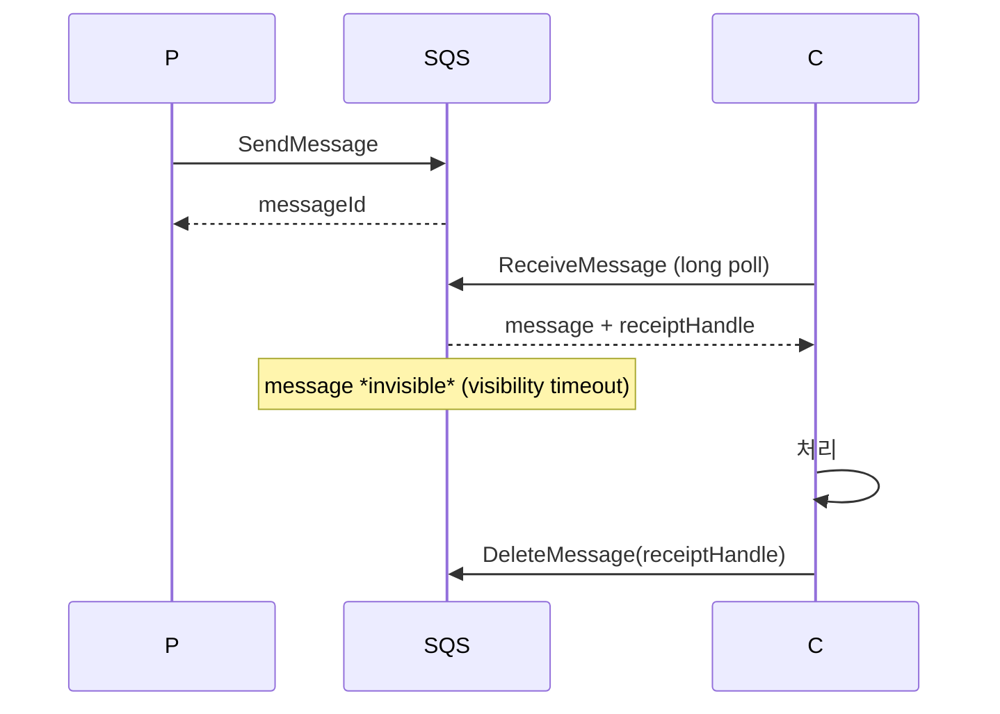
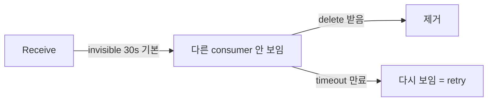

## 정의

**SQS** = AWS 의 *완전 관리형 메시지 큐*. *infinite scale*, *no provisioning*, *pay-per-request*.

## Standard vs FIFO

| | Standard | FIFO |
|---|---|---|
| 처리량 | *거의 무한* | 300 msg/s (batching 시 3000) |
| 순서 | best-effort | *strict (group 안)* |
| 중복 | *at-least-once* (드물게 중복) | *exactly-once* (5분 dedup) |
| 가격 | cheap | 약간 비쌈 |

## 흐름

```anim:queue
{}
```



## Visibility Timeout



> *처리 시간 + 안전 마진* 으로 설정. 짧으면 *중복 처리*, 길면 *재시도 지연*.

## DLQ (Dead Letter Queue)

```yaml
RedrivePolicy:
  deadLetterTargetArn: arn:aws:sqs:...:my-dlq
  maxReceiveCount: 5
```

> *5회 처리 실패* → DLQ 로. 운영자 검사 후 redrive.

## Long Polling

```python
sqs.receive_message(
    QueueUrl=q,
    WaitTimeSeconds=20,   # long poll (max 20s)
    MaxNumberOfMessages=10,
)
```

- *메시지 없으면 20초 기다림*. 짧은 polling 보다 *API call 절감 + latency 낮음*.
- 거의 *항상 사용*.

## SQS + Lambda

```yaml
EventSourceMapping:
  EventSourceArn: arn:aws:sqs:...
  FunctionName: my-func
  BatchSize: 10
  MaximumBatchingWindowInSeconds: 5
```

> AWS 가 자동으로 *batch poll* + Lambda 호출 + delete.

## FIFO + MessageGroupId

```python
sqs.send_message(
    QueueUrl=q,
    MessageBody='...',
    MessageGroupId='user-42',          # 같은 group = 순서 보장
    MessageDeduplicationId='unique-id'
)
```

- 같은 group = 한 consumer 가 순서대로.
- 다른 group = 병렬.

## Standard vs Kafka

| | SQS | Kafka |
|---|---|---|
| 운영 | 0 (managed) | 큼 |
| 처리량 | 무한 (auto) | 노드 수 비례 |
| Retention | 최대 14일 | 무제한 (디스크) |
| Replay | DLQ 만 | 자유 |
| Fan-out | SNS 와 결합 | consumer group |
| 비용 | 사용량 비례 | 인프라 비례 |

> *AWS only + 단순 큐* = SQS. *영속 + 재처리 + 큰 throughput* = Kafka (또는 MSK).

## 흔한 함정

> [!WARNING]
> 1. **At-least-once 중복** = consumer *idempotent* 필요. [[idempotency-keys]].
> 2. **Visibility timeout 짧음** = 처리 도중 message 가 *다른 consumer 에게 다시*. 처리 시간 모니터링.
> 3. **DLQ 미설정** = 실패 message 영원히 재시도.
> 4. **FIFO 의 *group 부재*** = 모든 message 가 *한 group* 으로 = 단일 consumer = 처리량 30 msg/s.

## 관련 위키

- [[aws-sns]]
- [[aws-eventbridge]]
- [[aws-lambda]]
- [[kafka]] (대안)
- [[message-broker-comparison]]
