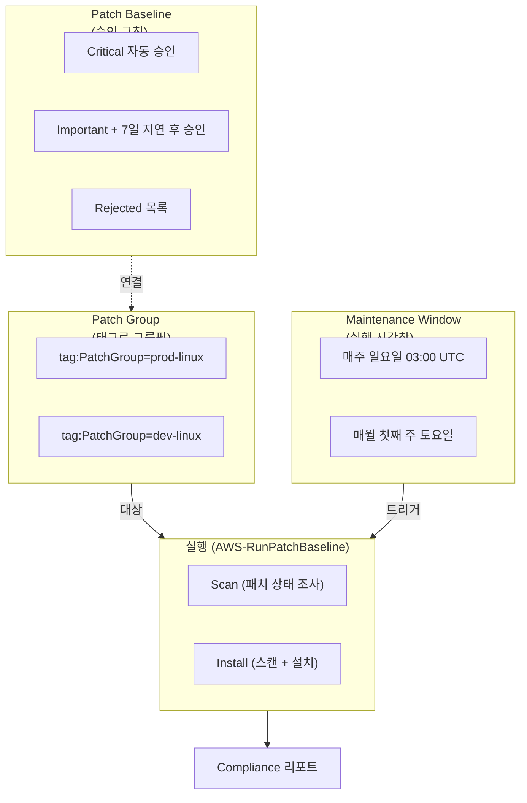
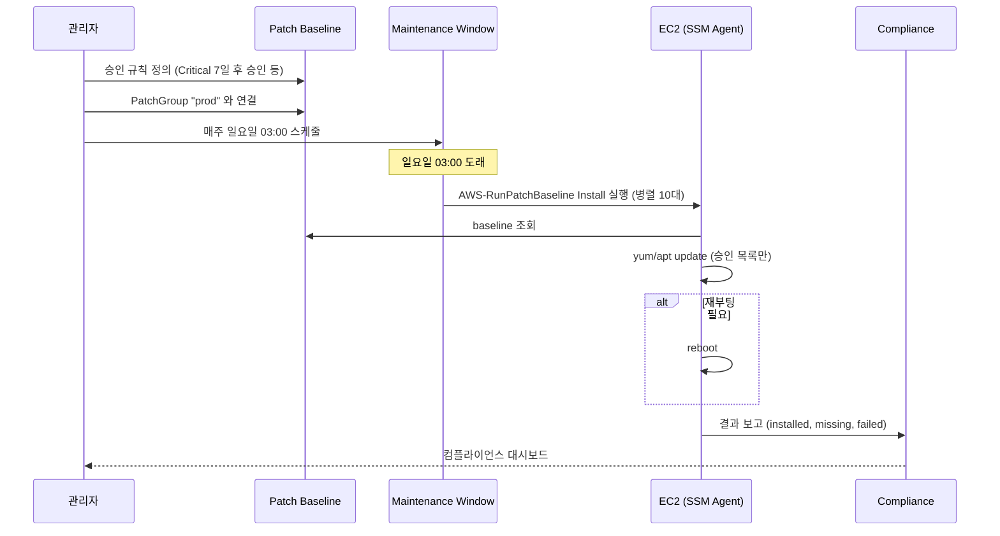

## 정의

**AWS SSM Patch Manager** 는 *수십 - 수천 개의 [[aws-ec2|EC2]] / 온프레미스 서버에 OS 및 애플리케이션 패치를 정책 기반으로 자동 적용* 하는 [[aws-systems-manager|Systems Manager]] 기능. 승인 규칙 (patch baseline), 대상 그룹 (patch group), 실행 시간창 (maintenance window) 을 조합해 *"매주 일요일 새벽 3시에 프로덕션 서버의 Critical / Important 보안 패치만 자동 설치"* 같은 정책을 선언적으로 실행.

**핵심 정체성**: *"패치를 사람이 매번 SSH 로 apt/yum 안 돌려도 되게" 만드는 서비스*.

## 왜 Patch Manager 인가

수동 패치의 문제:

- **규모 문제**: 수백 대 EC2 를 하나씩 SSH → apt/yum 은 불가능
- **일관성 문제**: 서버마다 다른 시점에 다른 패치 상태 → 컴플라이언스 위반
- **다운타임 관리**: 프로덕션은 새벽에, 개발은 낮에 등 시간대 관리 필요
- **감사 요구**: 언제 어떤 패치가 적용됐는지 기록
- **롤아웃 안전성**: 일부만 먼저 적용 후 검증, 이후 확장

Patch Manager 의 답:
- **정책 (baseline)** 으로 "어떤 패치를 어떻게 승인" 정의
- **태그 기반 타겟팅** 으로 그룹 관리
- **Maintenance Window** 로 시간 창 지정
- **자동 배포 + 병렬성 제어** (한 번에 몇 대씩)
- **컴플라이언스 리포트** 자동 생성 (누락된 패치, 실패한 서버)

## 핵심 구성 요소



### 1. Patch Baseline (승인 규칙)

*"어떤 패치를 승인하고 무엇을 거절할지"* 정의.

**포함 사항**:
- **Operating System** 지정 (`AMAZON_LINUX_2023`, `UBUNTU`, `WINDOWS`, `RHEL` 등)
- **승인 규칙** (여러 개):
  - 심각도 (Critical / Important / ...)
  - 분류 (Security / Bugfix / ...)
  - 자동 승인 지연일수 (`ApproveAfterDays=7` 등)
- **명시 승인** 목록 (KB 번호 등 특정 패치 강제 승인)
- **명시 거절** 목록 (문제 있는 패치 차단)
- **컴플라이언스 수준** (승인 안 된 패치 발견 시 어떻게 표시)

**AWS 제공 기본 baseline** (`AWS-DefaultPatchBaseline*`) 이 OS 별로 있으며, 신규 사용 시 이것부터 시작 후 커스텀.

### 2. Patch Group (대상 그룹)

*태그로 서버를 논리 그룹핑*. 각 그룹에 다른 baseline 적용.

```
EC2 인스턴스에 태그 추가:
  Key: PatchGroup    Value: prod-linux

Patch Group 등록:
  Baseline "prod-linux-critical" → Patch Group "prod-linux"
  Baseline "dev-linux-all" → Patch Group "dev-linux"
```

**중요**: 태그 키는 **정확히 `Patch Group`** (콘솔 표기) 또는 `PatchGroup` (API/CLI). 한 인스턴스는 한 patch group 에만 속할 수 있음.

### 3. Maintenance Window (실행 시간창)

*"언제 실행할지"* 지정. Cron 표현식 또는 rate.

```
매주 일요일 03:00 UTC → duration 4시간 → cutoff 1시간
  Task 1: 대상 tag:PatchGroup=prod-linux, AWS-RunPatchBaseline (Operation=Install)
    Concurrency: 10 (한번에 10대)
    Error threshold: 5 (5대 실패 시 중단)
```

**시간창 매개변수**:
- **Schedule**: `cron(0 3 ? * SUN *)` (매주 일요일 03:00)
- **Duration**: 유지 시간 (예: 4 시간)
- **Cutoff**: 종료 전 새 태스크 시작 안 하는 시간 (예: 1 시간)
- **Concurrency**: 병렬 실행 수 (`10` 또는 `50%`)
- **Error threshold**: N 개 실패 시 중단

### 4. AWS-RunPatchBaseline (실행 문서)

*실제 스캔/설치를 수행하는 SSM Document*. Maintenance Window 의 태스크로 실행.

**Operation** 두 가지:
- **Scan**: 컴플라이언스 조사만 (설치 X)
- **Install**: 스캔 + 승인된 패치 설치 (재부팅 발생 가능)

## 흐름 (전체 라이프사이클)



## 패치 컴플라이언스

각 인스턴스별로 4 가지 상태:

- **INSTALLED**: 승인된 패치가 이미 적용됨
- **INSTALLED_OTHER**: 승인 안 된 패치가 적용됨 (수동 설치 등)
- **MISSING**: 승인된 패치인데 미설치 (배포 대상)
- **FAILED**: 설치 시도했으나 실패

**대시보드**:
- SSM 콘솔 → Patch Manager → Compliance
- [[aws-config|AWS Config]] 규칙 (`ec2-managedinstance-patch-compliance-status-check`) 로 자동 감시
- Security Hub 통합으로 조직 전체 뷰

## 실전 예제

### 예 1: 프로덕션 Linux 매주 정기 패치

```
1. Patch Baseline:
   Name: prod-linux-critical
   OS: AMAZON_LINUX_2023
   Rules:
     - Classification=Security, Severity=Critical, ApproveAfterDays=0
     - Classification=Security, Severity=Important, ApproveAfterDays=7
   Rejected: []

2. Patch Group:
   Baseline "prod-linux-critical" → Group "prod-linux"
   EC2 태그: PatchGroup=prod-linux

3. Maintenance Window:
   Name: prod-weekly-patching
   Schedule: cron(0 18 ? * SAT *)   # 토요일 18:00 UTC = 일요일 03:00 KST
   Duration: 4 hours
   Cutoff: 1 hour

4. Task:
   Document: AWS-RunPatchBaseline
   Parameters: Operation=Install
   Targets: tag:PatchGroup=prod-linux
   Concurrency: 10%
   Error threshold: 20%
```

### 예 2: 사전 스캔만 (Install 없음)

새 baseline 을 적용하기 전 미리 스캔해서 어떤 패치가 대상이 될지 확인.

```
Task Parameters: Operation=Scan
```

Install 없이 컴플라이언스만 업데이트 → 리포트 검토 후 승인.

### 예 3: 긴급 CVE 대응

특정 CVE 만 즉시 배포.

```
Baseline 에 명시 승인:
  Approved Patches: ["CVE-2026-12345"]   (또는 KB 번호)
  Approved Patches Enable Non-Security: true

즉시 실행 (Maintenance Window 대신 Run Command):
  aws ssm send-command \
    --document-name AWS-RunPatchBaseline \
    --targets "Key=tag:PatchGroup,Values=prod-linux" \
    --parameters '{"Operation":["Install"]}'
```

## 지원 OS

| OS | 지원 |
|:---|:---|
| Amazon Linux 2, 2023 | O |
| Ubuntu (18.04+) | O |
| RHEL / CentOS / Rocky / Alma | O |
| Debian | O |
| SUSE Linux Enterprise Server | O |
| Windows Server (2016+) | O |
| macOS (제한적) | O |
| Oracle Linux | O |

## 요금

- **Patch Manager 자체는 무료**
- Maintenance Window 실행 시 [[aws-cloudwatch|CloudWatch]] Logs, S3 등 통합 서비스 요금
- SSM Agent, IAM 등 표준

## 함정

> [!WARNING]
> **재부팅 정책**. 기본 `RebootIfNeeded`. 프로덕션은 사전 조율 필수. `NoReboot` 옵션도 있지만 kernel 패치는 반영 안 됨.

> [!CAUTION]
> **Patch group 태그 오탈자**. 태그 미매칭 → 대상에서 누락 → 컴플라이언스 실패. `PatchGroup` vs `Patch Group` 등 정확히.

> [!WARNING]
> **Maintenance Window duration 짧음** = 큰 그룹 다 못 마침. 인스턴스 수 × 개별 소요시간 여유 있게.

> [!IMPORTANT]
> **Concurrency 너무 높음** = 부하 급증, error 폭발 시 다수 서버 동시 다운. 처음에는 10% 부터.

> [!CAUTION]
> **AWS-RunPatchBaseline vs AWS-InstallPatches**. 전자는 baseline 기반 (권장), 후자는 특정 KB/패키지 직접 지정 (일회성).

> [!WARNING]
> **컴플라이언스만 활성 X**. Config 규칙 or Security Hub 로 지속 감시 안 하면 실패해도 모름.

> [!IMPORTANT]
> **Advanced Baseline (사용자 정의) 는 조금씩**. 처음엔 AWS 기본 baseline 으로 시작, 필요할 때만 커스텀.

## 관련 위키

- [[aws-systems-manager|Systems Manager (개요)]] - 상위 서비스
- [[aws-ssm-run-command|SSM Run Command]] - 임시 명령 실행
- [[aws-ssm-state-manager|SSM State Manager]] - 상시 원하는 상태 유지
- [[aws-ec2|AWS EC2]] - 관리 대상
- [[aws-iam|IAM]] - 실행 권한
- [[aws-config|AWS Config]] - 컴플라이언스 규칙
- [[aws-cloudwatch|CloudWatch]] - 로그
