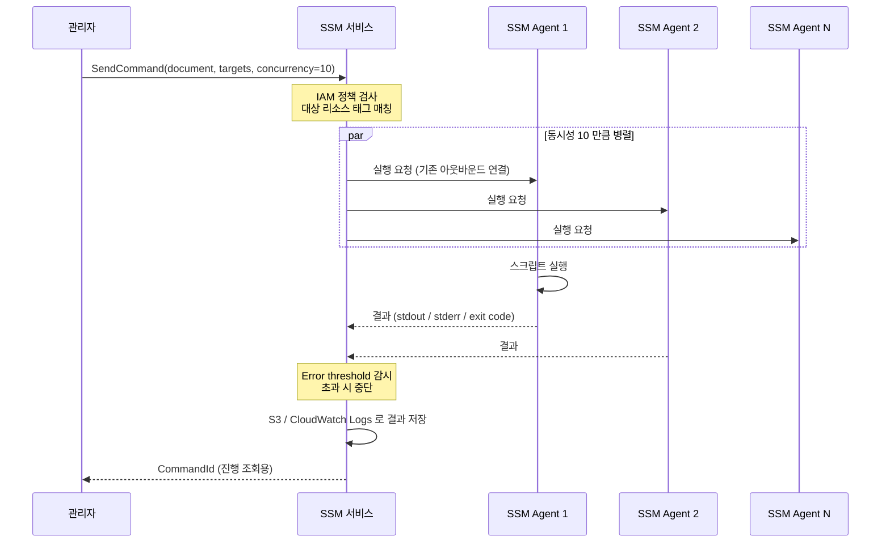

## 정의

**AWS SSM Run Command** 는 *하나의 API 호출로 수십 - 수천 개의 EC2 및 온프레미스 서버에 명령을 원격 실행* 하는 [[aws-systems-manager|Systems Manager]] 기능. SSH 를 열지 않고, 개별 서버에 로그인하지 않고, IAM 권한만으로 셸 스크립트 / PowerShell / AWS 제공 문서를 배포/실행할 수 있다.

**한 줄 요약**: *"모든 프로덕션 서버에 nginx 재시작 스크립트 실행" 같은 작업을 SSH 반복 스크립트 없이 SDK 한 번으로*.

## 왜 Run Command 인가

수동 원격 실행의 문제:

- **SSH 다중 실행 스크립트** (Ansible ad-hoc, pssh 등) 는 관리 서버와 SSH 접속성 필요
- **에러 처리 / 중단 / 재시도** 를 직접 구현
- **동시 실행 수 제어** 어려움 (수백 대 동시 실행 시 앱 부하)
- **감사 로그** 를 별도 수집
- **온프레미스 서버 + AWS 서버 혼재** 시 통합 도구 부재

Run Command 의 답:
- **SSH 불필요** ([[aws-ssm-session-manager|Session Manager]] 와 같은 통신 채널)
- **동시성 (concurrency) + 오류 임계값 (error threshold)** 내장
- **[[aws-cloudtrail|CloudTrail]] + [[aws-cloudwatch|CloudWatch Logs]]** 자동 통합
- **하이브리드 노드 지원** (온프레미스 서버)
- **SSM Document** 로 스크립트 표준화 / 파라미터화 / 버전 관리

## SSM Document

Run Command 의 실행 단위. *실행할 스크립트 / 파라미터 / 실행 환경* 을 정의한 YAML/JSON 문서.

### AWS 제공 문서 (사용 빈도 최고)

| Document | 용도 |
|:---|:---|
| `AWS-RunShellScript` | Linux 셸 명령 실행 |
| `AWS-RunPowerShellScript` | Windows PowerShell 실행 |
| `AWS-UpdateSSMAgent` | SSM Agent 최신 버전 설치 |
| `AWS-RunPatchBaseline` | [[aws-ssm-patch-manager\|Patch Manager]] 실행 |
| `AWS-ConfigureAWSPackage` | 패키지 설치 (Distributor 통합) |
| `AWS-RunAnsiblePlaybook` | Ansible playbook 실행 |
| `AWS-RunDockerAction` | Docker 명령 실행 |
| `AWS-GatherSoftwareInventory` | 인벤토리 수집 |

### 커스텀 문서

특정 워크플로를 재사용 가능하게 문서화.

```yaml
# nginx-restart.yaml
schemaVersion: '2.2'
description: 'nginx graceful restart with health check'
parameters:
  healthCheckPath:
    type: String
    default: /healthz
    description: nginx 헬스체크 경로
mainSteps:
  - action: aws:runShellScript
    name: gracefulRestart
    inputs:
      runCommand:
        - '#!/bin/bash'
        - 'set -e'
        - 'nginx -t                            # 설정 검증'
        - 'systemctl reload nginx              # graceful reload'
        - 'sleep 3'
        - 'curl -f http://localhost{{healthCheckPath}} || exit 1'
        - 'echo "OK"'
```

## 실행 흐름



**핵심 통찰**: [[aws-ssm-session-manager|Session Manager]] 와 동일한 아웃바운드 통신 채널을 사용. **인바운드 포트 필요 없음**.

## 실행 예제

### 예 1: 태그 매칭 + 셸 명령

```bash
aws ssm send-command \
  --document-name "AWS-RunShellScript" \
  --targets "Key=tag:Env,Values=prod" \
  --parameters 'commands=["sudo systemctl restart nginx"]' \
  --max-concurrency "10" \
  --max-errors "2" \
  --timeout-seconds 300 \
  --output-s3-bucket-name my-ssm-output \
  --output-s3-key-prefix restart-nginx/$(date +%F)
```

**주요 파라미터**:
- **`targets`**: 태그 매칭 (`Key=tag:Env,Values=prod`) 또는 인스턴스 ID (`Key=InstanceIds,Values=i-abc,i-def`)
- **`max-concurrency`**: 동시 실행 수 (`10` 또는 `50%`)
- **`max-errors`**: N 개 실패 시 중단 (`2` 또는 `10%`)
- **`timeout-seconds`**: 스크립트 실행 상한
- **`output-s3-*`**: stdout/stderr 를 S3 로 저장

### 예 2: 다중 스텝 스크립트

```bash
aws ssm send-command \
  --document-name "AWS-RunShellScript" \
  --targets "Key=tag:App,Values=api" \
  --parameters '{
    "commands": [
      "cd /opt/app",
      "git pull origin main",
      "npm install --production",
      "systemctl restart api"
    ],
    "workingDirectory": ["/opt/app"],
    "executionTimeout": ["600"]
  }'
```

### 예 3: 커스텀 Document 실행

```bash
aws ssm send-command \
  --document-name "nginx-restart" \
  --document-version "3" \
  --targets "Key=tag:Env,Values=prod" \
  --parameters "healthCheckPath=/status" \
  --max-concurrency "10%"
```

**버전 지정** 으로 재현성 확보.

## 진행 모니터링

```bash
# 명령 요약
aws ssm list-commands --command-id abc-123

# 인스턴스별 상세
aws ssm list-command-invocations \
  --command-id abc-123 \
  --details

# 특정 인스턴스 출력
aws ssm get-command-invocation \
  --command-id abc-123 \
  --instance-id i-xxx
```

**상태**:
- **Pending**: 스케줄됨
- **InProgress**: 실행 중
- **Success**: 완료 (exit 0)
- **Failed**: 실패 (exit != 0)
- **Cancelled** / **TimedOut** / **DeliveryTimedOut**

## 동시성 & 오류 임계값 (중요)

`max-concurrency` 와 `max-errors` 는 Run Command 의 안전 장치.

### max-concurrency

한 번에 실행되는 인스턴스 수 제한.

- **절대값**: `10` (동시 10 대만)
- **비율**: `10%` (전체 대상의 10%)

**용도**:
- 앱 재시작 명령을 100 대 동시 실행 시 서비스 다운
- 10% 씩 rolling → 항상 90% 가용 유지

### max-errors

**절대값** 또는 **비율** 로 오류 임계값 지정. 초과 시 나머지 실행 중단.

**전형적 조합**:
```
max-concurrency: 10%     # 10% 씩만
max-errors: 20%          # 20% 실패하면 중단 → 심각한 이슈 조기 감지
```

## Run Command vs 유사 기능 비교

같은 SSM 안에서도 유사한 것들이 있음. 목적별 구분.

| 기능 | 특성 | 사용 시점 |
|:---|:---|:---|
| **Run Command** | 일회성 명령/스크립트 | ad-hoc, 긴급 작업 |
| **[[aws-ssm-automation\|Automation]]** | 여러 단계 워크플로 (approval, 조건, AWS API 호출 등) | 복잡한 운영 자동화 |
| **[[aws-ssm-state-manager\|State Manager]]** | 원하는 상태 지속 유지 | 구성 드리프트 방지 |
| **[[aws-ssm-patch-manager\|Patch Manager]]** | 패치 특화 | 정기 패치 |
| **[[aws-ssm-session-manager\|Session Manager]]** | 인터랙티브 셸 | 사람이 직접 접속 |

**결정**:
- 한 번 실행 + 명령 반복 → **Run Command**
- 다단계 + 승인 필요 → **Automation**
- 항상 특정 상태 유지 → **State Manager**

## 실전 시나리오

### 1. 긴급 CVE 대응 (임시 mitigation)

```bash
# 취약한 서비스 즉시 중지
aws ssm send-command \
  --document-name "AWS-RunShellScript" \
  --targets "Key=tag:Env,Values=prod" \
  --parameters 'commands=["systemctl stop vulnerable-service", "iptables -A INPUT -p tcp --dport 8080 -j DROP"]' \
  --max-concurrency "100%"
```

### 2. 로그 수집

```bash
# 모든 서버의 최근 로그 수집 → S3
aws ssm send-command \
  --document-name "AWS-RunShellScript" \
  --targets "Key=tag:App,Values=web" \
  --parameters 'commands=["tar -czf /tmp/logs.tar.gz /var/log/nginx/", "aws s3 cp /tmp/logs.tar.gz s3://ops-logs/$(hostname)/"]' \
  --max-concurrency "20"
```

### 3. 앱 재배포 (Rolling)

```bash
aws ssm send-command \
  --document-name "app-deploy" \
  --targets "Key=tag:App,Values=api" \
  --max-concurrency "10%" \
  --max-errors "20%" \
  --parameters "version=v1.2.3"
```

10% 씩 배포 → 20% 실패 시 중단 → 자동 롤백 스크립트 트리거.

### 4. 정기 감사 (Cron 대체)

[[aws-eventbridge|EventBridge]] 스케줄러 → Run Command:

```
매일 09:00 → EventBridge Rule → SSM SendCommand
  → 모든 EC2 에서 df -h, ps aux 등 수집 → CloudWatch Logs
```

## 요금

- **Run Command 자체 무료**
- SSM Agent + IAM 표준
- [[aws-s3|S3]] / [[aws-cloudwatch|CloudWatch Logs]] 저장은 별도

## 함정

> [!WARNING]
> **`max-concurrency` 없음 (기본 50)** = 50 대 동시 실행. 앱 재시작 명령이면 서비스 대량 중단. 반드시 지정.

> [!CAUTION]
> **`max-errors` 없음 (기본 0)** = 1 대 실패해도 중단. 반대로 큰 값이면 모든 서버가 실패해도 계속. 워크로드에 맞게.

> [!WARNING]
> **긴 스크립트 timeout** = 기본 3600 초. 짧은 명령에 큰 값이면 hang. 반대로 큰 스크립트에 작은 값이면 강제 종료.

> [!IMPORTANT]
> **[[aws-cloudtrail|CloudTrail]] 로 감사** = 누가 언제 어떤 명령 실행했는지 모두 기록. 프로덕션 접근은 반드시 IAM 로그 검토.

> [!CAUTION]
> **커스텀 Document 는 버전 관리 필수**. 프로덕션에서 `--document-version "$LATEST"` 는 재현 불가.

> [!WARNING]
> **stdout 큼** = SSM API 응답 제한 (24 KB). 큰 출력은 S3 로 저장 (`--output-s3-*`).

> [!IMPORTANT]
> **IAM 정책 최소 권한**. `ssm:SendCommand` + 특정 document + 특정 태그 리소스. `Resource: *` 는 금지.

## 관련 위키

- [[aws-systems-manager|Systems Manager (개요)]] - 상위 서비스
- [[aws-ssm-session-manager|SSM Session Manager]] - 인터랙티브 셸
- [[aws-ssm-automation|SSM Automation]] - 복잡한 워크플로
- [[aws-ssm-state-manager|SSM State Manager]] - 지속 상태 유지
- [[aws-ssm-patch-manager|SSM Patch Manager]] - 패치 특화
- [[aws-ec2|AWS EC2]] - 관리 대상
- [[aws-iam|IAM]] - 권한
- [[aws-cloudtrail|CloudTrail]] - 감사
- [[aws-cloudwatch|CloudWatch Logs]] - 출력 저장
- [[aws-eventbridge|EventBridge]] - 스케줄
