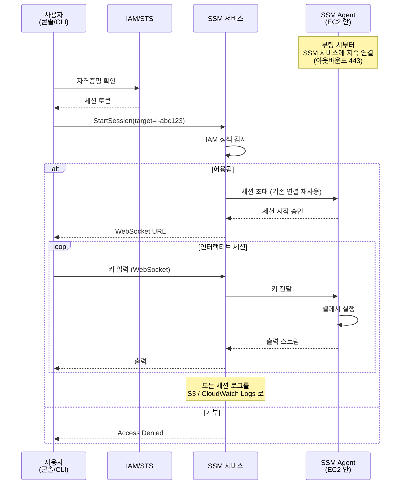
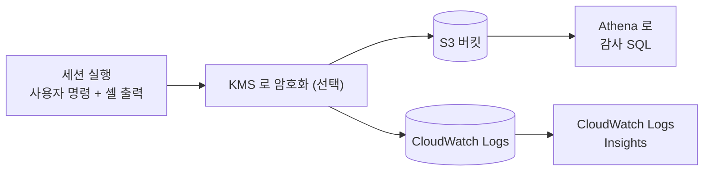

## 정의

**AWS SSM Session Manager** 는 *[[aws-systems-manager|Systems Manager]] 의 셸 접속 기능*. SSH / RDP 포트를 열지 않고, 배스천 호스트도 없이, 브라우저 / CLI / IDE 에서 [[aws-ec2|EC2]] 및 온프레미스 서버에 셸을 열 수 있게 한다. 모든 세션은 [[aws-cloudtrail|CloudTrail]] 로 감사되고 로그는 [[aws-s3|S3]] / [[aws-cloudwatch|CloudWatch Logs]] 에 저장.

**한 줄 요약**: *포트 22/3389 를 영원히 닫아도 서버 관리 가능하게 만드는 서비스*.

## 왜 Session Manager 인가

전통 원격 접속의 문제:

- **인바운드 포트 개방** (SSH 22, RDP 3389) = 공격 표면 증가
- **배스천 호스트** = 별도 EC2 유지 비용 + 관리 부담
- **SSH 키 관리** = 유출 위험, 로테이션 어려움, 개인 IdP 와 연동 어려움
- **접속 감사 어려움** = 누가 언제 무엇을 실행했는지 추적 부실
- **프라이빗 서브넷 접속** = VPN / bastion / port forwarding 필요

Session Manager 의 답:
- **인바운드 포트 0 개** (SSM Agent 가 아웃바운드 443 으로 SSM 서비스에 연결)
- **배스천 불필요** (SSM 서비스 자체가 게이트웨이 역할)
- **SSH 키 불필요** ([[aws-iam|IAM]] role 로 인증)
- **완전한 감사** (모든 세션 시작/명령/출력 기록)
- **프라이빗 서브넷 지원** ([[aws-vpc|VPC]] Endpoint 로)

## 어떻게 동작하는가



**핵심 통찰**:
- **연결 방향이 역전됨**: 사용자 → 서버가 아니라, 서버 (SSM Agent) → SSM 서비스 로 아웃바운드 연결
- 사용자는 SSM 서비스와 통신 (443)
- SSM 서비스가 이미 열린 아웃바운드 연결을 통해 서버로 명령 전달
- **인바운드 규칙 필요 없음**

## 필요한 준비물

### 1. SSM Agent

- Amazon Linux 2/2023, Ubuntu, RHEL 등 최신 AMI 에 **기본 설치**
- 온프레미스 서버는 수동 설치 (`amazon-ssm-agent` 패키지)
- 자동 시작 (systemd)

### 2. IAM Instance Profile

인스턴스에 SSM 통신 권한 부여. `AmazonSSMManagedInstanceCore` AWS 관리형 정책이 최소.

```
Instance Profile: EC2-SSM-Role
  Policies:
    - AmazonSSMManagedInstanceCore  (필수)
    - CloudWatchAgentServerPolicy    (모니터링용, 선택)
```

### 3. 사용자 IAM 권한

관리자에게는 `ssm:StartSession`, 대상 리소스 지정.

```json
{
  "Version": "2012-10-17",
  "Statement": [
    {
      "Effect": "Allow",
      "Action": "ssm:StartSession",
      "Resource": [
        "arn:aws:ec2:*:*:instance/*",
        "arn:aws:ssm:*::document/AWS-StartSSHSession"
      ],
      "Condition": {
        "StringEquals": {
          "aws:ResourceTag/Environment": "prod",
          "ssm:SessionDocumentAccessCheck": "true"
        }
      }
    }
  ]
}
```

- **태그 기반 접근 제어** 가능 (Environment=prod 만 접근 허용 등)
- **DocumentAccessCheck**: 특정 SSM Document 만 사용

### 4. (프라이빗 서브넷) VPC Endpoint

프라이빗 서브넷 인스턴스는 인터넷 접근 없이 SSM 통신하려면 3개 endpoint 필요:

- `com.amazonaws.<region>.ssm`
- `com.amazonaws.<region>.ssmmessages`
- `com.amazonaws.<region>.ec2messages`

## 접속 방법 3 가지

### 1. AWS 콘솔 (브라우저)

EC2 콘솔 → Connect → Session Manager. 브라우저 안에서 xterm.

**적합**:
- 임시 트러블슈팅
- 노트북 없이 태블릿 등에서
- 처음 시작

### 2. AWS CLI

```bash
aws ssm start-session --target i-0abc123def456
```

- 로컬 터미널에서 그대로
- `Session Manager Plugin` 필요 (`brew install --cask session-manager-plugin`)

### 3. SSH 프록시 (기존 SSH 도구와 호환)

`~/.ssh/config`:
```
Host i-* mi-*
  ProxyCommand aws ssm start-session --target %h \
    --document-name AWS-StartSSHSession \
    --parameters portNumber=%p
```

```bash
ssh ec2-user@i-0abc123def456
scp file.tar.gz ec2-user@i-0abc123def456:/tmp/
```

**핵심**: `scp`, `rsync`, VS Code Remote SSH 등 SSH 기반 도구가 그대로 작동. **인바운드 22 여전히 닫힘**.

### 4. 포트 포워딩 (Port Forwarding)

로컬 포트 → 인스턴스의 특정 포트 터널.

```bash
# 로컬 5432 → 인스턴스 5432 (RDS 프록시)
aws ssm start-session \
  --target i-0abc123def456 \
  --document-name AWS-StartPortForwardingSession \
  --parameters "portNumber=5432,localPortNumber=5432"

# 원격 호스트 포워딩 (인스턴스 → RDS)
aws ssm start-session \
  --target i-0abc123def456 \
  --document-name AWS-StartPortForwardingSessionToRemoteHost \
  --parameters '{"host":["my-db.abc.us-east-1.rds.amazonaws.com"],"portNumber":["5432"],"localPortNumber":["5432"]}'
```

로컬에서 `psql -h localhost -p 5432` 로 RDS 접속 가능. 개발자 노트북에서 프라이빗 RDS 접속의 표준 방법.

## 감사 & 로깅

### CloudTrail 이벤트

- `StartSession`, `TerminateSession`, `ResumeSession` 이벤트 자동 기록
- 누가 언제 어느 인스턴스에 접속했는지 감사

### 세션 로그

Preferences 에서 활성화하면 **모든 키 입력 + 출력** 을 저장.



**용도**:
- 규제 준수 감사 (SOC2, PCI-DSS, HIPAA)
- 사고 조사 (누가 무엇을 실행했나)
- 보안 팀 정책 강제

## 실행 사용자

기본은 `ssm-user` 라는 전용 사용자 (sudo 권한 있음). 변경 가능:

```
Session Manager Preferences:
  Run As: ec2-user   # 기존 사용자로 세션 시작
```

**패턴**:
- **개인화**: 사용자마다 다른 OS 계정으로 실행 (audit trail 명확)
- **표준화**: 모두 `ssm-user` 로 실행 (단순함)

## Session Manager vs 대안 비교

| 방법 | 인바운드 포트 | 배스천 | SSH 키 | 감사 |
|:---|:---|:---|:---|:---|
| **SSH 직접** | 22 개방 | X | 필요 | 서버 로그만 |
| **배스천 호스트** | 22 (배스천만) | O | 필요 | 배스천 로그 |
| **[[aws-vpc\|VPN]] + SSH** | VPN 필요 | X | 필요 | VPN + SSH 로그 |
| **EC2 Instance Connect** | 22 (일시 IP) | X | 임시 | CloudTrail |
| **Session Manager** | 없음 | X | 없음 | 완전 (모든 입력) |

## 실전 사용 시나리오

### 1. 프라이빗 서브넷 EC2 접속

```
1. EC2 는 프라이빗 서브넷 (인터넷 X)
2. VPC Endpoint (ssm, ssmmessages, ec2messages) 활성
3. IAM Instance Profile 에 AmazonSSMManagedInstanceCore
4. 개발자: aws ssm start-session --target i-xxx
```

배스천/VPN 없이 프라이빗 서브넷 접근 성공.

### 2. 로컬 노트북에서 프라이빗 RDS 접속

```
1. Session Manager 로 EC2 에 port forwarding 세션
2. 로컬 5432 -> EC2 -> RDS 5432 터널
3. psql -h localhost 로 접속
```

RDS 를 인터넷에 노출 없이 개발자가 접속.

### 3. RDP 대체 (Windows)

```bash
aws ssm start-session \
  --target i-0abc \
  --document-name AWS-StartPortForwardingSession \
  --parameters "portNumber=3389,localPortNumber=13389"
```

`mstsc /v:localhost:13389` 로 RDP 접속. 인바운드 3389 여전히 닫힘.

### 4. 감사가 필수인 환경

```
Preferences:
  Enable session logging: S3 + CloudWatch Logs
  KMS 암호화: enabled

정책:
  1일 1회 CloudWatch Logs Insights 로 특권 세션 리뷰
  이상 세션은 알림 (SNS + Lambda)
```

금융, 의료, 정부 등 감사 필수 환경.

## 함정

> [!WARNING]
> **SSM Agent + IAM Instance Profile** 없으면 관리형 노드 안 됨. 두 조건 모두 필요.

> [!CAUTION]
> **프라이빗 서브넷 접근** 시 VPC Endpoint 3개 (ssm, ssmmessages, ec2messages) 필수. 없으면 SSM Agent 가 SSM 서비스와 통신 불가.

> [!WARNING]
> **세션 로그 활성화 안 함** = 감사 사각. 규제 환경은 반드시 S3 + CloudWatch Logs 로.

> [!IMPORTANT]
> **`ssm-user` 는 sudo 권한**. 원치 않으면 특정 사용자 (`ec2-user` 등) 로 실행하도록 Preferences 조정.

> [!CAUTION]
> **CLI 접속 시 `Session Manager Plugin` 필요**. 설치 안 하면 CLI 로 세션 못 엶.

> [!WARNING]
> **IAM 정책 지나치게 넓음** = 모든 EC2 접근 허용. 태그 조건 (`Environment=prod`), 리소스 지정으로 최소 권한.

> [!IMPORTANT]
> **SCP 로 파일 전송** 은 SSH 프록시 설정 후 가능. Session Manager 자체는 raw 셸만.

## 관련 위키

- [[aws-systems-manager|Systems Manager (개요)]] - 상위 서비스
- [[aws-ssm-run-command|SSM Run Command]] - 다수 서버 명령 실행
- [[aws-ec2|AWS EC2]] - 관리 대상
- [[aws-iam|IAM]] - 접근 제어
- [[aws-vpc|VPC]] - 프라이빗 서브넷 + Endpoint
- [[aws-cloudtrail|CloudTrail]] - 감사
- [[aws-cloudwatch|CloudWatch Logs]] - 세션 로그
- [[aws-kms|KMS]] - 세션 로그 암호화
