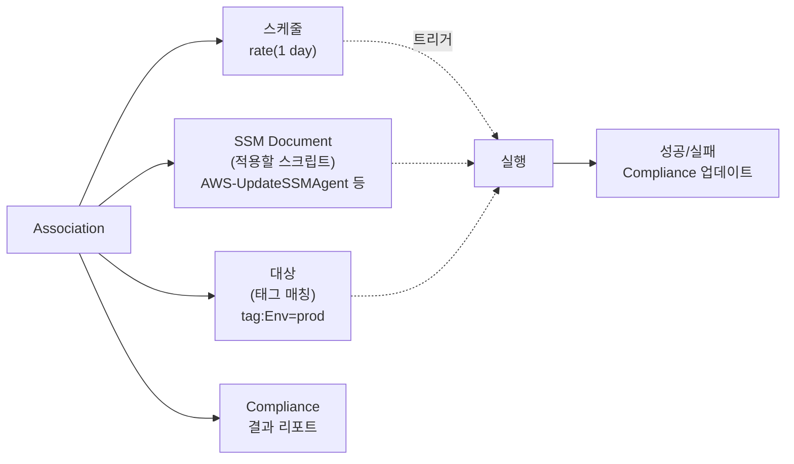
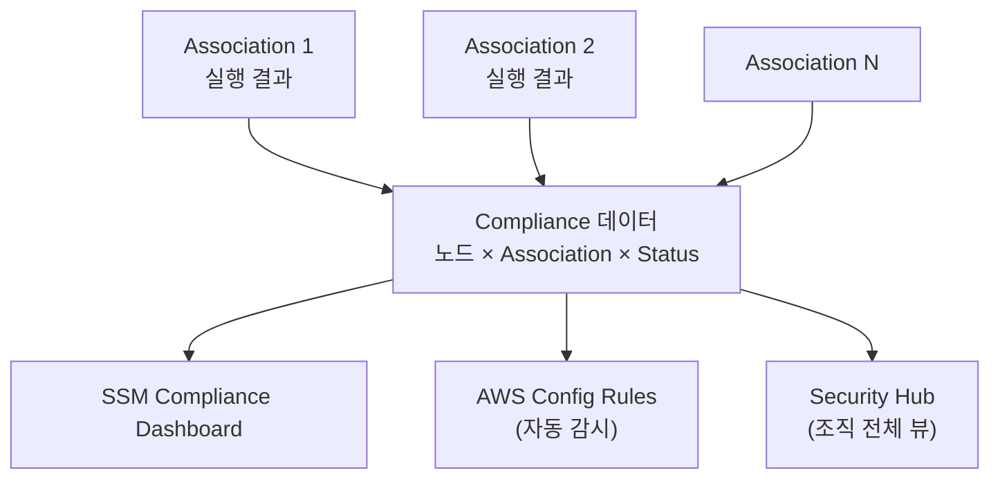

## 정의

**AWS SSM State Manager** 는 *관리형 노드 (EC2, 온프레미스) 가 항상 정의된 상태를 유지하도록 정기적으로 확인 + 적용* 하는 [[aws-systems-manager|Systems Manager]] 기능. "SSM Agent 최신 버전 유지", "CloudWatch Agent 설치되어 있어야 함", "특정 서비스 실행 중이어야 함" 같은 *"원하는 상태 (desired state)"* 를 선언하고 정기 실행으로 강제.

**한 줄 요약**: *구성 드리프트 (configuration drift) 를 자동 감지 + 자동 복구* 하는 서비스.

## 왜 State Manager 인가

### 구성 드리프트의 문제

시간이 지나면 서버 상태가 서서히 어긋남:

- 담당자가 SSH 로 직접 수정 (temporary fix 라며)
- 자동 업데이트로 예상 밖 버전
- 신규 노드가 최신 초기화 스크립트 반영 안 됨
- 3개월 전 결정한 표준이 흐지부지

결과: *"제가 알기론 동일한데요..."* 라고 하는 서버가 사실은 다 다름.

### 전통적 대응의 한계

- **Cron 스크립트**: 실행 이력 감사 어려움
- **Configuration Management (Chef/Puppet/Ansible)**: 별도 인프라 + 학습
- **[[aws-ssm-run-command|Run Command]] 정기 실행**: 실행은 되지만 컴플라이언스 뷰 없음

### State Manager 의 답

- **Association**: "이 노드 그룹" + "이 문서 (SSM Document)" + "이 스케줄" 을 묶은 선언
- **정기 실행**: 스케줄대로 자동 (cron / rate)
- **컴플라이언스 뷰**: 어느 노드가 준수 / 위반인지 대시보드
- **자동 복구**: 상태가 어긋나면 스크립트로 다시 적용

## Association: State Manager 의 핵심 단위

*Association 은 "노드 X 는 문서 Y 의 상태를 스케줄 Z 로 유지해야 함"* 이라는 선언.



**구성 요소**:
- **이름 (Association Name)**
- **Document** (실행할 스크립트, AWS 제공 또는 커스텀)
- **Target** (태그, 인스턴스 ID, 리소스 그룹)
- **Schedule** (cron 또는 rate)
- **파라미터**
- **출력** ([[aws-s3|S3]] / [[aws-cloudwatch|CloudWatch Logs]])
- **Compliance 심각도**

## Association 예제

### 예 1: SSM Agent 항상 최신 유지

```bash
aws ssm create-association \
  --name "AWS-UpdateSSMAgent" \
  --targets "Key=tag:ManagedBy,Values=SSM" \
  --schedule-expression "rate(7 days)" \
  --compliance-severity CRITICAL \
  --association-name "keep-ssm-agent-updated"
```

**의미**:
- 매주 tag:ManagedBy=SSM 인 모든 노드에 `AWS-UpdateSSMAgent` 실행
- Agent 가 최신이 아니면 자동 업데이트
- 실패한 노드는 CRITICAL 컴플라이언스 위반으로 표시

### 예 2: CloudWatch Agent 필수 설치

```yaml
# 커스텀 Document: ensure-cw-agent.yaml
schemaVersion: '2.2'
description: 'CloudWatch Agent 설치 및 실행 상태 유지'
mainSteps:
  - action: aws:runShellScript
    name: installAndStart
    inputs:
      runCommand:
        - '#!/bin/bash'
        - 'if ! systemctl is-active --quiet amazon-cloudwatch-agent; then'
        - '  yum install -y amazon-cloudwatch-agent'
        - '  systemctl enable --now amazon-cloudwatch-agent'
        - 'fi'
```

```bash
aws ssm create-association \
  --name "ensure-cw-agent" \
  --targets "Key=tag:Env,Values=prod" \
  --schedule-expression "rate(1 day)" \
  --compliance-severity HIGH
```

매일 실행해 CloudWatch Agent 가 없거나 죽어있으면 재설치/시작.

### 예 3: 보안 설정 강제 (SSH 포트 22 만 허용)

```yaml
schemaVersion: '2.2'
description: 'SSH 는 22, root 로그인 금지, 비밀번호 인증 금지'
mainSteps:
  - action: aws:runShellScript
    inputs:
      runCommand:
        - 'sed -i "s/^#\?Port .*/Port 22/" /etc/ssh/sshd_config'
        - 'sed -i "s/^#\?PermitRootLogin .*/PermitRootLogin no/" /etc/ssh/sshd_config'
        - 'sed -i "s/^#\?PasswordAuthentication .*/PasswordAuthentication no/" /etc/ssh/sshd_config'
        - 'systemctl restart sshd'
```

담당자가 SSH 로 임시로 root 로그인 켜놓으면 다음 실행 시 다시 꺼짐.

## 스케줄 표현

- **Rate**: `rate(1 hour)`, `rate(7 days)`
- **Cron**: `cron(0 3 ? * SUN *)` (매주 일요일 03:00 UTC)
- **On-change** (2024+): 대상 변경 감지 시 즉시 실행

## Compliance (컴플라이언스) 뷰

State Manager 실행 결과가 SSM Compliance 로 자동 집계.



**상태**:
- **COMPLIANT**: 마지막 실행 성공
- **NON_COMPLIANT**: 실패 (심각도 별로 표시)

**활용**:
- 조직 전체에서 어느 노드가 뒤처졌는지 즉시 파악
- 감사 리포트 자동 생성
- 위반 감지 시 [[aws-eventbridge|EventBridge]] 로 알림

## State Manager vs Automation vs Run Command

Similar 하지만 목적이 다름.

| 축 | [[aws-ssm-run-command\|Run Command]] | [[aws-ssm-automation\|Automation]] | State Manager |
|:---|:---|:---|:---|
| **성격** | 일회성 명령 | 다단계 워크플로 | 지속적 상태 유지 |
| **실행 시점** | 사용자가 트리거 | 사용자 또는 이벤트 | **정기 자동** |
| **컴플라이언스** | X | X | **O (기본)** |
| **재실행** | 매번 수동 | 수동 or 이벤트 | 자동 |
| **대표 사용** | "지금 nginx 재시작" | "AMI 만들고 인스턴스 교체" | "SSM Agent 최신 유지" |

**결정**:
- 한 번만 실행 → Run Command
- 여러 단계 워크플로 → Automation
- 항상 특정 상태 유지 → **State Manager**

## 흔한 Association 패턴

### 1. 부팅 시 초기화 (`applyOnlyAtCronInterval: false`)

새 EC2 가 태그 매칭 되는 순간 즉시 실행.

- 신규 노드 자동 설정
- 오토스케일링으로 늘어난 인스턴스 표준화

### 2. 정기 검증 (Scheduled)

매일/주 등 정기 실행으로 드리프트 감지 + 복구.

### 3. On-Demand (스케줄 없음)

Association 만 정의하고 수동으로 실행 (`start-associations-once`). 배포 시점에.

## 실전 예제 (조합)

**시나리오**: 신규 프로덕션 EC2 노드가 반드시 다음을 유지해야 함.

1. SSM Agent 최신 (매주)
2. CloudWatch Agent 설치 + 실행 (매일)
3. Patch Manager Baseline 스캔 (매일)
4. 보안 설정 (SSH port 22 만, root 금지) (매일)
5. Sudo 로그 파일 로테이션 설정 (매주)

각각 별도 Association 으로 정의. tag:Env=prod 매칭. 모두 컴플라이언스 대시보드에서 통합 관측.

```
Associations
├─ keep-ssm-agent (rate 7 days)      → AWS-UpdateSSMAgent
├─ ensure-cw-agent (rate 1 day)      → custom document
├─ scan-patches (rate 1 day)         → AWS-RunPatchBaseline (Operation=Scan)
├─ enforce-ssh-config (rate 1 day)   → custom document
└─ setup-logrotate (rate 7 days)     → custom document
```

## 요금

- **State Manager 자체 무료**
- 하위 Run Command / SSM Agent 통신 등 표준 무료
- [[aws-s3|S3]] / [[aws-cloudwatch|CloudWatch Logs]] 저장은 별도

## 함정

> [!WARNING]
> **Association 이 실패하는데 알림 없음** = 조용히 드리프트 지속. Compliance NON_COMPLIANT 를 [[aws-eventbridge|EventBridge]] 로 감지 → [[aws-sns|SNS]] 알림.

> [!CAUTION]
> **스크립트가 idempotent 하지 않음** = 매번 실행하면 부작용. `if ! installed; then install; fi` 스타일로.

> [!WARNING]
> **잘못된 Association 이 대량 파괴** 가능. 예: `rm -rf /var/log/*` 을 매일 실행. Dev 환경에서 충분히 테스트.

> [!IMPORTANT]
> **`applyOnlyAtCronInterval: true`** 는 새 노드 즉시 실행 안 함. 신규 노드 초기 설정에는 `false`.

> [!CAUTION]
> **재시작 필요한 변경** = 스크립트가 재시작 유발 시 서비스 중단. Maintenance Window 와 조합 (State Manager 는 Maintenance Window 없이 정시 실행).

> [!WARNING]
> **Association 수 관리 안 하면 카오스**. 이름 규약 (`{env}-{purpose}`), 태그 매칭 명확히.

> [!IMPORTANT]
> **동시성 (`max-concurrency`)** 지정. Run Command 처럼 대량 동시 실행 방지. 특히 재시작 유발 스크립트.

## 관련 위키

- [[aws-systems-manager|Systems Manager (개요)]] - 상위 서비스
- [[aws-ssm-run-command|SSM Run Command]] - 일회성 명령
- [[aws-ssm-automation|SSM Automation]] - 워크플로
- [[aws-ssm-patch-manager|SSM Patch Manager]] - 패치 특화 (State Manager 로도 실행 가능)
- [[aws-config|AWS Config]] - 대안 컴플라이언스 감시
- [[aws-eventbridge|EventBridge]] - 컴플라이언스 이벤트
- [[aws-sns|SNS]] - 알림
- [[aws-cloudwatch|CloudWatch]] - 실행 로그
