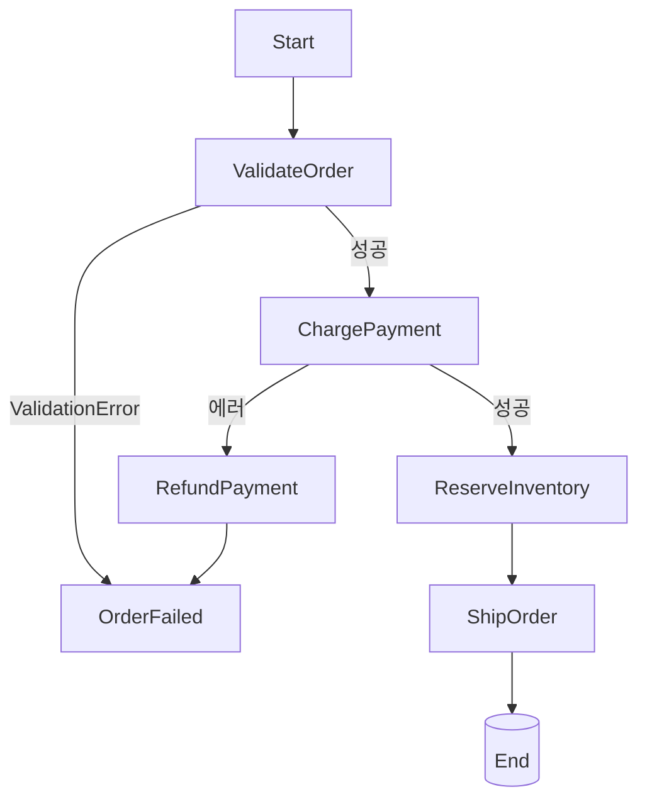
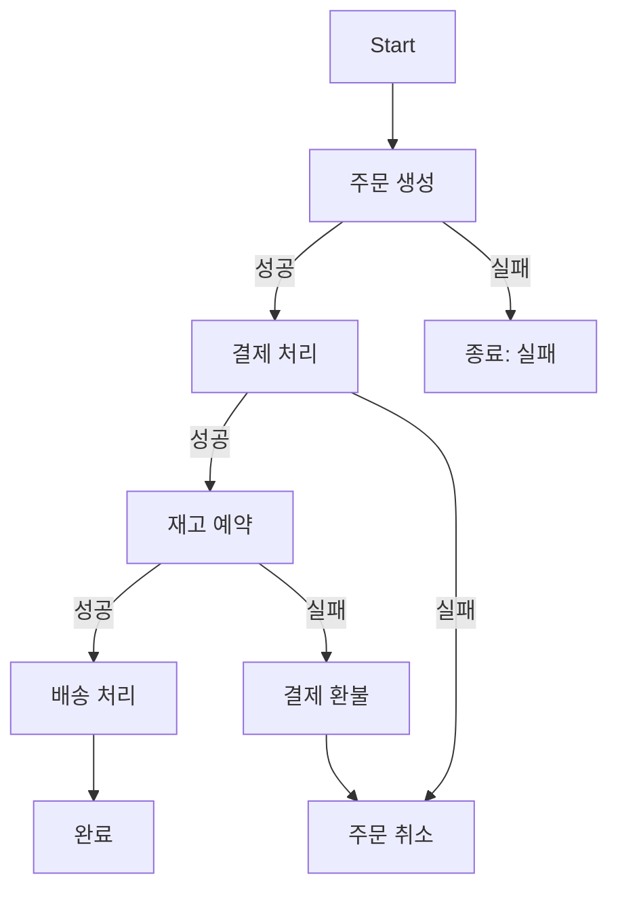

## 정의

**Step Functions** = *서버리스 워크플로 오케스트레이션*. *Amazon States Language (ASL, JSON)* 으로 *상태 기계* 정의.  
각 단계의 재시도, 에러 처리, 분기, 병렬 실행을 코드 없이 선언적으로 구성.

## 사용 상황

| 상황 | Step Functions 활용 |
|---|---|
| 주문 처리 (결제 → 재고 → 배송) | Task 체인 + Catch/Retry |
| 인간 승인 후 진행 | Wait for Callback |
| CSV 파일 행 병렬 처리 | Distributed Map |
| 마이크로서비스 Saga 패턴 | Catch + 보상 Task |
| ML 파이프라인 (전처리 → 학습 → 배포) | Parallel + Task |
| 주기적 배치 | EventBridge Scheduler + SFN |

## ASL 예시

```json
{
  "StartAt": "ValidateOrder",
  "States": {
    "ValidateOrder": {
      "Type": "Task",
      "Resource": "arn:aws:lambda:...:validate",
      "Next": "ChargePayment",
      "Retry": [{
        "ErrorEquals": ["Lambda.ServiceException"],
        "MaxAttempts": 3,
        "BackoffRate": 2.0
      }],
      "Catch": [{
        "ErrorEquals": ["ValidationError"],
        "Next": "OrderFailed"
      }]
    },
    "ChargePayment": {
      "Type": "Task",
      "Resource": "arn:aws:lambda:...:charge",
      "Next": "ReserveInventory",
      "Catch": [{
        "ErrorEquals": ["States.ALL"],
        "Next": "RefundPayment"
      }]
    },
    "ReserveInventory": {
      "Type": "Task",
      "Resource": "arn:aws:lambda:...:reserve",
      "Next": "ShipOrder"
    },
    "ShipOrder": {
      "Type": "Task",
      "Resource": "arn:aws:lambda:...:ship",
      "End": true
    },
    "OrderFailed": { "Type": "Fail", "Cause": "Validation" },
    "RefundPayment": {
      "Type": "Task",
      "Resource": "arn:aws:lambda:...:refund",
      "Next": "OrderFailed"
    }
  }
}
```

## 시각화



> 자세한 saga 흐름은 [[saga-pattern]].

## State 종류

| Type | 의미 |
|---|---|
| `Task` | Lambda, ECS, Glue, SNS, SQS 등 |
| `Choice` | if-else 분기 |
| `Wait` | 대기 (sec, timestamp) |
| `Parallel` | 동시 실행 |
| `Map` | 배열 iterate |
| `Pass` | 데이터 변환만 |
| `Succeed` / `Fail` | 종료 |

## Parallel State

여러 브랜치를 *동시에* 실행, 모두 완료되면 다음 단계 진행.

```json
{
  "Type": "Parallel",
  "Branches": [
    {
      "StartAt": "SendEmailNotification",
      "States": {
        "SendEmailNotification": {
          "Type": "Task",
          "Resource": "arn:lambda:...:email",
          "End": true
        }
      }
    },
    {
      "StartAt": "UpdateAnalytics",
      "States": {
        "UpdateAnalytics": {
          "Type": "Task",
          "Resource": "arn:lambda:...:analytics",
          "End": true
        }
      }
    }
  ],
  "Next": "Done"
}
```

> 브랜치 중 하나라도 실패하면 전체 Parallel 실패. 각 브랜치에 Catch 권장.

## Choice State

```json
{
  "Type": "Choice",
  "Choices": [
    {
      "Variable": "$.orderAmount",
      "NumericGreaterThan": 1000,
      "Next": "PremiumProcessing"
    },
    {
      "Variable": "$.paymentMethod",
      "StringEquals": "CRYPTO",
      "Next": "CryptoGateway"
    }
  ],
  "Default": "StandardProcessing"
}
```

> Choice 는 `End: true` 나 `Retry` 없음. 반드시 `Default` 설정 권장.

## Standard vs Express

| | Standard | Express |
|---|---|---|
| 실행 시간 | 최대 1년 | 5분 |
| 가격 모델 | per-transition | duration |
| 적합 | long-running, 인간 승인 | 짧은 API |
| 실행 이력 | 90일 | 짧음 |
| Throughput | 2000/s | *100,000+/s* |

## Map (배열 처리)

```json
{
  "Type": "Map",
  "ItemsPath": "$.orders",
  "MaxConcurrency": 10,
  "Iterator": {
    "StartAt": "ProcessOne",
    "States": {
      "ProcessOne": {
        "Type": "Task",
        "Resource": "arn:lambda:...",
        "End": true
      }
    }
  }
}
```

> *수만 ~ 수십만 항목* 병렬 처리.

## Distributed Map (2022+)

*수백만 항목*까지. S3 prefix 의 모든 객체 처리 같은 *큰 batch*.

```json
{
  "Type": "Map",
  "ItemReader": {
    "Resource": "arn:aws:states:::s3:getObject",
    "Parameters": {
      "Bucket": "my-bucket",
      "Key": "data/records.csv"
    }
  },
  "MaxConcurrency": 1000,
  "ToleratedFailurePercentage": 5
}
```

## Wait for Callback

```json
{
  "Type": "Task",
  "Resource": "arn:aws:states:::lambda:invoke.waitForTaskToken",
  "Parameters": {
    "FunctionName": "manual-approval-notifier",
    "Payload": { "taskToken.$": "$$.Task.Token" }
  }
}
```

> *인간 승인 / 외부 API 응답 대기*. 토큰을 외부에 넘기고 *완료 알림 대기*.

## Saga 패턴 아키텍처



> 각 단계 실패 시 *보상 트랜잭션* 역순 실행. Step Functions 의 Catch 로 구현.  
> 자세히는 [[saga-pattern]], [[outbox-pattern]].

## 모니터링

| 도구 | 용도 |
|---|---|
| CloudWatch Logs | 실행 이력, 상태 전환 로그 |
| X-Ray | 각 Task 의 latency / 오류 추적 |
| CloudWatch Metrics | ExecutionsStarted, ExecutionsFailed 등 |

```yaml
# SAM/CloudFormation 에서 로깅 활성화
StateMachine:
  Type: AWS::Serverless::StateMachine
  Properties:
    Logging:
      Level: ALL
      IncludeExecutionData: true
      Destinations:
        - CloudWatchLogsLogGroup:
            LogGroupArn: !GetAtt SFNLogGroup.Arn
```

## Step Functions vs Temporal

| | Step Functions | Temporal |
|---|---|---|
| 운영 | managed (AWS) | self-host 또는 Temporal Cloud |
| 코드 | JSON ASL | *언어 코드 (TS, Go, Java, ...)* |
| 학습 곡선 | 중간 | 높음 |
| 가격 | per-transition | hosted 또는 자체 |
| 적합 | AWS-native | 멀티 클라우드 / 복잡 코드 |

## 흔한 함정

> [!WARNING]
> 1. **Retry / Catch 미정의** = 한 단계 실패 = 전체 fail. *명시 정책*.
> 2. **Express 의 *5분 한도*** = 모르고 사용하면 truncation. Standard 권장 (모르면).
> 3. **상태 사이 데이터 전달 *너무 큼*** = 256KB 한도. S3 reference 패턴 사용.
> 4. **시각화만 의존** = 복잡 workflow 의 *디버깅 어려움*. CloudWatch Logs + X-Ray.
> 5. **Choice 의 Default 없음** = 매칭 실패 시 runtime error.
> 6. **Parallel 브랜치에서 외부 상태 변경** = 보상 트랜잭션 없으면 partial 업데이트 위험.

## 관련 위키

- [[aws-lambda]]
- [[aws-eventbridge]]
- [[saga-pattern]]
- [[outbox-pattern]]
- [[aws-cloudwatch]]
