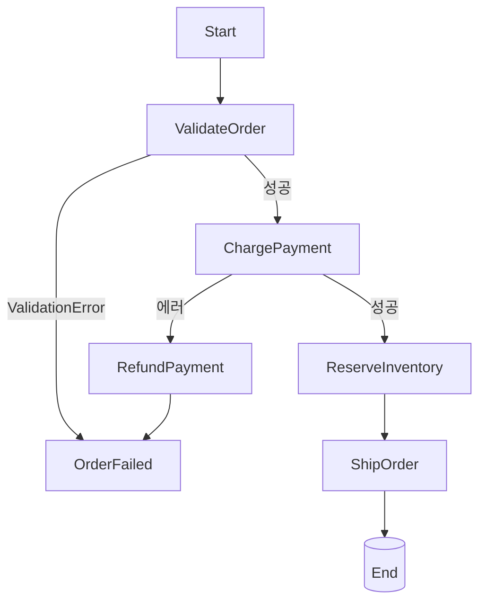

## 정의

**Step Functions** = *서버리스 워크플로 오케스트레이션*. *Amazon States Language (ASL, JSON)* 으로 *상태 기계* 정의.

## ASL 예시

```json
{
  "StartAt": "ValidateOrder",
  "States": {
    "ValidateOrder": {
      "Type": "Task",
      "Resource": "arn:aws:lambda:...:validate",
      "Next": "ChargePayment",
      "Retry": [{
        "ErrorEquals": ["Lambda.ServiceException"],
        "MaxAttempts": 3,
        "BackoffRate": 2.0
      }],
      "Catch": [{
        "ErrorEquals": ["ValidationError"],
        "Next": "OrderFailed"
      }]
    },
    "ChargePayment": {
      "Type": "Task",
      "Resource": "arn:aws:lambda:...:charge",
      "Next": "ReserveInventory",
      "Catch": [{
        "ErrorEquals": ["States.ALL"],
        "Next": "RefundPayment"
      }]
    },
    "ReserveInventory": {
      "Type": "Task",
      "Resource": "arn:aws:lambda:...:reserve",
      "Next": "ShipOrder"
    },
    "ShipOrder": {
      "Type": "Task",
      "Resource": "arn:aws:lambda:...:ship",
      "End": true
    },
    "OrderFailed": { "Type": "Fail", "Cause": "Validation" },
    "RefundPayment": {
      "Type": "Task",
      "Resource": "arn:aws:lambda:...:refund",
      "Next": "OrderFailed"
    }
  }
}
```

## 시각화



> 자세한 saga 흐름은 [[saga-pattern]].

## State 종류

| Type | 의미 |
|---|---|
| `Task` | Lambda, ECS, Glue, SNS, SQS 등 |
| `Choice` | if-else 분기 |
| `Wait` | 대기 (sec, timestamp) |
| `Parallel` | 동시 실행 |
| `Map` | 배열 iterate |
| `Pass` | 데이터 변환만 |
| `Succeed` / `Fail` | 종료 |

## Standard vs Express

| | Standard | Express |
|---|---|---|
| 실행 시간 | 최대 1년 | 5분 |
| 가격 모델 | per-transition | duration |
| 적합 | long-running (인간 승인) | 짧은 API |
| 실행 이력 | 90일 | 짧음 |
| Throughput | 2000/s | *100,000+/s* |

## Map (배열 처리)

```json
{
  "Type": "Map",
  "ItemsPath": "$.orders",
  "MaxConcurrency": 10,
  "Iterator": {
    "StartAt": "ProcessOne",
    "States": {
      "ProcessOne": {
        "Type": "Task",
        "Resource": "arn:lambda:...",
        "End": true
      }
    }
  }
}
```

> *수만 ~ 수십만 항목* 병렬 처리.

## Distributed Map (2022+)

*수백만 항목*까지. S3 prefix 의 모든 객체 처리 같은 *큰 batch*.

## Wait for Callback

```json
{
  "Type": "Task",
  "Resource": "arn:aws:states:::lambda:invoke.waitForTaskToken",
  "Parameters": {
    "FunctionName": "manual-approval-notifier",
    "Payload": { "taskToken.$": "$$.Task.Token" }
  }
}
```

> *인간 승인 / 외부 API 응답 대기*. 토큰을 외부에 넘기고 *완료 알림 대기*.

## Step Functions vs Temporal

| | Step Functions | Temporal |
|---|---|---|
| 운영 | managed (AWS) | self-host 또는 Temporal Cloud |
| 코드 | JSON ASL | *언어 코드 (TS, Go, Java, ...)* |
| 학습 곡선 | 중간 | 높음 |
| 가격 | per-transition | hosted 또는 자체 |
| 적합 | AWS-native | 멀티 클라우드 / 복잡 코드 |

## 흔한 함정

> [!WARNING]
> 1. **Retry / Catch 미정의** = 한 단계 실패 = 전체 fail. *명시 정책*.
> 2. **Express 의 *5분 한도*** = 모르고 사용하면 truncation. Standard 권장 (모르면).
> 3. **상태 사이 데이터 전달 *너무 큼*** = 256KB 한도. S3 reference.
> 4. **시각화만 의존** = 복잡 workflow 의 *디버깅 어려움*. CloudWatch Logs + X-Ray.

## 관련 위키

- [[aws-lambda]]
- [[aws-eventbridge]]
- [[saga-pattern]]
- [[outbox-pattern]]
