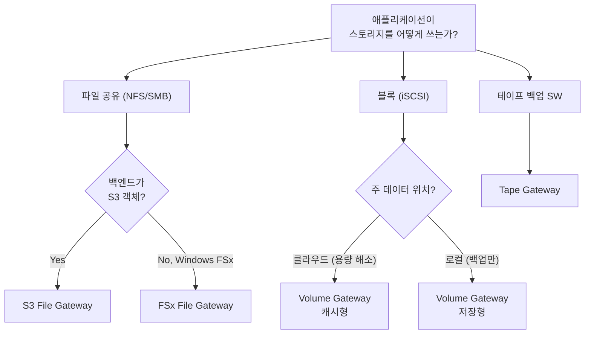

## 정의

**AWS Storage Gateway** 는 *온프레미스 환경과 AWS 클라우드 스토리지를 잇는 하이브리드 스토리지 서비스*. 온프레미스에 설치한 어플라이언스 (VMware / Hyper-V / KVM / EC2 AMI 등) 가 클라우드로 데이터를 저장/백업하면서, 애플리케이션에는 **NFS / SMB / iSCSI** 같은 익숙한 표준 프로토콜로 노출.

**핵심 3가지**:
1. **애플리케이션 수정 불필요** - 기존 프로토콜을 그대로 유지
2. **로컬 캐시** - 자주 쓰는 데이터는 온프레미스에 캐시 (저지연)
3. **클라우드가 실제 저장소** - 대부분/전체 데이터는 [[aws-s3|S3]] / [[aws-s3-glacier|Glacier]] 에 안전하게

## 왜 하이브리드인가

- **온프레미스 용량 한계** - 데이터가 커져 로컬 스토리지 증설이 부담
- **저지연 로컬 접근 유지** - 자주 쓰는 데이터는 여전히 빠르게
- **점진적 클라우드 전환** - 애플리케이션 재작성 없이 스토리지부터
- **백업/DR** - 오프사이트 백업을 클라우드에

## 4가지 게이트웨이 유형

| 게이트웨이 | 프로토콜 | 데이터 형태 | 백엔드 | 한 줄 목적 |
|:---|:---|:---|:---|:---|
| **S3 File Gateway** | NFS / SMB | 파일 | [[aws-s3\|S3]] | 파일을 S3 객체로 저장, 로컬 캐시 |
| **FSx File Gateway** | SMB | 파일 | FSx for Windows | 온프레미스에서 Windows 공유 저지연 접근 |
| **Volume Gateway** | iSCSI | 블록 | [[aws-s3\|S3]] + EBS 스냅샷 | 블록 볼륨을 클라우드로 백업/확장 |
| **Tape Gateway** | iSCSI VTL | 가상 테이프 | [[aws-s3\|S3]] + [[aws-s3-glacier\|Glacier]] | 기존 테이프 백업 SW 를 클라우드로 |

**출발 질문**: *애플리케이션이 스토리지를 어떤 방식으로 쓰는가?*
- 파일 (폴더/파일) -> **File Gateway** (S3 또는 FSx)
- 블록 (디스크/볼륨) -> **Volume Gateway**
- 테이프 백업 -> **Tape Gateway**

## S3 File Gateway (파일 -> S3)

**NFS v3/v4.1, SMB v2/v3** 로 파일 공유를 제공. write 는 **S3 객체 1:1** 로 저장.

```
[클라이언트: NFS/SMB]
   ↓
[S3 File Gateway 어플라이언스 (온프렘 VM)]
   ↓ 캐시 계층 (로컬 SSD)
   ↓ 비동기 upload
   ↓
[S3 Bucket]
```

**특성**:
- 파일 = 객체 1:1 (역방향으로 [[aws-s3|S3]] 콘솔/API 로도 접근 가능)
- 캐시로 자주 접근 파일 저지연
- **AD 통합** (SMB), POSIX 메타데이터 보존
- 파일 최대 5 TB (S3 객체 상한)
- 저장 후 S3 lifecycle / 버저닝 / 복제 활용 가능

**적합**:
- 온프레미스 파일 서버 -> S3 로 저비용 이전
- 미디어/문서 아카이빙
- 로그 파일 수집

**부적합**:
- 데이터베이스 파일 (SQLite, MySQL)
- POSIX lock 필요 앱

## FSx File Gateway (SMB -> FSx for Windows)

온프레미스에서 **FSx for Windows File Server** 에 저지연 접근.

**특성**:
- **SMB v2/v3** 만 (Windows 네이티브)
- **Active Directory / NTFS 권한 / DFS** 그대로
- 로컬 캐시로 저지연

**적합**:
- Windows 파일 공유를 클라우드로 옮기며 온프레미스 사용자에게 저지연 유지
- 데이터센터의 Windows 파일 서버 통합

## Volume Gateway (iSCSI 블록)

**iSCSI 블록 스토리지 볼륨** 을 제공. 애플리케이션은 로컬 SAN (디스크) 처럼 마운트, 실제 데이터는 [[aws-s3|S3]] 관리. 애플리케이션 재작성 불필요.

### 두 가지 볼륨 모드 (핵심 갈림길)

| | **캐시형 (Cached)** | **저장형 (Stored)** |
|:---|:---|:---|
| **주 데이터 위치** | [[aws-s3\|S3]] (클라우드) | 온프레미스 (로컬) |
| **로컬에 두는 것** | 자주 접근 데이터의 캐시 | 전체 데이터셋 |
| **클라우드 역할** | 주 저장소 | 백업 (EBS 스냅샷) |
| **저지연 접근 범위** | 활성 데이터 (working set) | 전체 데이터 |
| **온프레미스 용량 부담** | 낮음 (캐시만) | 높음 (전량 보관) |
| **볼륨 크기** | 1 GiB ~ 32 TiB | 1 GiB ~ 16 TiB |
| **게이트웨이당 최대** | 32 볼륨 × 32 TiB = 1,024 TiB | 32 볼륨 × 16 TiB = 512 TiB |

**핵심 통찰**:
- **캐시형**: "클라우드가 본체, 로컬은 자주 쓰는 것만" -> 로컬 용량 한계를 클라우드로 오프로드하면서도 활성 데이터 저지연
- **저장형**: "로컬이 본체, 클라우드는 백업" -> 전체 데이터 저지연 + DR/백업. 단, 용량 부담은 그대로

> [!IMPORTANT]
> 두 모드의 성능 (저지연 iSCSI) 은 비슷하지만, **캐시형만 온프레미스 용량 한계를 해소**합니다. 저장형은 전량을 로컬에 두기 때문.

### 구성 요소

- **캐시 스토리지 (Cache)**: 최근 접근 데이터 로컬 -> 저지연
- **업로드 버퍼 (Upload Buffer)**: [[aws-s3|S3]] 로 올리기 전 스테이징
- **EBS 스냅샷**: 볼륨의 특정 시점 복사본. 스냅샷에서 **EBS 볼륨을 생성해 EC2 로 마이그레이션** 가능 (DR 스토리)

### iSCSI 라는 신호

Volume Gateway 는 **iSCSI 타깃** 을 제공. 문제에 *"iSCSI", "블록 스토리지", "볼륨을 마운트"* 가 있으면 File Gateway 가 아니라 **Volume Gateway**.

## Tape Gateway (VTL)

백업 애플리케이션에 **iSCSI 가상 테이프 라이브러리 (VTL)** 인터페이스 제공 (가상 미디어 체인저, 가상 테이프 드라이브, 가상 테이프).

- 가상 테이프 = [[aws-s3|S3]] 에 저장
- [[aws-s3-glacier|Glacier / Glacier Deep Archive]] 로 아카이브
- **기존 테이프 기반 백업 SW** (NetBackup, Backup Exec, Veeam 등) 그대로 사용

**적합**:
- 물리 테이프 라이브러리를 클라우드로 대체
- 규제 (금융/의료) 장기 보관

**부적합**:
- 자주 접근하는 활성 데이터

## 프로토콜 vs 스토리지 유형

| 프로토콜 | 유형 | 대표 사용 OS | Storage Gateway 매핑 |
|:---|:---|:---|:---|
| **NFS** | 파일 | Linux / Unix | S3 File Gateway |
| **SMB** | 파일 | Windows | S3 File Gateway, FSx File Gateway |
| **iSCSI** | 블록 | 무관 | Volume Gateway |
| **iSCSI VTL** | 테이프 | 무관 | Tape Gateway |

## 게이트웨이 선택 흐름



## Storage Gateway vs 유사 서비스

| 요구 | 선택 |
|:---|:---|
| 온프레미스 앱이 **로컬처럼** 쓰되 실제는 AWS 저장 (지속 하이브리드) | **Storage Gateway** |
| 온프레미스 ↔ AWS **대량 데이터 온라인 전송/동기화** | **AWS DataSync** |
| 네트워크로 몇 달 걸리는 **PB급 오프라인** 전송 | **AWS Snow Family** |
| **SFTP / FTPS / FTP** 로 [[aws-s3\|S3]]/EFS 에 파일 전송 | **AWS Transfer Family** |

> [!IMPORTANT]
> **Storage Gateway ≠ DataSync**. 전자는 지속 하이브리드 스토리지, 후자는 전송 도구. "온프레미스 앱이 앞으로도 계속 저지연 접근" 이면 Gateway. "데이터를 클라우드로 옮기는 것 자체가 목적" 이면 DataSync.

## 배포 옵션

| 배포 방식 | 특징 |
|:---|:---|
| **VM 어플라이언스** | VMware ESXi / Hyper-V / KVM / Linux KVM 에 이미지 배포 |
| **하드웨어 어플라이언스** | AWS 가 제공하는 물리 장비 (선주문) |
| **EC2 AMI** | AWS 리전 안에서 어플라이언스 실행 (마이그레이션/DR) |

## 캐시 & 업로드 버퍼 크기

- **캐시 스토리지**: 활성 워킹셋 크기 이상. 부족하면 캐시 미스 -> S3 fetch 지연
- **업로드 버퍼**: write throughput × 업로드 지연. 부족하면 backpressure

**모니터링**:
- CloudWatch: `CacheHitPercent`, `CachePercentDirty`, `UploadBufferUsed`
- `CachePercentDirty` 지속 상승 = 업로드가 뒤처짐

## 암호화 & 보안

- **전송 중**: TLS
- **저장 중**: SSE-S3 (기본) 또는 SSE-KMS
- **어플라이언스 접근**: 인터넷 인바운드 열지 말 것 (관리는 activation key + AWS 콘솔)
- **네트워크**: [[aws-vpc|VPC]] 엔드포인트 로 프라이빗 통신

## 함정

> [!WARNING]
> **캐시형 vs 저장형 혼동**. "온프레미스 용량 한계 해소" 시나리오에서 저장형을 고르면 오답 - 저장형은 전량을 로컬에 두므로 해소 못 함.

> [!CAUTION]
> **File Gateway 는 블록 제공 X**. 애플리케이션이 iSCSI 블록 디바이스를 원하면 Volume Gateway.

> [!WARNING]
> **Tape Gateway 는 백업 전용**. 자주 접근하는 활성 데이터에 쓰면 restore 지연으로 서비스 마비.

> [!IMPORTANT]
> **어플라이언스 장애 = 최근 write 손실 위험**. 캐시가 [[aws-s3|S3]] 로 upload 되기 전에 어플라이언스가 죽으면 손실. 프로덕션은 어플라이언스 이중화 + `CachePercentDirty` 모니터링.

> [!CAUTION]
> **캐시 스토리지 부족** = 자주 접근하는 파일도 [[aws-s3|S3]] 에서 계속 fetch -> 저지연 이점 사라짐. 워킹셋 이상으로 프로비저닝.

> [!WARNING]
> **Storage Gateway ≠ DataSync 혼동**. Gateway 는 계속 쓰는 하이브리드 스토리지, DataSync 는 옮기는 전송 도구.

> [!IMPORTANT]
> **NFS = Linux, SMB = Windows** 기본 대응. 잘못 고르면 마운트 자체 안 됨.

## 관련 위키

- [[aws-s3|AWS S3]] - 파일/볼륨/테이프의 백엔드
- [[aws-s3-glacier|S3 Glacier]] - Tape Gateway 아카이빙
- [[aws-s3-files|S3 File Access]] - Mountpoint, FSx 등 대안
- [[aws-vpc|AWS VPC]] - 프라이빗 통신
- [[aws-iam|IAM]] - 권한
- [[aws-kms|KMS]] - 저장 암호화
- [[aws-cloudwatch|CloudWatch]] - 캐시/업로드 모니터링
