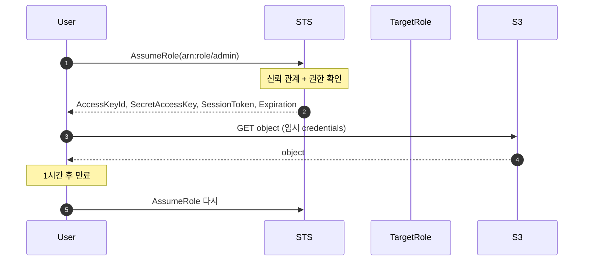
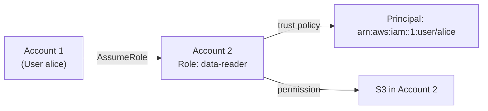
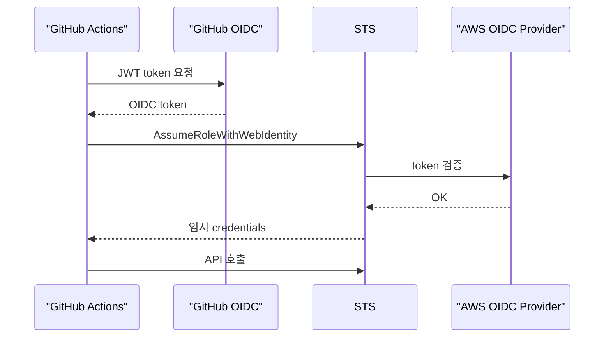
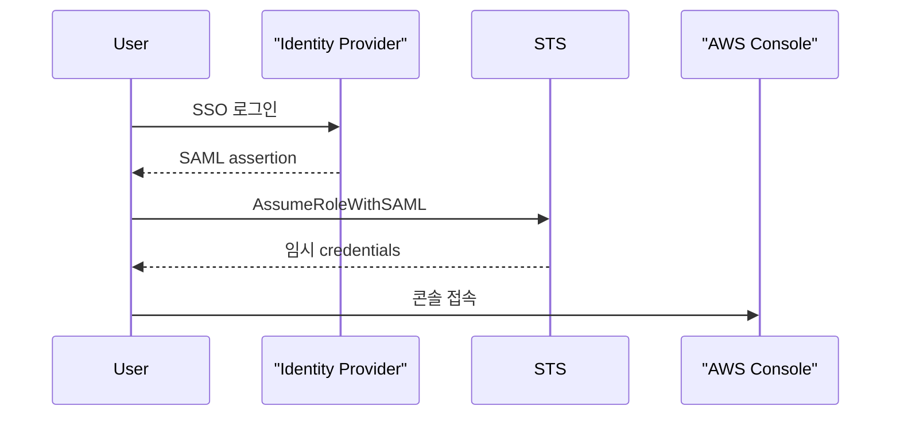
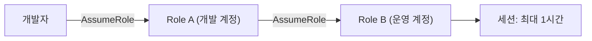

## 정의

**STS (Security Token Service)** = *임시 자격 증명 발급*. short-lived (15분-12시간) credentials. 장기 access key 없이 안전하게 AWS 서비스에 접근.

## 사용 상황

| 상황 | 방법 |
|---|---|
| CI/CD에서 deploy | GitHub OIDC + AssumeRoleWithWebIdentity |
| 멀티 계정 AWS 조직 | Cross-account AssumeRole |
| SaaS → 고객 계정 접근 | AssumeRole + External ID |
| EC2/Lambda에서 API 호출 | Instance Profile (자동 갱신) |
| EKS Pod에서 S3, DynamoDB | IRSA (AssumeRoleWithWebIdentity) |
| MFA 필요 작업 | GetSessionToken |
| 회사 SSO 로그인 | AssumeRoleWithSAML |

## 5가지 API

| API | 사용 |
|---|---|
| `AssumeRole` | IAM role assume |
| `AssumeRoleWithWebIdentity` | OIDC (EKS IRSA, GitHub OIDC) |
| `AssumeRoleWithSAML` | SAML SSO |
| `GetSessionToken` | MFA token |
| `GetCallerIdentity` | 누구인지 |

## 세션 유효 시간

| API | 최소 | 최대 | 비고 |
|---|---|---|---|
| `AssumeRole` | 15분 | 12시간 | role `MaxSessionDuration` 설정 필요 |
| `AssumeRoleWithWebIdentity` | 15분 | 12시간 | |
| `AssumeRoleWithSAML` | 15분 | 12시간 | |
| `GetSessionToken` | 15분 | 36시간 | MFA 필수 작업 |
| Role Chaining | 15분 | **1시간 고정** | 연장 불가 |

## AssumeRole 흐름



## Cross-Account AssumeRole



### Trust Policy (Account 2 role)

```json
{
  "Version": "2012-10-17",
  "Statement": [{
    "Effect": "Allow",
    "Principal": { "AWS": "arn:aws:iam::ACCOUNT-1:root" },
    "Action": "sts:AssumeRole",
    "Condition": {
      "StringEquals": { "sts:ExternalId": "shared-secret-string" }
    }
  }]
}
```

> [!IMPORTANT]
> *External ID* 가 *confused deputy 공격* 방어. SaaS 가 우리 계정 접근 시 *반드시*.

## Web Identity (OIDC) - GitHub Actions

```yaml
permissions:
  id-token: write
steps:
  - uses: aws-actions/configure-aws-credentials@v4
    with:
      role-to-assume: arn:aws:iam::123:role/github-actions
      aws-region: us-east-1
```

GitHub 의 OIDC token → AWS role assume. *long-term access key 없이*.



## EKS IRSA (위와 동일)

자세한 건 [[aws-eks]] 의 IRSA 절.

## SAML Federation

기업 IdP (Okta, Active Directory, Azure AD) 로 로그인 후 AWS 콘솔, API 접근.



Trust policy 핵심 필드:

```json
{
  "Principal": {
    "Federated": "arn:aws:iam::123:saml-provider/MyIdP"
  },
  "Action": "sts:AssumeRoleWithSAML",
  "Condition": {
    "StringEquals": {
      "SAML:aud": "https://signin.aws.amazon.com/saml"
    }
  }
}
```

> IdP에서 role ARN을 attribute로 매핑. 사용자가 IAM user 없이 AWS 접근 가능.

## Instance Profile (EC2, Lambda, ECS)

인스턴스에 붙이는 IAM role. IMDS를 통해 credentials 자동 갱신 (만료 5분 전).

Trust policy:

```json
{
  "Principal": { "Service": "ec2.amazonaws.com" },
  "Action": "sts:AssumeRole"
}
```

EC2 내부에서 현재 credentials 확인:

```bash
TOKEN=$(curl -sX PUT "http://169.254.169.254/latest/api/token" \
  -H "X-aws-ec2-metadata-token-ttl-seconds: 21600")
curl -sH "X-aws-ec2-metadata-token: $TOKEN" \
  http://169.254.169.254/latest/meta-data/iam/security-credentials/
```

SDK 사용 시 credentials 명시 불필요. 자동 갱신.

| 서비스 | Principal |
|---|---|
| EC2 | `ec2.amazonaws.com` |
| Lambda | `lambda.amazonaws.com` |
| ECS Task | `ecs-tasks.amazonaws.com` |
| CodeBuild | `codebuild.amazonaws.com` |

## Role Chaining

A role이 B role을 assume. 세션 최대 1시간 고정 (MaxSessionDuration 무관).



```bash
# Role A credentials 로 Role B assume
aws sts assume-role \
  --role-arn arn:aws:iam::PROD:role/deploy \
  --role-session-name chain-session \
  --duration-seconds 3600
```

> [!WARNING]
> Role chaining 시 1시간 제한은 `MaxSessionDuration` 과 무관. 12시간 설정해도 체인이면 1시간.
> 배포 파이프라인이 1시간 초과할 경우 재assume 로직 필요.

## Session Policy

AssumeRole 시 *inline permission 추가 제한*. role 권한 AND session policy = 실제 권한. 확대 불가.

```bash
aws sts assume-role \
  --role-arn arn:role/x \
  --role-session-name session \
  --policy '{
    "Version": "2012-10-17",
    "Statement": [{
      "Effect": "Allow",
      "Action": "s3:GetObject",
      "Resource": "arn:aws:s3:::my-bucket/*"
    }]
  }'
```

CI/CD에서 최소 권한 세션 발급, 임시 작업자에게 제한된 권한 부여 시 유용.

## Session Tags

```bash
aws sts assume-role \
  --role-arn arn:role/x \
  --role-session-name session \
  --tags Key=Team,Value=backend
```

```json
"Condition": {
  "StringEquals": { "aws:PrincipalTag/Team": "backend" }
}
```

> 같은 role 의 *세션마다 다른 tag* → *세분화 권한*.

## 감사 (CloudTrail)

AssumeRole 이벤트는 CloudTrail에 자동 기록.

```bash
aws cloudtrail lookup-events \
  --lookup-attributes AttributeKey=EventName,AttributeValue=AssumeRole \
  --max-results 20
```

주요 필드:

| 필드 | 의미 |
|---|---|
| `userIdentity.arn` | 누가 assume 했는지 |
| `requestParameters.roleArn` | 어느 role |
| `requestParameters.externalId` | External ID 사용 여부 |
| `responseElements.assumedRoleUser` | 결과 세션 ARN |

```json
// CloudWatch Logs Insights 쿼리 예시
{
  "filter": "eventName = 'AssumeRole'",
  "stats": "count(*) by userIdentity.arn"
}
```

> [!TIP]
> 비정상 cross-account assume 감지용 EventBridge 룰 설정 권장. 알 수 없는 Account → SNS 알림.

## Session 강제 만료

침해된 role 세션을 즉각 무효화:

```bash
# DenyAll inline policy 추가 (토큰 발급 시간 이전 세션 차단)
aws iam put-role-policy \
  --role-name compromised-role \
  --policy-name AWSRevokeOlderSessions \
  --policy-document '{
    "Version": "2012-10-17",
    "Statement": [{
      "Effect": "Deny",
      "Action": "*",
      "Resource": "*",
      "Condition": {
        "DateLessThan": {
          "aws:TokenIssueTime": "2026-07-16T12:00:00Z"
        }
      }
    }]
  }'

# 정리 후 삭제
aws iam delete-role-policy \
  --role-name compromised-role \
  --policy-name AWSRevokeOlderSessions
```

> STS session 자체는 만료 전 취소 불가. 이 방식으로 *실질적 무효화*.

## 흔한 함정

> [!WARNING]
> 1. **External ID 누락** = 3rd party 신뢰 약함.
> 2. **장기 access key 와 혼용** = role 의 의미 깨짐.
> 3. **세션 만료 갱신 안 함** = 1시간 후 API 호출 실패. SDK 의 *자동 refresh* 확인.
> 4. **trust policy 의 너무 넓은 Principal** = 모든 user 가 assume.
> 5. **Role Chaining 1시간 제한 간과** = 배포 파이프라인이 1시간 넘으면 자동 실패. 재assume 로직 추가.
> 6. **SCP가 AssumeRole 차단** = OU 레벨 SCP 에서 `sts:AssumeRole` 거부 정책 확인 필수.
> 7. **세션 tag 상속 누락** = `TransitiveTagKeys` 지정 안 하면 chaining 시 tag 사라짐.

## 관련 위키

- [[aws-iam]]
- [[oauth2]]
- [[github-actions]]
- [[aws-eks]]
- [[aws-cloudtrail]]
- [[saml]]
- [[openid-connect]]
