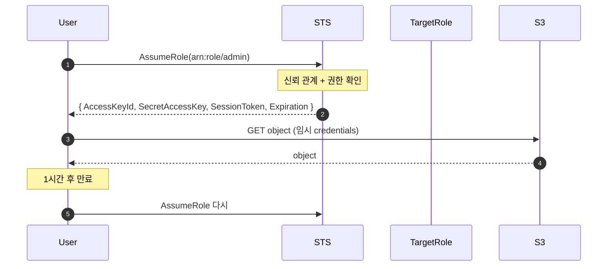
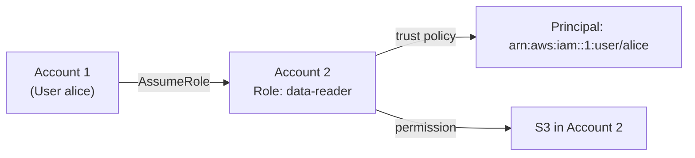
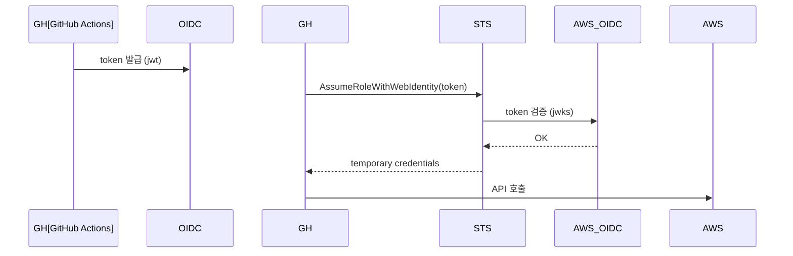

## 정의

**STS (Security Token Service)** = *임시 자격 증명 발급*. *short-lived (15분-12시간) credentials*.

## 5가지 API

| API | 사용 |
|---|---|
| `AssumeRole` | IAM role assume |
| `AssumeRoleWithWebIdentity` | OIDC (EKS IRSA, GitHub OIDC) |
| `AssumeRoleWithSAML` | SAML SSO |
| `GetSessionToken` | MFA token |
| `GetCallerIdentity` | 누구인지 |

## AssumeRole 흐름



## Cross-Account AssumeRole



### Trust Policy (Account 2 role)

```json
{
  "Version": "2012-10-17",
  "Statement": [{
    "Effect": "Allow",
    "Principal": { "AWS": "arn:aws:iam::ACCOUNT-1:root" },
    "Action": "sts:AssumeRole",
    "Condition": {
      "StringEquals": { "sts:ExternalId": "shared-secret-string" }
    }
  }]
}
```

> [!IMPORTANT]
> *External ID* 가 *confused deputy 공격* 방어. SaaS 가 우리 계정 접근 시 *반드시*.

## Web Identity (OIDC) - GitHub Actions

```yaml
permissions:
  id-token: write
steps:
  - uses: aws-actions/configure-aws-credentials@v4
    with:
      role-to-assume: arn:aws:iam::123:role/github-actions
      aws-region: us-east-1
```

GitHub 의 OIDC token → AWS role assume. *long-term access key 없이*.



## EKS IRSA (위와 동일)

자세한 건 [[aws-eks]] 의 IRSA 절.

## Session Tags

```bash
aws sts assume-role \
  --role-arn arn:role/x \
  --role-session-name session \
  --tags Key=Team,Value=backend
```

```json
"Condition": {
  "StringEquals": { "aws:PrincipalTag/Team": "backend" }
}
```

> 같은 role 의 *세션마다 다른 tag* → *세분화 권한*.

## 흔한 함정

> [!WARNING]
> 1. **External ID 누락** = 3rd party 신뢰 약함.
> 2. **장기 access key 와 혼용** = role 의 의미 깨짐.
> 3. **세션 만료 갱신 안 함** = 1시간 후 API 호출 실패. SDK 의 *자동 refresh* 확인.
> 4. **trust policy 의 *너무 넓은 Principal*** = 모든 user 가 assume.

## 관련 위키

- [[aws-iam]]
- [[OAuth2]]
- [[github-actions]]
- [[aws-eks]]
