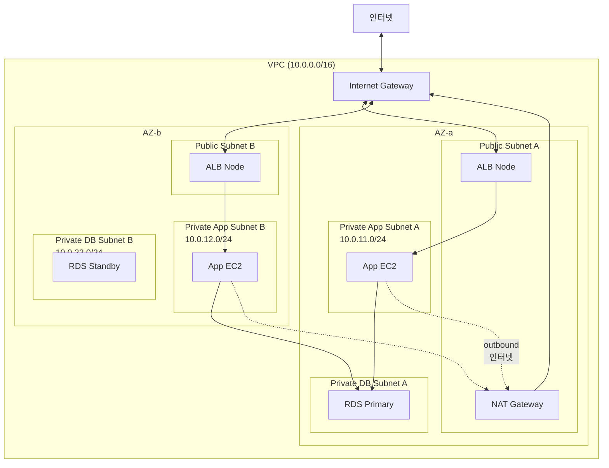

## 정의

**Public Subnet** 과 **Private Subnet** 은 [[aws-vpc|VPC]] 의 서브넷 유형 이름 같지만, 사실은 *서브넷 자체의 속성이 아니라 라우트 테이블 (Route Table) 구성에 따른 결과적 분류*.

- **Public Subnet**: 라우트 테이블에 **`0.0.0.0/0 → Internet Gateway`** 라우트가 있는 서브넷
- **Private Subnet**: 그런 라우트가 **없는** 서브넷 (인터넷 직접 접근 불가)

**한 줄 요약**: *"Public / Private" 은 AWS API 나 서브넷 속성이 아니라, 라우트 테이블 설정으로 결정되는 관습적 분류*.

## 왜 이 분류가 관습이 되었나

전통 3-tier 웹 아키텍처의 보안 원칙:
- 인터넷에 노출되는 것은 최소한만 (ALB, bastion 등)
- 실제 앱 서버, DB 는 인터넷에서 직접 접근 불가
- 앱 서버가 필요할 때만 outbound 로 인터넷 접근 (패키지 설치 등)

이 요구를 만족하려면 서브넷을 **인터넷 접근 가능 / 불가능** 두 그룹으로 나눠 다르게 라우팅. AWS 커뮤니티가 각각 "public subnet", "private subnet" 이라고 부르기 시작한 것.

**중요**: AWS 콘솔의 서브넷 리소스에는 "public" / "private" 이라는 필드가 **없다**. 라우트 테이블 확인이 유일한 판별 방법.

## Public Subnet 조건 (모두 만족해야)

인스턴스가 실제로 인터넷과 통신하려면:

1. **VPC 에 Internet Gateway 부착**
2. **서브넷의 라우트 테이블에 `0.0.0.0/0 → IGW` 라우트** 존재
3. **인스턴스에 Public IPv4 또는 Elastic IP** 부여
4. **Security Group 이 인바운드/아웃바운드 허용**
5. **NACL 도 허용**

이 5가지 중 하나라도 빠지면 인터넷 통신 안 됨. 흔한 실수: IGW 붙이고 라우트도 넣었지만 EC2 에 Public IP 가 없어서 접근 실패.

### Auto-assign Public IP

서브넷 속성 `MapPublicIpOnLaunch`:
- **True**: 이 서브넷에서 시작한 EC2 는 자동으로 Public IPv4 할당
- **False**: 명시적 지정 필요 (또는 EIP 부착)

**Default VPC 의 기본 서브넷**: `MapPublicIpOnLaunch = True` (편의)
**신규 커스텀 VPC 의 서브넷**: `False` (안전)

## Private Subnet 의 인터넷 접근

Private subnet 안 EC2 도 outbound 로 인터넷 접근이 필요한 경우 흔함:
- OS 패키지 업데이트 (`apt update`, `yum update`)
- Docker 이미지 pull
- 외부 API 호출 (Stripe, SendGrid 등)

**해결책 4가지** (트레이드오프 있음):

### 1. NAT Gateway (표준)

```
Private Subnet 라우트 테이블:
  10.0.0.0/16 → local
  0.0.0.0/0 → NAT Gateway (public subnet 안)

NAT Gateway 라우트 테이블 (자기가 있는 public subnet):
  0.0.0.0/0 → IGW
```

- Public subnet 안에 NAT Gateway 배치
- Private subnet → NAT Gateway → IGW → 인터넷
- 인터넷 → private subnet 은 여전히 불가 (unsolicited inbound 차단)
- **요금**: 시간당 + GB 처리 (누적 가능)

### 2. NAT Instance (레거시)

EC2 인스턴스 하나를 NAT 역할로 (source/dest check 비활성). 옛 방식. 신규는 NAT Gateway 사용.

### 3. VPC Endpoint (인터넷 우회)

AWS 서비스 접근만 필요하면 인터넷 대신 [[aws-vpc-endpoints|VPC Endpoint]]:
- S3, DynamoDB → Gateway Endpoint (무료)
- KMS, ECR, SSM 등 → Interface Endpoint

### 4. Egress-only Internet Gateway (IPv6 전용)

IPv6 에는 NAT 개념이 없음. 대신 "egress-only IGW" 로 outbound 만 허용.

## 아키텍처 (표준 3-tier)



**세 계층의 역할**:
- **Public Subnet (ALB, NAT Gateway, bastion)**: 인터넷과 직접 통신. 최소 리소스만.
- **Private App Subnet (EC2, ECS, Lambda)**: ALB 뒤 애플리케이션. Outbound 인터넷은 NAT 로.
- **Private DB Subnet (RDS, ElastiCache)**: 앱 서버만 접근. Outbound 도 대개 불필요.

## 라우트 테이블의 차이 (핵심)

**Public Subnet 라우트 테이블**:
```
Destination        Target
10.0.0.0/16        local
0.0.0.0/0          igw-abc123      ← Internet Gateway
```

**Private Subnet 라우트 테이블 (NAT 있음)**:
```
Destination        Target
10.0.0.0/16        local
0.0.0.0/0          nat-xyz789      ← NAT Gateway (public subnet 안)
```

**Private Subnet 라우트 테이블 (NAT 없음)**:
```
Destination        Target
10.0.0.0/16        local
                   (0.0.0.0/0 라우트 없음)
```

## Private Subnet 은 정말 격리인가

**주의**: "Private Subnet 이면 안전하다" 는 오해.

Private subnet 안 EC2 도 다음이면 접근 가능:
- **다른 VPC** ([[aws-vpc|VPC]] Peering / Transit Gateway 로 연결됨)
- **온프레미스** (Direct Connect / VPN 으로 연결됨)
- **VPC 내부 다른 서브넷** (라우트 + SG 가 허용)

**격리는 Security Group / NACL 로 명시적 통제**. Private subnet 만으로는 보안 완결 X.

## 서브넷 크기 계획

**AWS 는 서브넷 앞 4개 + 마지막 1개 IP 를 예약**:

| 서브넷 IP | 용도 |
|:---|:---|
| `.0` | 네트워크 주소 |
| `.1` | VPC router |
| `.2` | AWS DNS |
| `.3` | 미래 사용 예약 |
| `.255` (마지막) | 브로드캐스트 |

**예: `10.0.1.0/24` (256 IP) → 실제 사용 가능 251 IP**

**크기 결정**:
- `/28` (16 IP) - 매우 작음, 실 사용 11개. VPC endpoint 서브넷 등
- `/24` (256 IP) - 작은 서브넷. 소규모 앱
- `/22` (1024 IP) - 중간. 대부분 워크로드
- `/20` (4096 IP) - Default VPC 서브넷 크기
- `/16` - VPC CIDR 상한 (서브넷은 /16 불가, 최대 /16 은 VPC 자체)

**Kubernetes / EKS**: Pod 마다 IP 소비 → 큰 서브넷 (`/22` 이상) 권장.

## 명명 관례

AWS 공식 이름은 없지만 관용:

- `<env>-public-<az>` (예: `prod-public-1a`, `prod-public-1b`)
- `<env>-private-app-<az>`
- `<env>-private-db-<az>`

Terraform / CloudFormation 에서 tag 로 구분:
```yaml
Tags:
  - Key: Tier
    Value: public / private-app / private-db
  - Key: Name
    Value: prod-private-app-1a
```

## 함정

> [!WARNING]
> **"Public / Private" 은 서브넷 속성이 아님**. 라우트 테이블만이 진실. 헷갈리면 서브넷의 route table 을 실제 확인.

> [!CAUTION]
> **Public IP 없이 Internet Gateway 있는 서브넷** = 인터넷 통신 안 됨. IGW 라우트만으로는 부족, Public IPv4 / EIP 필요.

> [!WARNING]
> **NAT Gateway 는 public subnet 에 배치**. Private subnet 에 NAT 를 놓으면 자기가 인터넷 접근 못함.

> [!IMPORTANT]
> **NAT Gateway 는 AZ 단위**. HA 를 위해 각 AZ 마다 별도 NAT 배치. 하나에 몰면 그 AZ 장애 시 전체 outbound 마비 + 크로스 AZ 요금.

> [!CAUTION]
> **Private subnet 만으로 격리 완결 아님**. 다른 VPC / 온프렘 / 같은 VPC 접근 가능성. SG / NACL 로 명시적 통제.

> [!WARNING]
> **AWS 예약 5개 IP** 를 잊고 `/28` 로 만들면 실 사용 11개. 큰 서브넷 필요 시 `/28` 지양.

> [!IMPORTANT]
> **VPC Endpoint 로 상당 부분 NAT 대체 가능**. S3 / DynamoDB / KMS / ECR 등이 주 outbound 이면 endpoint 로 NAT 요금 절감.

## 관련 위키

- [[aws-vpc|AWS VPC]] - 상위 컨텍스트
- [[aws-vpc-endpoints|VPC Endpoints]] - NAT 대안
- [[aws-eni|ENI]] - Public IP 부여 대상
- [[aws-sg|Security Group]] - 접근 제어
- [[aws-sg-vs-nacl|SG vs NACL]] - subnet 레벨 제어 (NACL)
- [[network-cidr-subnetting|CIDR / Subnetting]] - IP 계산
