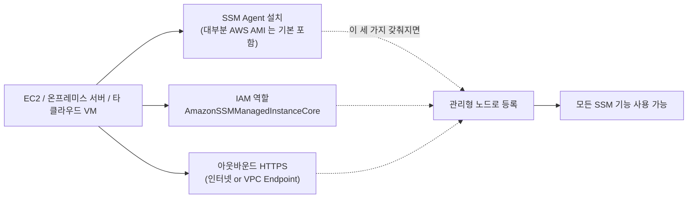
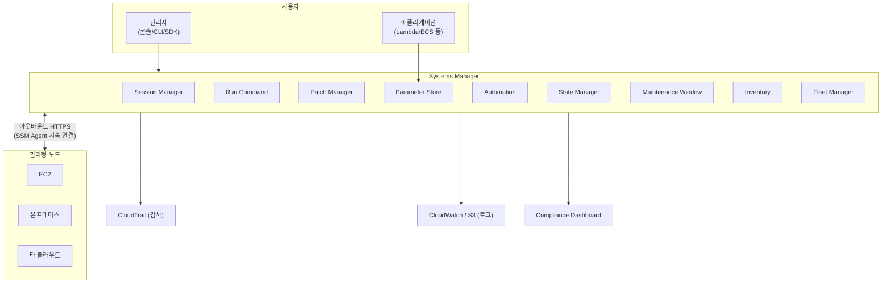

## 정의

**AWS Systems Manager** (SSM) 는 *AWS / 온프레미스 / 멀티클라우드에 걸친 노드 (서버, 인스턴스, VM, IoT 등) 를 대규모로 안전하게 관리 / 운영* 하는 도구 **모음**. 접속, 실행, 패치, 구성, 감사, 자동화, 인벤토리 등 서버 라이프사이클 전반을 다루는 여러 기능이 하나의 우산 (SSM) 아래 묶여 있다.

**핵심 정체성**: *"SSH / RDP 로 서버에 로그인해서 손으로 하던 모든 것" 을 대체* 하는 관리 플랫폼.

**대부분 기능은 무료**. 일부 고급 옵션 (Advanced Parameter Store, Change Manager 등) 만 과금.

## 왜 필요한가

전통 서버 운영의 문제:

- **SSH / RDP 열어놔야 접속 가능** = 공격 표면 증가
- **배스천 호스트** = 별도 인프라 유지 비용
- **자격증명 관리** = SSH 키, 비밀번호 유출 위험
- **수동 반복 작업** (패치, 재시작, 로그 수집 등) = 규모 불가
- **온프레미스 + 클라우드 혼재** = 도구 분산
- **감사** = 누가 언제 무엇을 했는지 추적 어려움

SSM 의 답: 이 모든 것을 *한 서비스 + IAM 권한 + SSM Agent + 아웃바운드 HTTPS 하나* 로 통합.

## 관리형 노드 (Managed Node) 라는 전제

SSM 의 모든 기능은 **관리형 노드** 에 대해 작동. 세 가지 요건.

**핵심 통찰**: SSM 은 **인바운드 포트를 열지 않는다**. SSM Agent 가 아웃바운드 HTTPS 로 SSM 서비스에 지속 연결해두고, 관리자는 SSM 서비스를 통해 명령을 보낸다. 이 방향 역전이 배스천 없는 접근을 가능하게 한다.

프라이빗 서브넷 노드의 경우 인터넷 접근 대신 **VPC Endpoint** 3 개 (`ssm`, `ssmmessages`, `ec2messages`) 로 프라이빗 통신 가능.

## SSM 기능 지도

SSM 은 여러 독립 기능의 집합. 각 기능은 아래 표로 정리하되, 상세는 각 위키에서.

### 핵심 기능 (주요 dedicated wiki)

| 기능 | 한 줄 요약 | 자세히 |
|:---|:---|:---|
| **Session Manager** | 배스천/포트 없이 브라우저·CLI 셸 접속, 완전 감사 | [[aws-ssm-session-manager\|Session Manager]] |
| **Run Command** | 다수 노드에 명령을 원격 병렬 실행 (SSH X) | [[aws-ssm-run-command\|Run Command]] |
| **Patch Manager** | Patch Baseline 기반 OS 패치 정기 자동화 | [[aws-ssm-patch-manager\|Patch Manager]] |
| **Parameter Store** | 계층적 구성값 + 경량 비밀 (KMS SecureString) | [[aws-ssm-parameter-store\|Parameter Store]] |
| **Automation** | 여러 단계 운영 워크플로 (런북) + 승인 게이트 | [[aws-ssm-automation\|Automation]] |
| **State Manager** | 노드가 원하는 상태를 지속 유지 (드리프트 방지) | [[aws-ssm-state-manager\|State Manager]] |

### 보조 기능 (개요)

주요 기능만큼 큰 페이지가 필요하지 않은 소단위 기능들.

| 기능 | 정리 |
|:---|:---|
| **Maintenance Window** | 작업 실행 **시간 창** 예약. Patch Manager / Automation / Run Command 의 스케줄러 역할. cron 표현으로 매주 일요일 03:00 UTC 4시간 창 등을 정의하고, 그 안에서 태스크가 순차/병렬 실행. |
| **Inventory** | 각 노드의 **설치된 SW / 서비스 / 파일 / 레지스트리** 인벤토리를 자동 수집. `AWS-GatherSoftwareInventory` 문서로 실행되며 결과는 [[aws-athena\|Athena]] 로 조회 가능. "우리 조직에 OpenSSL 몇 대에 어떤 버전이?" 같은 질문에. |
| **Fleet Manager** | 관리형 노드를 **웹 UI 로 원격 관리** (파일시스템 탐색, 로그, 성능, 프로세스, RDP 등). SSH / RDP 없이 콘솔에서. |
| **Distributor** | 커스텀 **소프트웨어 패키지를 노드에 배포/버전 관리**. Chef/Puppet/Ansible 없이 표준 방식으로. `AWS-ConfigureAWSPackage` 로 실행. |
| **OpsCenter / Explorer** | 운영 이슈 (OpsItem) 를 **중앙 집계 + 조사** 대시보드. CloudWatch Alarm, Config, Security Hub 발견을 통합 티켓처럼. |
| **Incident Manager** | 인시던트 자동 대응 (런북 실행, 담당자 호출, 채팅 통합). PagerDuty 대안. |
| **Change Manager / Change Calendar** | 변경 승인 워크플로 + 변경 금지/허용 일정. 특정 기간 (블랙아웃) 동안 프로덕션 변경 자동 차단. |

## 어떤 기능을 언제 쓰나 (요약)

목적별 즉답 매핑.

| 상황 | 해당 기능 |
|:---|:---|
| SSH 포트 안 열고 접속 / 배스천 제거 | [[aws-ssm-session-manager\|Session Manager]] |
| 다수 서버에 지금 스크립트 일괄 실행 | [[aws-ssm-run-command\|Run Command]] |
| 매주 정기 보안 패치 자동 | [[aws-ssm-patch-manager\|Patch Manager]] + Maintenance Window |
| 설정값 저장 + 비용 최소 | [[aws-ssm-parameter-store\|Parameter Store]] |
| DB 비밀번호 자동 회전 필요 | [[aws-secrets-manager\|Secrets Manager]] (SSM 아님) |
| AMI 만들고 인스턴스 교체하고 DNS 업데이트 | [[aws-ssm-automation\|Automation]] |
| 인스턴스가 항상 특정 에이전트 설치 유지 | [[aws-ssm-state-manager\|State Manager]] |
| AMI ID 하드코딩 없이 참조 | [[aws-ssm-parameter-store\|Parameter Store]] Public Parameter |
| 조직 내 특정 SW 몇 대에 설치? | Inventory |
| GUI 로 원격 노드 관리 | Fleet Manager |
| 정해진 시간에만 패치 실행 | Maintenance Window |
| 커스텀 SW 패키지 배포/업데이트 | Distributor |
| 인시던트 자동 대응 | Incident Manager |
| 프로덕션 변경 승인 워크플로 | Change Manager |

## 전체 아키텍처

**설계 원칙**:
- 모든 통신은 **SSM Agent 아웃바운드 → SSM 서비스**
- 관리자는 **SSM 서비스로만 명령** (직접 노드 접근 없음)
- IAM 정책이 유일한 인증
- 모든 활동은 [[aws-cloudtrail|CloudTrail]] 감사

## 요금

- **대부분 무료**: Session Manager, Run Command, State Manager, Patch Manager, Standard Parameter Store, Compliance, Inventory, Fleet Manager 등
- **일부 유료**:
  - Automation: 월 100,000 스텝 무료, 초과 스텝당 과금
  - Advanced Parameter Store: 파라미터당 월 요금
  - Change Manager, Incident Manager: 별도 요금
- **하위 서비스** ([[aws-s3|S3]], [[aws-cloudwatch|CloudWatch Logs]], [[aws-kms|KMS]] 등) 요금 별도

## 시작 (최소 준비)

새 계정에서 SSM 을 처음 활성화하는 순서.

1. **IAM Instance Profile 생성**: `AmazonSSMManagedInstanceCore` 정책 부착
2. **EC2 에 profile 부착**: 신규는 시작 시, 기존은 attach
3. **SSM Agent 확인**: Amazon Linux 2/2023, Ubuntu 최신 AMI 는 기본. 아니면 수동 설치
4. **프라이빗 서브넷의 경우**: VPC Endpoint 3 개 (`ssm`, `ssmmessages`, `ec2messages`)
5. **테스트**: `aws ssm start-session --target i-xxx` 로 셸 접속 성공하면 완료
6. **필요 기능 활성화**: [[aws-ssm-patch-manager|Patch Manager]] baseline, [[aws-ssm-parameter-store|Parameter Store]] 계층 등 순차 도입

## 함정

> [!WARNING]
> **SSM Agent + IAM Instance Profile** 이 없으면 관리형 노드 아님. 두 조건 동시 확인.

> [!CAUTION]
> **프라이빗 서브넷** 노드는 **VPC Endpoint 3개 (ssm, ssmmessages, ec2messages)** 필수. 없으면 관리 불가.

> [!WARNING]
> **관리 계정만 SCP 미적용**. 조직에서 관리 계정이 곧 SSM 통제 대상에서 예외라는 의미. 관리 계정 최소 사용.

> [!IMPORTANT]
> **한 SSM 안에 기능이 너무 많음**. 어떤 기능이 뭘 하는지 명확히 하지 않고 도입하면 이 기능 저 기능 흩어져 관리 어려움. 각 기능별 wiki 로 나눠서 이해 필요.

> [!CAUTION]
> **관리자 IAM 권한 남용**. `ssm:*` + `Resource: *` 는 곧 조직 모든 노드 셸 접근권. 최소 권한 + 태그 조건 필수.

> [!WARNING]
> **자동 회전 기능은 SSM 에 없음**. DB 비밀번호 등 자동 회전 필요하면 [[aws-secrets-manager|Secrets Manager]].

## 관련 위키 (SSM 기능 상세)

### 주요 dedicated wiki

- [[aws-ssm-session-manager|Session Manager]] - 배스천 없는 셸 접속
- [[aws-ssm-run-command|Run Command]] - 다수 서버 명령 실행
- [[aws-ssm-patch-manager|Patch Manager]] - OS 패치 자동화
- [[aws-ssm-parameter-store|Parameter Store]] - 구성/비밀 저장
- [[aws-ssm-automation|Automation]] - 운영 워크플로 런북
- [[aws-ssm-state-manager|State Manager]] - 원하는 상태 유지

### 상호작용 서비스

- [[aws-secrets-manager|Secrets Manager]] - 비밀 자동 회전 (SSM 대안)
- [[aws-ec2|AWS EC2]] - 주 관리 대상
- [[aws-iam|IAM]] - SSM 접근 제어
- [[aws-vpc|VPC]] - 프라이빗 서브넷 Endpoint
- [[aws-kms|KMS]] - SecureString / 세션 로그 암호화
- [[aws-cloudwatch|CloudWatch]] - 로그
- [[aws-cloudtrail|CloudTrail]] - 감사
- [[aws-config|AWS Config]] - Compliance 규칙
- [[aws-eventbridge|EventBridge]] - 자동화 트리거
